# 0401

## 개요

* `ctrl` + `Shift` + `Esc` : 작업 관리자

* CPU 사양
  * 소켓: 1 / 코어: 4 / 논리프로세서: 8 / 가상화: 사용 
  * 드라이브: 1개
  * 이더넷: 1개
  * 링크 속도: 1000/1000 (Mbps)

* 파일 공유 사이트 : 192.168.120.30

* [Firefox 다운로드](https://www.mozilla.org/ko/firefox/new/)
* [VirtualBox 다운로드](https://www.virtualbox.org/)

* 검색창 `winver` : window 버전 확인 - 10 pro

## 랜카드(LAN card) 

* 오버레이(Overlay) : 가상 네트워크
  * 가상의 랜카드 
  * NIC 카드가 있는 부분
* 언더레이(Underlay) : 물리 네트워크
  * 진짜 랜카드
  * 스위치와 라우터가 있는 부분

### 가상 랜카드 생성

* 제어판\네트워크 및 인터넷\네트워크 및 공유 센터\어댑터 설정 변경
  * 현재 랜카드 1개
  
  * Realtek
  
    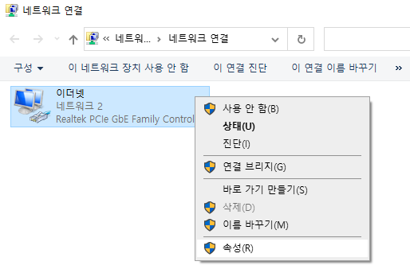  
  
  * IP 주소 자동 설정
  
    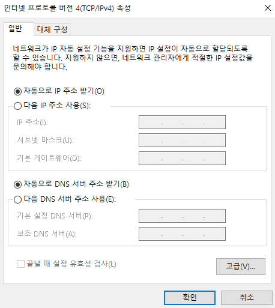 

* 명령 프롬프트(cmd)로 IP 확인

  * IP = 192.168.120.28

  * 현재는 물리적 랜카드

    ```
    C:\Users\user>ipconfig
    
    Windows IP 구성
    
    
    이더넷 어댑터 이더넷:
    
       연결별 DNS 접미사. . . . :
       링크-로컬 IPv6 주소 . . . . : fe80::d009:94c1:cc1f:1b4c%3
       IPv4 주소 . . . . . . . . . : 192.168.120.28
       서브넷 마스크 . . . . . . . : 255.255.255.0
       기본 게이트웨이 . . . . . . : 192.168.120.1
    ```

* 랜카드 추가 생성 

  * VirtualBox Host-Only

    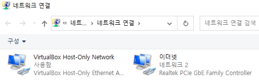 

  * IP 주소 할당됨

  * 192.168.56.~ : 가상의 랜카드

    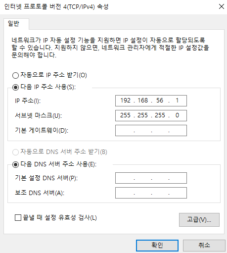 

  * 명령 프롬프트(cmd)로 IP 확인

  * IP 2개

    ```
    C:\Users\user>ipconfig
    
    Windows IP 구성
    
    
    이더넷 어댑터 이더넷:
    
       연결별 DNS 접미사. . . . :
       링크-로컬 IPv6 주소 . . . . : fe80::d009:94c1:cc1f:1b4c%3
       IPv4 주소 . . . . . . . . . : 192.168.120.28
       서브넷 마스크 . . . . . . . : 255.255.255.0
       기본 게이트웨이 . . . . . . : 192.168.120.1
    
    이더넷 어댑터 VirtualBox Host-Only Network:
    
       연결별 DNS 접미사. . . . :
       링크-로컬 IPv6 주소 . . . . : fe80::288f:ca12:a80f:3e65%27
       IPv4 주소 . . . . . . . . . : 192.168.56.1
       서브넷 마스크 . . . . . . . : 255.255.255.0
       기본 게이트웨이 . . . . . . :
    ```

* 환경설정 - 전역(Global) 설정


## VirtualBox

### VM 데이터 경로 설정

* 하드디스크 드라이버 : C드라이브 / D드라이브

  * 공간을 효율적으로 사용하기 위해 파티션 구분
  * C드라이브 : 윈도우 구동 전용으로 사용, Window 설치
  * D드라이브 : 게임, 영화, 음악 등 용량 큰 것 저장할 때 사용, Window 설치x

* 파티션 나뉘어져 있을 경우에 VM 데이터 경로를 따로 설정

  * D드라이버에서 Vbox 폴더 생성 

  * VirtualBox > 환경설정 > 기타 > Vbox 폴더 선택

    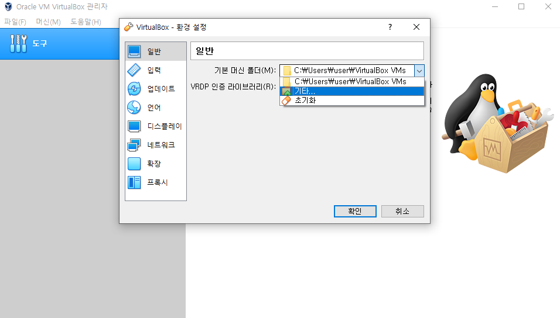 

  * 입력 > 가상머신 > 호스트 키 조합을 `Right Control` 에서 `Control` + `Alt` 로 변경

    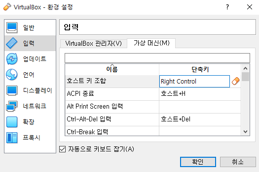 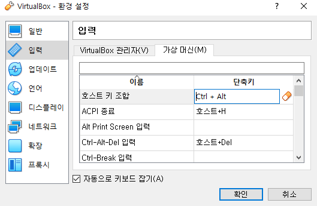 


### CentOS 설치

- `.iso`: OS 설치하는 파일, 이미지
  - `.isos` : `.iso`의 복수 [isos/](http://mirror.kakao.com/centos/7.9.2009/isos/)

- 설치 경로
  - http://mirror.kakao.com/
  - [CentOS](http://mirror.kakao.com/centos) > [7.9.2009/](http://mirror.kakao.com/centos/7.9.2009/) >  [isos/](http://mirror.kakao.com/centos/7.9.2009/isos/) > [x86_64/](http://mirror.kakao.com/centos/7.9.2009/isos/x86_64/) > [CentOS-7-x86_64-DVD-2009.iso](http://mirror.kakao.com/centos/7.9.2009/isos/x86_64/CentOS-7-x86_64-DVD-2009.iso) , [CentOS-7-x86_64-Minimal-2009.iso](http://mirror.kakao.com/centos/7.9.2009/isos/x86_64/CentOS-7-x86_64-Minimal-2009.iso) 설치

- `7.9.2009/` : 아마존 머신 이미지 7버전 대
- `8-stream/` : 최신버전
- `.isos` : `.iso`의 복수
- `x86` :  cpu 의미
- CentOS-7-x86_64-DVD-2009.iso
  - GUI(Graphic User Interface) : Desktop 바탕화면 OS
  - 용량: 4712300544byte

- CentOS-7-x86_64-Minimal-2009.iso
  - CLI(Command Line Interface) : Text 환경 OS
  - 용량: 1020264448byte


### VM 스펙

* Host PC 최소사양 (Win 10)
  * CPU: 4Core(논리프로세서 4~8)
  * RAM: 8G
  * SSD: 128G

* Guest VM 사양(CentOS7Desktop)
  * CPU: 2C (호스트보다 작은게 좋음)
  * RAM: 4G
  * SSD(Storage): 100G
  * NET(Network): NAT
  * IMG(Image): CentOS7DVD*.iso

* Guest VM 사양(CentOS7Minimal)
  * CPU: 1C
  * RAM: 2G
  * SSD(Storage): 100G
  * NET(Network): NAT
  * IMG(Image): CentOS7Minimal*.iso

cf) 메모장 글꼴 : consolas = 코딩 글꼴


## CentOS7Minimal 생성

* Guest VM 사양(CentOS7Minimal)
  * CPU: 1C
  * RAM: 2G
  * SSD(Storage): 100G
  * NET(Network): NAT
  * IMG(Image): CentOS7Minimal*.iso


- 머신 > 새로 만들기

  - 머신 폴더: D드라이브 > VBox (드라이브 파티션이 있을 경우 아까 설정대로)
  - 버전: Red Hat으로 자동설정

  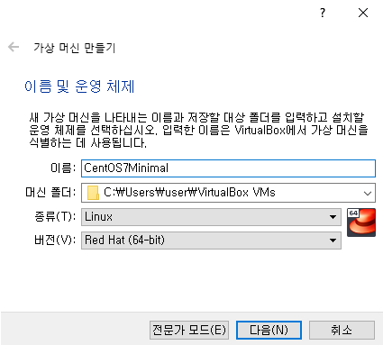 

- 메모리 크기 : 2048MB = 2G 

* CentOS7Minimal 폴더 생성됨 
  * 경로 : C:\Users\user\VirtualBox VMs

* 하드 디스크 파일 종류
  * VDI (VirtualBox 디스크 이미지)
  * 동적 할당


> 동적할당 vs. 고정 크기

* 동적 할당 
  * 가상 디스크를 사용할 때 고정된 최대 크기까지 파일 크기가 커지지만, 사용량이 줄어들어도 자동적으로 작아지지 않음
  * 설정한 범위까지 용량이 그때그때 커짐 but Host 공간 이상으로 커질 때 오류 !
    * VDI 크기 계속 늘어남
    * 늘어난 용량은 줄어들지 않으므로 파일 삭제해도 공간 확보 x
  * 실습용

* 고정 크기 
  * 만드는 데 더 오래 걸리지만 사용할 때 더 빠름
  * 한번 고정되면 남는 공간 사용 불가
  * 실무용

* 만들어진 디스크는 `.vdi` 파일
* lazy / eager ...


## CentOS7Desktop 생성

* Guest VM 사양(CentOS7Desktop)
  * CPU: 2Core (vCPU : 논리프로세서) 
  * RAM: 4GB (Shared Memory : 128M VGA : 비디오메모리)
  * SSD 32GB
  * NET: NAT (Network Address Translation)
  * IMG: CentOS7DVD*.iso


* 메모리 크기 : 4096MB

* 하드 디스크 파일 종류

  * VDI (VirtualBox 디스크 이미지)
  * 동적 할당

* 하드디스크 : 32GB

* 시스템 > 마더보드 

  * 광 디스크 / 하드 디스크 

  * 플로피 디스크 선택 해제

    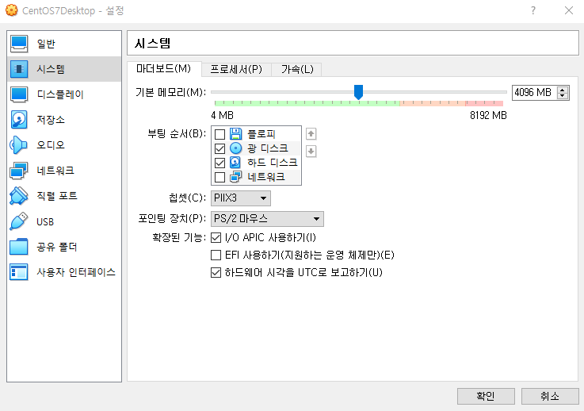 

* 시스템 > 프로세서 
  
  * CPU : 2
  
    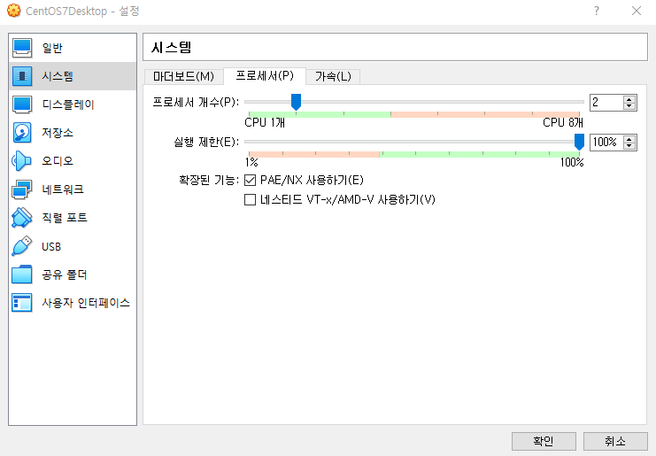 

* 디스플레이 > 비디오 메모리
  
  * 128MB
  
  * 기본적인 시스템 메모리에서 가져옴
  
    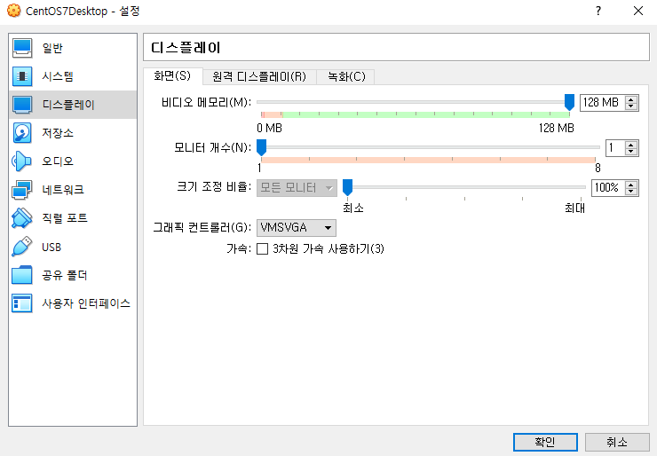 
  

* 저장소

  * 디스크 파일 CentOS7DVD 선택

    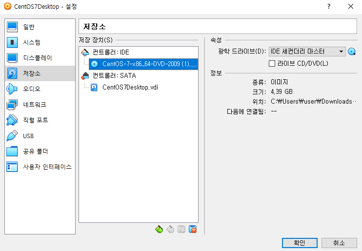 

* 오디오 > 선택해제
* 네트워크 > NAT
* USB > 선택해제
