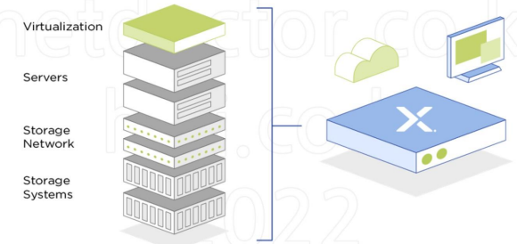
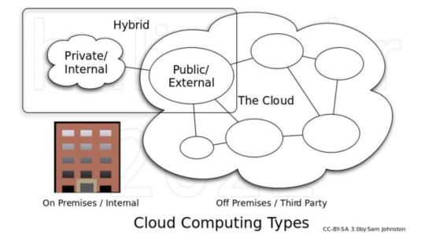
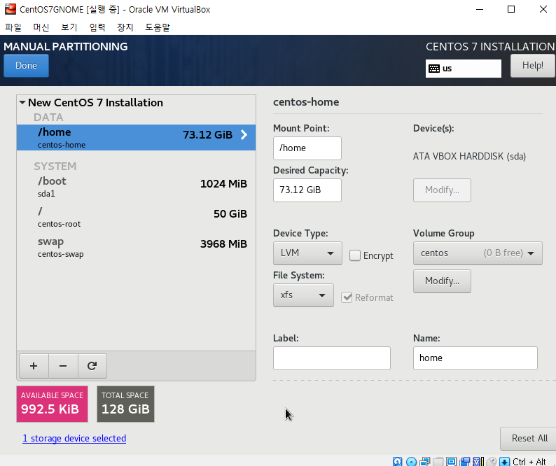
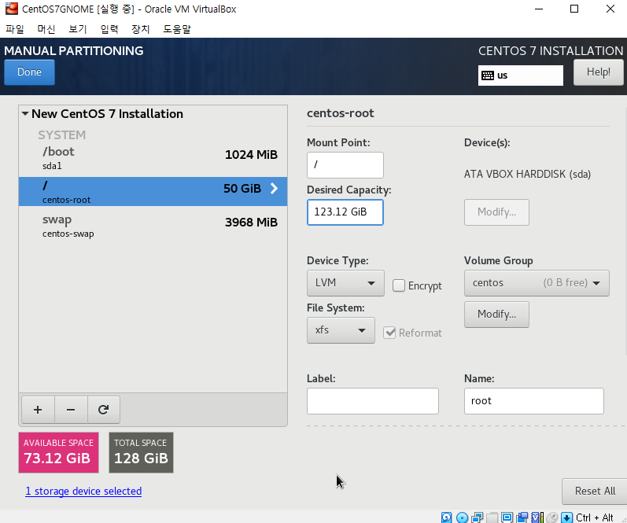
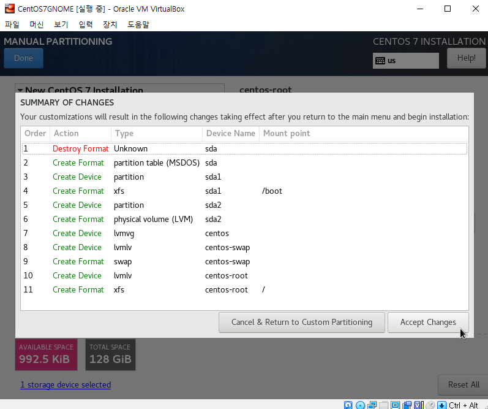
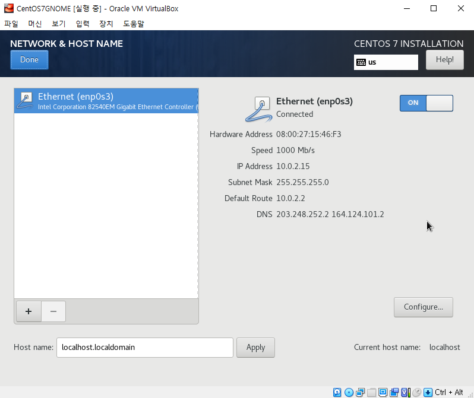

# 0404

* WIFI : kosa702-5G
* Password : kosa0401
  * Kosa0401! / Test1234! 등으로..
* 도메인
  * [gagia](https://domain.gabia.com/regist/today_domain)
  * [쇼핑 도메인](https://event.gabia.com/d_event_190201)

## 1. 인프라스트럭처 개요

### 인프라스트럭처란?

* 컴퓨터와 사용자들을 연결하는데 사용되는 물리적인 하드웨어
* 전송매체, 전송제어장치, 소프트웨어 포함
* 정보의 흐름과 처리를 지원하는 모든 것을 칭하기도 함
* IT Infrastructure Service : 아웃소싱으로 서비스를 받는 것

### IT 인프라 구성요소

* 하드웨어 : 서버(기본), 데이터센터, 개인용 컴퓨터, 라우터, 스위치, 기타 장비 등
* 소프트웨어 : 웹 서버, 콘텐츠 관리 시스템, 리눅스와 같은 OS 등
* 네트워크 : 라우터, 스위치, 케이블 등의 하드웨어와 인터넷 연결, 네트워크 활성화, 방화벽 및 보안

### IT 인프라 유형

* 전통적 인프라
  * 데이터센터, 데이터 스토리지를 비롯한 구성 요소는 모두 기업의 자체 시설에서 소유하고 관리해야 함
  * 실행하는 데 비용이 많이 들고 서버와 같은 하드웨어, 전력 및 물리적 공간이 대량으로 필요
  * 온프레미스(On-premise) :  소프트웨어 등 솔루션을 클라우드 같이 원격 환경이 아닌 자체적으로 보유한 전산실 서버에 직접 설치해 운영하는 방식
* 클라우드 인프라
  * 라우드 컴퓨팅에 필요한 구성 요소와 리소스
  * 클라우드 네이티브 인프라 : 처음부터 끝까지 클라우드
  * 클라우드 종류
    * 프라이빗 클라우드
      * 전용 리소스를 사용해 자체적으로 구축 
      * 사용자 특정
        * 회사 사원, 거래처
    * 퍼블릭 클라우드 
      * 클라우드 제공업체의 클라우드 인프라를 대여
      * 여러 클라이언트 사이에 자동으로 프로비저닝되고 할당되는 가상 리소스 풀
      * 사용자 불특정 다수
    * 멀티클라우드
      *  2곳 이상의 클라우드 벤더가 제공하는 2개 이상의 퍼블릭 또는 프라이빗 클라우드로 구성
    * 하이브리드클라우드
      * 둘 이상의 환경에서 일정 수준의 워크로드 이식성, 오케스트레이션, 관리 기능을 통합하는 IT 아키텍처
* 하이퍼컨버지드 인프라(HCI)
  * 단일 인터페이스에서 컴퓨팅, 네트워크, 데이터 스토리지 리소스를 관리 가능
  * 소프트웨어 정의 컴퓨팅 및 데이터 스토리지가 번들로 제공
  * 업계 표준 하드웨어에서 확장 가능한 아키텍처로 보다 현대적인 워크로드를 지원 가능
  * HCI는 컴퓨팅, 스토리지, 스토리지 네트워킹 및 가상화를 비롯한 전체 데이터센터 스택을 통합
  * 복잡하고 비용이 많이 드는 레거시 인프라는 턴키 방식의 업계 표준 서버에서 실행되는 플랫폼으로 대체

* 랙 -> IDC -> CDC
  * 랙 (Rack)
    * 전산실
    * 내부에 서버, 통신장비 등 장비을 설치하여 시스템 구성에 필요한 환경을 제공하고 장비의 보호 등의 기능을 수행하는 장비
  * IDC (Internet Data Center) 
    * 서버를 냉각, 관리, 전력 부분 서비스해주는 센터
    * 서버 컴퓨터와 네트워크 회선 등을 제공하는 시설로, 서버를 한 데 모아 집중시킬 필요가 있을 때 설립
  * CDC (Cloud Data Center)
    * 서버를 가상화 시켜서 가상머신(VM) 생성
    * 가상화 기술 서버를 좀 더 효율적으로 사용하기 위해 사용

* 서비스 제공자
  * CSP (Cloud Service Provider)
  * MSP (Managed Service Provider) 
  * ISP (Internet Service Provider) 

* 스택(Stack)

  

## 2. 온프레미스 인프라스트럭처

### 온프레미스(On-premise)  인프라스트럭처란?

* 직접 서버와 네트워크 운영
* 솔루션을 오프라인 전산실 서버에 직접 설치해 운영하는 방식
* 클라우드 컴퓨팅 기술이 나오기 전까지 기업 인프라 구축의 일반적 방식
* 보안이 필요한 서비스와 데이터는 온프레미스 롼경 사용
* 오프프레미스(Off-premise) : 온프레미스의 반대 개념 = 퍼블릭 클라우드

## 3. Virtual Box

* Guest VM 사양(CentOS7GNOME)
  * CPU: 2Core (vCPU : 논리프로세서) 
  * RAM: 4GB (4096MB)
    * Shared Memory : 128M VGA 
  * SSD 128GB
  * NET: NAT (Network Address Translation)
  * IMG: CentOS7DVD*.iso

* Disk Provisioning 
  * 사전에 미리 설정
  * 동적할당(D) : Thin Provisioning
  * 고정크기(F) : Thick Provisioning

* DATE&TIME : Asia/Seoul
* SOFTWARE SELECTION : GNOME Desktop
* I will configure partitioning > click here ...
* 
* home 삭제 > `/`에 123.12GB 용량 할당
* 
* 

* NETWORK & HOST NAME : On

* 

* ROOT PASSWORD : 개인 암호

  

## 4. 클라우드 컴퓨팅

### 클라우드 컴퓨팅이란?

* 관리 노력과 서비스 공급자의 상호 작용을 최소화하면서 신속하게 제공하거나 해제할 수 있는 구성 가능한 컴퓨팅 리소스의 공유 풀에 어디서나 편리하게 필요한 시점에 네트워크(인터넷)로 접근할 수 있게 하는 모델 (미국 국립표준기술협회)
* 클라우드를 통해 서버, 스토리지, 데이터베이스, 네트워킹, 소프트웨어, 분석, 인텔리전스 등의 컴퓨팅 서비스를 제공하는 것 (Microsoft Azure)
*  IT 리소스를 인터넷을 통해 온디맨드로 제공하고 사용한 만큼만 비용을 지불하는 것 (Amazon AWS)

### 클라우드 컴퓨팅 유형

* 퍼블릭 클라우드

  * 클라우드 리소스는 타사 클라우드 서비스 공급자가 소유하고 운영하며 인터넷을 통해 제공
  * 모든 하드웨어, 소프트웨어 및 기타 지원 인프라를 클라우드 공급자가 소유하고 관리
  * 다른 조직 또는 클라우드 테넌트와 같은 하드웨어, 스토리지 및 네트워크 디바이스를 공유하며 웹 브라우저를 사용하여 서비스에 액세스하고 계정을 관리
  * 장점: 비용절감, 유지관리 불필요, **무제한에 가까운 스케일링 성능(오토 스케일링)**, **높은 안정성(고가용성)**
    * 스케일링: 자원에 대한 조정
      * 예: CPU, RAM, SSD
    * 가용성: 접근/네트워크 자원

* 프라이빗 클라우드

  * 단일 비즈니스 또는 조직에서 독점적으로 사용되는 클라우드 컴퓨팅 리소스로 구성
  * 실제로 조직의 현장 데이터 센터에 있거나 타사 서비스 공급자가 호스팅할 수 있음
  * 서비스와 인프라가 항상 프라이빗 네트워크에서 유지 관리되며, 하드웨어와 소프트웨어는 조직에서만 전용으로 사용됨
  * 조직이 특정 IT 요구 사항을 만족시키도록 리소스를 쉽게 사용자 지정 가능
  * 장점: 유연성 향상(커스터마이징), 제어 향상(보안), 스케일링 성능 향상
    * 스케일링 성능: 기존 온-프레미스보다는 향상 but 퍼블릭과는 비교 불가
  * 오픈스택(Openstack)으로 클라우드 생성
    * [NHN Cloud 서비스](https://www.toast.com/kr/service)
    * [KT Cloud](https://cloud.kt.com/)
  * 

  

