# 0405

> 복습

* 백업(backup) : ova 파일로 내보내기(다른 머신으로 옮기기)

* 스냅샷(snapshot) : 타임머신 기능(어느 한 시점을 찍고 돌아가는 복원 기능)


## 1. 운영체제

### 운영체제란?

> 오퍼레이팅 시스템(Operating System:OS)

* 시스템 하드웨어를 관리할 뿐 아니라 응용 소프트웨어를 실행하기 위해 하드웨어 추상화 플랫폼과 공통 시스템 서비스를 제공하는 시스템 소프트웨어
* 최근에는 실제 하드웨어가 아닌 하이퍼바이저(가상 머신)위에서 실행
* 커널(Kernel): 입출력과 메모리할당과 같은 하드웨어 기능의 경우 운영 체제는 응용 프로그램과 컴퓨터 하드웨어 사이의 중재 역할
* 윈도우, 맥 OS, 리눅스, 유닉스


### 운영체제 구성 요소

#### 커널(Kernel)

##### 정의

* 운영체제에서 가장 중요한 프로그램 중 하나로, 하드웨어라는 자원을 관리하는 관리자

* 어떤 프로그램이 작동할 수 있도록 CPU, 메모리, 디스크와 같은 물리적 장치들을 배분하는 것
  * 배분: 하드웨어 장치를 적절하게 배치
  
  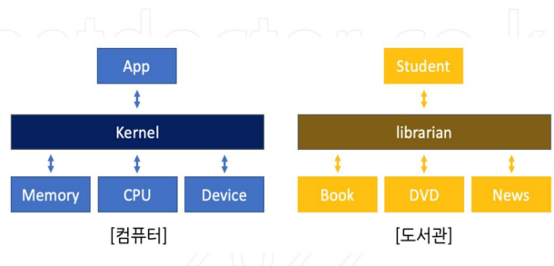

##### 기능

* 메모리관리
  * 메모리가 어디에서 무엇을 저장하는데 얼마나 사용되는지 추적
* 프로세스관리 = 스케줄링(배치,배분)
  * 어느 프로세스가 중앙처리장치(CPU)를 언제 얼마나 오랫동안 사용할지를 결정
* 장치 드라이버
  * 하드웨어와 프로세스 사이에서 중재자/인터프리터의 역할을 수행
* 시스템 호출 및 보안
  * 프로세스의 서비스 요청을 수신


## 2. VirtualBox 네트워크

### 기본 용어 정리

* Host (호스트) = 자신의 메인 PC (window10)

* Guest (Guest) = 모든 가상 서버


* 공인 IP = 외부 세계와 연결할 때 쓰는 통신사에 돈 내고 얻은 내 고유의 IP (1개)

  사설 IP = 통신사에서 준 유무선공유기(AP)를 통해 집 내부 기기들에 할당되는 모든 IP (여러개)

  

* IPv4 주소는 수가 제한적 

  * 따라서 여러 디바이스에서 인터넷에 엑세스할 때 공유기 필요

  * 공유기

    * 하나의 공인 IP 공유 
    * 내부 IP를 통신할 수 있는 공인IP로 변화시켜줌 > 이 기술이 NAT(Network Address Transration)

    

### 01. NAT (Network Address Translation)

* 네트워크 주소 변환 방식
* NAT 방식으로 연결된 가상머신 모두 같은 IP가 할당
* 가상머신 모두 외부로 인터넷 통신은 되지만 내부 머신끼리 통신은 불가
* 호스트와 게스트간 통신을 하기 위해서는 별도로 포트 포워딩 필요

* ssh(Secure SHell) : 물리적서버(PM) 및 가상서버(VM)

  ```
  ssh root@10.0.2.15
  ```

  * 접속 불가 

  

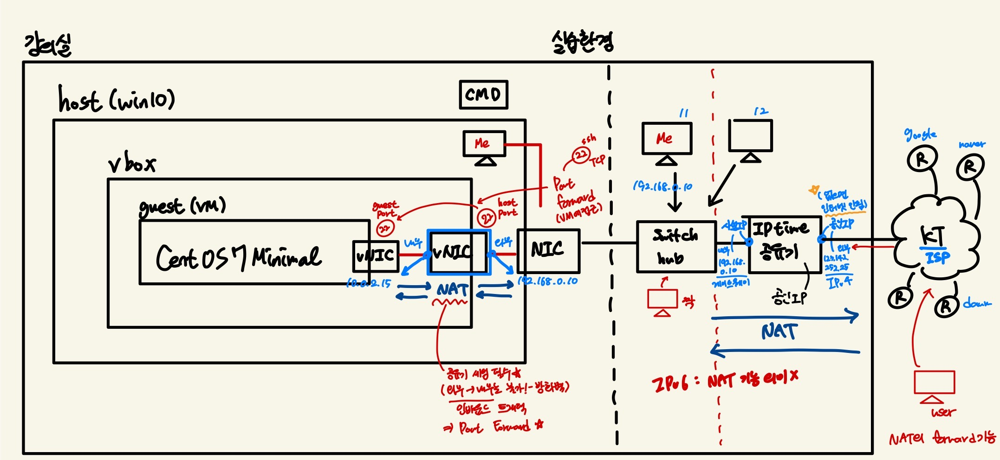

* NIC (Nextwork Interface Card) : 랜카드
* vNIC (Virtual Nextwork Interface Card) : 가상 랜카드

* 포트 포워드(Port Forward) :

  * 출발지 IP > 목적지 IP

    * 출발지가 내부 > 외부 : 송신

      출발지가 외부 > 내부 : 수신

  * 공인 IP 필요
  * NAT는 송신 전용 게이트

    * 라우팅이 없기 때문에 외부에서 내부(인바운드)로 수신 불가 - 방화벽
    * 대신 세팅을 통해 수신도 가능


CentOS > 설정 > 네트워크 > 포트 포워딩 > 새 포트 포워딩 규칙 추가

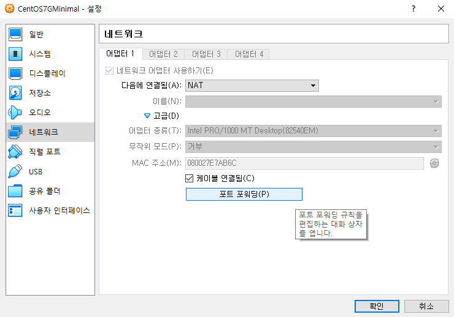

* SSH 프로토콜 도구 이용해서 VM에 접근
  * 통신을 통해서 접근 : IP, Port
  * ssh를 이용할 때는 22번 port 이용 (TCP)

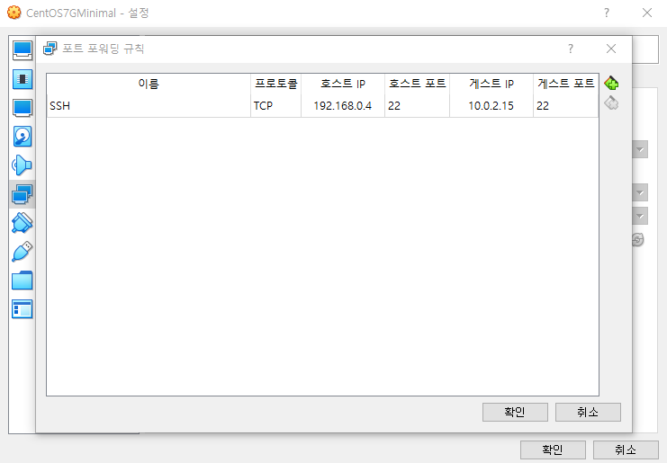

* 호스트 ip (window10 ip)
* 호스트 port (22)
* 게스트 ip (10.0.2.15)
* 게스트 port (22)

```
C:\Users\user>ssh root@192.168.0.4
The authenticity of host '192.168.0.4 (192.168.0.4)' can't be established.
ECDSA key fingerprint is SHA256:UtZ1c/AE5Ix2E3+tnW4ITpYcsGGMDBimAW24NS8vMSI.
Are you sure you want to continue connecting (yes/no)? 
```

* `yes` : known host로 등록

```
C:\Users\user>ssh root@192.168.0.4
root@192.168.0.4's password:
Last login: Tue Apr  5 09:43:24 2022
[root@localhost ~]#
```

* id : kosa
* pass: kosa0401

```
[root@localhost ~]# adduser kosa
[root@localhost ~]# passwd kosa
Changing password for user kosa.
New password:
BAD PASSWORD: The password contains the user name in some form
Retype new password:
passwd: all authentication tokens updated successfully.
[root@localhost ~]#
```

* 짝's VM에 접근

```
C:\Users\user>ssh kosa@192.168.0.21
kosa@192.168.0.21's password:
[kosa@localhost ~]$
```


### 02.  Natnetwork
* 원본과 복제본 ip 주소가 같음
  * 같으면 통신 불가
  * NAT로 세팅했기 때문
  * vm들이 다 똑같은 ip 부여 받음 
* Natnetwork가 더 바람직
* VM만 NAT 두종류!


* 전역설정
  * 파일 > 환경설정 > 네트워크 > NAT 네트워크 추가

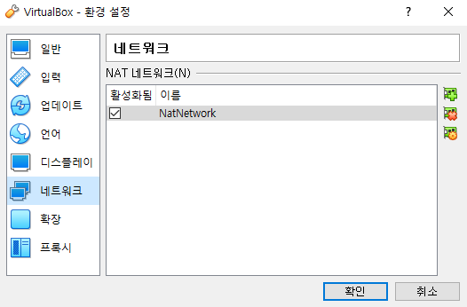

* 개별 설정(두개 다)
  * 설정 > 네트워크 > NAT 네트워크 선택

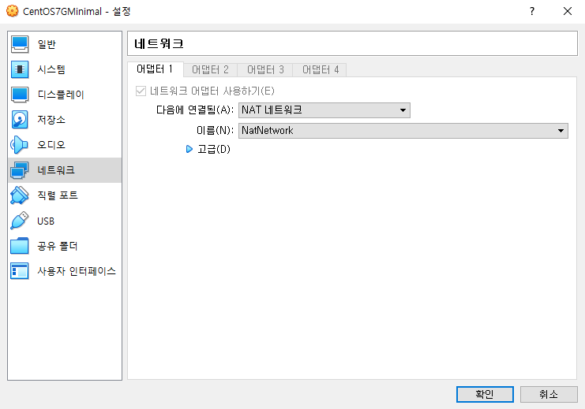

* DHCP (Dynamic Host Configuration Protocol)
  * 동적 호스트 구성 프로토콜
  * 컴퓨터와 사용자에게 IP 주소를 자동으로 할당

* VM 안에도 DHCP 기능 존재 - 자동으로 NAT ip 부여
  * 다 같은 ip -  MAC 주소(pysical주소) - 가 같기 때문에!
  *  MAC 주소 변경 가능

* 개별 설정
  * 네트워크 > 고급 > MAC 주소 새로고침
  * 각 VM 다른 IP 주소 갖게 됨
    * CentOS7Minimal : 10.0.2.5
    * CentOS7Minimal - 복제 : 10.0.2.4


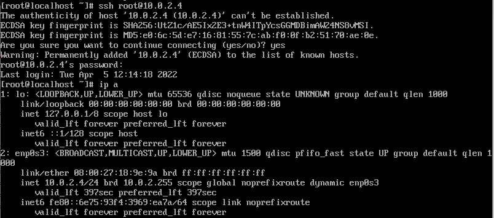

* 두개의 호스트 - `10.0.2.` : 같은 네트워크 / `5.` or `.4` : 호스트
  * A : 10.0.2.5
  * B : 10.0.2.4

* 하나의 ip로 두개의 vm에 접근 가능해야 함 - 도커 컨테이너 !

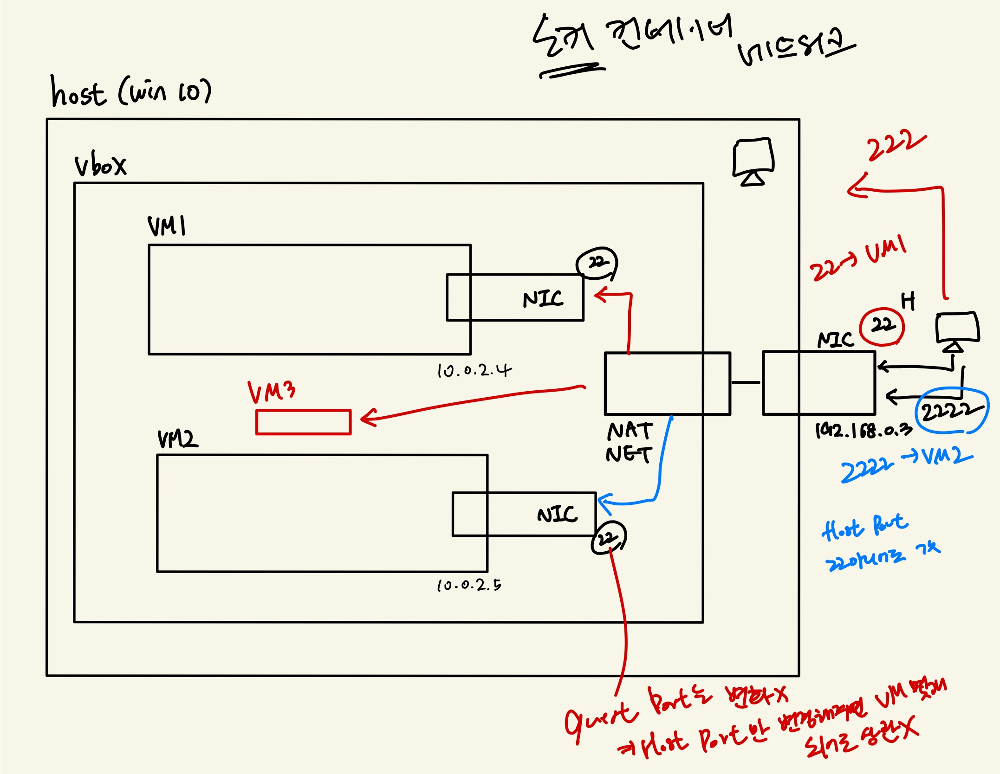

* 전역설정
  * 파일 > 환경설정 > 네트워크 > NatNetwork 더블클릭 > 포트 포워딩 > 추가

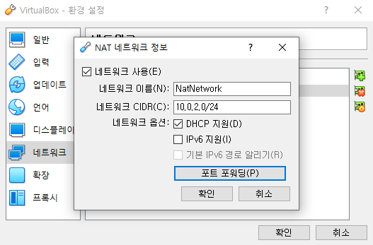

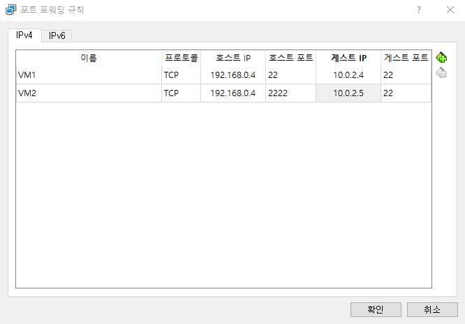

* VM1 접속

  * inet 10.0.2.4

  ```
  C:\Users\user>ssh root@192.168.0.4
  root@192.168.0.4's password:
  Last login: Tue Apr  5 12:17:01 2022 from 10.0.2.5
  [root@localhost ~]#
  ```

* VM2 접속

  *  inet 10.0.2.5

* `-p` : port 번호

  ```
  C:\Users\user>ssh -p 2222 root@192.168.0.4
  root@192.168.0.4's password:
  Last login: Tue Apr  5 12:14:31 2022
  [root@localhost ~]#
  ```

  

* NatNetwork를 사용하는 것이 바람직!
  * 도커 네트워크와 유사


### 03. host only

* 호스트 전용 어댑터
* host only IP는 인터넷 사용 불가, 연결 안됨
  * `127.0.0.1`는 localhost IP (loopback IP)


* 개별설정 > 네트워크 > 호스트 전용 어댑터
  * 원본 MAC주소 : 08002720E316
  * 복제 MAC주소 : 080027189E9A

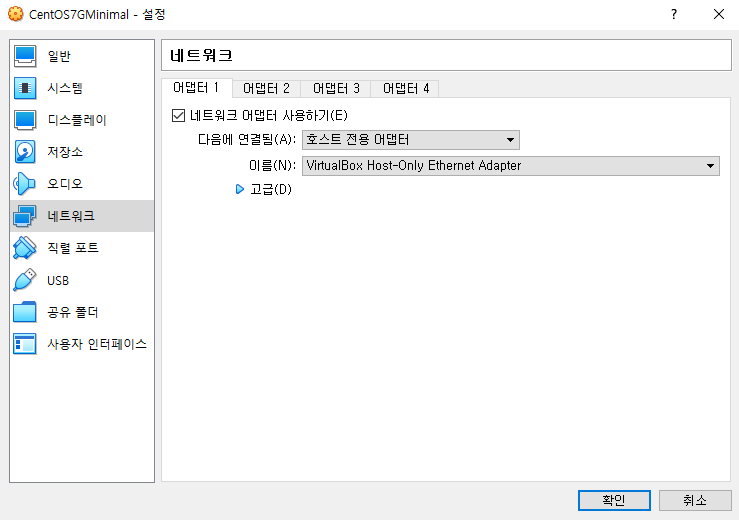


* Host-Only Network의 가상 랜카드를 통해 ping, ssh 가능

  * 포트 포워딩 필요 x

  * `192.168.56.~` : 네트워크가 같음

  * ping

    ```
    C:\Users\user>ping 192.168.56.101
    
    Ping 192.168.56.101 32바이트 데이터 사용:
    192.168.56.101의 응답: 바이트=32 시간=1ms TTL=64
    192.168.56.101의 응답: 바이트=32 시간<1ms TTL=64
    192.168.56.101의 응답: 바이트=32 시간<1ms TTL=64
    
    192.168.56.101에 대한 Ping 통계:
        패킷: 보냄 = 3, 받음 = 3, 손실 = 0 (0% 손실),
    왕복 시간(밀리초):
        최소 = 0ms, 최대 = 1ms, 평균 = 0ms
    Control-C
    ^C
    C:\Users\user>ping 192.168.56.102
    
    Ping 192.168.56.102 32바이트 데이터 사용:
    192.168.56.102의 응답: 바이트=32 시간<1ms TTL=64
    192.168.56.102의 응답: 바이트=32 시간<1ms TTL=64
    192.168.56.102의 응답: 바이트=32 시간<1ms TTL=64
    
    192.168.56.102에 대한 Ping 통계:
        패킷: 보냄 = 3, 받음 = 3, 손실 = 0 (0% 손실),
    왕복 시간(밀리초):
        최소 = 0ms, 최대 = 0ms, 평균 = 0ms
    ```

  * ssh

    ```
    C:\Users\user>ping 192.168.56.101
    
    Ping 192.168.56.101 32바이트 데이터 사용:
    192.168.56.101의 응답: 바이트=32 시간=1ms TTL=64
    192.168.56.101의 응답: 바이트=32 시간<1ms TTL=64
    192.168.56.101의 응답: 바이트=32 시간<1ms TTL=64
    
    192.168.56.101에 대한 Ping 통계:
        패킷: 보냄 = 3, 받음 = 3, 손실 = 0 (0% 손실),
    왕복 시간(밀리초):
        최소 = 0ms, 최대 = 1ms, 평균 = 0ms
    Control-C
    ^C
    C:\Users\user>ping 192.168.56.102
    
    Ping 192.168.56.102 32바이트 데이터 사용:
    192.168.56.102의 응답: 바이트=32 시간<1ms TTL=64
    192.168.56.102의 응답: 바이트=32 시간<1ms TTL=64
    192.168.56.102의 응답: 바이트=32 시간<1ms TTL=64
    
    192.168.56.102에 대한 Ping 통계:
        패킷: 보냄 = 3, 받음 = 3, 손실 = 0 (0% 손실),
    왕복 시간(밀리초):
        최소 = 0ms, 최대 = 0ms, 평균 = 0ms
    ```

* 인터넷 연결하기 위해 랜카드 하나 더 생성

  * 설정 > 네트워크 > 어댑터2 > NAT 네트워크
  
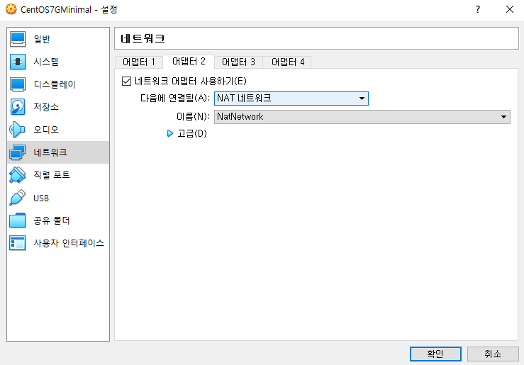

* enp0s3 / enp0s8  : NIC 인터페이스명

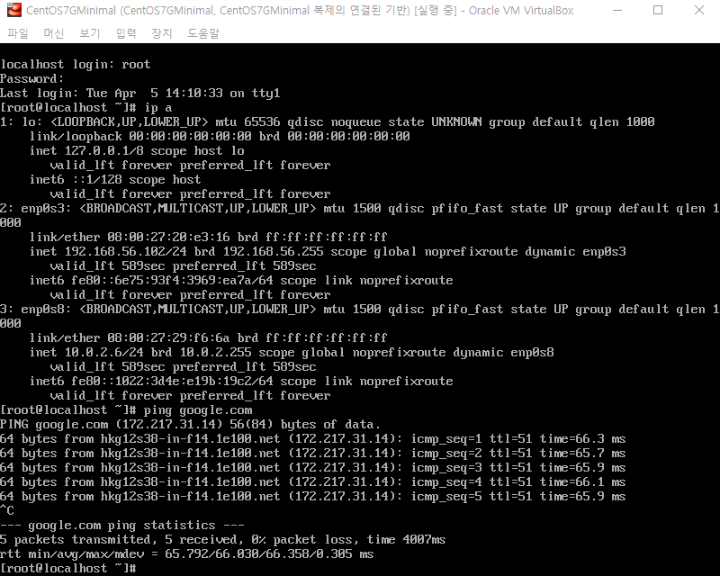

* 포트포워드 : 호스트 내부에선 필요없지만 외부에서는 필요!
* 파일 > 환경설정 > 네트워크 > NatNetwork 더블클릭 > 포트 포워딩 > 추가

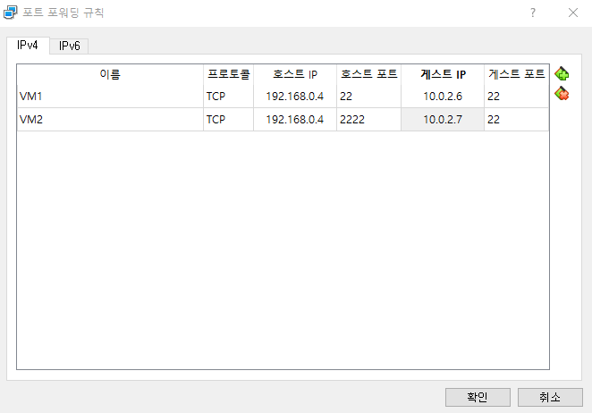

* 포트포워딩으로 외부 VM과 연결

```
C:\Users\user> ssh kosa@192.168.0.21
kosa@192.168.0.21's password:
Last login: Tue Apr  5 11:30:15 2022 from gateway
[kosa@localhost ~]$
```

* hostonly : 보안상의 이유로 사내에서 사용


### 04. bridge

* 외부IP사용가능

* 개별설정 > 네트워크 > 어댑터1 > 어댑터에 브리지

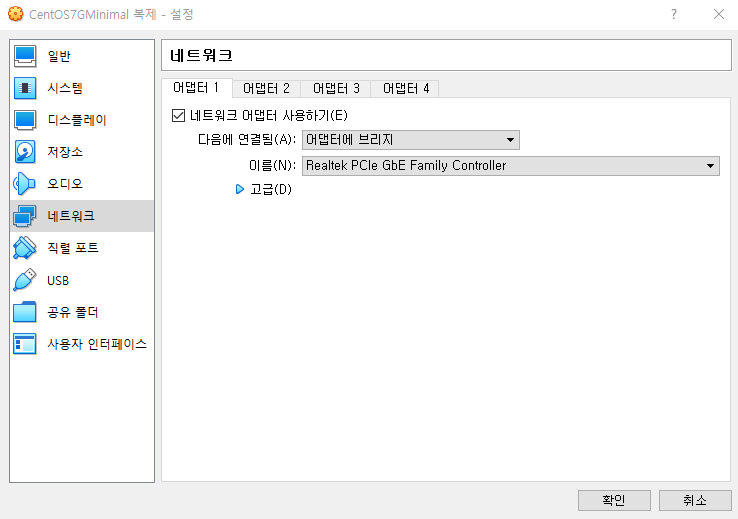

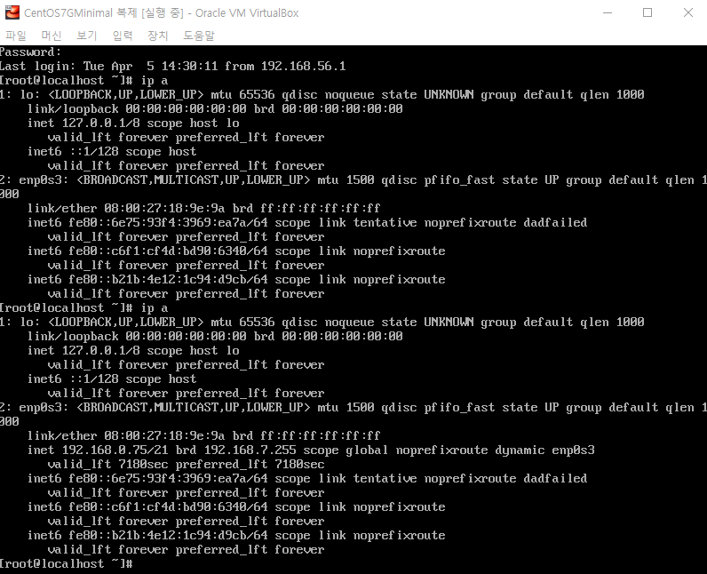

```
C:\Users\user>ssh kosa@192.168.0.96
kosa@192.168.0.96's password:
Last login: Tue Apr  5 14:35:27 2022 from 192.168.0.4
[kosa@localhost ~]$
```


### 05. 내부네트워크

* 나중에...


## 3. GUI 설치

### CentOS7GXFCE 

#### CentOS7GXFCE 생성

* CentOS7Minimal 복제
* MAC 주소 정책 : 모든 네트워크 어댑터의 새 MAC 주소 생성
* 완전한 복제
* 스냅샷 : 현재 머신 상태

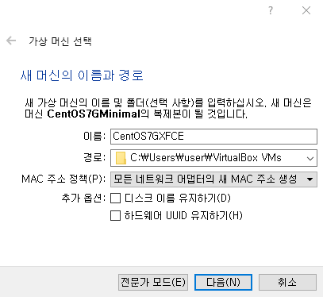

#### CentOS7GXFCE 사양

* CPU: 2C
* RAM: 4G (Shared Memory : 128M VGA)

```
C:\Users\user>ssh root@192.168.0.124
root@192.168.0.124's password:
Last login: Tue Apr  5 15:17:41 2022
[root@localhost ~]#
```


### CentOS7 경량 데스크톱 (X-Windows) 설치

> 메모장 참고

1. 센토스 7 커널 업데이트

```
# yum -y install yum-plugin-fastestmirror # 가장 빠른 미러사이트
# yum install epel-release -y # EPEL 설치
# yum update -y # 업데이트
# yum install kernel-devel kernel-headers -y # 커널 설치 
# yum install -y install gcc make linux-headers-$(uname -r) dkms # 컴파일 관련 도구/라이브러리
# reboot # OS 커널 관련은 재부팅 필요
```

2. 센토스 7 xfce 데스크톱 설치

```
# yum groupinstall "X Window System" Xfce -y
# systemctl set-default graphical.target
# rm -rf /etc/systemd/system/default.target
# ln -s '/usr/lib/systemd/system/graphical.target' '/etc/systemd/system/default.target'
# yum install -y unzip wget
```

3. 센토스 7 구글 크롬 설치

   * `vi` 는 나중에...

   * `:q!` : 나오는 단축키

4. 한글 나눔글꼴 설치

```
# mkdir /usr/share/fonts/nanumfont && cd $_
# wget http://cdn.naver.com/naver/NanumFont/fontfiles/NanumFont_TTF_ALL.zip
# unzip NanumFont_TTF_ALL.zip
# rpm -Uvh https://dl.fedoraproject.org/pub/epel/epel-release-latest-7.noarch.rpm
# yum install -y perl gcc dkms kernel-devel kernel-headers make bzip2
```

* GUI 설치 후

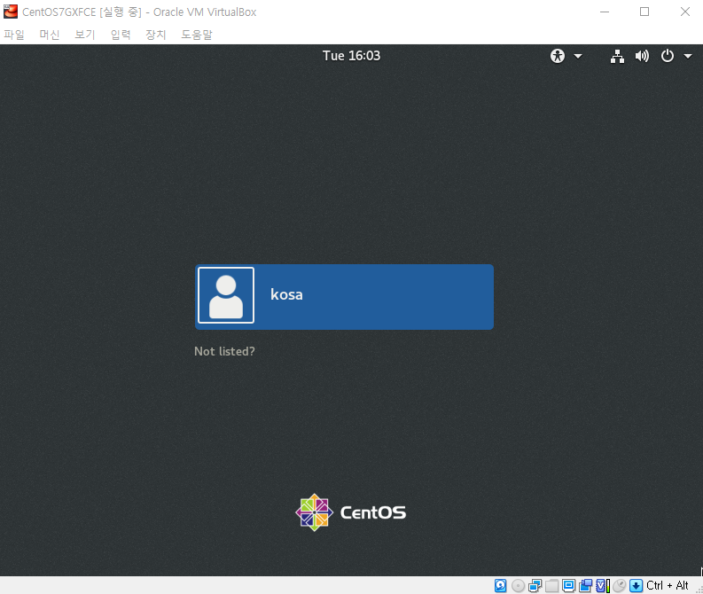


#### Auto Resize 기능 추가

* cdrom 생성 : 장치 > 게스트 확장 CD 이미지 삽입

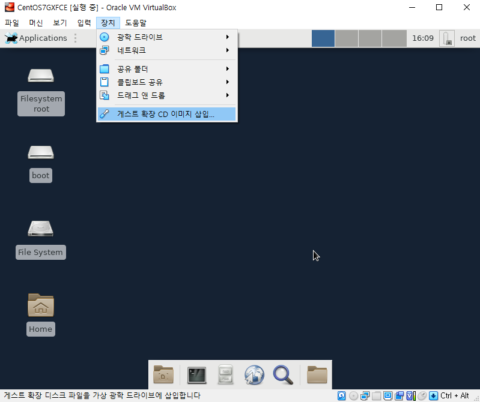

* 터미널 : 우클릭 > Open Terminal Here

* mnt와 cdrom 연결

```
# mount /dev/sr0 /mnt 				 # mnt폴더와 cdrom 연결
# cd /mnt 							# mnt로 이동
# ./VBoxLinuxAdditions.run
# reboot							# 리부트
```

* `Ctrl` + `Shift` + `C` : 복사
* `Ctrl` + `Shift` + `V` : 붙여넣기

* 장치 > 클립보드 공유 > 양방향 ㅊㅇ //
* 장치 > 드래그 앤 드롭 > 양방향


#### Text Editor 설치

```
# yum install gedit
```

* 실행 : Applications > Accessories > Text Editor

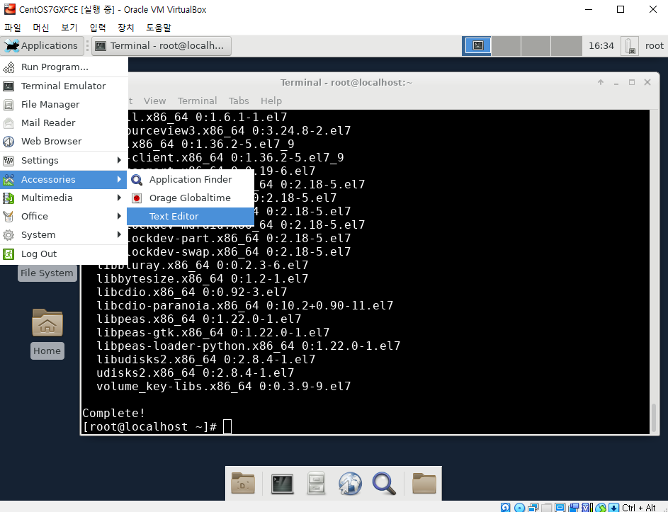


## 4. 리눅스 기본 명령어

### 실습준비

* `{}` : 여러개

```
# mkdir dir{A,B,C}
anaconda-ks.cfg  Desktop  dirA  dirB  dirC

# touch dir{A,B,C}/file{X,Y,Z}
# touch file{A,B,C,D}
anaconda-ks.cfg  Desktop  dirA  dirB  dirC  fileA  fileB  fileC  fileD

# ls -F ./ dirA dirB dirC
anaconda-ks.cfg  Desktop/  dirA/  dirB/  dirC/  fileA  fileB  fileC  fileD

dirA:
fileX  fileY  fileZ

dirB:
fileX  fileY  fileZ

dirC:
fileX  fileY  fileZ
```


### CLI 구문

* `uname` : 시스템 정보 출력

```
# uname
Linux
# uname -a
Linux localhost.localdomain 3.10.0-1160.59.1.el7.x86_64 #1 SMP Wed Feb 23 16:47:03 UTC 2022 x86_64 x86_64 x86_64 GNU/Linux
# uname -s
Linux
# uname -r
3.10.0-1160.59.1.el7.x86_64
# uname -s -r
Linux 3.10.0-1160.59.1.el7.x86_64
# uname -sr
Linux 3.10.0-1160.59.1.el7.x86_64
```

* 날짜 관련

```
# date
Tue Apr  5 16:49:02 KST 2022
# cal
     April 2022     
Su Mo Tu We Th Fr Sa
                1  2
 3  4  5  6  7  8  9
10 11 12 13 14 15 16
17 18 19 20 21 22 23
# cal 9 2015
   September 2015   
Su Mo Tu We Th Fr Sa
       1  2  3  4  5
 6  7  8  9 10 11 12
13 14 15 16 17 18 19
20 21 22 23 24 25 26
27 28 29 30
```

* 목록 확인

```
# ls
anaconda-ks.cfg  Desktop
# ls -l /etc/hosts
-rw-r--r--. 1 root root 158 Jun  7  2013 /etc/hosts
```

* `cd` : 디렉토리 이동
  * `/`생략 가능

```
[root@localhost /]# cd /var/log/samba/old
[root@localhost old]# cd /
[root@localhost /]# cd test
[root@localhost test]# 
```

* `;` : 명령어 연결

```
[root@localhost /]# date; uname
Tue Apr  5 17:16:38 KST 2022
Linux
[root@localhost /]# cal 9 2020; date; uname -a
   September 2020   
Su Mo Tu We Th Fr Sa
       1  2  3  4  5
 6  7  8  9 10 11 12
13 14 15 16 17 18 19
20 21 22 23 24 25 26
27 28 29 30

Tue Apr  5 17:16:56 KST 2022
Linux localhost.localdomain 3.10.0-1160.59.1.el7.x86_64 #1 SMP Wed Feb 23 16:47:03 UTC 2022 x86_64 x86_64 x86_64 GNU/Linux
[root@localhost /]# 
```

* `mkdir –p /test` : 최상위 디렉토리 아래 test 디렉토리 생성

* `cd /test` : 생성한 test 디렉토리로 이동
* `pwd` : 현재 작업 디텍토리 확인

```
# mkdir -p /test
# ls
bin   dev  home  lib64  mnt  proc  run   srv  test  usr
boot  etc  lib   media  opt  root  sbin  sys  tmp   var
# cd test
[root@localhost test]# cd /var/log/samba/old
[root@localhost old]# pwd
/var/log/samba/old
```

* `cd ~` : home으로 이동

```
[root@localhost old]# cd ~
[root@localhost ~]# pwd
/root
[root@localhost ~]# 
```

* `Ctrl` + `C` : 명령어 중지

```
# sleep 500
# ls 
# locale
```

* `Ctrl` + `D` : 파일의 끝 

  * `file1`에 `Hello, Linux`라는 문구 입력

  ```
  # cat > file1
  Hello, Linux <Enter>
  <CTRL + D>
  ```

  * 입력된 파일 내용 확인
    * `<` : 생략가능

  ```
  # cat < file1
  Hello, Linux
  ```

* 실습

```
# cat > file1
Hello, Linux
# ls
anaconda-ks.cfg  Desktop  dirA  dirB  dirC  file1  fileA  fileB  fileC  fileD
# cat file1
Hello, Linux
# cat < file1
Hello, Linux
# cat > file2
Aloha, Linux
# cat file2
Aloha, Linux
```


## 센토스 7 구글 크롬 설치

```
3. 센토스 7 구글 크롬 설치
# vi /etc/yum.repos.d/google-chrome.repo 
[google-chrome] 
name=google-chrome 
baseurl=http://dl.google.com/linux/chrome/rpm/stable/$basearch
enabled=1 
gpgcheck=1 
gpgkey=https://dl-ssl.google.com/linux/linux_signing_key.pub 
# yum install google-chrome-stable -y
# vi /opt/google/chrome/google-chrome
exec -a "$0" "$HERE/chrome" "$@" --no-sandbox --user-data-dir
#  /usr/bin/google-chrome
```

* Applications > Internet > Google Chrome

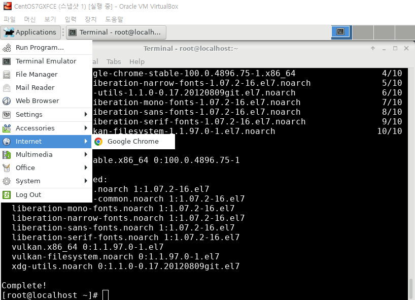

* 구글 크롬 내려 받을 저장소 정의
  * `cat` 이용

```
# cat > /etc/yum.repos.d/google-chrome.repo
[google-chrome] 
name=google-chrome 
baseurl=http://dl.google.com/linux/chrome/rpm/stable/$basearch
enabled=1 
gpgcheck=1 
gpgkey=https://dl-ssl.google.com/linux/linux_signing_key.pub

# cat < /etc/yum.repos.d/google-chrome.repo
[google-chrome] 
name=google-chrome 
baseurl=http://dl.google.com/linux/chrome/rpm/stable/$basearch
enabled=1 
gpgcheck=1 
gpgkey=https://dl-ssl.google.com/linux/linux_signing_key.pub
[root@localhost ~]# 
```

```
# yum install google-chrome-stable -y
```

