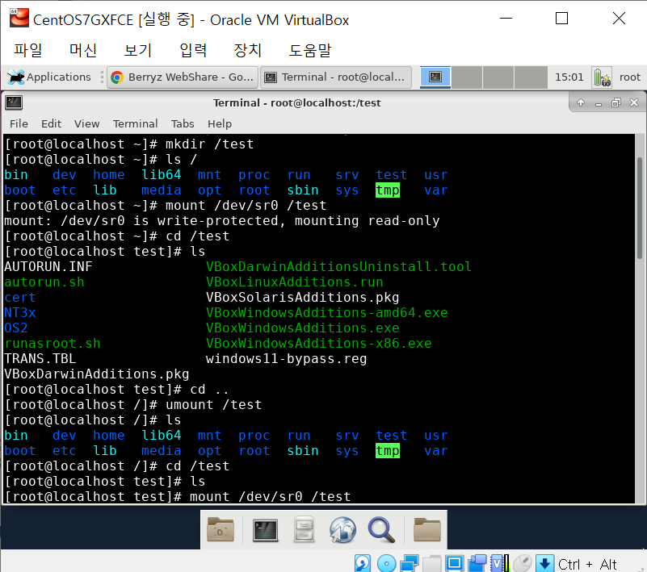

# 0406


## 운영체제 구성요소

### 커널(Kernel)

* 이전 시간

### 쉘(Shell)

* 사람이 사용하는 명령어를 프로그램이 실행할 수 있도록 만들어주는 인터페이스
* 터미널에서 사용하는 명령어들은 전부 쉘 언어
* 쉘에서는 프로그램에 직접 명령어를 전달할 수도 있고, 내부에서 함수도 짤 수 있으며, 초기 환경 세팅도 가능
* 일반적으로 명령 줄과 그래픽 형의 두 종류로 분류
  * 명령줄 쉘은 운영 체제 상에서 명령 줄 인터페이스(CLI)를 제공
  * 그래픽 쉘은 그래픽 사용자 인터페이스(GUI)를 제공
* 윈도우 쉘 : 
  * 명령 프롬프트(cmd)
  * 탐색창
* CentOS7 쉘
  * bash
  * sh / shell ...

### 디렉토리(Directory)

> 폴더(Folder), 카탈로그(Catalog)

* 컴퓨팅에서 파일을 분류하기 위해 사용하는 이름 공간
* 파일 시스템 안에서 파일과 다른 하부 디렉토리들로 구성
* 하위(서브) 디렉토리: 다른 디렉토리 속의 디렉토리
  * 계급, 트리 구조
  * 부모 - 자식 디렉토리


## 리눅스(Linux)

### 리눅스란?

* 컴퓨터 운영체제(서버 운영체제)이며, 그 커널을 뜻하기도 함
* 자유 소프트웨어와 오픈 소스 개발의 가장 유명한 표본
* 다중 사용자, 다중 작업(멀티태스킹), 다중 스레드를 지원하는 네트워크 운영 체제(NOS)
* CentOS7(AWS, AMI, AL2), Ubuntu18, ...
* 벤더 독립성, 적은 개발비, 보안성, 안정성


* UNIX > BSD > LINUX > ...


### 경로


* `/` : 최상위 디렉토리
* `/`로 시작하면 절대경로
  * `/etc/sysconfig/network`


* 주로 3등분
  * yum + `-y`
  * install + `-y`


### 디렉토리 종류

* /home : 사용자 홈 디렉토리 생성되는 디렉토리
* /media : CD_ROM이나 USB 같은 외부 장치를 연결하는 디렉토리
* /opt : 추가 패키지가 설치되는 디렉토리
* /dev : 장치 파일들이 저장되어 있는 디렉토리
* /root : root 계정의 홈 디렉토리
  * / 디렉토리와는 다름
* /sys : 리눅스 커널 관련 정보가 있는 디렉토리
* /usr : 기본 실행 파일과 라이브러리 파일, 헤더 파일 등의 파일이 저장되어 있는 디렉토리
* /boot : 부팅에 필요한 정보를 가진 파일들이 있는 디렉토리
* /var : 시스템 운영 중에 발생한 데이터의 로그가 저장되는 디렉토리
  * /var/www/html ...
  * /var/log ...
* /tmp : 시스템 사용 중에 발생한 임시 데이터가 저장되는 디렉토리 
  * 부팅 시 초기화
* /srv : FTP나 Web등 시스템에서 제공하는 서비스의 데이터가 저장되는 디렉토리
* /run : 실행 중인 서비스와 관련된 파일이 저장되는 디렉토리
* /proc : 프로세스 정보 등 커널 관련 정보가 저장되는 디렉토리
* /mnt : 파일 시스템을 임시로 연결하는 디렉토리 
* /etc : 리눅스 설정을 위한 각종 파일들을 가지고 있는 디렉토리


## VirtualBox

### CentOS7GXFCE

### 사양

* CPU: 2C

  RAM: 4G (4096MB)

  * 128M VGA 

  SSD: 128G (동적할당)

  IMG: CentOS7DMinimal*.iso

  NET: 

  * NAT
  * Host-Only

* 현재 enp0s8 : IP 안나옴
  * 랜카드 안킴
  * vi로 enp0s8 설정을 변경해 IP 받아올 것


### 문제 해결

* vi : 유닉스(Unix) 환경에서 사용되는 문서 편집기
  * `vi` + `i` : Insert 모드
  * `Esc`
  * `:` : 모드 변경


```
# vi ifcfg-enp0s8
```

* Insert 모드로 변경 후 `ONBOOT=yes`로 변경
* `:wq`로 저장


* 리부팅

```
# systemctl restart network
```


* IP : 192.168.56.101


### CentOS7XFCE

* CentOS7GXFCE 복제
* 모든 어댑터의 새 MAC 주소 생성
* 완전한 복제


**1. 센토스 7 커널 업데이트**

```
# yum -y install yum-plugin-fastestmirror 
# yum install epel-release -y
# yum update -y
# yum install kernel-devel kernel-headers -y 
# yum install -y install gcc make linux-headers-$(uname -r) dkms
# reboot 
```


**2. 센토스 7 xfce 데스크톱 설치**

```
# yum groupinstall "X Window System" Xfce -y
# systemctl set-default graphical.target
# rm -rf /etc/systemd/system/default.target
# ln -s '/usr/lib/systemd/system/graphical.target' '/etc/systemd/system/default.target'
# yum install -y unzip wget
```


**3. 센토스 7 구글 크롬 설치**

```
# vi /etc/yum.repos.d/google-chrome.repo 
```

```
[google-chrome] 
name=google-chrome 
baseurl=http://dl.google.com/linux/chrome/rpm/stable/$basearch
enabled=1 
gpgcheck=1 
gpgkey=https://dl-ssl.google.com/linux/linux_signing_key.pub 
```

```
# yum install google-chrome-stable -y
# vi /opt/google/chrome/google-chrome
```

* 맨마지막에 아래 내용 추가

```
exec -a "$0" "$HERE/chrome" "$@" --no-sandbox --user-data-dir
```


```
#  /usr/bin/google-chrome
```


**4. 한글 나눔글꼴 설치**

```
# mkdir /usr/share/fonts/nanumfont && cd $_
# wget http://cdn.naver.com/naver/NanumFont/fontfiles/NanumFont_TTF_ALL.zip
# unzip NanumFont_TTF_ALL.zip
# rpm -Uvh https://dl.fedoraproject.org/pub/epel/epel-release-latest-7.noarch.rpm
# yum install -y perl gcc dkms kernel-devel kernel-headers make bzip2
# reboot
```


**5. 복붙/오토리사이징 기능 추가**

* VM > 장치 > 게스트 확장 CD 이미지 삽입


**VM 터미널**

```
mount /dev/sr0/test
```


* mount: 보조기억장치/파일시스템이 다른 디스크의 `/`의 하위 디렉토리로 연결하여 사용 가능하게 해주는 명령어
  * 위 목록의 파일들은 실제로 test 폴더에 있는 것이 아님
  * umount하면 test에서 사라짐

```
# df -h
```


* `df` : 디스크 사용량을 보여주는 명령어 


**VM Chrome**

* Application > Internet > Google Chrome


**Local Webshare**

* 경로 : C:\Program Files\Oracle\VirtualBox
* `VBoxGuestAdditions.iso` 압축 해제
* `VBoxLinuxtAdditions.run` Webshare에 업로드


**VM Webshare**

* Webshare에서 `VBoxLinuxAdditions.run`링크 주소 복사
* http://192.168.56.1/kosa/VBoxLinuxAdditions.run


**VM 터미널**

* `wget` : 웹 상의 파일을 다운로드 받을 때 사용하는 명령어

```
# wget http://192.168.56.1/kosa/VBoxLinuxAdditions.run
```


* chmod :  파일의 모드(mode)를 변경하는 명령어
* chmod 744 
  * r(4) : read
  * w(2) : write
  * x(1) : execute 실행하다


* `VBoxLinuxAdditions.run` : 초록색으로 바뀜 ! 


**VM 설정**

* 장치 > 클립보드 공유/드래그 앤 드롭 > 양방향


## 리눅스 기본 명령어

### 실습준비

```
[root@localhost ~]# mkdir dir{A,B,C}
[root@localhost ~]# pwd
/root
[root@localhost ~]# whoami
root
[root@localhost ~]# ls
anaconda-ks.cfg  Desktop  dirA  dirB  dirC  Downloads  VBoxLinuxAdditions.run
[root@localhost ~]# touch dir{A,B,C}/file{X,Y,Z}
[root@localhost ~]# ls dirA
fileX  fileY  fileZ
[root@localhost ~]# touch file{A,B,C,D}
[root@localhost ~]# ls
anaconda-ks.cfg  dirA  dirC       fileA  fileC  VBoxLinuxAdditions.run
Desktop          dirB  Downloads  fileB  fileD
[root@localhost ~]# ls -F ./ dirA dirB dirC
./:
anaconda-ks.cfg  dirA/  dirC/       fileA  fileC  VBoxLinuxAdditions.run*
Desktop/         dirB/  Downloads/  fileB  fileD

dirA:
fileX  fileY  fileZ

dirB:
fileX  fileY  fileZ

dirC:
fileX  fileY  fileZ
```


* cat : 입출력
  * `>` : 입력 + <Ctrl + D>
  * `<` : 출력 (생략가능)

```
[root@localhost ~]# cat > file1
Hello, Linux
[root@localhost ~]# cat < file1
Hello, Linux
```


### 1. CLI 구문

**Ctrl + D**

* Indicates end-of-file or exit

```
# mkdir –p /test				#최상위 디렉토리 아래 test 디렉토리 생성
# cd /test						#생성한 test 디렉토리로 이동
# pwd							#현재 작업 디텍토리 확인
/test
# cat > file1					# 파일에 내용 입력
Hello, Linux <Enter>
<CTRL + D>						# “파일의 끝”의미
# cat file1						# 입력된 파일 내용 확인
Hello, Linux
```


**Ctrl + U**   

* Erases all characters on the current command line

```
# find / -name core -type f <CTRL + U>
```


**Ctrl + W**

* Erase the last word on the command line

```
# find / -name core -type f <CTRL + W>
# find / -name core -type <CTRL + W> <CTRL + W>
# find / -name <CTRL + W>
```


**Ctrl + S**

* Stop

```
# du –a /
```


**Ctrl + Q**    

* quit

```
# du –a /
```


**CTRL + C**

*  Terminates the command currently running

```
# du –a /
```


### 2. 메뉴얼 페이지

```
# man uname
```


```
# man ls
# man -k calendar 
cal (1)              - display a calendar
```

* cal : calendar와 관련된 명령어


### 3. 디렉토리 작업


**현재 작업 디렉토리 확인**

```
# pwd
```


**디렉토리 내용 확인**

```
# ls
# ls dirA
# ls /var/log
```


**숨겨진 파일 보기**

* `.`으로 시작하는 파일

```
# ls -a
```


**개별 디렉토리 확인**

```
# ls -l
# ls -l dirA
# ls -ld dirA
```

```
# ls -l /dev
```


* sda : root 볼륨
  * 블록 디바이스 중 하나


**디렉토리 하위 목록 보기**

```
# ls -R
# ls -R dirA
```


**파일 종류 확인**

```
# ls -F
# ls -F /bin/uname
/bin/uname*
```

*  `*` : 실행파일

*  `/` : 폴더

```
# file dirA
dirA: directory

# file /var/log/maillog
/var/log/maillog: ASCII text

# file /bin/uname
/bin/uname: ELF 64-bit LSB executable, x86-64, version 1 (SYSV), dynamically linked (uses shared libs), for GNU/Linux 2.6.32, BuildID[sha1]=520fab7250b1fd254767861e67b70ae401d0288b, stripped

# file VBoxLinuxAdditions.run 
VBoxLinuxAdditions.run: data
```

* bin : binary

```
# file fileA
fileA: empty

# cat > fileA
Hello World

# file fileA
fileA: ASCII text
```

```
# file /dev/sda
/dev/sda: block special
```


**디렉토리 변경**

```
# cd /root/dirA		#절대경로
# cd dirA			#상대경로
```

* 절대경로 : 최상위 폴더부터 시작
  * 위치가 어디든 상관 없음
  * 라인이 길어짐
* 상대경로 : 현 위치부터 시작
  * 위치가 특정


```
# cd ..				#상위폴더로
# cd dirA			#dirA로
# cd ../dirA		#상위폴더로 이동 후 dirA로
# cd /root/dirA		#위와 동일
# cd ../..			#최상위폴더로

# cd ~				#홈으로
# cd -				#위와 동일
# cd				#위와 동일

# cd ~/dirA			#홈으로 이동 후 dirA로
# cd -/dirA			#오류!!
```


* 현재경로

```
# cd .
# cd ./
```


### 4. 파일 작업

> bash command

```
# cat /etc/ssh/sshd_config
# more /etc/ssh/sshd_config

# echo -e "1\n2\n3\n4\n5\n6\n7\n8\n9\n10\n11\n12\n13\n14\n15" > numbers

# cat numbers
# head numbers
# head -5 numbers
# tail -3 numbers
```

* more : 일부분만 출력하고 나머지 more...
  * 스페이스바 : 한 페이지씩 넘어감
  * 엔터 : 한 줄씩 넘어감

* echo : 입력
  * `>` : 방향성 화살표
  * " " 내용 `>` numbers 파일 생성


```
# wc /etc/ssh/sshd_config
 139  476 3907 /etc/ssh/sshd_config			#line / word / byte

# wc -c /etc/ssh/sshd_config		
3907 /etc/ssh/sshd_config					#bytes

# wc -m /etc/ssh/sshd_config
3907 /etc/ssh/sshd_config					#chars

# wc -l /etc/ssh/sshd_config
139 /etc/ssh/sshd_config					#lines

# wc -w /etc/ssh/sshd_config
476 /etc/ssh/sshd_config
```

* `-c` : print the byte counts
* `-m` : print the character counts
* `-l` : print the newline counts
* `-L` : print the length of the longest line
* `-w` : print the word counts


### 5. 복사

* 파일 복사
  * `-i` : interative

```
# ls -F
# cp fileA fileAA
# ls -F

# ls -F dirC
# cp fileA fileAA dirC
# ls -F dirC

# cp -i fileA fileAA
cp: overwrite ‘fileAA’? 
```


* 디렉토리 복사
  * 옵션 필수
  * `-r` : copy directories recursively

```
# cp dirC dirCC				#오류!!
# cp -r dirC dirCC
```


### 6. 이동

* 파일 이동

```
# ls -F dirC
# mv fileD dirC
# ls -F dirC
```


* 디렉토리 이동

```
# ls -F
# ls -F dirC
# mv dirCC dirC
# ls -F
# ls -F dirC
```


### 7. 생성

* 빈 파일 생성

```
# touch dirC/touch_file
# ls -F dirC
# touch makeA makeB makeC
# ls -F
```


* 디렉토리 생성

```
# mkdir dirX
# ls -ld dirX

# mkdir dirY/dirZ			#오류!!
mkdir: cannot create directory ‘dirY/dirZ’: No such file or directory

# mkdir -p dirY/dirZ
# ls -F
# ls -F dirY

# mkdir dirU dirV
```


