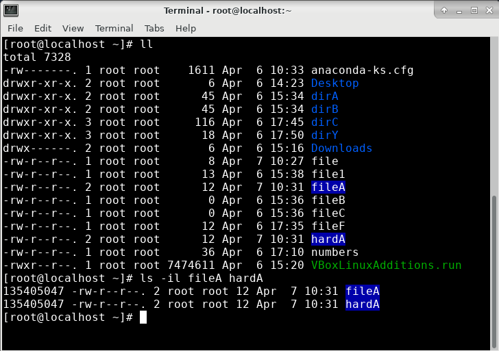

# 0407


## 리눅스 기본 명령어

> 저번 시간에 이어서..

```
# cd ~
/root 			#루트 사용자 홈디렉토리
/home/user		#user 사용자 홈디렉토리
```


### 8. 이름 변경

**파일 이름 변경**

```
# mv fileAA fileF
# ls -F
```


**디렉토리 이름 변경**

```
# mv dirX dirD
# ls -F
```


### 9. 삭제

**파일 삭제**

```
# rm makeA
# rm makeB makeC
```


**빈 디렉토리 삭제**

```
# rmdir dirD
# ls -F
# ls -F dirC
# rmdir dirC
# rm -r dirC
```


* 비어있지 않으면 안지워짐
  * `-r` / `-rf `사용

```
# touch dirD/test.txt
# rm dirD
rm: cannot remove ‘dirD’: Is a directory

# rm -r dirD
rm: descend into directory ‘dirD’? y
rm: remove regular empty file ‘dirD/test.txt’? y
rm: remove directory ‘dirD’? y

# rm -rf dirD
```


### 10. 링크

> 상호 연결을 통해 디스크를 효율적으로 사용


**하드 링크 (디스크 공유)**

* `i` : index 
* 연결되면 인덱스(숫자)가 같다

```
# ls -il /bin/cd
201327765 -rwxr-xr-x. 1 root root 26 Nov 25 01:33 /bin/cd

# ls -il /usr/bin/cd
201327765 -rwxr-xr-x. 1 root root 26 Nov 25 01:33 /usr/bin/cd
```

```
# ls -il fileA
# ln fileA hardA

# ls -il fileA hardA
135405047 -rw-r--r--. 2 root root 12 Apr  6 16:30 fileA
135405047 -rw-r--r--. 2 root root 12 Apr  6 16:30 hardA
```




* 두개가 한 공간을 공유
  * `>` : 기존 문구가 새 문구를 대체
  * `>>` : 기존 문구에 새 문구

```
# echo hello > fileA
# cat fileA
hello
# cat hardA
hello
# echo world > hardA
# cat hardA
world
# cat fileA
world

# echo hello > fileA
# cat hardA
hello
# echo world >> hardA
# cat hardA
hello
world
```


* 둘 중 하나만 유지되면 저장공간은 남아있음

```
# rm -f hardA
# cat fileA
hello
world
```


**심볼릭 링크 (바로가기)**

```
# ln -s fileA symbolA
# ls -il fileA symbolA
135405047 -rw-r--r--. 1 root root 12 Apr  7 10:31 fileA
135405041 lrwxrwxrwx. 1 root root  5 Apr  7 10:43 symbolA -> fileA

# echo aloha > fileA
# cat symbolA
aloha
```


* 연결된 파일 삭제하면 링크도 삭제됨

```
# rm -rf fileA
# ls -il

# cat symbolA
cat: symbolA: No such file or directory
```


* 링크를 삭제해도 원본 파일은 삭제 안됨

```
# rm -rf symbolA
```


### 11. 파일 내용 검색

**grep 명령어**

* 특정 단어를 빨간색으로 보여줌

```
# grep `root` /etc/passwd
```


* `-n` : 매칭되는 줄번호

````
# grep -n `root` /etc/passwd
````


* `-v` : root만 제외하고 출력

```
# grep -v `root` /etc/passwd
```


* `-l` : root라는 문구가 포함된 파일 출력

```
# grep -l `root` /etc/*
```


* `-c` : root가 있는 줄 갯수 출력

```
# grep -c `root` /etc/passwd
```


* root 사용자 말고 다른 사용자 이름도 가능

```
# useradd  kosa
# grep `kosa` /etc/passwd
```


* `-w` : 단어 단위로 출력

```
# grep -w  `kosa` /etc/passwd
```


* `^` : kosa로 시작되는 부분만 출력

```
# grep `^kosa` /etc/passwd
```


* `..` : k로 시작 a로 끝나는 부분 출력

```
# grep `k..a` /etc/passwd
```


* `$` : login로 끝나는 부분 출력

```
# grep `login$` /etc/passwd
```


**egrep 명령어**

> `|` : or

* N뒤에 o나 e가 있는 부분 출력

```
# egrep `N(o|e)+` /etc/passwd
```


* root나 kosa뒤에 :x가 있는 부분 출력 

```
# egrep `(root|kosa):x` /etc/passwd
```


* vm에게 줬던 cpu 갯수
  * svm : AMD cpu의 가상머신
  * vmx: Intel cpu의 가상머신

```
# egrep -c `(svm|vmx)` /proc/cpuinfo
0
```


### 12.  파일 및 디렉토리 검색

* `/` 뒤에 경로 붙여도 됨

```
# find / -name hosts
# find /etc -name hosts
```


* `f` :  파일

  `d` : 디렉토리

```
# find / -name hosts -type f
# find / -name hosts -type d
```


* `-exec rm {} \;` : 강제 삭제

  `-ok rm {} \;` : 대화형 삭제

```
# find / -name fileA -type f -exec rm {} \;
# find / -name fileC -type f -ok rm {} \;
< rm ... /root/fileC > ? 
```


* 최근 이틀동안 수정시간이 변경된 파일 출력

```
# find ~ -mtime -2
```


* /usr/bin 밑에 3M이상인 파일 출력

```
# find /usr/bin -size +3000000c -ls
```


## vi 편집기

### 기초

```
# view numbers
# vi numbers
```

* `i`키 누른다 -> 글을 입력한다. -> `esc`키를 누른다. -> `:wq!` 입력한다.


### 명령어

* `a` : 텍스트 뒤에 커서를 위치시키고 입력을 받는다.

* `i` :텍스트가 앞에 커서를 위치시키고 입력을 받는다.

* `o` : 커서가 위치한 줄의 아래에 새로운 줄을 추가하여 커서를 위치시키고 입력을 받는다.

* `G` : 파일의 제일 마지막 줄로 이동

* `1G` : 파일의 제일 첫 번째 줄로 이동

  `nG` : n번째 줄로 이동

* `x` : 커서가 위치한 부분의 글자를 삭제한다.

* `dd` : 커서가 위치한 줄을 삭제한다.

* `u` : 명령어 실행 전으로 되돌린다.

* `yy` : 한 줄을 복사하여 임시 버퍼 공간에 저장한다.

* `p` : 임시 버퍼 공간에 저장된 텍스트를 커서의 아랫줄에 붙여 넣는다.

* `:%s/old/new/g` :  old를 찾아 new로 바꾸기

* `:set nu` : 화면에 줄 번호를 출력한다.

* `:n,nd` : n번째 줄부터 n번째 줄까지 삭제한다.

* `:n` : n번째 줄로 이동

* `:wq` : 수정한 파일을 디스크에 저장한 후 종료한다.

* `:x` : 수정한 파일을 디스크에 저장한 후 종료한다.

* `:q!` : 수정한 파일을 디스크에 저장하지 않고 종료한다.

* `/` : 찾기


## 파일 및 디렉토리 접근 권한

### 사용자 구분

- 소유자(user): 파일과 디렉토리의 소유자
- 그룹(group): 사용자가 속한 논리 그룹
- 기타(others): 소유자나 그룹에 속하지 않은 사용자

### 퍼미션

- 읽기(r): 조회

  - 4

  - 파일의 내용을 확인하거나 복사 할 수 있음, 디렉토리 내용 확인 가능

    

- 쓰기(w): 등록, 수정, 삭제

  - 4

  - 파일의 내용을 수정할 수 있음, 디렉토리 내에 파일을 추가하거나 삭제 가능

    

- 실행(x): 실행

  - 1
  - 실행파일의 경우 실행할 수 있음, 디렉토리 접근 및 내용 확인 가능.


* 파일 권한 (= 퍼미션)
  * rwx / _ _ _ / _ _ _ : 9자리
  * 첫번째 _ _ _ : 소유자
  * 두번쨰 _ _ _ : 그룹
  * 세번째 _ _ _ : 기타


* 암호화가 아닌 키로 접근

```
-rw-r--r--. 1 root root      12 Apr  7 14:37 test.txt

# chmod 666 test.txt

-rw-rw-rw-. 1 root root      12 Apr  7 14:37 test.txt
```


* su (switch user) : 사용자 바꾸기

```
[root@localhost ~]# su - kosa

[kosa@localhost ~]$ cd /root
-bash: cd: /root: Permission denied

[root@localhost ~]# chmod 755 /root

[kosa@localhost ~]$ cd /root
[kosa@localhost root]$ 
```


* `rw` : 권한 해제

```
$ chmod u-rw test.txt
$ chmod g-rw test.txt
$ chmod o-rw test.txt
```


* pem 키에 대해 bad permissions ?

```
$ chmod 400 keypair.pem
```


## 쉘 명령어

### 경로

```
# cd dirA
# cd ~
# pwd
```


```
# cd ~kosa					#일반 사용자 kosa 홈
[root@localhost kosa]# 

# cd ~root
# pwd
```


* cd `-` : 직전 디렉토리로 이동

```
# cd dirB
# ls ~+					#현재 디렉토리 list
# ls ~-					#직전 디렉토리(/root) list
```


```
# cd /usr/bin
# cd -
# cd -
```


### 파일 이름 대체 메타문자

* `*`  : 와일드카드

```
# ls fi*
file  file1  fileB  fileF

# ls *B
fileB
```


* `?` : 대체

```
# ls f???B
fileB

# ls dir?
dirA:
fileX  fileY  fileZ

dirB:
fileX  fileY  fileZ

dirC:
dirCC  fileAA  fileD  fileX  fileY  fileZ  touch_file

dirY:
dirZ
```


* [AC] : A와 C

  [A-C] : A부터 C

```
# ls file[AB]
fileB

# ls dir[AC]
dirA:
fileX  fileY  fileZ

dirC:
dirCC  fileAA  fileD  fileX  fileY  fileZ  touch_file

# ls dir[A-C]				
dirA:
fileX  fileY  fileZ

dirB:
fileX  fileY  fileZ

dirC:
dirCC  fileAA  fileD  fileX  fileY  fileZ  touch_file
[root@localhost ~]# 
```


### 인용부호 메타문자

> 변수선언

* `''` / `" "`

```
# echo $USER
root

# echo '$USER'
$USER

# echo "$USER"
root

# echo "\$USER"
$USER
```


* `` ` :  실행

```
# echo date
date

# echo `date`
Thu Apr 7 15:40:06 KST 2022

# echo "The current time is `date`"
The current time is Thu Apr  7 15:40:25 KST 2022
```


### 표준 스트림(standard stream)

**표준 입력 재지정**

* stdin; 0 
  * 0 생략 가능

* 키보드

```
# cat 0< /etc/hosts
127.0.0.1   localhost localhost.localdomain localhost4 localhost4.localdomain4
::1         localhost localhost.localdomain localhost6 localhost6.localdomain6
```


**표준 출력 재지정**

* stdout; 1
* 콘솔(console), 터미널(terminal)
* `ps` : 실행중인 프로세스의 목록 출력

```
# ps 1> process_list

# cat process_list
  PID TTY          TIME CMD
 2289 pts/0    00:00:00 bash
 2316 pts/0    00:00:00 ps

# echo "---My Proccess List---" > process_list

# ps >> process_list

# cat process_list
---My Proccess List---
  PID TTY          TIME CMD
 2289 pts/0    00:00:00 bash
 2336 pts/0    00:00:00 ps
```


**표준 에러 재지정**

* stderr; 2
* 콘솔(console), 터미널(terminal)

```
# su - kosa

$ echo "TEST" > /tmp/test.txt
$ find /tmp -type f -exec grep TEST {} \; -print
```

* Permission denied 에러 !!
  * TEST
    /tmp/test.txt 만 빼고 


* `2> /dev/null` : null에 에러 버리고 나머지 출력

```
$ find /tmp -type f -exec grep TEST {} \; -print 2> /dev/null
TEST
/tmp/test.txt
```


* `1> test 2>&1` : test에 에러 입력

```
$ find /tmp -type f -exec grep TEST {} \; -print 1> test 2>&1

$ more test
```


### 파이프 문자

* `|` :앞 명령어의 출력(stdout)을 다음 명령어의 입력(stdin)으로 연결
* `ps -ef` : 실행중인 모든 프로세스의 정보를 출력

```
# ls -l /etc | wc -l		#라인 수
# ps -ef | more
# ps -ef | grep bash
# cat /etc/ssh/sshd_config | grep -n "22"
# grep -n "22" /etc/ssh/sshd_config
```


### history 명령어

* 명령어 이력 출력

```
# history
# history > history.txt

# history 5
# history | head -3
# history | tail -3

# ls
# !!			# 마지막 명령 다시 수행
# !10			# 10번째 명령 다시 수행
```


### 사용자 초기화 파일

* 변수 선언

```
# MyName="Minha"
# echo $MyName
Minha Seo
# exit
# echo $MyName				#MyName 변수 삭제됨

```

* 세션 끊어지면 변수 삭제됨


* /etc/profile 에 변수 저장

```
# vi /etc/profile
MyName="Minha"	

# exit
# source /etc/profile		#/etc/profile 실행
# echo $MyName
```


* bash_profile와 bashrc도 마찬가지

```
$ vi .bash_profile
MyName=Minha

$ source .bash_profile		#bash_profile 실행
$ echo $MyName
Minha
```

```
$ vi .bashrc
MyName=Minha

$ source .bashrc		
$ echo $MyName
Minha
```


### 프로세스 확인

```
# ps
# ps -f
# ps -ef
# ps -ef | more
# ps -ef | grep bash
```


* pstree : 프로세스를 트리구조로 보여줌

```
# pstree
```


* 프로세스 ID 확인

```
$ pgrep -x bash				#ID
$ pgrep -n sh
$ pgrep -u 1000
$ pgrep -l bash				#이름 + ID
$ pgrep  -lt pts/1			#터미널 접속 정보
```


### kill 명령어

```
# sleep 1000 &
[1] 3548				#sleep 프로세스 ID

# pgrep -l sleep
3548 sleep				#sleep 프로세스 ID

# kill 3548				#ID로 kill
[1]+  Terminated              sleep 1000

# pgrep -l sleep		#kill됨
```


```
# sleep 2000 &
3553 sleep

# pgrep -l sleep
3553 sleep

# pkill sleep			#이름으로 kill
[1]+  Terminated              sleep 2000

# pgrep -l sleep		#kill됨
```


### 작업 관리

* sleep 60 : foreground 실행
  * 60초 동안 아무 명령 x
* sleep 60 `&` : background 실행
  * 다른 명령어 실행 가능


* `fg %1` : foreground 실행

```
# sleep 60 &
[1] 3584

# jobs
[1]+  Running                 sleep 60 &

# fg %1
sleep 60
```


* `bg %1` : background 실행

```
# sleep 60
^Z
[1]+  Stopped                 sleep 60

# bg %1
[1]+ sleep 60 &

# jobs
[1]+  Running                 sleep 60 
```

