# 0408

## 복습

### 링크

* 도커 생성 - 이미지 push
  * 아이디 같으면 같은 디스크 공간
  * but 복사해놓은 것은 아님 !

### vi

```
# su - kosa
Last login: Thu Apr  7 17:30:24 KST 2022 on pts/1

$ pwd
/home/kosa

$ vi test
```

* test에 간단한 쉘 스크립트 작성
* 나중에 할 작업 미리 파일로 정리 > 실행

```vi
#!/bin/bash				/*bash 쉘 이용
yum update -y             
```

```
$ ll
total 4
-rw-rw-r--. 1 kosa kosa 26 Apr  8 09:47 test

$ ./test
-bash: ./test: Permission denied

$ chmod 764 test

$ ./test
Loaded plugins: fastestmirror
You need to be root to perform this command.
```

* yum 명령어는 root에서만 사용 가능...
  * 쉘 스크립트 실행은 됨


* `chmod a=rwx` : 777과 동일

```
$ chmod a=rwx test

$ ll
total 4
-rwxrwxrwx. 1 kosa kosa 26 Apr  8 09:47 test
```


* chown: 파일 소유자 변경

```
[root@localhost ~]# cd ~kosa
[root@localhost kosa]# ll
total 4
-rwxrwxrwx. 1 kosa kosa 26 Apr  8 09:47 test
[root@localhost kosa]# chmod 000 test
```

```
[kosa@localhost ~]$ ll
total 4
----------. 1 kosa kosa 26 Apr  8 09:47 test
```

```
[root@localhost kosa]# chown root:root test
[root@localhost kosa]# ll
total 4
----------. 1 root root 26 Apr  8 09:47 test
```

```
[kosa@localhost ~]$ ll
total 4
----------. 1 kosa kosa 26 Apr  8 09:47 test
[kosa@localhost ~]$ chmod 777 test
chmod: changing permissions of ‘test’: Operation not permitted
```


### 쉘 명령어

* echo를 통해 변수에 저장된 값 알 수 있음

```
# env | grep "USER"
USER=root
USERNAME=root

# echo $USER
root
```


### 사용자 초기화 파일

* alias ans = 'ansible'
* alias k = 'kubectl' (Kubernetes)


### 프로세스 확인

```
# cat /etc/passwd | grep kosa
kosa:x:1000:1000::/home/kosa:/bin/bash			/* ID

# pgrep -u 1000
2404

# pgrep -lt pts/1
2385 bash
2403 su
2404 bash
```


### kill

```
# top
# yes > /dev/null &
# pkill yes
# pgrep -l yes

```


## 아카이브

### tar 명령어

* 압축보다는 여러 파일을 하나로 모아주는 것
  * 크기나 용량 줄어들지 않음

* c: 새로운 tar 파일을 생성
  t: tar 파일 내부 내용 확인
  x: tar 파일을 해제합니다.
  f: 아카이브 파일 지정
  v: tar 명령어 수행 과정 출력

* - tar 명령어를 이용한 아카이브 생성 (jar, war 유사)


* 옵션에 `-` 붙이지 않는 경우 ?

```
# tar cvf archive.tar dirA fileD numbers
# tar tvf archive.tar
# mkdir test
# cd test
# tar xvf ../archive.tar
```


### 압축 및 압축 해제


#### compress 파일

> .z

**compress 파일 압축**

```
# yum install ncompress -y
# ll
# compress -v process_list
# ll

# zcat process_list.Z
# compress -v archive.tar
# ll

# zcat archive.tar.Z | tar xvf -

# uncompress -c process_list.Z		/* 내용 확인
```


**uncompress 압축 해제**

```
# uncompress -v archive.tar.Z
# uncompress -v process_list.Z
# ls -l
```


#### gzip 파일

> .gz

**gzip 파일 압축**

```
# gzip process_list
# ls -l

# zcat process_list.gz
```


**gunzip 압축 해제**

```
# gunzip process_list.gz
# ls -l
```


**아카이브된 파일 또는 디렉토리 압축 및 해제**

* zcvf : `.tar` 파일을 `.gz`로 압축
* ztvf : 내용 확인
* zxvf : 압축 해제
  * 삭제된 dirB 복구 + tar.gz 유지

```
# tar zcvf test.tar.gz dirB
# ls -l

# tar ztvf test.tar.gz
# rm -rf dirB

# tar zxvf test.tar.gz
# ls -l
```


* `-C` : 압축 해제할 폴더 지정

```
# mkdir archive
# tar zxvf archive.tar.gz -C archive
# ll archive
total 12
-rw-r--r--. 1 root root 10240 Apr  8 11:50 archive.tar
```


#### bzip2 파일

> .bz2

**bzip2 파일 압축**

```
# bzip2 process_list		/* 압축
# bzcat process_list.bz2	/* 내용확인
```


**bunzip 압축 해제**

```
# bunzip2 process_list.bz2
```


**아카이브된 파일 또는 디렉토리 압축 및 해제**

* jcvf: `.tar` 파일을 `.bz2`로 압축
* jtvf : 내용 확인
* jxvf: 압축 해제

```
# tar jcvf test.tar.bz2 dirB
# tar jtvf test.tar.bz2 dirB
# tar jxvf test.tar.bz2
```

```
# mkdir archive-bz2
# tar jxvf test.tar.bz2 -C archive-bz2
```


#### zip 파일 또는 디렉토리

> .zip

**zip 파일 압축**

```
# zip test.zip dirB/*
```

**zip 파일 압축해제**

```
# rm -rf dirB

# unzip test.zip
```


## 다이어그램

[**다이어그램 사이트**](https://www.diagrams.net/)


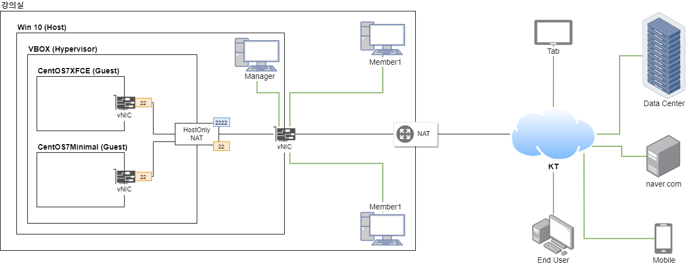


## 리눅스 서버


### 1.  KeyPair 생성 및 활용

### SSH (Secure Shell)

* 키 쌍은 특정 인증 프로토콜에 사용되는 공개 키 및 프라이빗 키 파일을 나타냅니다.
* SSH 공개 키 인증은 비동기 암호화 알고리즘을 사용하여 "프라이빗" 키와 "공개" 키라는 두 가지 키 파일을 생성합니다. 
* 프라이빗 키 파일은 암호와 동일하며, 모든 상황에서 보호되어야 합니다. 
* 다른 사람이 사용자의 프라이빗 키를 획득하면 사용자가 액세스할 수 있는 모든 SSH 서버에 사용자의 이름으로 로그인할 수 있습니다.


**cmd**

```
>ssh root@192.168.56.101
root@192.168.56.101's password:
Last login: Fri Apr  8 09:18:14 2022

# mkdir /root/.ssh
# exit
logout
Connection to 192.168.56.101 closed.
```


* id_rsa  : 프라이빗 키 파일
* id_rsa.pub : 공개 키

```
> ssh-keygen -t rsa
```

```
Generating public/private rsa key pair.
Enter file in which to save the key (C:\Users\lg/.ssh/id_rsa):
Enter passphrase (empty for no passphrase):
Enter same passphrase again:
Your identification has been saved in C:\Users\lg/.ssh/id_rsa.
Your public key has been saved in C:\Users\lg/.ssh/id_rsa.pub.
The key fingerprint is:
SHA256:hpq6DXQcZHU1dAHd663hmlOpXJV8gIIF7Ir0cr5F1m0 lg@lge
The key's randomart image is:
+---[RSA 2048]----+
|    o...o**oo+   |
|   o   .o .oo o  |
|    .  .   .  .o.|
|   ... ... .  .oo|
|  ..oo..S . E. +.|
| . .oo++   .  * .|
|  . o+  .  . = o |
|   +  ..    +.o  |
|  o.. ..    oo   |
+----[SHA256]-----+
```


```
> cd %UserProfile%\.ssh
C:\Users\lg\.ssh>dir
 C 드라이브의 볼륨: Windows
 볼륨 일련 번호: CA8C-1C79

 C:\Users\lg\.ssh 디렉터리

2022-04-08  오후 03:46    <DIR>          .
2022-04-08  오후 03:46    <DIR>          ..
2022-04-08  오후 03:46             1,679 id_rsa
2022-04-08  오후 03:46               389 id_rsa.pub
2022-04-06  오전 11:39               177 known_hosts
               3개 파일               2,245 바이트
               2개 디렉터리   7,183,212,544 바이트 남음

C:\Users\lg\.ssh>
```


* scp : ssh 프로토콜 이용하여 복사
  * `id_rsa.pub ` 파일 `authorized_keys`로 복사

```
.ssh> scp id_rsa.pub root@192.168.56.101:/root/.ssh/authorized_keys
```

* 공개키 서버에 전송한 상태
  * passwd 없이 접근 가능
  * `-i id_rsa`는 생략가능

```
.ssh>ssh -i id_rsa root@192.168.56.101
Last login: Fri Apr  8 16:00:54 2022 from 192.168.56.1
```


* root passwd 노출당하더라도 접근 불가하도록
  * 키로만 접근가능하도록

```
# vi /etc/ssh/sshd_config
PasswordAuthentication no
```

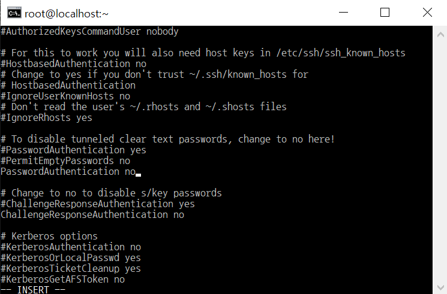

* SSHD(Secure Shell Daemon) : 백그라운드 실행
  * sshd_config : sshd 서비스 
  * restart 필요

```
# systemctl restart sshd
```

* key pair 설정 끝

  

### 2. 웹서버 구축 및 간단 홈페이지 꾸미기

* HTTPD(Hyper Text Transfer Protocol Daemon)
  HTTP는 HTML 문서와 같은 리소스들을 가져올 수 있도록 해주는 프로토콜입니다. 
* HTTP는 웹에서 이루어지는 모든 데이터 교환의 기초이며, 클라이언트-서버 프로토콜이기도 합니다. 
* 클라이언트-서버 프로토콜이란 (보통 웹브라우저인) 수신자 측에 의해 요청이 초기화되는 프로토콜을 의미합니다. 
* 하나의 완전한 문서는 텍스트, 레이아웃 설명, 이미지, 비디오, 스크립트 등 불러온(fetched) 하위 문서들로 재구성됩니다.


```
# sestatus

# vi /etc/sysconfig/selinux
SELINUX=disabled		/* enforcing을 disabled로
```

* selinux : 보안 강화
  * 강력하고 안전하지만 어려움


```
# setenforce 0
# sestatus
```

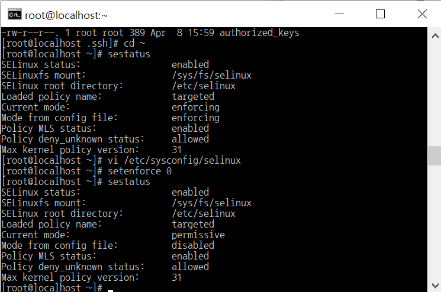

* Current mode:                   permissive                                      Mode from config file:          disabled 


* 가장 빠른 미러사이트 찾기
  * 웹서버 설치 > 서비스 시작

```
# yum install -y httpd
# systemctl start httpd
```

* 아직은 192.168.56.101 : 접속 불가
  * 방화벽을 세팅하지 않았기 때문
  * 포트번호 열려있지 않음

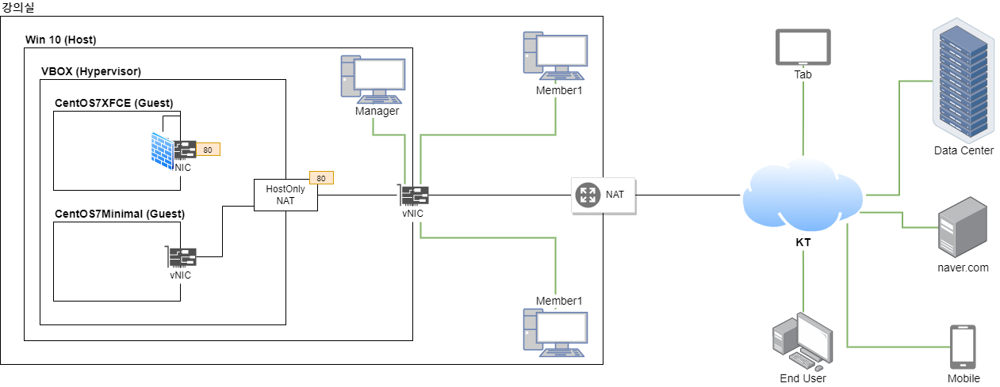

```
# systemctl status httpd
```

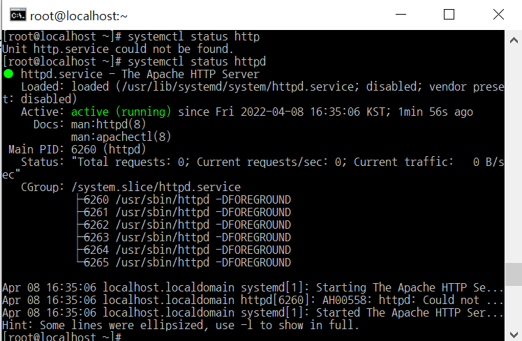

* active 상태 : ok !


**VM에서 Google 접속**

* passwd : 아까 설정한 키 (Enter)


* 127.0.0.1 : 내부 IP


* curl : 웹 브라우저 대신해주는 도구

```
# curl 127.0.0.1
```

* 127.0.0.1 : 내부 IP
  * 외부에 접속 했을 떄가 아닌 내부 설치된 서버가 잘 실행되는지 확인할 때 사용


* 보안그룹이라는 방화벽 바깥 가정해서 firewall 사용
* firewall 서비스해주는 데몬

```
# systemctl status firewalld                                  
```

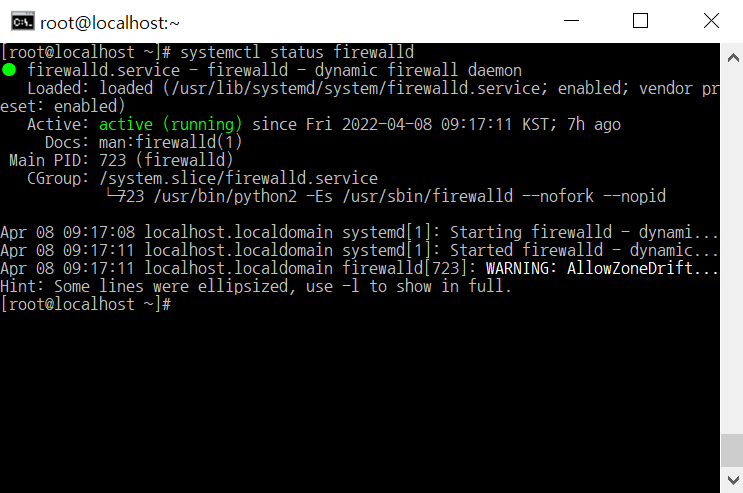


```
# firewall-cmd --get-active-zone

# firewall-cmd --zone=public --list-all
# firewall-cmd --list-all			/*위와 동일
```

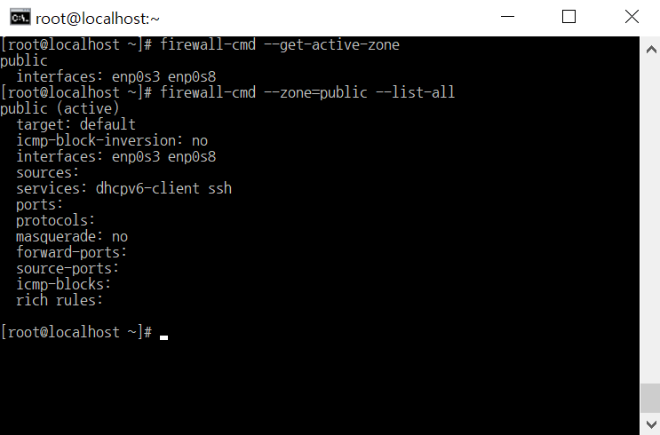

```
# firewall-cmd --permanent --add-service=http                 success                                                                     # firewall-cmd --reload                                       success 
```

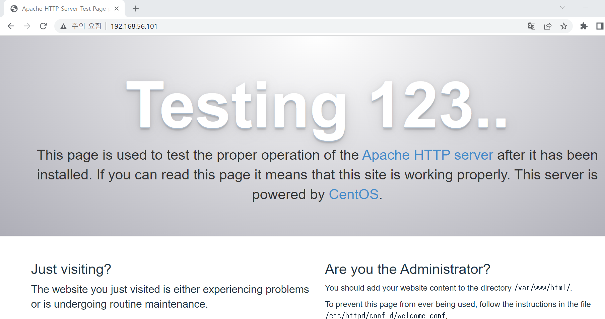

* ` /var/www/html/`. : 홈페이지 주소 파일 담기는 경로
  * 현재 아무것도 없음
  * `httpd` 설치 필수

```
[root@localhost ~]# cd /var/www/html
[root@localhost html]# ll
total 0
[root@localhost html]# echo "Hello World" > index.html
[root@localhost html]# ll
total 4
-rw-r--r--. 1 root root 12 Apr  8 17:17 index.html
```

* other는 r 권한만 있으면 됨

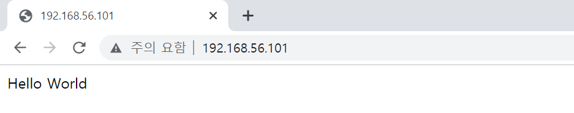


**Webshare**

* http://192.168.56.1/kosa/


* && : 앞의 명령 실행 후 뒤 명령 실행
* $_ : 방금 만든 폴더 지칭 (images)

```
# mkdir images && cd $_
```


* Webshare에서 img 다운로드

```
# wget http://192.168.56.1/kosa/two-rabbit.jpg
```

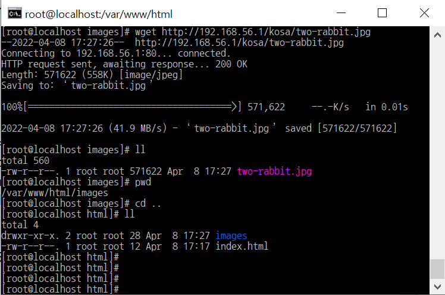


* html 꾸미기

```
# vi index.html
```

```
<!DOCTYPE html>
<html>
<head>
  <meta charset="utf-8">
  <title>Sample Deployment</title>
  <style>
    body {
      color: #ffffff;
      background-color: #0188cc;
      font-family: Arial, sans-serif;
      font-size: 14px;
    }
    h1 {
      font-size: 500%;
      font-weight: normal;
      margin-bottom: 0;
    }
    h2 {
      font-size: 200%;
      font-weight: normal;
      margin-bottom: 0;
    }
  </style>
</head>
<body>
  <div align="center">
    <h1>Congratulations</h1>
    <h2>This application was deployed using AWS ECS, EKS.</h2>
    <p>For next steps, read the <a href="https://aws.amazon.com/ko">AWS Management Console.</a></p>
    <p></p>
  </div>
</body>
</html>
```

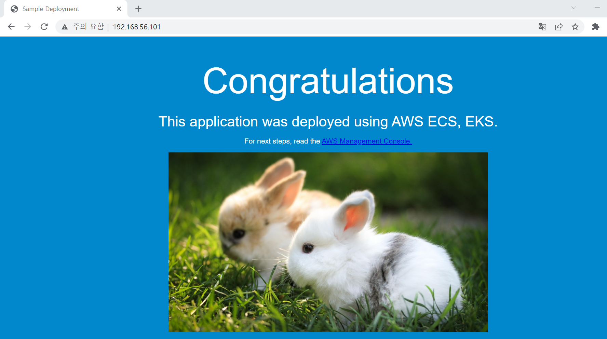