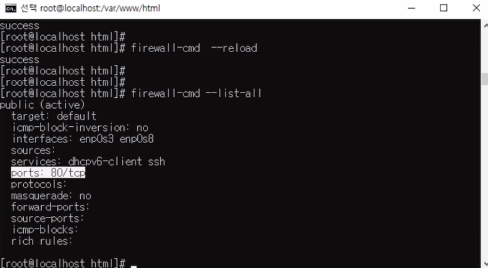
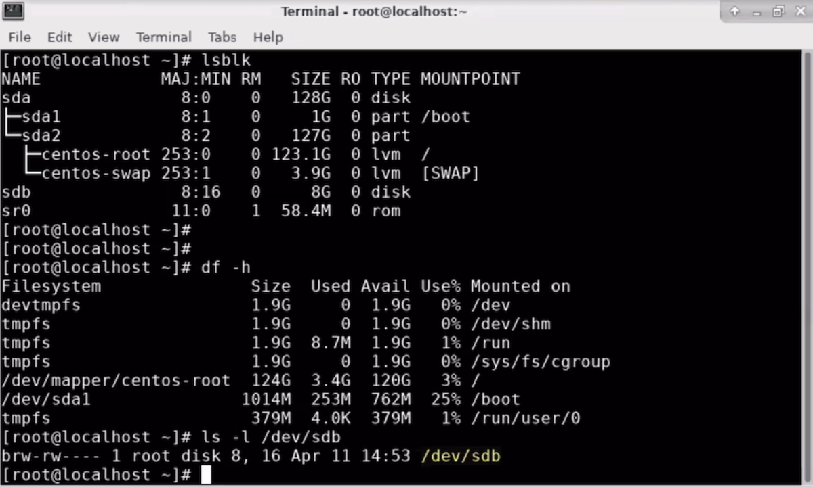
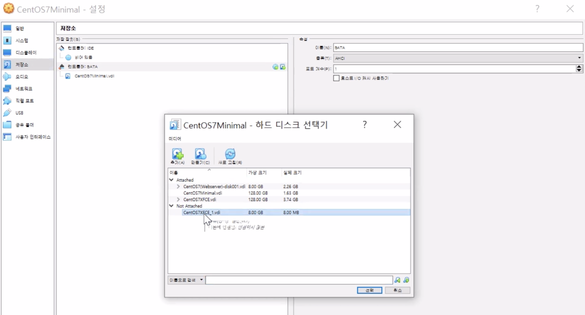
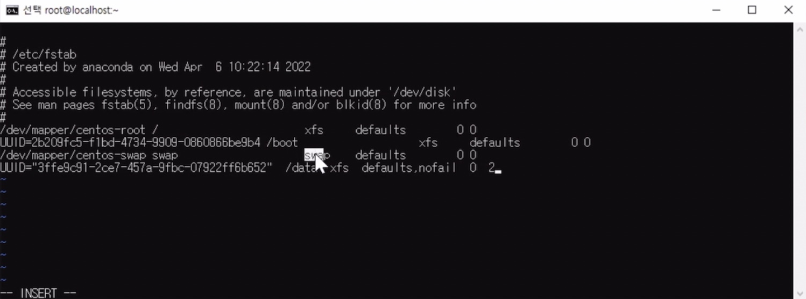

0411
=============================================================

## 방화벽 설정 (firewall-cmd)

```
# systemctl status firewalld
```

```
# firewall-cmd --get-active-zone			/* 활성화 존 출력
# firewall-cmd --zone=public --list-all		/* public존의 사용 가능 서비스/포트 출력
# firewall-cmd --list-all					/* 사용 가능 서비스/포트 출력
```

```
# firewall-cmd --permanent --add-service=http	/* http 서비스 추가(permanent)
# firewall-cmd --permanent --add-port=80/tcp	/* 80번 포트 추가
```



```
# firewall-cmd --permanent --remove-service=http	/* http 서비스 제거
# firewall-cmd --permanent --remove-port=80/tcp		/* 80번 포트 제거
```

```
# firewall-cmd --reload		/* 재시작
```


## Storage 추가(Mount; Block Storage 다루기) - AWS EBS

* sda(root volume) -> OS, App
* 마운트(mount)는 컴퓨터 과학에서 저장 장치에 접근할 수 있는 경로를 디렉터리 구조에 편입시키는 작업입니다. 
* 좁은 의미로는 유닉스 계열의 운영 체제에서의 mount 명령어 또는 그 명령어를 사용하는 것입니다.
* mount 명령어를 사용하면 저장 장치의 접근 경로를 원하는 위치에 생성할 수 있습니다.
* 마운트를 이용하면 분산 파일 시스템으로 확장하기가 용이합니다. 
* 사용자는 마운트된 미디어의 파일들에만 접근이 가능합니다.

```
# df -h		/* 디스크 공간을 확인
# lsblk		/* 사용하는 저장 장치를 확인
```



  ```
  # mkfs -t xfs /dev/sdb		/*  /dev/sdb파일을 xfs라는 파일시스템으로 포맷
  ```

* `mkfs` : 파일시스템 포맷
* `-t`: 파일시스템을 지정

```
# mkdir /data
# mount /dev/sdb /data		 	    /* /dev/sdb을 /data에 마운트(연결)
# df -h							  /* 확인

# file -s /dev/sdb				   /* 파일 확인 명령어

# cp /etc/fstab /etc/fstab.orig		/*백업
```

```
# blkid						/* 파일 시스템 유형이나 속성 출력
/dev/sda1: UUID=""
/dev/sda2: UUID=""
/dev/sdb: UUID=""

# vi /etc/fstab
UUID="3ffe9c91-2ce7-457a-9fbc-07922ff6b652"  /data  xfs  defaults,nofail  0  2 추가

# umount /data				/* 연결 끊음
```

###   

### 직접 마운트

1. xfc에서 설정으로 들어가 저장소를 들어간다. 

2. 저장소의 컨트롤러:SATA로 들어가서 하드디스크 추가를 누른다.

3. 만들기를 눌러서 새로운 disk를 만든다  

4. 생성 후 사용한 디스크를 연결삭제를 한다.

5. 연결 삭제한 다음 minimal의 설정으로 들어가 저장소를 누른다.

6. 하드디스크 추가를 눌러서 추가하려는 디스크를 누르고 선택 버튼을 누른다.




### 자동 마운트

1. blkid를 입력해 출력되는 원하는 디스크의 UUID를 복사한다.

   ```
   /dev/sdb: UUID="db260ed0-e7e5-4afd-9a1d-c1988e61511b"
   ```

2. vi /etc/fstab으로 들어간다.

3. 저장한 UUID를 fstab에 붙여넣는다.

   ```
   UUID="db260ed0-e7e5-4afd-9a1d-c1988e61511b"  /data  xfs  defaults,nofail  0  2
   ```

4. reboot를 한 후 다시 로그인 해서 df -h로 자동으로 마운트가 되었는지 확인한다.




## SAMBA(Server Message Block; 윈도우용 파일 시스템) - Amazon FSx  - 완전 관리형 서비스

* 서버 메시지 블록(Server Message Block, SMB)은 도스나 윈도우에서 파일이나 디렉터리 및 주변 장치들을 공유하는데 사용되는 메시지 형식입니다.
*  NetBIOS는 SMB 형식에 기반을 두고 있으며, 많은 네트워크 제품들도 SMB를 사용합니다. 
* 이러한 SMB 기반의 네트워크에는 랜매니저, 윈도우 포 워크그룹(Windows for Workgroups), 윈도우 NT, 그리고 랜 서버(Lan Server) 등이 있습니다. 
* 서로 다른 운영 체제 사이에 파일을 공유할 수 있도록 하기 위해 SMB를 사용하는 제품들도 많이 있습니다. 
* 그 중 하나가 삼바인데, 유닉스와 윈도우 컴퓨터들간에 디렉터리와 파일을 공유할 수 있게 합니다.


**samba설치**

```
# yum install -y samba
```


**경로 설정**

```
# mkdir -p /var/samba/share
# chmod 777 /var/samba/share
# adduser kosa
# passwd kosa0401
# smbpasswd -a kosa				/* kosa - samba용 계정 생성
```

```
# vi /etc/samba/smb.conf

        workgroup = hali/네트워크 2로변경
[share]							/*추가
        comment = Share Directory
        path = /var/samba/share
        browserable = yes
        writable = yes
        valid users = kosa
        create mask = 0777
        directory mask = 0777
```


**nmb/smb 실행**

```
# systemctl start smb
# systemctl enable smb

# systemctl enable --now smb		/*위 두개 합친 것
```

```]
# systemctl start nmb
# systemctl enable nmb
# systemctl enable --now nmb
```


**방화벽 설정**

```
# firewall-cmd --permanent --add-service=samba --zone=public
# firewall-cmd --reload

# setenforce 0
```


**윈도우 클라이언트 접속 방법**

* `win` + `R` : \\192.168.56.103 (xfc의 enp0s8 주소)를 입력

**CentOS7 클라이언트 접속 방법**

```
# yum install -y samba-client
# smbclient //192.168.56.120/share -U kosa
```

