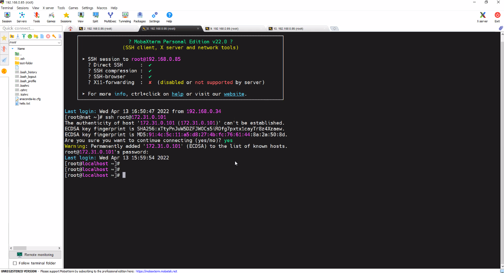

# 0413

## 리눅스 네트워크

## Router (IP 공유기; AWS VPC NAT GateWay)

> 저번시간 이어서...

* 네트워크 주소 변환(NAT; Network Address Translation)은 컴퓨터 네트워킹에서 쓰이는 용어로서, IP 패킷의 TCP/UDP 포트 숫자와 소스 및 목적지의 IP 주소 등을 재기록하면서 라우터를 통해 네트워크 트래픽을 주고 받는 기술을 말합니다. 
* NAT를 이용하는 이유는 대개 사설 네트워크에 속한 여러 개의 호스트가 하나의 공인 IP 주소를 사용하여 인터넷에 접속하기 위함입니다. 
* 많은 네트워크 관리자들이 NAT를 편리한 기법이라고 보고 널리 사용하고 있습니다.


**NAT GW_DHCP_HAproxy**

* 어댑터 1: 어댑터에 브리지
  * 외부와 연결
* 어댑터 2 : 내부 네트워크
  * 이름 : vSwitch
  * 내부와 연결

**WEB01_SAMBA**

* 어댑터 1 : 내부 네트워크
  * 이름 : vSwitch
* 어댑터 2 : 사용안함

**WEB02_NFS**

* 어댑터 1 : 내부 네트워크
  * 이름 : vSwitch
* 어댑터 2 : 사용안함

**Database_DNS**

* 어댑터 1 : 내부 네트워크
  * 이름 : vSwitch
* 어댑터 2 : 사용안함


### IP 종류

* 공인 IP = Public IP
  * [123.142.252.25](https://search.naver.com/search.naver?where=nexearch&sm=top_hty&fbm=1&ie=utf8&query=%EB%82%B4+%EC%95%84%EC%9D%B4%ED%94%BC)
* 사설 IP = Private IP
  * 10.0.0.0 ~ 10.0.255.255
    172.16.0.0 ~ 172.31.255.255
    192.168.0.0 ~ 192.168.255.255

**강의실 네트워크**

* Public Subnet
  192.168.0.0/24
  192.168.0.0 ~ 192.168.0.255 (256개 ip - 2개 = 254개)
  192.168.0.0   네트워크 주소(시작 ip)
  192.168.0.255 브로드캐스팅 주소(마지막 ip)

* Private Subnet
  172.31.0.0/24
  172.31.0.0 ~ 10.0.0.255 (256개 ip - 2개 = 254개)
  172.31.0.0   네트워크 주소(시작 ip)
  172.31.0.255 브로드캐스팅 주소(마지막 ip)


### WIN10 ip  고정

* 네트워크 및 인터넷 설정 > 네트워크 연결 > 이더넷 > 속성
  * 인터넷 프로토콜 버전 4 속성


* cmd > 관리자 권한으로 실행


* KeyPair 생성

```
>ssh-keygen -t rsa
Generating public/private rsa key pair.

/*SSH 키를 저장할 위치를 지정한다. 엔터를 누르면 기본 경로에 저장된다. (엔터)
Enter file in which to save the key (C:\Users\r2com/.ssh/id_rsa):
/*passphrase 입력, 자동 로그인을 원한다면 생략해야 한다. (엔터)
Enter passphrase (empty for no passphrase):
/* 엔터
Enter same passphrase again:

Your identification has been saved in C:\Users\r2com/.ssh/id_rsa.
Your public key has been saved in C:\Users\r2com/.ssh/id_rsa.pub.
The key fingerprint is:
SHA256:S0/R3/76Hvjr7QrtU3YNjwyfx/PHajzp5LGtN8krNn0 r2com@DESKTOP-DD3FU43
The key's randomart image is:
+---[RSA 3072]----+
|                 |
|           .     |
|          . .    |
|           ..... |
|        S .  +.*o|
|       . +   .*oO|
|        . . .o*B*|
|             OBOE|
|            .o&^&|
+----[SHA256]-----+
```


* root의 `authorized_keys`에 r2com의`id_rsa.pub` 복사
  * scp : 전송하고 싶은 파일 전송

```
C:\Windows\system3>cd %UserProfile%\.ssh

C:\Users\r2com\.ssh>scp id_rsa.pub root@192.168.0.73:/root/.ssh/authorized_keys
```


* key 이름 변경 

```
C:\Users\r2com\.ssh>ren id_rsa my-key.pem
```

* key로 VM 접근


```
C:\Users\r2com\.ssh>ssh -i my-key.pem root@192.168.0.73
```


* selinux 설정 변경

```
# setenforce 0
setenforce: SELinux is disabled

# vi /etc/sysconfig/selinux
SELINUX=disabled

# vi /etc/ssh/sshd_config
Port 2222 주석 없애기
PasswordAuthentication no로 변경

# systemctl restart sshd
```


* key로만 로그인 가능

```
C:\Users\r2com\.ssh>ssh root@192.168.0.73
root@192.168.0.73: Permission denied (publickey,gssapi-keyex,gssapi-with-mic).
```


* 포트 확인

```
# ss -ant
```

* ESTAB : 192.168.0.73:22                                192.168.0.26:64176
  * 서버 : 192.168.0.73:22
    * 포트 : 22 (고정)
  * 클라이언트 : 192.168.0.26:64176
    * 포트 : 61328 (랜덤)

* well-known 포트번호 : 0~1023 (서버 포트)
* unknown 포트번호 : 1025 ~ 65535 (클라이언트 포트)


* 방화벽 처리
  * VM에서 작업 (RedHat)

```
# firewall-cmd --permanent --add-port=2222/tcp
# firewall-cmd --reload
# firewall-cmd --list-all
```


* 포트 번호 2222로 root에 접근
  * `-p` 옵션 사용

```
C:\Users\r2com\.ssh>ssh -p 2222 -i my-key.pem root@192.168.0.73
```


* 포트 번호 복구
  * 포트는 주석(#) 처리 해도 22번으로 되돌아감 (디폴트)


### Hostname 변경

* `hostnamectl` 명령어

```
[root@localhost ~]# hostnamectl set-hostname nat
[root@localhost ~]# exit
logout

C:\Users\r2com\.ssh>ssh -i my-key.pem root@192.168.0.73
[root@nat ~]#
```


* network 확인
  * ifcfg-enp0s8 : 랜카드만 존재, 설정 파일이 없음


```
[root@nat ~]# cd /etc/sysconfig/network-scripts/
[root@nat network-scripts]# ls
ifcfg-enp0s3  ifdown-ippp  ifdown-routes    ifup          ifup-ipv6   ifup-ppp       ifup-tunnel
ifcfg-lo      ifdown-ipv6  ifdown-sit       ifup-aliases  ifup-isdn   ifup-routes    ifup-wireless
ifdown        ifdown-isdn  ifdown-Team      ifup-bnep     ifup-plip   ifup-sit       init.ipv6-global
ifdown-bnep   ifdown-post  ifdown-TeamPort  ifup-eth      ifup-plusb  ifup-Team      network-functions
ifdown-eth    ifdown-ppp   ifdown-tunnel    ifup-ippp     ifup-post   ifup-TeamPort  network-functions-ipv6
```


### 랜카드  설정 변경 -  ip 고정

* 첫번째 랜카드 (외부에서 바라보는)

```
# vi /etc/sysconfig/network-scripts/ifcfg-enp0s3
```

```
TYPE=Ethernet
BOOTPROTO=none				/*dhcp: 자동으로 ip 주소 받기 > none으로 변경
NAME=enp0s3
DEVICE=enp0s3
ONBOOT=yes

IPADDR=192.168.0.73
NETMASK=255.255.255.0
GATEWAY=192.168.0.1			/*공유기 ip
DNS1=8.8.8.8
DNS2=8.8.4.4
```


* 두번째 랜카드 (내부-VM에서 바라보는)

```
# vi /etc/sysconfig/network-scripts/ifcfg-enp0s8
```


```
TYPE=Ethernet
BOOTPROTO=none				/*dhcp > none으로 변경
NAME=enp0s8
DEVICE=enp0s8
ONBOOT=yes
IPADDR=172.31.0.1
NETMASK=255.255.255.0
```


* 다시 시작

```
# systemctl restart network
```


### 랜카드  설정 변경 -  네트워크 분할

* 현재 두 랜카드 몰려있음

```
# firewall-cmd --get-active-zone
public
  interfaces: enp0s3 enp0s8			/* 랜카드 2개 모두 public
```

* `nmcli` : 네트워크 세팅 명령어 (network manager)
  * 내부 = private / internal / backend
  * 외부 = public / external / frontend

```
# nmcli c mod enp0s3 connection.zone external
# nmcli c mod enp0s8 connection.zone internal
```

```
# firewall-cmd --get-active-zone
internal
  interfaces: enp0s8
external
  interfaces: enp0s3
```


* 리눅스 시스템 라우터로 만드는 세팅
  * ip 포워드 사용할 수 있게

```
# sysctl -w net.ipv4.ip_forward=1				/* 1 : 활성화
# sysctl -p	# 설정 저장
# cat /proc/sys/net/ipv4/ip_forward
1
```


## DHCP(Dynamic Host Configuration Protocol)
* 동적 호스트 구성 프로토콜(Dynamic Host Configuration Protocol, DHCP)은 호스트 IP 구성 관리를 단순화하는 IP 표준입니다. 
* 동적 호스트 구성 프로토콜 표준에서는 DHCP 서버를 사용하여 IP 주소 및 관련된 기타 구성 세부 정보를 네트워크의 DHCP 사용 클라이언트에게 동적으로 할당하는 방법을 제공합니다.
* 자동으로 IP를 부여하기 때문에 보안성 문제
  * 기업내에서는 고정IP를 주로 사용


### dhcp  설치 및 설정 변경

```
# yum install dhcp -y
# vi /etc/dhcp/dhcpd.conf
```

```
ddns-update-style interim;
subnet 172.31.0.0 netmask 255.255.255.0 {			 /* 172.31.0.0/24
option routers 172.31.0.1;							/* 라우터
option subnet-mask 255.255.255.0;					 /* 서브넷 마스크
range dynamic-bootp 172.31.0.100 172.31.0.110;		  /* IP 범위
option domain-name-servers 8.8.8.8, 8.8.4.4;		  /* 도메인 IP
default-lease-time 7200;							/* IP 임대시간 - 2시간
max-lease-time 86400;								/* 사용자 추가요청시간 - 하루
}
```

* 사용가능한 IP 범위 : 172.31.0.2 ~ 172.31.0.254

  * 172.31.0.1 : 라우터로 제외

  * 172.31.0.255 : 서브넷 마스크로 제외


```
# systemctl enable dhcpd --now dhcpd
```

* `systemctl enable dhcpd` + `systemctl start dhcpd`


**vSwitch IP 확인**

> ping도 확인할 것

* WEB01_SAMBA IP : 172.31.0.101
* WEB02_NFS IP : 172.31.0.102
* DATABASE_DNS IP : 172.31.0.103


**파일 및 폴더 복사**

* cmd

```
- 파일 복사
C:\Users\r2com\.ssh> notepad hello.txt
C:\Users\r2com\.ssh> dir		/*확인
C:\Users\r2com\.ssh> scp -i my-key.pem hello.txt root@192.168.0.73:/root/


- 역으로
C:\Users\r2com\.ssh> del hello.txt
C:\Users\r2com\.ssh> scp -i my-key.pem root@192.168.0.73:/root/hello.txt ./

C:\Users\r2com\.ssh> ssh -i my-key.pem root@192.168.0.73		/* 확인
# ls


- 폴더 (-r 옵션)
C:\Users\r2com\.ssh> copy hello.txt test-folder
C:\Users\r2com\.ssh> scp -i my-key.pem -r test-folder root@192.168.0.73:/root/

C:\Users\r2com\.ssh> ssh -i my-key.pem root@192.168.0.73		/* 확인
# ls
```


## 3.  터미널 도구 변경 - Mobaxterm

> cmd 대신

[Mobaxterm 다운로드](https://mobaxterm.mobatek.net/download.html)

* Portable Edition 다운로드 > 압축해제

* Session > ssh 


**web01_SAMBA**




```
# ssh root@{web01_samba IP}
# hosanamectl set-hostname web01
# exit

# ssh root@{web01_samba IP}
```


**web02_NFS**

```
# ssh root@{web02_NFS IP}
# hosanamectl set-hostname web02
# exit

# ssh root@{web02_NFS IP}
```


**Database_DNS**


```
# ssh root@{Database_DNS IP}
# hosanamectl set-hostname ns
# exit

# ssh root@{Database_DNS IP}
```


### Key로 접근

**Nat**


**authorized_keys 보내기**

```
# cp authorized_keys authorized_keys.pub
# ls
authorized_keys authorized_keys.pub known_hosts

# ssh-copy-id -i authorized_keys.pub root@{web01_SAMBA IP}
# ssh-copy-id -i authorized_keys.pub root@{web02_NFS IP}
# ssh-copy-id -i authorized_keys.pub root@{Database_DNS IP}
```


**Key 넣기**

* .ssh 에서 my-key.pem 옮겨오기(드래그)


**NAT 터미널**

```
	# cd .ssh
.ssh # ls
.ssh # ssh -i my-key.pem root@{web01_SAMBA}
```


* key 아닌 pwd로 들어옴 - 오류
  * my-key.pem : too open (permission : 644)


```
# chmod 400 my-key.pem
# ssh -i my-key.pem root@{web01_SAMBA}
```


**정리**

* NAT GW 에 key 올리기 (경유지) > 이미 공개키는 나머지 VM에 세팅 끝 (Authorized_keys) > my-key 권한 400으로 (g,o는 아무 권한 없어야)

```
# cp authorized_keys authorized_keys.pub
# ssh-copy-id -i authorized_keys.pub root@{web01/web02/ns IP}
# chmod 400 my-key.pem
# ssh -i my-key.pem root@{web01/web02/ns IP}
```

