# 0414

## 포트 포워드

### IP 확인

* NATGW : 192.168.0.73
* WEB01_SAMBA IP : 172.31.0.101
* WEB02_NFS IP : 172.31.0.102
* DATABASE_DNS IP : 172.31.0.103

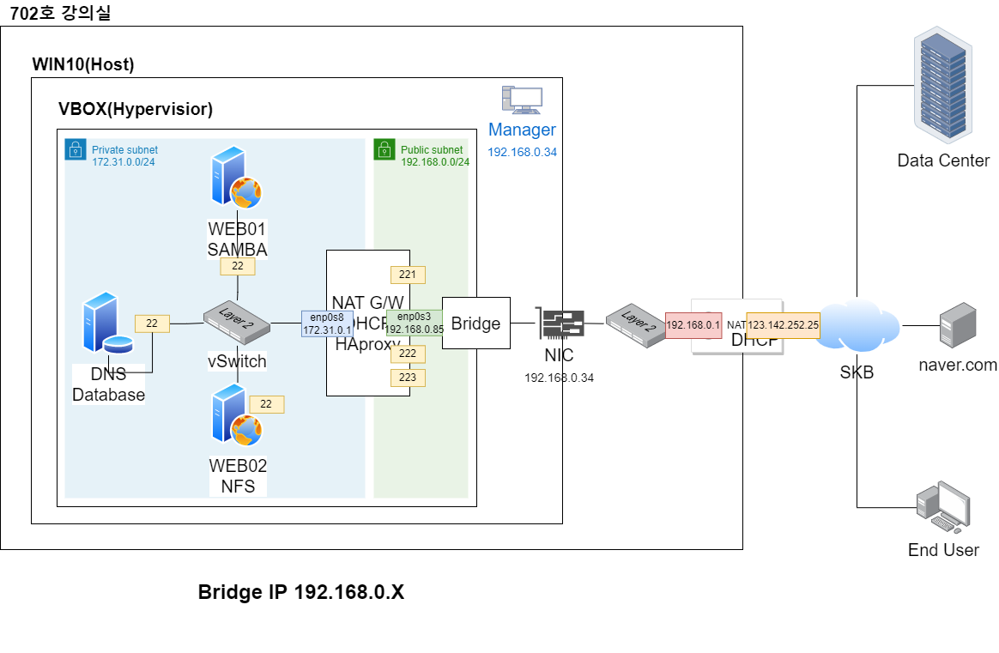

**네트워크 경로**

* 192.168.0.73:221 -> 172.31.0.101:22 (WEB01)
* 192.168.0.73:222  -> 172.31.0.102:22 (WEB02)
* 192.168.0.73:223  -> 172.31.0.103:22 (DNS)


```
C:\Windows\system32>netstat -a
```

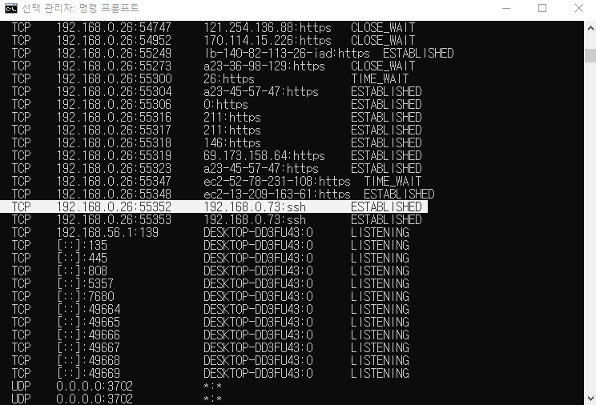


```
# ss -ant
```

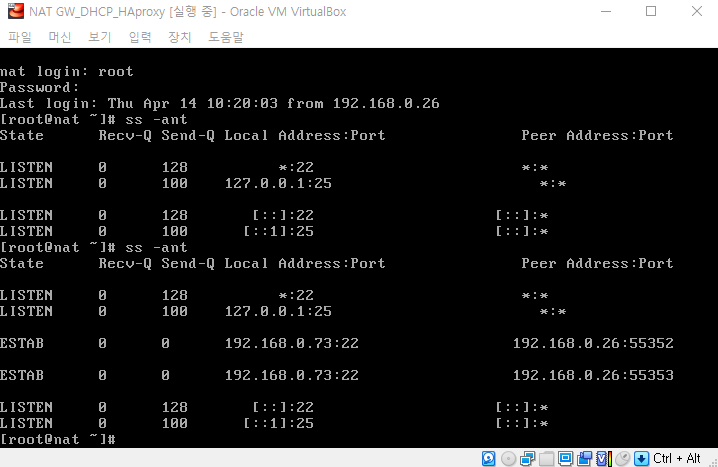


* zone=external : NAT의 의미
* WEB01 : FROM 22 TO 221
* WEB02 : FROM 22 TO 222
* DNS : FROM 22 TO 223

```
*/ WEB01_SAMBA 
# firewall-cmd --permanent --zone=external --add-forward-port=port=221:proto=tcp:toport=22:toaddr=172.31.0.101


/* WEB02_NFS 
# firewall-cmd --permanent --zone=external --add-forward-port=port=222:proto=tcp:toport=22:toaddr=172.31.0.102


/* DATABASE_DNS
# firewall-cmd --permanent --zone=external --add-forward-port=port=223:proto=tcp:toport=22:toaddr=172.31.0.103


# firewall-cmd --reload
# firewall-cmd --list-all --zone=external
```


```
# yum  update -y
```

* Multi-exec로 한번에

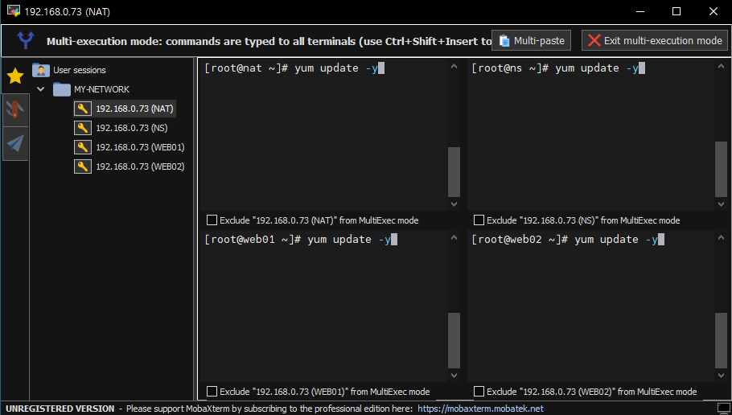


## DNS - AWS Route53
* 도메인 네임 시스템(Domain Name System, DNS)은 호스트의 도메인 이름을 호스트의 네트워크 주소로 바꾸거나 그 반대의 변환을 수행할 수 있도록 하기 위해 개발되었습니다. 
* 특정 컴퓨터(또는 네트워크로 연결된 임의의 장치)의 주소를 찾기 위해, 사람이 이해하기 쉬운 도메인 이름을 숫자로 된 식별 번호(IP 주소)로 변환해 줍니다. 
* 도메인 네임 시스템은 흔히 "전화번호부"에 비유됩니다. 
* 인터넷 도메인 주소 체계로서 TCP/IP의 응용에서, www.{ex}.com과 같은 주 컴퓨터의 도메인 이름을 192.168.1.0과 같은 IP 주소로 변환하고 라우팅 정보를 제공하는 분산형 데이터베이스 시스템입니다.


### DNS 라우팅 과정

> 도메인을 ip로...


1. 사용자가 웹 브라우저 www.{ex}.com 입력 + Enter
2. www.{ex}.com 요청이 ISP가 관리하는 DNS Resolver(해석기)로 라우팅
   - ISP (Internet Service Provider :인터넷 서비스 제공업체)
     -  KT, SKB, LGU+, Dreamline ...
3. ISP의 DNS Resolver가 www.{ex}.com에 대한 요청을 DNS Root Nameserver에 전달
4. DNS Resolver가 요청을 .com TLD Nameserver에 다시 전달
5. DNS Resolver가 요청을 Amazon Route 53 Nameserver에 다시 전달
6. Amazon Route 53이 {ex}.com 호스팅 영역에서 www.{ex}.com  IP 주소를 DNS Resolver로 반환
7. ISP의 DNS Resolver가 사용자에게 필요한 IP 주소를 확보
   - IP 주소 : 192.0.2.44
   - 이 값을 웹 브라우저로 반환 및 일정 기간 IP 주소를 캐싱(저장)
8. 웹 브라우저는 얻은 IP 주소로 www.{ex}.com에 대한 요청을 전송
9. www.{ex}.com의 웹 페이지를 웹 브라우저로 반환, 웹 브라우저는 이 페이지를 표시

* 자주 접속하면 2 > 7 으로 바로 감
  * resolver가 정보 갖고 있기 때문에 일련의 과정 스킵
* 우리가 만들 것은 dns resolver : ip가 아닌 도메인으로 네트워크 접속 (사설 도메인)


### DNS 설치 및 설정

* NS에 설치

```
# yum -y install bind bind-chroot bind-utils
# cp /etc/named.conf /etc/named.conf.bak	/*백업
```


**대표적인 레코드**

* SOA : 다루는 도메인 버전과 업데이트 시간 간격 등의 정보를 저장하는 레코드
* A : 호스트 이름으로 IPv4 주소를 조회할 때 사용하는 레코드, 도메인을 ip로
  * 예: 호스트 ns.xeomina.shop의 IPv4 주소는 172.31.0.130
* AAA : 호스트 이름으로 IPv6 주소를 조회할 때 사용하는 레코드
  * 예: jprs.jp의 IPv6 주소는 2001:218:3001:7::80
* PTR : IP 주소로 호스트 이름을 조회할 때 사용하는 레코드, ip를 도메인으로
  * 예: 172.31.0.130의 호스트 이름은 ns.xeomina.shop
* NS : DNS 서버의 호스트 이름 혹은 IP 주소를 저장하는 레코드
  * 예: xeomina.shop의 DNS 서버는 ns.xeomina.shop
* MX : 메일 서버 호스트 이름 혹은 IP 주소를 저장하는 레코드
  * 예: xeomina.shop의 메일 서버는 mail.xeomina.shop
* CNAME : 호스트 이름의 별칭을 저장하는 레코드, 도메인을 도메인으로
  * 예: www.xeomina.shop은 ns.xeomina.shop의 별칭 (alias)


```
# vi /etc/named.conf
```

* `Esc` + ggdG : 전부 다 지우기

```
options {
        listen-on port 53 { 127.0.0.1; 192.168.0/24; 172.31.0/24; };		/* 172.31.0 =  172.31.0.0(마지막 생략가능) : 내부네트워크 정의
        listen-on-v6 port 53 { ::1; };
        directory       "/var/named";
        dump-file       "/var/named/data/cache_dump.db";
        statistics-file "/var/named/data/named_stats.txt";
        memstatistics-file "/var/named/data/named_mem_stats.txt";
        recursing-file  "/var/named/data/named.recursing";
        secroots-file   "/var/named/data/named.secroots";
        allow-query     { localhost; 192.168.0/24; 172.31.0/24; };
        forwarders { 8.8.8.8; 8.8.4.4; };

        recursion yes;

        dnssec-enable yes;
        dnssec-validation yes;

        /* Path to ISC DLV key */
        bindkeys-file "/etc/named.iscdlv.key";

        managed-keys-directory "/var/named/dynamic";

        pid-file "/run/named/named.pid";
        session-keyfile "/run/named/session.key";
};

logging {
        channel default_debug {
                file "data/named.run";
                severity dynamic;
        };
};
view "internal" {
        zone "." IN {
                type hint;
                file "named.ca";
        };

        include "/etc/named.rfc1912.zones";
        include "/var/named/xeomina.shop.zones";	/* 호스팅 영역 생성 (zones)
};
```


* zones

```
# vi /var/named/xeomina.shop.zones
```

```
zone "xeomina.shop" IN {
        type master;
        file "xeomina.shop.db";				/* db파일 생성/링크 - db안에 ip와 도메인 정보 매핑
        allow-update { none; };
};

zone "0.31.172.in-addr.arpa" IN {			/*172.31.0 > 0.31.172
        type master;
        file "0.31.172.in-addr.arpa.db";	/*ip를 도메인으로 변경(리버스)
        allow-update { none; };
};
```


* db

```
# vi /var/named/xeomina.shop.db
```

```
$TTL    86400
@       IN      SOA     xeomina.shop.   root.xeomina.shop.(		 /* 도메인
                        2022041401 ; Serial						/* 버전(날짜)- 2022041402,3,...
                        3h         ; Refresh
                        1h         ; Retry
                        1w         ; Expire
                        1h )       ; Minimum

        IN      NS      ns.xeomina.shop.
        IN      MX 10   ns.xeomina.shop.			/* 메일서버 DNS 필수 - MX(Mail Exchange;메일 교환기)
ns      IN      A       172.31.0.103				/* 네임서버
web01   IN      A       172.31.0.101
web02   IN      A       172.31.0.102
```


* 리버스
  * 리버스 도메인은 IP를 조회하면 도메인

```
# vi /var/named/0.31.172.in-addr.arpa.db
```

```
# vi /var/named/0.31.172.in-addr.arpa.db
$TTL	86400
@	IN	SOA	xeomina.shop.	root.xeomina.shop.(
			2022041401 ; Serial
			3h         ; Refresh
			1h         ; Retry
			1w         ; Expire
                        1h )       ; Minimum

	IN	NS	ns.xeomina.shop.
103	IN	PTR	ns.xeomina.shop.						/* 103 : 네임서버의 IP 맨 끝 
```


```
# systemctl enable --now named
# systemctl restart named
```


* 오류확인 - 라인 번호

```
# systemctl status named
```

* vi 편집기에 번호 달기

```
vi /etc/named.conf
: set number
```

* nameserver정보
  * 기본 DNS : 사설
    * 우리(로컬) 도메인 NS IP로 세팅
    * 먼저 확인
  * 보조 DNS : 공식 

```
# cat /etc/resolv.conf
# Generated by NetworkManager
nameserver 8.8.8.8
nameserver 8.8.4.4
```

* dhcp.conf 파일 수정해서 nameserver 변경

```
# find / -name dhcpd.conf	/*dhcp.conf 위치 찾기
/etc/dhcp/dhcpd.conf

# vi /etc/dhcp/dhcpd.conf
```

* domain-name-servers에 172.31.0.103 추가

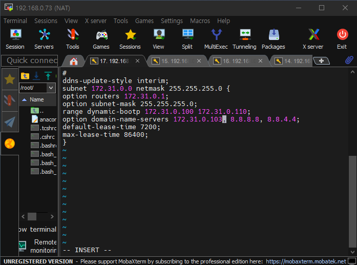

* DNS 변경사항 확인

```
# systemctl restart NetworkManager

# cat /etc/resolv.conf
# Generated by NetworkManager
nameserver 172.31.0.103
nameserver 8.8.8.8
nameserver 8.8.4.4
```


* ns에서 ping 확인

```
# systemctl restart named

# ping ns.xeomina.shop
# ping web01.xeomina.shop
# ping web02.xeomina.shop
```

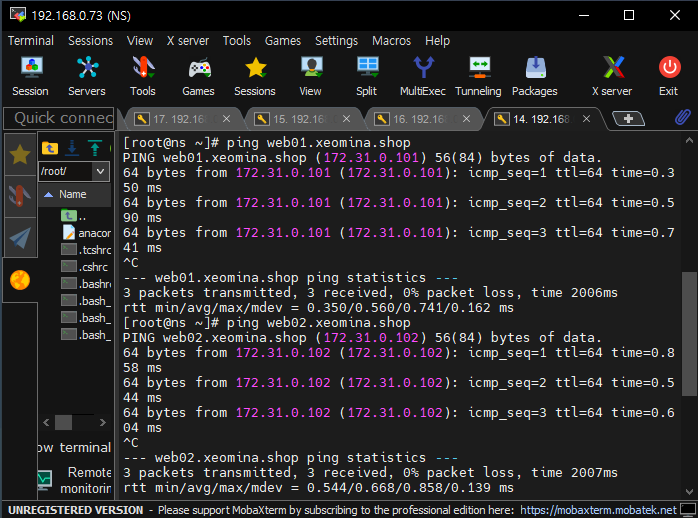

* 방화벽 설정

```
# firewall-cmd --permanent --add-service=dns
success
# firewall-cmd --reload
success
```

* WEB01에서 다른 서버로 ping 가능
  * WEB02도 마찬가지

```
# ping web02.xeomina.shop
# ping ns.xeomina.shop
```

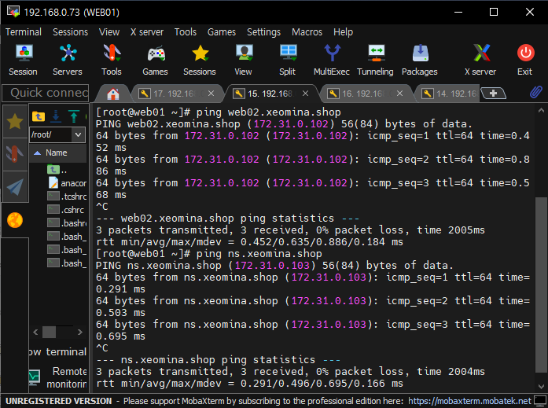


* NAT 도메인 추가

```
vi /var/named/xeomina.shop.db
```

```
nat     IN      A       172.31.0.1		/* 추가
```

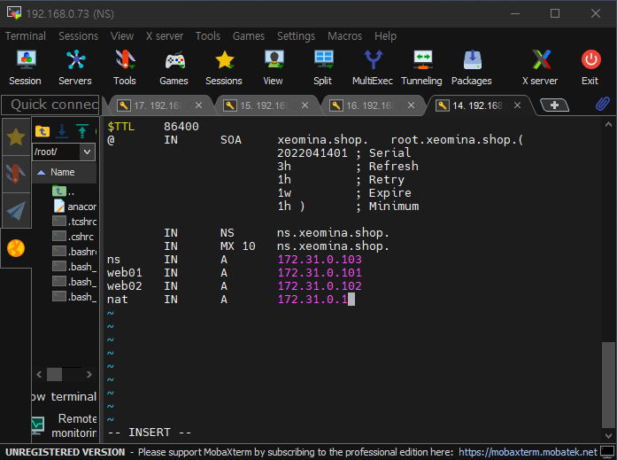

```
# ping nat.xeomina.shop
```

* IP : 172.31.0.1 (라우터)

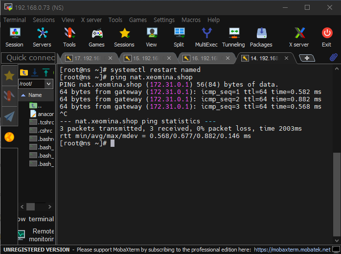


## HAproxy - AWS ELB 
* HAProxy는 여러 서버에 요청을 분산시키는 TCP 및 HTTP 기반 애플리케이션을 위한 고가용성 로드 밸런서 및 역방향 프록시를 제공하는 무료 오픈 소스 소프트웨어 입니다. 
* C로 작성되었으며 빠르고 효율적(프로세서 및 메모리 사용 측면에서)으로 유명합니다.

### 로드밸런서(Load Balancer)

* 새로고침 할 때마다 서버를 증가시켜 부하(트래픽)을 분산
* HAproxy : 로드밸런서 오픈소스로 구축

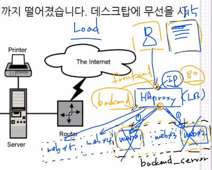

* frontend  
  * http로 신호 들어오면(in) backend_servers로 연결
* backend 
  * backend_servers로 웹서버 그룹화
  * web01과 web02로 부하분산:ㅈㅂ
* 균형 알고리즘 : roundrobin


**NAT에서 설치**

```
# yum install -y haproxy
```

```
# vi /etc/haproxy/haproxy.cfg
```

```
global		/*전역설정
    daemon	/*백그라운드

defaults
    mode               http	/*접속프로토콜=http

frontend  http-in
    bind *:80
    default_backend    backend_servers

backend backend_servers
    balance            roundrobin
#    cookie  SVID insert indirect nocache maxlife 3m
    server             web01 172.31.0.101:80 cookie check
    server             web02 172.31.0.102:80 cookie check
```

* cfg = conf

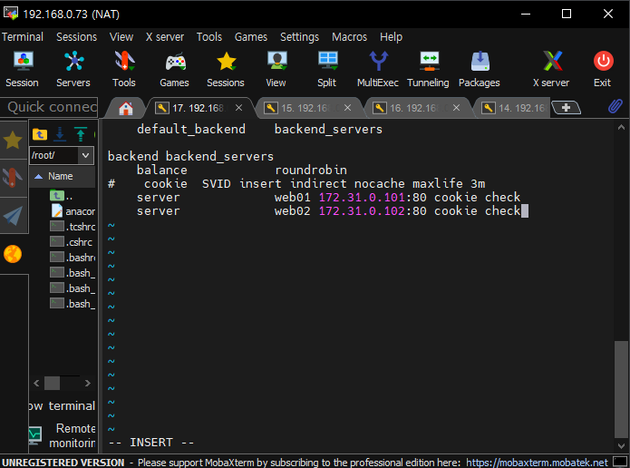

```
# systemctl enable --now haproxy
```


### 웹서버 설치

**WEB01/WEB02**

```
# sestatus
Current mode:                   enforcing
Mode from config file:          enforcing
```

```
# vi /etc/sysconfig/selinux
SELINUX=disabled 로 변경

# setenforce 0
```

```
# sestatus
Current mode:                   permissive
Mode from config file:          disabled
```

* httpd 설치

```
# yum install -y httpd

# systemctl enable --now httpd
```

### 홈페이지 꾸미기

* 방화벽 설정

```
# firewall-cmd --permanent --add-service=http
# firewall-cmd --reload
```

* 경로로 이동

```
# cd /var/www/html
# mkdir images
# cd images
```

* wget 설치

```
# yum install -y wget
```

* two-rabbit.jpg 파일 WebShare에서 다운로드

```
# wget http://192.168.0.26/FILES/two-rabbit.jpg
--2022-04-14 16:50:41--  http://192.168.0.26/FILES/two-rabbit.jpg
Connecting to 192.168.0.26:80... connected.
HTTP request sent, awaiting response... 200 OK
Length: 571622 (558K) [image/jpeg]
Saving to: ‘two-rabbit.jpg’

 0%  0           --.-K/s        100% 571,622     --.-K/s   in 0.02s

2022-04-14 16:50:41 (32.3 MB/s) - ‘two-rabbit.jpg’ saved [571622/571622]

# ls
two-rabbit.jpg
```

```
# cd ..
# vi index.html
<html> 코드 입력
```

### NAT에서 방화벽 설정

```
# firewall-cmd --zone=external --permanent --add-service=http
# firewall-cmd --reload
```

### WEB01과 WEB02 홈페이지 변경

**WEB01**

```
<h1>WEB01</h1>
```

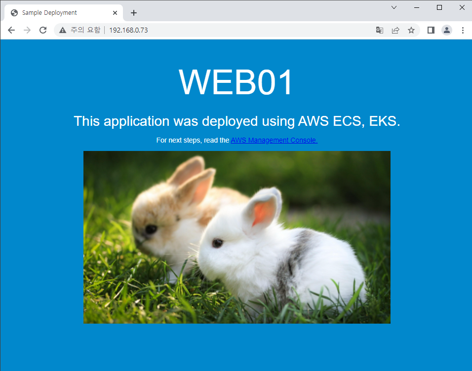

**WEB02**

```
<h1>WEB02</h1>
```

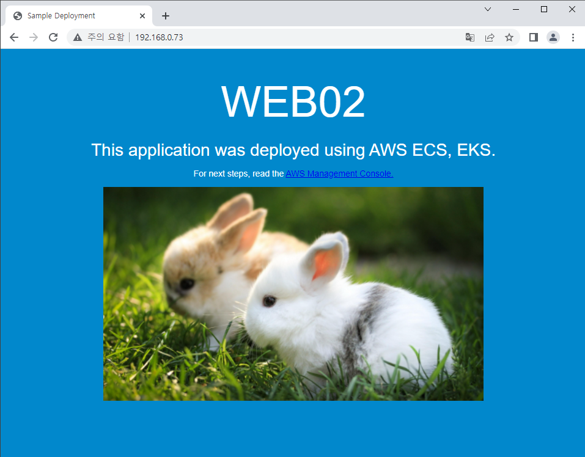

* 일정 시간 지나면(새로고침) 서버 바뀜 - 로그인 불가 !
  * 해결책 : 쿠키에 시간 지정
  * 주로 하루(1d)로 설정

```
# vi /etc/haproxy/haproxy.cfg

cookie  SVID insert indirect nocache maxlife 1m		/*1분
```


### 정방향(도메인 > IP) 조회

* bind-utils 설치(dig 포함)

```
# yum install -y bind-utils
```

```
# dig A web01.xeomina.shop

web01.xeomina.shop.     86400   IN      A       172.31.0.101
```

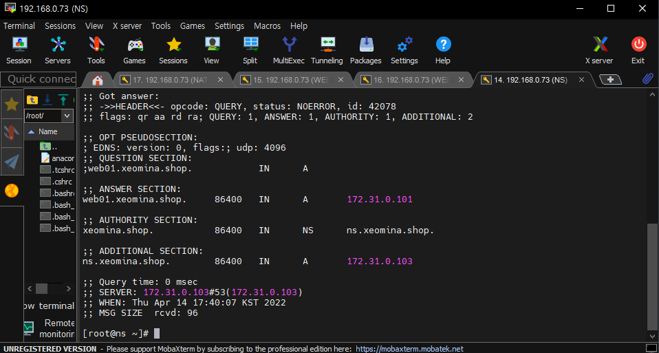


### 역방향(IP > 도메인) 조회

```
# dig -x 172.31.0.103		/* NS IP

103.0.31.172.in-addr.arpa. 86400 IN     PTR     ns.xeomina.shop.
```

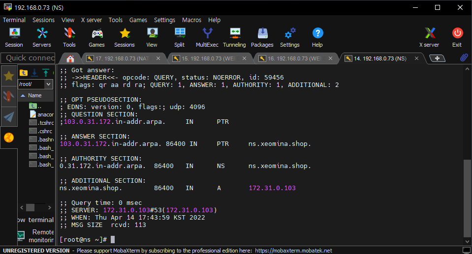