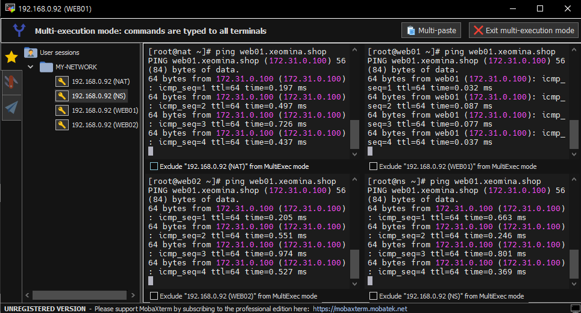
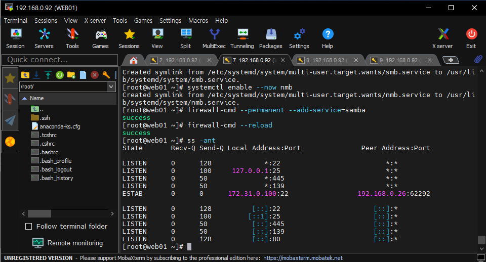
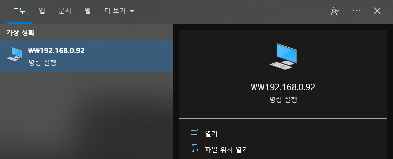
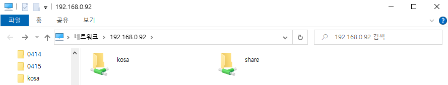
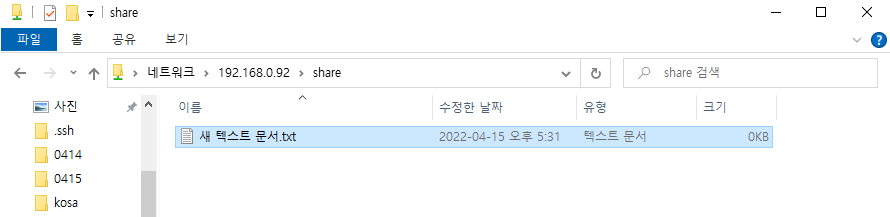

# 0415

> 이번주 리뷰

## 개요

**VM 네트워크 구성**

* NAT GW_DHCP_HAPROXY
  * 내부와 외부를 연결하는 라우터 역할
  * 어댑터1(enp0s3) : 어댑터에 브리지
  * 어댑터2(enp0s8) : 내부 네트워크(vSwitch)
* WEB01_SAMBA
  * 어댑터1 : 내부 네트워크(vSwitch)
* WEB02_NFS
  - 어댑터1 : 내부 네트워크(vSwitch)
* NS_DATABASE
  - 어댑터1 : 내부 네트워크(vSwitch)


**내부/외부 IP**

* Public Subnet (=외부, external, frontend)
  * 192.168.0.0/24
  * 192.168.0.0 ~ 192.168.0.255 (256개 IP - 2개 = 254개)
  * 192.168.0.0   네트워크 주소(시작 IP)
  * 192.168.0.255 브로드캐스팅 주소(마지막 IP)
* Private Subnet (=내부, internal, backend)
  * 172.31.0.0/24
  * 172.31.0.0 ~ 172.31.0.255 (256개 IP - 2개 = 254개)
  * 172.31.0.0   네트워크 주소(시작 IP)
  * 172.31.0.255 브로드캐스팅 주소(마지막 IP)


## SSHD(Secure Shell Daemon) - AWS KeyPair

### NAT

**KeyPair 생성**

```
C:\Windows\system32>ssh root@192.168.0.92

# mkdir /root/.ssh
# exit
```

```
C:\Windows\system32>ssh-keygen -t rsa
```

* Enter * 3


**KeyPair 복사**

```
C:\Windows\system32>cd %UserProfile%\.ssh

C:\Users\r2com\.ssh>
```

```
C:\Users\r2com\.ssh>scp id_rsa.pub root@192.168.0.92:/root/.ssh/authorized_keys
```

```
C:\Users\r2com\.ssh>ren id_rsa my-key.pem
```

* `ren` : 이름 변경


**KeyPair로만 접근**

```
C:\Users\r2com\.ssh>ssh -i my-key.pem root@192.168.0.92

# vi /etc/ssh/sshd_config
PasswordAuthentication no로 변경

# systemctl restart sshd
```


**selinux 설정 변경**

```
# vi /etc/sysconfig/selinux
SELINUX=disabled로 변경

# setenforce 0

# sestatus
Current mode:                   permissive
Mode from config file:          disabled
```


## Router - AWS VPC NAT GateWay

**hostname 변경**

```
# hostnamectl set-hostname nat
```


**네트워크 설정 변경**

```
# cp /etc/sysconfig/network-scripts/ifcfg-enp0s3 /etc/sysconfig/network-scripts/ifcfg-enp0s3.bak

# vi /etc/sysconfig/network-scripts/ifcfg-enp0s3
TYPE=Ethernet
BOOTPROTO=none
NAME=enp0s3
DEVICE=enp0s3
ONBOOT=yes
IPADDR=192.168.0.92
NETMASK=255.255.255.0
GATEWAY=192.168.0.1
DNS1=8.8.8.8
DNS2=8.8.4.4

# vi /etc/sysconfig/network-scripts/ifcfg-enp0s8
TYPE=Ethernet
BOOTPROTO=none
NAME=enp0s8
DEVICE=enp0s8
ONBOOT=yes
IPADDR=172.31.0.1
NETMASK=255.255.255.0

# systemctl restart network
```


**랜카드 존 나누기**

```
# firewall-cmd --get-active-zone
public
  interfaces: enp0s3 enp0s8

# nmcli c mod enp0s3 connection.zone external
# nmcli c mod enp0s8 connection.zone internal

# firewall-cmd --get-active-zone
internal
  interfaces: enp0s8
external
  interfaces: enp0s3
```


**IP 포워드**

```
# sysctl -w net.ipv4.ip_forward=1
net.ipv4.ip_forward = 1

# sysctl -p
# cat /proc/sys/net/ipv4/ip_forward
1
```


## DHCP (Dynamic Host Configuration Protocol)
* IP를 자동으로 부여

**DHCP 설치 및 설정**

```
# yum install dhcp -y

# vi /etc/dhcp/dhcpd.conf
ddns-update-style interim;
subnet 172.31.0.0 netmask 255.255.255.0 {
option routers 172.31.0.1;
option subnet-mask 255.255.255.0;
range dynamic-bootp 172.31.0.100 172.31.0.110;
option domain-name-servers 8.8.8.8, 8.8.4.4;
default-lease-time 7200;
max-lease-time 86400;
}

# systemctl enable --now dhcpd
```


**VM IP 목록**

* WEB01_SAMBA : 172.31.0.100
* WEB02_NFS: 172.31.0.101
* NS_DATABASE: 172.31.0.102


****

**지금부터 mobaxterm 이용**


**포트포워드**

```
# firewall-cmd --permanent --zone=external --add-forward-port=port=221:proto=tcp:toport=22:toaddr=172.31.0.100

# firewall-cmd --permanent --zone=external --add-forward-port=port=222:proto=tcp:toport=22:toaddr=172.31.0.101

# firewall-cmd --permanent --zone=external --add-forward-port=port=223:proto=tcp:toport=22:toaddr=172.31.0.102

# firewall-cmd --reload

# firewall-cmd --list-all --zone=external
external (active)
  forward-ports: port=221:proto=tcp:toport=22:toaddr=172.31.0.100
        port=222:proto=tcp:toport=22:toaddr=172.31.0.101
        port=223:proto=tcp:toport=22:toaddr=172.31.0.102
```


**Key 전송**

```
# cp authorized_keys authorized_keys.pub
# ssh-copy-id -i authorized_keys.pub root@172.31.0.100
# ssh-copy-id -i authorized_keys.pub root@172.31.0.101
# ssh-copy-id -i authorized_keys.pub root@172.31.0.102
```

* `scp`: 모든 파일 전송
* `ssh-copy-id` : 키 전송 전용


## DNS(Domain Name System, DNS) - AWS Route53
### NS

**bind  설치**

```
# yum -y install bind bind-chroot bind-utils
```


**DNS 환경설정**

*  `named.conf` : DNS bind (데몬명 named)의 메인 설정 파일

```
# vi /etc/named.conf		/* ggdG : 전체 삭제

options {
        listen-on port 53 { 127.0.0.1; 192.168.0/24; 172.31.0/24; };
        listen-on-v6 port 53 { ::1; };
        directory       "/var/named";
        dump-file       "/var/named/data/cache_dump.db";
        statistics-file "/var/named/data/named_stats.txt";
        memstatistics-file "/var/named/data/named_mem_stats.txt";
        recursing-file  "/var/named/data/named.recursing";
        secroots-file   "/var/named/data/named.secroots";
        allow-query     { localhost; 192.168.0/24; 172.31.0/24; };
        forwarders { 8.8.8.8; 8.8.4.4; };

        recursion yes;

        dnssec-enable yes;
        dnssec-validation yes;

        /* Path to ISC DLV key */
        bindkeys-file "/etc/named.iscdlv.key";

        managed-keys-directory "/var/named/dynamic";

        pid-file "/run/named/named.pid";
        session-keyfile "/run/named/session.key";
};

logging {
        channel default_debug {
                file "data/named.run";
                severity dynamic;
        };
};
view "internal" {
        zone "." IN {
                type hint;
                file "named.ca";
        };

        include "/etc/named.rfc1912.zones";
        include "/var/named/xeomina.shop.zones"; # 호스팅 영역 생성
};
```


**zone 설정**

```
# vi /var/named/xeomina.shop.zones

zone "xeomina.shop" IN {
        type master;
        file "xeomina.shop.db";
        allow-update { none; };
};

zone "0.31.172.in-addr.arpa" IN {
        type master;
        file "0.31.172.in-addr.arpa.db";
        allow-update { none; };
};
```


**db 설정**

```
# vi /var/named/xeomina.shop.db

$TTL    86400
@       IN      SOA     xeomina.shop.   root.xeomina.shop.(
                        2022041501 ; Serial
                        3h         ; Refresh
                        1h         ; Retry
                        1w         ; Expire
                        1h )       ; Minimum

        IN      NS      ns.xeomina.shop.
        IN      MX 10   ns.xeomina.shop.
ns      IN      A       172.31.0.102
web01   IN      A       172.31.0.100
web02   IN      A       172.31.0.101
```

```
# vi /var/named/0.31.172.in-addr.arpa.db

$TTL	86400
@	IN	SOA	xeomina.shop.	root.xeomina.shop.(
			2022041501 ; Serial
			3h         ; Refresh
			1h         ; Retry
			1w         ; Expire
                        1h )       ; Minimum

	IN	NS	ns.xeomina.shop.
102	IN	PTR	ns.xeomina.shop.		/*NS의 IP 끝자리
```

```
# systemctl enable --now named
```


**방화벽 설정**

```
# firewall-cmd --permanent --add-service=dns
# firewall-cmd --reload
# firewall-cmd --list-all
  services: dhcpv6-client dns ssh
```


### NAT

**도메인 네임 서버 추가**

```
# vi /etc/dhcp/dhcpd.conf
option domain-name-servers 172.31.0.102, 8.8.8.8, 8.8.4.4;	/*NS IP 추가

# systemctl restart dhcpd
```


**DNS 설정 변경**

```
# cat /etc/resolv.conf
# Generated by NetworkManager
nameserver 8.8.8.8
nameserver 8.8.4.4

# vi /etc/sysconfig/network-scripts/ifcfg-enp0s3
DNS1=172.31.0.102 로 변경

# systemctl restart network

# cat /etc/resolv.conf
# Generated by NetworkManager
nameserver 172.31.0.102
nameserver 8.8.4.4
```


### WEB01/WEB02/NS

```
# systemctl restart NetworkManager

# cat /etc/resolv.conf
# Generated by NetworkManager
nameserver 172.31.0.102
nameserver 8.8.8.8
nameserver 8.8.4.4
```

```
# setenforce 0

# vi /etc/sysconfig/selinux
SELINUX=disabled로 변경
```


**Ping 확인**




## HAproxy(High Availability Proxy) - AWS ELB 

* 가용성 : 보안 관련

### NAT

**haproxy 설치**

```
# yum install -y haproxy
```

**haproxy 설정 변경**

```
# vi /etc/haproxy/haproxy.cfg
global
    daemon

defaults
    mode               http

frontend  http-in
    bind *:80
    default_backend    backend_servers

backend backend_servers
    balance            roundrobin
#    cookie  SVID insert indirect nocache maxlife 3m		/* 고정세션(stickness)
    server             web01 172.31.0.100:80 cookie check
    server             web02 172.31.0.101:80 cookie check
```

**haproxy 실행**

```
# systemctl enable --now haproxy
```


## HTTPD(Hyper Text Transfer Protocol Daemon)

### WEB01/WEB02

**httpd 설치 및 실행**

```
# yum install -y httpd

# systemctl enable --now httpd
```

**방화벽 설정**

```
# firewall-cmd --permanent --add-service=http

# firewall-cmd --reload
```

**/var/www/html/images 생성**

```
# cd /var/www/html
# mkdir images && cd $_
```

**wget 설치**

```
# yum install -y wget
```

**WebShare에서 이미지 다운로드**

```
# wget http://192.168.0.26/FILES/two-rabbit.jpg
```

**index.html 꾸미기**

```
# vi index.html
<!DOCTYPE html>
<html>
<head>
  <meta charset="utf-8">
  <title>Sample Deployment</title>
  <style>
    body {
      color: #ffffff;
      background-color: #0188cc;
      font-family: Arial, sans-serif;
      font-size: 14px;
    }
    h1 {
      font-size: 500%;
      font-weight: normal;
      margin-bottom: 0;
    }
    h2 {
      font-size: 200%;
      font-weight: normal;
      margin-bottom: 0;
    }
  </style>
</head>
<body>
  <div align="center">
    <h1>Congratulations</h1>
    <h2>This application was deployed using AWS ECS, EKS.</h2>
    <p>For next steps, read the <a href="https://aws.amazon.com/ko">AWS Management Console.</a></p>
    <p></p>
  </div>
</body>
</html>
```

**html 확인**

```
# curl 127.0.0.1
```


### NAT

**외부 방화벽 확인**

```
# firewall-cmd --list-all --zone=external
external (active)
  services: ssh

  forward-ports: port=221:proto=tcp:toport=22:toaddr=172.31.0.100
        port=222:proto=tcp:toport=22:toaddr=172.31.0.101
        port=223:proto=tcp:toport=22:toaddr=172.31.0.102
```

**외부 방화벽 설정**

```
# firewall-cmd --permanent --zone=external --add-service=http
# firewall-cmd --reload
# firewall-cmd --list-all --zone=external
```


### WEB01/WEB02 접속

* 192.168.0.101
* 192.168.0.102


## SAMBA(Server Message Block) - Amazon FSx

### WEB01

**samba 설치**

```
# yum install -y samba
```

**공유 폴더 생성 및 권한 설정**

```
# mkdir -p /var/samba/share
# chmod 777 /var/samba/share
```

**리눅스 사용자 생성**

```
# adduser kosa
# passwd kosa
kosa0401
```

**samba 사용자 생성**

```
# smbpasswd -a kosa
kosa0401
```

**samba 설정 변경**

```
# vi /etc/samba/smb.conf

[global]
        workgroup = 네트워크2로 변경

[share]						/*추가
        comment = Share Directory
        path = /var/samba/share
        browserable = yes
        writable = yes
        valid users = kosa
        create mask = 0777
        directory mask = 0777
```

**smb/nmb 설치**

```
# systemctl enable --now smb
# systemctl enable --now nmb
```

**방화벽 설정**

```
# firewall-cmd --permanent --add-service=samba
# firewall-cmd --reload
```


**samba 포트 확인**

```
# ss -ant
```



* samba 포트 : 445 / 139 


### NAT

**포트포워드**

```
# firewall-cmd --permanent --zone=external --add-forward-port=port=139:proto=tcp:toport=139:toaddr=172.31.0.100
# firewall-cmd --permanent --zone=external --add-forward-port=port=445:proto=tcp:toport=445:toaddr=172.31.0.100
# firewall-cmd --reload
```

**포트 확인**

```
# firewall-cmd --list-all --zone=external
external (active)
  forward-ports: port=221:proto=tcp:toport=22:toaddr=172.31.0.100
        port=222:proto=tcp:toport=22:toaddr=172.31.0.101
        port=223:proto=tcp:toport=22:toaddr=172.31.0.102
        port=139:proto=tcp:toport=139:toaddr=172.31.0.100
        port=445:proto=tcp:toport=445:toaddr=172.31.0.100
```


### 로컬

**공유 폴더 접근**





**share 폴더에 새 텍스트 문서.txt 생성**




### WEB01

**파일 확인**

```
[root@web01 ~]# cd /var/samba/share/
[root@web01 share]# ls
새 텍스트 문서.txt
[root@web01 share]#
```

