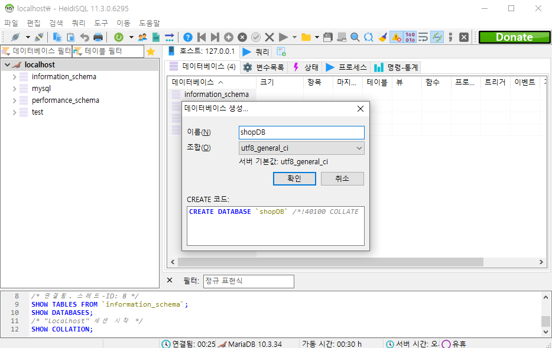

# 0418

## 개념

### 로드 밸런싱(Load Balancing) 

* 부하분산
* 컴퓨터 네트워크 기술의 일종으로 둘 혹은 셋이상의 중앙처리장치혹은 저장장치와 같은 컴퓨터 자원들에게 작업을 나누는 것


### 페일오버(FailOver)

* 장애 극복 기능
* 컴퓨터 서버, 시스템, 네트워크 등에서 이상이 생겼을 때 예비 시스템으로 자동전환되는 기능


### 클러스터(Cluster)

* 여러 대의 컴퓨터들이 연결되어 하나의 시스템처럼 동작하는 컴퓨터들의 집합
* Health Check : 클러스터 상태 검사


## NFS(Network File System; file storage) - AWS EFS

* 리눅스용 네트워크 파일 공유 시스템)  - 완전 관리형 서비스

* 네트워크 파일 시스템(Network File System, NFS)은 1984년에 썬 마이크로시스템즈가 개발한 프로토콜입니다. 
* 클라이언트 컴퓨터의 사용자가 네트워크 상의 파일을 직접 연결된 스토리지에 접근하는 방식과 비슷한 방식으로 접근하도록 도와 줍니다. 
* 다른 수많은 프로토콜과 마찬가지로 ONC RPC 시스템을 기반으로 합니다. 
* 네트워크 파일 시스템은 RFC에 정의된 오픈 표준이므로 누구나 구현할 수 있습니다.


### WEB02 (서버)

**nfs 설치**

```
# yum install -y nfs-utils
# mkdir /share && cd $_
# echo "Hello" > test.txt
```

**공유 폴더에 접근 가능한 IP 설정**

```
# vi /etc/exports
/share 172.31.0.0/24(rw,sync)
```

* HOST : 0~254 NFS 이용가능
  * 172.31.0.0/24 ip범위에 rw 권한 부여
* rw,sync : 읽기쓰기 가능
* `/share *(rw,sync)`  : anywhere 어디서든지

**접근가능한 사용자에게 권한 부여**

```
# chmod 707 /share
```

**start & enable**

```
# systemctl enable --now nfs-server
```


**방화벽 설정**

```
# firewall-cmd --permanent --add-service=nfs
# firewall-cmd --permanent --add-service=rpc-bind
# firewall-cmd --permanent --add-service=mountd
# firewall-cmd --reload
```


### NAT, WEB01, NS (클라이언트)

**nfs 설치**

```
# yum install -y nfs-utils
# rpm -qa | grep nfs-utils	/*확인
```

**WEB02 IP로 접속**

```
# showmount -e 172.31.0.101

Export list for 172.31.0.101:	/*mount 할 수 있는 범위
/share 172.31.0.0/24
```

**폴더 생성 - nfs와 연결**

```
# mkdir share
```

**마운트**

```
# mount -t nfs 172.31.0.101:/share /root/share	/* 절대경로
# mount -t nfs 172.31.0.101:/share share		/* 상대경로
```

* 저장장치 type : nfs
* 왼쪽은 서버의 경로 오른쪽은 클라이언트의 경로(절대/상대 가능)

**mount 확인**

```
# df -h
172.31.0.101:/share      125G  1.5G  124G   2% /root/share

# ls /root/share
test.txt
```

**마운트 설정 변경**

시작하면 자동으로 마운트

```
# vi /etc/fstab
172.31.0.101:/share /root/share nfs defaults 0 0

# echo "172.31.0.101:/share /root/share nfs defaults 0 0" >> /etc/fstab
```


Cf) UUID 확인

```
# blkid		/*block storage id
/dev/sda1: UUID="3d95066c-a872-4c35-8318-8522f0f69f60" TYPE="xfs"
/dev/sda2: UUID="okQ39D-0843-rJc8-9gET-P3cm-LjUQ-6aNx51" TYPE="LVM2_member"
/dev/mapper/centos-root: UUID="2de2ed1e-0727-40c1-8938-9ffaa2096835" TYPE="xfs"
/dev/mapper/centos-swap: UUID="5e1ef22f-e00f-4fa4-976e-66ee02772ba6" TYPE="swap"
```


## DB서버(Database Management System; MariaDB) - AWS RDS - 완전 관리형 서비스
* MariaDB는 오픈 소스의 관계형 데이터베이스 관리 시스템(RDBMS)입니다. 
* MySQL과 동일한 소스 코드를 기반으로 하며, GPL v2 라이선스를 따릅니다. 
* 오라클 소유의 현재 불확실한 MySQL의 라이선스 상태에 반발하여 만들어졌습니다.


### 리눅스 버전 DB :  MariaDB

### NS  

**MariaDB 경로 설정**

* repo = repository (저장소)
* 최신버전의 MariaDB를 위해

```
# vi /etc/yum.repos.d/MariaDB.repo
[mariadb]
name = MariaDB
baseurl = http://yum.mariadb.org/10.4/centos7-amd64
gpgkey=https://yum.mariadb.org/RPM-GPG-KEY-MariaDB
gpgcheck=1
```


**MariaDB 설치**

```
# yum install -y MariaDB
# rpm -qa | grep MariaDB
# mariadb --version
```

**background 설정**

```
# systemctl enable --now mariadb
```

**secure 설정**

```
# mysql_secure_installation		/*root pwd 정의
Enter > y*2 > pwd 입력 > y*4

# systemctl restart mariadb
```

**maria db 접근**

```
# mysql -u root -p
Enter password:
MariaDB [(none)]>
```

**사용자 생성**

```
> CREATE USER 'wpuser'@'%' IDENTIFIED BY 'kosa0401';
```

* `wpuser'@'%` 의 `%`: 출발지 ip어디든 상관없이(anywhere) 와일드카드
* `wpuser'@'localhost` : 로컬에서만 접근 가능
  * 프론트엔드는 remote > WEB01,02가 db에 접근 불가
* pwd : kosa0401


**데이터베이스 생성**

```
> CREATE DATABASE IF NOT EXISTS wordpress;
```

* maria db라는 서버에 wordpress라는 database 생성

**권한 설정**

```
> GRANT ALL PRIVILEGES ON wordpress.* TO 'wpuser'@'%';

> QUIT
> EXIT
```

* wordpress 데이터베이스상에서 wpuser에게 모든 권한 부여
  * {데이터베이스}.*의 `.*` : 모든 테이블 (와일드카드)


**방화벽 설정**

```
# firewall-cmd --permanent --add-service=mysql
# firewall-cmd --reload
```


### WEB 01,WEB02 (클라이언트)

* Two Tier : 웹서버 & DB서버
* 웹서버에서 db서버 접근 가능하도록

**mysql 설치**

```
# yum install mysql -y
```


**mysql 접근**

```
# mysql -h ns.xeomina.shop -u wpuser -p
# mysql -h 172.31.0.102 -u wpuser -p
```

* web01은 remote이기 때문에 root로 접근 불가 > wpuser로!
* `-h` : host 주소 = db서버의 주소
  * ip/도메인 둘다 접근 가능


## 데이터베이스란?

### 정의

* 데이터베이스를 간단히 정의하면 대용량의 데이터 집합을 체계적으로 구성해놓은 것으로 말할 수 있다. 
* 또한 데이터베이스는 혼자서 사용하는 시스템이 아니므로 여러 명의 사용자나 시스템 간에 상호 공유가 가능해야만 한다. 
* DBMS는(Database Management System)은 이러한 데이터베이스를 관리해주는 시스템 또는 소프트웨어를 말한다.
* 데이터베이스는 '데이터의 저장공간' 자체를 의미하기도 한다. 특히 MariaDB에서는 데이터베이스를 자료가 저장되는 디스크 공간으로 취급한다. 


### 특징

- 데이터의 무결성 
  - 데이터베이스 안의 데이터는 오류가 있어서는 안된다. 즉 삽입(Insert), 삭제(Delete), 갱신(Update) 등의 연산 후에도 데이터베이스에 저장된 데이터가 정해진 제약 조건을 항상 만족해야 한다.
- 데이터의 독립성
  - 데이터베이스의 크기를 변경하거나 데이터 파일의 저장소를 변경하더라도, 기존에 작성된 응용프로그램은 전혀 영향을 받지 않아야 한다. 예를 들어, 데이터베이스를 저장한 디스크가 새 것으로 변경되어도 기존에 사용하던 응용프로그램은 아무런 변경없이 계속 사용되어야 한다.
- 보안
  - 데이터베이스 안의 데이터에는 아무나 접근할 수 있는 것이 아니라, 데이터를 소유한 사람이나 데이터에 대한 접근이 허가된 사람만이 접근할 수 있어야 한다. 불법적인 데이터의 노출이나 변경, 손실로부터 보호할 수 있어야 한다.
- 데이터 중복의 최소화
  - 동일한 데이터가 중복되어 저장되는 것을 방지한다. 데이터베이스에 통합하면 하나의 테이블에 저장하고 이를 공유함으로써 데이터 중복이 최소화된다.


### 데이터베이스 용어

* 데이터 : 하나하나의 단편적인 정보
* 테이블 : 데이터를 입력하기 위해 표 형태로 표현한 것
* 데이터베이스 : 테이블이 저장되는 저장소
* DBMS : 데이터베이스를 관리하는 시스템 또는 소프트웨어
* 열(Column) : 각 테이블은 열로 구성
* 열 이름 : 각 열을 구분하기 위한 이름이며, 테이블 내에서 고유해야 함
* 데이터 형식 : 문자 형식, 숫자 형식이며 테이블을 생성할 떄 지정해야 함
* 행(Row) : 실질적인 데이터
* 기본 키(PK;Primary Key) 열 : 각 행을 구분하는 유일한 열을 말하며 식별자로 이용됨
* 외래 키(FK;Foreign Key) : 두 테이블의 관계를 맺어주는 키


### SQL 

SQL = 쿼리 <> NoSQL : SQL을 사용하지 않는 데이터베이스(예 : Key와 Value)

* SQL(Structured Query Language)은 구조적 쿼리 언어를 나타낸다. 
* SQL은 데이터베이스와 통신하는데 사용된다. 
* ANSI(American National Standards Institute)에 따르면 관계형 데이터베이스 관리 시스템의 표준 언어다. 
* SQL문은 데이터베이스에서 데이터 업데이트 또는 데이터베이스에서 데이터 검색과 같은 작업을 수행하는데 사용된다. 
* SQL을 사용하는 일반적인 관계형 데이터베이스 관리 시스템은 Oracle, Sybase, Microsoft SQL Server, Access, Ingres, MYSQL, Maria DB 등이다.
* 대부분의 데이터베이스 시스템이 SQL을 사용하지만, 시스템에서만 사용되는 고유한 추가 독점 확장을 가지고 있다.
* 'Select', 'Insert', 'Delete', 'Create', 'Drop' 과 같은 표준 SQL 명령을 사용하여 데이터베이스로 수행하는데 필요한 거의 모든 작업을 수행할 수 있다.


## Maria DB 설치 (윈도우)

> ns는 리눅스버전...

  

  

 


## Heidi SQL

### 로그인


### 환경변수 추가(영구적)

```
> setx path "%PATH%;{추가하고자하는 경로}"
```


### Data 준비

* employees.zip 다운로드
* C:\employees에 압축풀기


### mysql 실행

```
> cd C:\employees\
> mysql -u root -p
Enter password
```


### Data 불러오기

```
> source employees.sql;
> show databases;
```


### 데이터베이스 구축 절차


## SQL 명령어 실습(GUI)

### 1. 데이터베이스 생성

- shopDB 생성
- localhost > 새로 생성 > 테이터베이스 > shopDB 입력 확인





### 2. 테이블 생성

**memberTBL 생성**

- shopDB > 새로 생성 > 테이블 > memberTBL

| 열 이름(한글)       | 영문이름      | 데이터 형식 | 길이         | NULL 허용 |
| ------------------- | ------------- | ----------- | ------------ | --------- |
| 아이디(Primary Key) | memberID      | 문자(CHAR)  | 8글자(영문)  | X         |
| 회원 이름           | memberName    | 문자(CHAR)  | 5글자(한글)  | X         |
| 주소                | memberAddress | 문자(CHAR)  | 20글자(한글) | O         |


**productTBL 생성**

- shopDB > 새로 생성 > 테이블 > productTBL

| 열 이름(한글)         | 영문이름    | 데이터 형식 | 길이        | NULL 허용 |
| --------------------- | ----------- | ----------- | ----------- | --------- |
| 제품이름(Primary Key) | productName | 문자(CHAR)  | 4글자(한글) | X         |
| 가격                  | cost        | 숫자(INT)   | 11(정수)    | X         |
| 제조일자              | makeDate    | 날짜(DATE)  | 날짜형      | O         |
| 제조회사              | company     | 문자(CHAR)  | 4글자(한글) | O         |
| 남은수량              | amount      | 숫자(INT)   | 11(정수)    | X         |


### 3. 데이터 입력
- 행 삽입


**회원 데이터**

| 아이디 | 이름   | 주소               |
| ------ | ------ | ------------------ |
| Dang   | 당탕이 | 경기 부천시 중동   |
| Jee    | 지운이 | 서울 은평구 중산동 |
| Han    | 한주연 | 인천 남구 주안동   |
| Sang   | 상길이 | 경기 성남시 분당구 |


**제품 데이터**

| 제품명 | 비용 | 날짜       | 제조사 | 수량 |
| ------ | ---- | ---------- | ------ | ---- |
| 냉장고 | 5    | 2023-02-01 | 대우   | 22   |
| 세탁기 | 20   | 2022-09-01 | LG     | 3    |
| 컴퓨터 | 10   | 2021-01-01 | 삼성   | 17   |


### 4. 데이터 활용


**조회**

- 회원의 모든 정보 조회

```
SELECT * FROM memberTbl;
```


- 이름과 주소만 조회(같은 DB)

```
SELECT memberName, memberAddress FROM memberTbl;
```

* 이름과 주소만 조회(다른 DB)

```
SELECT memberName, memberAddress FROM shopdb.memberTbl;
```

- 지운이 정보만 조회

```
SELECT * FROM memberTbl WHERE memberName = '지운이';
```


**테이블 생성**

* ` : 백틱 사용

```
CREATE TABLE `my testTBL`(id int);
SELECT * FROM `my testTBL`;
```


**테이블 삭제**

```
DROP TABLE `my testTBL`;
```


### 5. 데이터베이스 개체 활용

#### 인덱스(Index)

- 인덱스(Index): 대부분의 책의 제일 뒤에 붙어 있는 '찾아보기'와 같은 개념
- 모든 내용을 조회하는 것이 아닌 인덱스 데이터만 찾기 때문에 시간이 절약됨


**테이블 생성**

```
CREATE TABLE indexTBL (first_name varchar(14), last_name varchar(16) , hire_date date);
INSERT INTO indexTBL 
	SELECT first_name, last_name, hire_date 
	FROM employees.employees
	LIMIT 500;
```

**일반 조회**

```
SELECT * FROM indexTBL;
SELECT * FROM indexTBL WHERE first_name = 'Mary';
EXPLAIN SELECT * FROM indexTBL WHERE first_name = 'Mary';
```

* type = all :  모두 조회

**인덱스로 조회**

```
CREATE INDEX idx_indexTBL_firstname ON indexTBL(first_name);
SELECT * FROM indexTBL WHERE first_name = 'Mary';
EXPLAIN SELECT * FROM indexTBL WHERE first_name = 'Mary';
```

* type = ref : 인덱스 참조 조회


#### 뷰(View)

- 뷰(View): 가상 테이블, 진짜 테이블에 링크된 개념
  - 수정 및 삭제 시 원본 테이블에 반영됨


```
CREATE VIEW uv_memberTBL 
AS
	SELECT memberName, memberAddress FROM memberTBL ;

SELECT * FROM uv_memberTBL ;
```


#### 프로시저(Procedure)

- 스토어드 프로시저(Stored Procedure): SQL문을 하나로 묶어서 편리하게 사용하는 기능

```
DELIMITER //
CREATE PROCEDURE myProc()
BEGIN
	SELECT * FROM memberTBL WHERE memberName = '당탕이' ;
	SELECT * FROM productTBL WHERE productName = '냉장고' ;
END // 
DELIMITER ;

CALL myProc() ;
```


#### 트리거(Trigger)

- 트리거(Trigger): 테이블에 부착되어서, 테이블에 INSERT나 UPDATE 또는 DELETE 작업이 발생되면 실행되는 코드

**테이블 생성**

```
INSERT INTO memberTBL VALUES ('Figure', '연아', '경기도 군포시 당정동');
SELECT * FROM membertbl;
UPDATE memberTBL SET memberAddress = '서울 강남구 역삼동' WHERE memberName = '연아';
SELECT * FROM membertbl;
DELETE FROM memberTBL WHERE memberName = '연아';
SELECT * FROM membertbl;
```

**백업 테이블 생성**

```
CREATE TABLE deletedMemberTBL (  -- 백업 테이블
	memberID CHAR(8),
	memberName CHAR(5),
	memberAddress  CHAR(20),
	deletedDate DATE  -- 삭제한 날짜
);
```

**트리거 생성**

```
DELIMITER // -- 구분자
CREATE TRIGGER trg_deletedMemberTBL  -- 트리거 이름 
	AFTER DELETE -- 삭제 후에 작동하게 지정 
	ON memberTBL -- 트리거를 부착할 테이블 
	FOR EACH ROW -- 각 행마다 적용시킴 
BEGIN 
	-- OLD 테이블의 내용을 백업테이블에 삽입 
	INSERT INTO deletedMemberTBL 
		VALUES (OLD.memberID, OLD.memberName, OLD.memberAddress, CURDATE() -- current date ); 
END //
DELIMITER;
```

**트리거 실행 및 결과 조회**

```
DELETE FROM memberTBL WHERE memberName = '당탕이';

SELECT * FROM memberTBL;

SELECT * FROM deletedMemberTBL;
```


**테이블 내보내기**

* TBL 선택 후 우클릭 > 데이터베이스를 SQL로 내보내기


## 포트포워드

### NAT

```
# firewall-cmd --permanent --zone=external --add-forward-port=port=3306:proto=tcp:toport=3306:toaddr=172.31.0.102	/*NS IP

# firewall-cmd --reload
```


