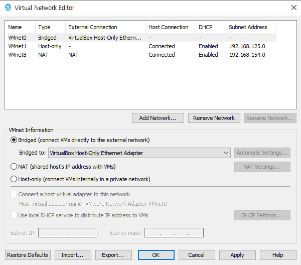
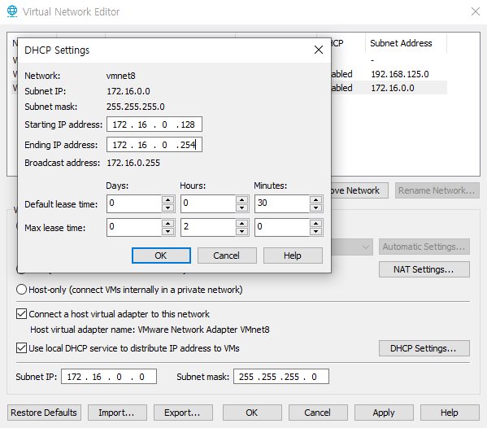
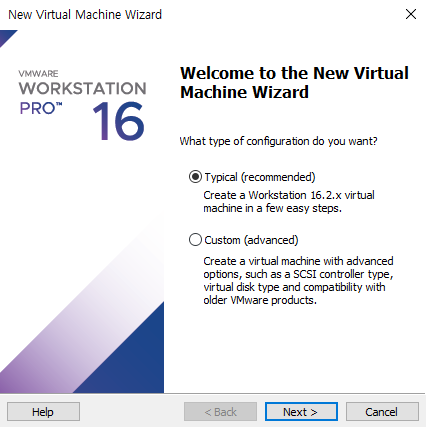
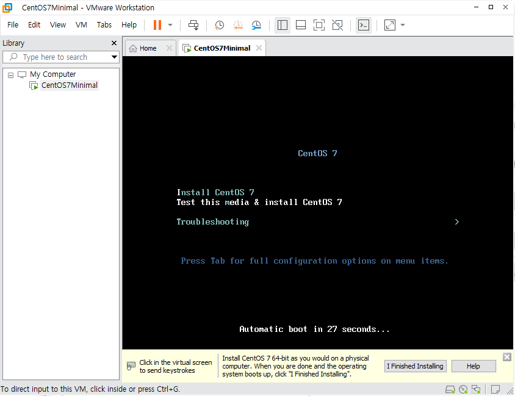

# 0426

## 1. 가상화

### 가상화란?

인스턴스를 만들기 위해 VM과 유사한 하이퍼바이저 필수!

가상화 기술을 바탕으로 클라우드 - 그 핵심 = 하이퍼바이저

* 가상화는 단일한 물리 하드웨어 시스템에서 여러 시뮤레이션 환경이나 전용 리소스를 생성할 수 있는 기술.
* 하이퍼바이저라 불리는 소프트웨어가 하드웨어에 직접 연결되며 1개의 시스템을 가상머신(VM)이라는 별도의 고유하고 안전한 환경으로 분할 가능.
* 이러한 VM은 하이퍼바이저의 기능을 사용하여 머신의 리소스를 하드웨어에서 분리한 후 적절하게 배포.
* 가상화는 기존 제품을 최대한 활용할 수 있도록 지원.
  * 호스트: 하이퍼바이저가 설치된 물리 하드웨어
  * 게스트 : 그 리소스를 사용하는 여러 VM
  * 게스트는 CPU, 메모리, 스토리지 등의 컴퓨팅 리소스를 처리하는 리소스의 풀로, 쉽게 재배치 가능
  * 운영자: 필요할 떄 필요한 리소스가 게스트에 제공될 수 있도록 CPU, 메모리, 스토리지, 기타 리소스의 가상 인스턴스를 제어 가능


## 2. 가상화 종류

> 주로 전가상화 사용


### 전가상화(Full-Virtualization)

* 게스트 OS명령이 Binary Translation 과정을 거쳐 하이퍼바이저의 중재를 통해서 하드웨어로 전달
* Binary Translation 과정에서 지연 발생


* 하드웨어 > 하이퍼바이저 > Guest OS > APP
  * APP : http ...
  * Guest OS : CentOS7
  * 하이퍼바이저 : 하드웨어의 자원을 어떻게 분배 ?
* 전가상화는 분배 과정에서 사용자 개입 X 
  * 하이퍼바이저가 하드웨어 자원을 설정한 만큼
  * 자원을 공급하는 과정이 간단
* 장점 : 편의성, 사용자 몇번 클릭만으로 가상화 가능
* 단점 : 지연


* Binary Translation = 이기종의 OS 언어들 해석 
  * 예) 윈도우 Add / 리눅스 ADD / 맥 add ... 
  * 하이퍼바이저가 '더해라'라고 각종 OS의 명령을 번역함.


### 반가상화(Para-Virtualization)

> 반은 가상/ 나머지 반은 물리

* 전가상화와 달리 Binary Translation 과정 없이 하이퍼콜(Hyper Call)이라는 인터페이스를 통해 게스트 OS 명령이 하이퍼바이저를 거쳐서 하드웨어로 전달.
* Binary Translation 과정에서 발생하는 오버헤드가 없어서 전가상화보다 빠름.
* XEN Server, Citrix...


* 각종 OS의 명령을 번역하는 번역기가 OS별로 존재.
* 번역기를 만드는데 커널 수정이 필요함
* 장점 : VM 고성능 가능
* 단점 : 번거로움


### 하드웨어 지원 가상화(Hardware-assisted Virtualization;HVM)

> CPU 자체의 가상화 기술 - Intel사의 VT-x, AMD사의 AMD-V

* 전가상화에서 성능 하락을 일으켰던 Binary Translation을 하이퍼바이저가 아닌 CPU에서 대신 처리하게 됨으로써 큰 폭의 성능이 향상됨.
* 전가상화에서 발생하는 binaray translation을 하이퍼바이저가 아닌 CPU에서 바로 처리함으로써 전가상화의 OS운영상의 장점과 반가상화의 속도라는 장점을 모두 가져옴.
* 커널의 역할을 하이퍼바이저가 대신 


## 3. 하이퍼바이저 타입

### 타입 1(native 또는 bare-metal)

> 실무용

- 운영체제가 프로그램을 제어하듯이 하이퍼바이저가 해당 하드웨어에서 직접 실행되며 게스트 운영 체제는 하드웨어 위에서 2번째 수준으로 실행됨.
  - Citrix의 Citrix Hypervisor (구 XenServer)
  - VMware의 vSphere Hypervisor (구 ESXi Server)
  - Microsoft의 Hyper-V
  - Linux의 KVM(Kernel Based Virtual Machine)
  - AWS는 Xen or KVM 하이퍼바이저 사용...


### 타입 2(hosted)

> 실습용

* 하이퍼바이저는 일반 프로그램과 같이 호스트 운영 체제에서 실행되며 VM 내부에서 동작되는 게스트 운영 체제는 하드웨어에서 3번째 수준으로 실행됨.
  * VMware Workstation Pro
  * VMware Workstation Player
  * VMware Fusion
  * 리눅스 OEMU
  * 마이크로소프트 버추얼 PC와 버추얼 서버
  * Oracle(SUN)의 버추얼박스


### 비교

* 타입 1 성능 > 타입 2 성능


## 4. VMware Workstation Pro

* VMware Workstation은 VMware사가 만든 하이퍼바이저 기반 가상머신 소프트웨어
* 현재는 x64 버전의 윈도우와 리눅스 운영 체제에서 구동됨


### 설치

* [VMware에서 다운로드](https://www.vmware.com/products/workstation-pro/workstation-pro-evaluation.html)


* 제어판\네트워크 및 인터넷\네트워크 연결
  * 이더넷 > 속성 > Bridged Networking Driver : 브릿지 담당


* Setup


* 랜카드 3개 추가됨


* bridge 기능 추가됨


* 실행


### 환경설정

* Edit > Virtual Network Editor


* Change Settings 클릭





* 서브넷 마스크 : 마스크를 씌워 고정 (172.16.0.0/255)
  * 앞에는 




### CentOS7







```
# vi /etc/sysconfig/selinux
```


### Ubuntu 


```
$ sudo apt-get update			# 저장소 선언 - KAIST

$ sudo apt-get upgrade -y	
$ sudo apt upgrade -y	
```


### Window


* 오토 리사이즈

  


* poweroff


