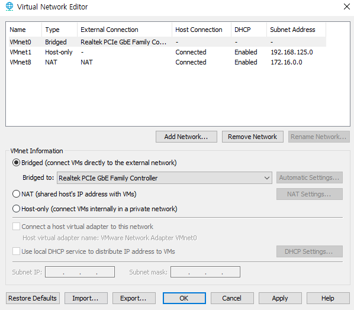
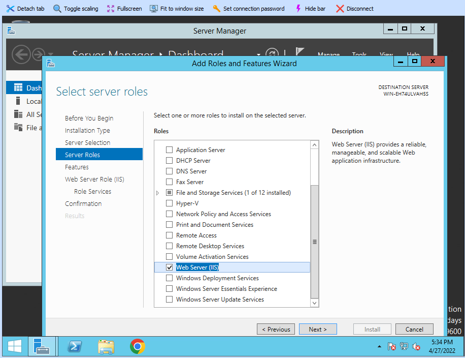

# 0427

## 구성도 수정


## 실습 전 환경설정

### 네트워크 설정



* VMnet0 :  진짜 랜카드(이더넷)의 드라이브
  * 현재 사용하고 있는 Realtek(물리) 랜카드 선택


### Mobaxterm 경로 설정


### Key 설정


### IP 대역

- 공인IP = Public IP
- 사설IP = Private IP
  - A Class	10.0.0.0 ~ 10.255.255.255
  - B Class	172.16.0.0 ~ 172.31.255.255
  - C Class	192.168.0.0 ~ 192.168.255.255
- 강의실 네트워크
  - Public Subnet
    - 192.168.0.0/24
    - 192.168.0.0 ~ 192.168.0.255 (256개 IP - 2개 = 254개)
    - 192.168.0.0				네트워크 주소(시작 IP)
    - 192.168.0.255			브로드캐스팅 주소(마지막 IP)
  - Private Subnet
    - 10.0.23.0/24
    - 10.0.23.0 ~ 10.0.23.255 (256개 IP - 2개 = 254개)
    - 10.0.23.0				네트워크 주소(시작 IP)
    - 10.0.23.255			브로드캐스팅 주소(마지막 IP)


## 실습

### NAT

#### nat 서버

* hostname  변경

```
# hostnamectl set-hostname nat
```


* 라우터 설정
  * ens33은 ip를 수동으로 만들어줘야 한다. (New File)

```
# vi /etc/sysconfig/network-scripts/ifcfg-ens32
TYPE=Ethernet
BOOTPROTO=none
NAME=ens32
DEVICE=ens32
ONBOOT=yes
IPADDR=192.168.0.218
NETMASK=255.255.255.0
GATEWAY=192.168.0.1
DNS1=8.8.8.8
DNS2=203.248.252.2
```

```
# vi /etc/sysconfig/network-scripts/ifcfg-ens33
TYPE=Ethernet
BOOTPROTO=none
NAME=ens33
DEVICE=ens33
ONBOOT=yes
IPADDR=10.0.23.1		/* 내부 라우터 ip
NETMASK=255.255.255.0	/* ip 고정하기위해 마스크
```


* 네트워크 재시작

```
# systemctl restart network
```


* IP 확인


* tab 자동완성 (bash-completion)

```
# yum install -y bash-completion
```


* 랜카드 존 설정

```
# firewall-cmd --get-active-zone
public
  interfaces: ens32 ens33
  
# nmcli c mod ens32 connection.zone external
# nmcli c mod ens33 connection.zone internal

# firewall-cmd --get-active-zone
internal
  interfaces: ens33
external
  interfaces: ens32
```


* ip forward 활성화

```
# sysctl -w net.ipv4.ip_forward=1		  # 리눅스 시스템을 라우터로
# sysctl -p								# 설정 저장
# reboot
# cat /proc/sys/net/ipv4/ip_forward
1
```


* dhcp 데몬설치

```
# yum install dhcp -y
```


* dhcpd.conf 파일 설정

```
# vi /etc/dhcp/dhcpd.conf
ddns-update-style interim;	
subnet 10.0.23.0 netmask 255.255.255.0 {				# 본인의 ip 대역 - 네트워크 지칭
option routers 10.0.23.1;
option subnet-mask 255.255.255.0;
range dynamic-bootp 10.0.23.2 10.0.23.254;				# 이론적으로는 0~255 가능, but 0: 네트워크 주소/255: 브로드캐스팅 주소/1: 라우터
option domain-name-servers 10.0.23.1, 8.8.8.8, 203.248.252.2;	 # 10.0.23.1 : ns의 IP
default-lease-time 7200;	#7200s=2h
max-lease-time 86400;		#86400s=24h
}
```


Cf) 만약 DNS 대란이 날 경우..?

* 다른 ISP의 DNS 서버를 보조 DNS로 추가

  * 구글의 DNS : 8.8.8.8 / 8.8.4.4
  * LG U+의 DNS : 203.248.252.2 (현재 강의장)

  


* enable 설정

```
# systemctl enable --now dhcpd
```


### DNS

#### nat 서버

* DNS 도구 설치(bind)

```
# yum -y install bind bind-chroot bind-utils
```


* named.conf 파일 설정
  * named 데몬의 설정파일

```
# vi /etc/named.conf
options {
        listen-on port 53 { 127.0.0.1; 192.168.0/24; 10.0.23/24; };		#NS에 접근할 IP범위(접근제어)
        listen-on-v6 port 53 { ::1; };
        directory       "/var/named";
        dump-file       "/var/named/data/cache_dump.db";
        statistics-file "/var/named/data/named_stats.txt";
        memstatistics-file "/var/named/data/named_mem_stats.txt";
        recursing-file  "/var/named/data/named.recursing";
        secroots-file   "/var/named/data/named.secroots";
        allow-query     { localhost; 192.168.0/24; 10.0.23/24; };		#쿼리할 IP범위
        forwarders { 8.8.8.8; 203.248.252.2; };

        recursion yes;

        dnssec-enable yes;
        dnssec-validation yes;

        # Path to ISC DLV key */
        bindkeys-file "/etc/named.iscdlv.key";

        managed-keys-directory "/var/named/dynamic";

        pid-file "/run/named/named.pid";
        session-keyfile "/run/named/session.key";
};

logging {
        channel default_debug {
                file "data/named.run";
                severity dynamic;
        };
};
view "internal" {
        zone "." IN {
                type hint;
                file "named.ca";
        };

        include "/etc/named.rfc1912.zones";
        include "/var/named/xeomina.shop.zones"; # 호스팅 영역 생성
};
```


- xeomina.shop.zones 파일 설정
  - DNS db 파일을 등록하는 설정 파일 - db 파일명과 경로 설정 및 동기화
    - db 파일 안에 도메인과 IP정의

```
# vi /var/named/xeomina.shop.zones
zone "xeomina.shop" IN {			#도메인을 IP로(정방향)
        type master;
        file "xeomina.shop.db";
        allow-update { none; };
};

zone "23.0.10.in-addr.arpa" IN {	#IP를 도메인으로(역방향)
        type master;
        file "23.0.10.in-addr.arpa.db";
        allow-update { none; };
};
```


* xeomina.shop.db 파일 설정

```
# vi /var/named/xeomina.shop.db
$TTL    86400
@       IN      SOA     xeomina.shop.   root.xeomina.shop.(
                        2022041401 ; Serial
                        3h         ; Refresh
                        1h         ; Retry
                        1w         ; Expire
                        1h )       ; Minimum

        IN      NS      ns.xeomina.shop.
        IN      MX 10   ns.xeomina.shop.
ns      IN      A       10.0.23.1
```


* 23.0.10.in-addr.arpa.db 파일 설정

```
# vi /var/named/23.0.10.in-addr.arpa.db
$TTL    86400
@       IN      SOA     xeomina.shop.   root.xeomina.shop.(
                        2022042701 ; Serial
                        3h         ; Refresh
                        1h         ; Retry
                        1w         ; Expire
                        1h )       ; Minimum

        IN      NS      ns.xeomina.shop.
1       IN      PTR     ns.xeomina.shop.
```


* 방화벽 설정
  * 내부에서 DNS로 접근할 수 있도록

```
# firewall-cmd --permanent --add-service=dns --zone=internal
# firewall-cmd --reload

# firewall-cmd --list-all --zone=internal
internal (active)
  interfaces: ens33
  services: dhcpv6-client dns mdns samba-client ssh
```


### IP 정리

| 이름              | OS       | IP        |
| ----------------- | -------- | --------- |
| NAT_GW_DHCP_HA_NS | CentOS7  | 10.0.23.1 |
| WEB01             | CentOS7  | 10.0.23.2 |
| DB_SMB_NFS        | CentOS7  | 10.0.23.3 |
| WEB02             | Ubuntu18 | 10.0.23.4 |
| WEB03             | Win2012  | 10.0.23.5 |


* xeomina.shop.db 파일 설정 변경

```
# vi /var/named/xeomina.shop.db
$TTL    86400
@       IN      SOA     xeomina.shop.   root.xeomina.shop.(
                        2022041401 ; Serial
                        3h         ; Refresh
                        1h         ; Retry
                        1w         ; Expire
                        1h )       ; Minimum

        IN      NS      ns.xeomina.shop.
        IN      MX 10   ns.xeomina.shop.
nat     IN      A       192.168.0.218
ns      IN      A       10.0.23.1
web01   IN      A       10.0.23.2
db      IN      A       10.0.23.3
web02   IN      A       10.0.23.4
web03   IN      A       10.0.23.5
```


* named 재시작

```
# systemctl restart named
```


* 방화벽 설정
  * 외부에서도 dns 접근가능하게
  * nat 서버에 도메인으로 접속 시도

```
# firewall-cmd --permanent --add-service=dns --zone=external
# firewall-cmd --reload
```


* 로컬 dns 서버 변경


* ip 확인


* ping 확인


### NAT

#### nat 서버

* DNS 수동설정 - 자기 자신의 도메인 설정

```
# vi /etc/sysconfig/network-scripts/ifcfg-ens32
TYPE=Ethernet
BOOTPROTO=none
NAME=ens32
DEVICE=ens32
ONBOOT=yes
IPADDR=192.168.0.218
NETMASK=255.255.255.0
GATEWAY=192.168.0.1
DNS1=10.0.23.1		#추가
DNS2=8.8.8.8
DNS3=8.8.4.4
PEERDNS=no			#추가 - 만들어놓은 DNS 최우선
PROXY_METHOD=none
BROWSER_ONLY=no
PREFIX=24
DEFROUTE=yes
IPV4_FAILURE_FATAL=no
IPV6INIT=no
UUID=152beb06-47c5-c5e8-95a9-385590654382
ZONE=external
```


* 네트워크 재시작 및 확인

```
# systemctl restart network

# cat /etc/resolv.conf
# Generated by NetworkManager
nameserver 10.0.23.1		#추가됨
nameserver 8.8.8.8
nameserver 8.8.4.4
```


* DNS 확인(역방향)

```
# dig -x 10.0.23.1	

;; ANSWER SECTION:
1.23.0.10.in-addr.arpa. 86400   IN      PTR     ns.xeomina.shop.
```


* DNS 확인(정방향)

```
# dig A web01.xeomina.shop
;; ANSWER SECTION:
web01.xeomina.shop.     86400   IN      A       10.0.23.2
```


* nslookup 도구 사용 - DNS확인

```
# nslookup web02.xeomina.shop
Server:         10.0.23.1
Address:        10.0.23.1#53

Name:   web02.xeomina.shop
Address: 10.0.23.4
```


* CNAME
  * 하나의 IP에 두개의 도메인 연결

```
$TTL    86400
@       IN      SOA     xeomina.shop.   root.xeomina.shop.(
                        2022041401 ; Serial
                        3h         ; Refresh
                        1h         ; Retry
                        1w         ; Expire
                        1h )       ; Minimum

        IN      NS      ns.xeomina.shop.
        IN      MX 10   ns.xeomina.shop.
nat     IN      A       192.168.0.218
ns      IN      A       10.0.23.1
web01   IN      A       10.0.23.2
db      IN      A       10.0.23.3
web02   IN      A       10.0.23.4
web03   IN      A       10.0.23.5
test    IN      CNAME   db			#추가
```

* named 재시작

```
# systemctl restart named
```


* ping 확인

```
# ping test.xeomina.shop
```


### 윈도우 라우팅 테이블 추가

* 라우팅 테이블에 라우팅 정보를 Add
  * route add {IP 주소} mask {서브넷 마스크} {게이트웨이}
  * IP 주소 : `10.0.23.0`
  * 서브넷 마스크 : `255.255.255.0`
  * 게이트웨이 : `192.168.0.218` (NAT GW)


```
C:\Windows\system32>route add 10.0.23.0 mask 255.255.255.0 192.168.0.218
```

* ping 확인


### 포트포워딩

- WEB01

```
# firewall-cmd --permanent --zone=external --add-forward-port=port=221:proto=tcp:toport=22:toaddr=10.0.23.2
```

- WEB02

```
# firewall-cmd --permanent --zone=external --add-forward-port=port=222:proto=tcp:toport=22:toaddr=10.0.23.4
```

- DB

```
# firewall-cmd --permanent --zone=external --add-forward-port=port=223:proto=tcp:toport=22:toaddr=10.0.23.3
```

- WEB03
  - 윈도우 원격 데스크톱 포트 : tcp = 3389 / guest = 3389 

```
# firewall-cmd --permanent --zone=external --add-forward-port=port=3389:proto=tcp:toport=3389:toaddr=10.0.23.5	
```


### 윈도우 원격 접속

* 윈도우는 ssh 대신 원격접속으로

#### web03 서버

  

* 방화벽 설정
  * Port를 허용하는 룰 생성

 


* 원격 데스크톱 포트 : 3389


* http 포트 : 80


#### 로컬 윈도우

* 원격 데스크톱 연결 검색


* NAT GW의 ip입력


* 로그인


* key 복사

```
>ssh-copy-id -p 221 -i id_rsa.pub root@192.168.0.218
>ssh-copy-id -p 222 -i id_rsa.pub xeomina@192.168.0.218	#ubuntu 사용자
>ssh-copy-id -p 223 -i id_rsa.pub root@192.168.0.218
```


* Mobaxterm에서도 RDP 가능


### DB 구축

#### db 서버

* MariaDB repository 설정

```
# vi /etc/yum.repos.d/MariaDB.repo
[mariadb]
name = MariaDB		#패키지 이름 지정
baseurl = http://yum.mariadb.org/10.4/centos7-amd64
gpgkey=https://yum.mariadb.org/RPM-GPG-KEY-MariaDB
gpgcheck=1
```

* MariaDB 설치 및 확인

```
# yum install -y MariaDB	#설정한 패키지 이름
# rpm -qa | grep MariaDB
# mariadb --version
```


* start & enable 설정

```
# systemctl enable --now mariadb
```


* secure 설정
  * `Disallow root login remotely?` : `n`으로

```
# mysql_secure_installation
```


* DB 생성 및 사용자 설정

```
# systemctl restart mariadb
# mysql -u root -p

> CREATE USER 'wpuser'@'%' IDENTIFIED BY 'kosa0401';
> CREATE DATABASE IF NOT EXISTS wordpress;
> GRANT ALL PRIVILEGES ON wordpress.* TO 'wpuser'@'%';
> EXIT
```


* 방화벽 설정

```
# firewall-cmd --permanent --add-service=mysql
# firewall-cmd --reload
```


### 웹서버 구축

* HTTPD(Hyper Text Transfer Protocol Daemon)
  * AWS Linux (apache, nginx)
  * WIN (IIS:Internet Information Services)
* web01 : apache
* web02 : nginx
* web03 : IIS

#### web01 서버 - apache

* httpd 설치

```
# yum install -y httpd
```

* start & enable 설정

```
# systemctl enable --now httpd
```

* 방화벽 설정

```
# firewall-cmd --permanent --add-service=http
# firewall-cmd --reload
```

* firewalld 확인

```
# rpm -qa | grep firewalld
# systemctl status firewalld
```


**web03에서 확인**

* Webshare에서 Chrome 다운로드


* web01.xeomina.shop 접속


#### web02 서버 - nginx

* update
  * `apt-get` : 우분투의 패키지 매니저

```
$ sudo apt-get update
```


* nginx 설치
  * 설치와 동시에 start & enable 설정됨

```
$ sudo apt-get install nginx -y
```


**web03에서 확인**

* web02.xeomina.shop 접속


#### web03 서버 - IIS

* Server 





### 로드밸런싱

#### nat 서버

* haproxy 설치

```
# yum install -y haproxy
```


* haproxy.cfg 파일 설정

```
# vi /etc/haproxy/haproxy.cfg
global
    daemon

defaults
    mode               http

frontend  http-in
    bind *:80
    default_backend    backend_servers

backend backend_servers
    balance            roundrobin
#    cookie  SVID insert indirect nocache maxlife 3m
    server             web01 10.0.23.2:80 cookie check
    server             web02 10.0.23.4:80 cookie check
    server             web03 10.0.23.5:80 cookie check
```


* start & enable

```
# systemctl enable --now haproxy
```


* 방화벽 설정

```
# firewall-cmd --list-all --zone=external
# firewall-cmd --permanent --add-service=http --zone=external
# firewall-cmd --reload
```


* 로컬 윈도우에서 nat.xeomina.shop 접속

