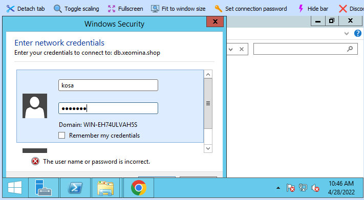

# 0428

## 웹페이지 꾸미기


### 각 OS의 html root 폴더

* CentOS HTTPD (Apache) : `/var/www/html/`
* Ubuntu Nginx : `/var/www/html/`
  * Ubuntu Docker Nginx : `/usr/share/nginx/html/`
* Window IIS : `C:\inetpub\wwwroot\`


### web01 서버

* 경로이동 / 표준 출력 재지정

```
# cd /var/www/html
# echo "<h1>WEB01</h1>" > index.html
```


**Cf) 리눅스의 입출력 재지정(redirection)**

* 기본적으로 리눅스의 표준 입력(standard input)은 키보드이고 표준 출력 (standard output)은 모니터 혹은 터미널윈도이다.

* 출력 재지정(output redirection) : 

  * 명령어의 표준 출력 내용을 모니터에 출력하는 대신에 파일에 저장하거나 다른 명령어의 입력으로 인가할 수 있다. 

  * 이때 사용되는 기호가 >와 | 이다.

    ```
    명령어 > 파일명
    ```

* 입력 재지정 (input redirection) : 

  * 명령어의 표준 입력을 키보드 대신 파일에서 받을 수 있다. 

  * 이 때 < 연산자가 이용된다.

    ```
    명령어 < 파일명
    ```

    


### web02 서버

* index.html 파일 찾기

```
$ sudo find / -name index.html
```


* 경로이동 및 index.html 파일 백업

```
$ cd /var/www/html/
$ sudo mv index.nginx-debian.html index.nginx-debian.html.bak
```


* index.html 파일 수정
  * sudo로 root처럼

 ```
 $ sudo echo "<h1>WEB02</h1>" > index.html
 ```


### web03 서버

* index.html.text 파일 생성


* 내용 입력


* 확장자 .html로 변경


### nat 페이지 확인


## HAproxy 설정

### nat 서버

* haproxy.cfg 파일 설정

```
global
    daemon
defaults
    mode               http
frontend  http-in
    bind *:80
    default_backend    backend_servers
backend backend_servers
    balance            roundrobin
    cookie  SVID insert indirect nocache maxlife 10s
    server             web01 10.0.23.2:80 cookie w1 check
    server             web02 10.0.23.4:80 cookie w2 check
    server             web03 10.0.23.5:80 cookie w3 check
```

**세부 사항**

* layer
  * 총 7개의 레이어 중 로드밸런서는 L7, L4 두개
    * L7(Application Layer) : Application 계층을 사용, 요청(URL) 기반 부하 분산
    * L4(Transport Layer) : Transport Layer(IP+Port) Load Balancing
    * TCP, UDP Protocol
    * 장점 : Port기반 스위칭 지원, VIP를 이용하여 여러대를 한대로 묶어 부하분산

```
mode               http		#http : L7(Application Layer) S/W (상위)
	               tcp		#tcp  : L4(Transport Layer) S/W (하위)
```

* frontend / backend

```
frontend  http-in			# front 이름 : http-in (변경 가능) 
    bind *:80				# *: 접근제어에서 anywhere의 의미 / 80 port(default)
    default_backend    backend_servers	# back에서 정의한 backend_servers로 연결

backend backend_servers			# back 이름 : backend_servers
    balance            roundrobin	# 로드밸런서 알고리즘 : roundrobin(서버에 순차적으로 접근)
```


로그인 버튼 누를떄마다 다른 서버로 세션 바뀜 -> 하나의 서버에 일정시간 동안은 머물러야 함 -> 고정 세션

* 쿠키 이름 지정
* 고정세션으로 만들기 위해 쿠키를 구울때 이름 지정 -> 클라이언트

```
    cookie  SVID insert indirect nocache maxlife 10s		# sticky sesstion(고정세션)
    server             web01 10.0.23.2:80 cookie w1 check	# w1
    server             web02 10.0.23.4:80 cookie w2 check
    server             web03 10.0.23.5:80 cookie w3 check
```


## 클라우드 3대 Storage

* 파일 스토리지(File Storage), 블록 스토리지(Block Storage), 오브젝트 스토리지(Object Storage)

### 파일 스토리지(File Storage)

> 네트워크 폴더 공유(mount), 파일공유 - AWS EFS(Elastic File Storage)


- 파일 스토리지는 데이터를 폴더 안에 단일 정보로 저장한다.
- 파일에 저장된 데이터는 제한된 양의 메타데이터(해당 파일 자체가 보관된 정확한 위치를 알려주는 데이터)를 사용해 구성 및 검색된다. 
- 장점 : 파일 스토리지는 기능이 다양하며 거의 모든 것을 저장할 수 있다. 다수의 복잡한 파일을 저장하기에 좋고 사용자가 신속하게 탐색할 수 있다.
- 단점 : 파일 기반 스토리지 시스템은 더 많은 용량을 추가해 확장하는 것이 아닌, 더 많은 시스템을 추가해 스케일 아웃해야 한다.

### 블록 스토리지(Block Storage)

> OS 설치, App 설치 - AWS EBS(Elastic Block Store)


- 블록 스토리지는 데이터를 별도의 조각으로 분리해 저장한다. 
- 각 데이터 블록은 고유 식별자를 부여받는데, 이는 스토리지 시스템이 더 작은 데이터 조각을 원하는 곳에 배치할 수 있도록 한다. 
- 데이터가 요청되면 기본 스토리지 소프트웨어가 데이터 블록을 다시 조합해 사용자에게 제공한다. 
- 장점 : 블록 스토리지는 단일 데이터 경로에 의존하지 않으므로 신속하게 검색 가능하다. 각 블록은 독립적으로 존재하며 파티션으로 분할될 수 있어, 서로 다른 운영 체제에 액세스할 수 있다. 이는 데이터를 효율적이고 안정적으로 저장하는 방법이며 사용과 관리도 간편하다. 
- 단점 : 블록 스토리지는 비용이 많이 든다. 메타데이터를 처리하는 기능이 제한적이므로, 애플리케이션 또는 데이터베이스 수준에서 취급해야 하기 때문에 개발자나 시스템 관리자의 업무 부담이 증가한다.

### 오브젝트 스토리지(Object Storage)

> Webshare, url 파일 공유(링크), http서버 탑재 - AWS S3(Simple Storage Service)


- 오브젝트 스토리지는 파일들이 작게 나뉘어 여러 하드웨어에 분산되는 평면적(flat) 구조이다. 
- 오브젝트 스토리지에서 데이터는 오브젝트라 불리는 개별 단위로 나뉘며, 서버의 블록이나 폴더에 파일을 보관하는 대신 단일 리포지토리에 보관된다.
- 오브젝트 스토리지 볼륨은 모듈 단위로 동작한다. 각각은 독립적인 리포지토리이며 데이터, 오브젝트가 분산 시스템에 존재하도록 허용하는 고유 식별자, 그리고 해당 데이터를 설명하는 메타데이터를 보유한다. 
- 데이터를 검색하기 위해 스토리지 운영 체제는 메타데이터와 식별자를 사용하고, 로드를 보다 효율적으로 배포하여 관리자가 보다 강력한 검색 수행 정책을 적용하도록 한다.
- 장점 : 오브젝트 스토리지에 사용되는 HTTP API는 대부분의 클라이언트에서 모든 언어로 사용된다. 사용한 만큼만 비용을 지불하면 되므로 비용 효율적이다. 확장하기도 쉬우므로 퍼블릭 클라우드 스토리지에 적합하다. 오브젝트에는 충분한 양의 정보가 있어서 애플리케이션이 신속하게 데이터를 검색 가능하다.
- 단점 : 오브젝트는 수정이 불가능해서 오브젝트 작성을 한번에 완료해야 한다. 오브젝트 스토리지는 전통적인 데이터베이스와 잘 연동되지 않는다. 


## SAMBA

### db 서버

* samba 설치

```
# yum install -y samba
```

* share 폴더 생성 및 권한 설정

```
# mkdir -p /var/samba/share
# chmod 777 /var/samba/share
```

* 리눅스 사용자 생성

```
# adduser kosa
# passwd kosa
New password:koda0401
```

* 삼바에서 리눅스 사용자 이용할 수 있도록 passwd 지정

```
# smbpasswd -a kosa
```

* smb.conf 설정

```
# vi /etc/samba/smb.conf
[global]
        workgroup = SAMBA	  # 설정 변경 안해도 됨
        
[share]						# 추가
        comment = Share Directory
        path = /var/samba/share
        browserable = yes
        writable = yes
        valid users = kosa
        create mask = 0777
        directory mask = 0777
```

* start & enable

```
# systemctl enable --now smb nmb
```

* 방화벽 설정
  * `zone=public` : 랜카드 하나 > internal/external zone 구분 안해도 됨 > public 생략가능(default)

```
# firewall-cmd --permanent --add-service=samba --zone=public
# firewall-cmd --reload
```


### web03 서버 (클라이언트)

* ping 확인


* samba 접속

```
\\db.xeomina.shop
```


* samba 사용자 로그인



* share 폴더 확인


* 워드프레스 다운로드


* share 폴더에 워드프레스 파일 넣기


### db 서버

* share 폴더안에 워드프레스 파일 확인

```
# cd /var/samba/share/
# ls
wordpress-5.9.3-ko_KR.zip
```


## NFS

### db 서버

* nfs 설치

```
# yum install -y nfs-utils
```

* share 폴더 생성 및 이동
  * 최상위폴더(`/`) 밑에 생성

```
# mkdir /share && cd $_	
```

* samba의 워드프레스 파일 복사
  * 현재폴더(`.`)로

```
# cp /var/samba/share/wordpress-5.9.3-ko_KR.zip .
# ls
wordpress-5.9.3-ko_KR.zip
```

* share 폴더 접근제어
  * nfs는 주로 로컬에서 이용
  * 접근 가능한 내부 ip범위 정의

```
# vi /etc/exports
/share 10.0.23.0/24(rw,sync)
/share *(rw,sync)			# *: anywhere
```

* 권한 설정

```
# chmod 707 /share
```

* start & enable

```
# systemctl enable --now nfs-server
```

* fs 확인
  * sync, rw 외는 default

```
# exportfs -v
/share          <world>(sync,wdelay,hide,no_subtree_check,sec=sys,rw,secure,root_squash,no_all_squash)
```

* 방화벽 설정

```
# firewall-cmd --permanent --add-service=nfs
# firewall-cmd --permanent --add-service=rpc-bind
# firewall-cmd --permanent --add-service=mountd
# firewall-cmd --reload
```


### nat / web01서버 (클라이언트 )

> CentOS

* nfs 설치

```
# yum install -y nfs-utils
```

* 공유가능한 디렉토리 확인
  * nfs 서버와 mount 가능한지..

```
# showmount -e db.xeomina.shop
Export list for db.xeomina.shop:
/share *
```

* share 폴더 생성

```
# mkdir share
```

* 마운트

```
# mount -t nfs db.xeomina.shop:/share /root/share
```

* 마운트 확인

```
# df -h
Filesystem               Size  Used Avail Use% Mounted on
devtmpfs                 899M     0  899M   0% /dev
tmpfs                    910M     0  910M   0% /dev/shm
tmpfs                    910M  9.5M  901M   2% /run
tmpfs                    910M     0  910M   0% /sys/fs/cgroup
/dev/mapper/centos-root   97G  1.5G   96G   2% /
/dev/sda1               1014M  195M  820M  20% /boot
tmpfs                    182M     0  182M   0% /run/user/0
db.xeomina.shop:/share    97G  2.0G   96G   2% /root/share
```

* share 폴더 확인

```
# ls share/
wordpress-5.9.3-ko_KR.zip
```

* fstab 파일 설정
  * fstab : 파일 시스템에 대한 정보를 고정적으로 저장
  * 시스템이 부팅될 때 자동으로 마운트하도록 설정

```
# cp /etc/fstab /etc/fstab.bak
# echo "db.xeomina.shop:/share /root/share nfs defaults 0 0" >> /etc/fstab
```

### web02 서버 (클라이언트)

> Ubuntu

* nfs 설치

```
$ sudo apt-get update
$ sudo apt-get install -y nfs-common
```

* 마운트
  * CentOS와 경로 다름

```
$ sudo mount -t nfs db.xeomina.shop:/share /home/xeomina/share
```

* 마운트 및 share 폴더 확인

```
$ df -h
$ ls share/
```

* fstab 파일 설정

```]
$ sudo cp /etc/fstab /etc/fstab.bak

$ sudo vi /etc/fstab
db.xeomina.shop:/share /home/xeomina/share nfs defaults 0 0
```


### web03 서버 (클라이언트)

> Window 2012

* Control Panel > Turn Windows features on or off


* Client for NFS 설치


* 관리자 권한으로 명령 프롬프트 실행


* ping 확인

```
> ping db.xeomina.shop
```


* 마운트

```
> mount db.xeomina.shop:/share z:\
```


* 마운트 확인


* 파일 확인


## 워드프레스 설치

> 각 서버에 접속하기 전 nat에서 다른 서버 주석처리 하기


### web01 서버

* remi 저장소 설치
  * 가장 최신의 LAMP(Linux, Apache, MySQL, PHP) 기반의 스택을 제공하는 외부 yum repository
  * php 을 버전별로 나뉘어서 제공하므로 한 서버에 다양한 버전의 php를 같이 사용 가능

```
# yum -y install http://rpms.remirepo.net/enterprise/remi-release-7.rpm
```

* 기타 패키지 설치
  * EPEL(Extra Package for Enterprise Linux)

```
# yum -y install epel-release yum-utils
```

* configmanager 로 remi-php74 사용

```
# yum-config-manager --enable remi-php74
```

* php 설치
  * 7.4 버전으로

```
# yum install -y httpd php php-mysql php-gd php-mbstring wget unzip
```

* 경로 이동 및 워드프레스 압축 풀기

```
# cd /var/www/html
# unzip /root/share/wordpress-5.9.3-ko_KR.zip
# ls
index.html  wordpress
```

* wordpress안의 파일 현재 경로로 이동

```
# mv wordpress/* .
# ls
index.html   wp-activate.php       wp-content         wp-login.php      xmlrpc.php
index.php    wp-admin              wp-cron.php        wp-mail.php
license.txt  wp-blog-header.php    wp-includes        wp-settings.php
readme.html  wp-comments-post.php  wp-links-opml.php  wp-signup.php
wordpress    wp-config-sample.php  wp-load.php        wp-trackback.php
```

* apache에게 소유권 부여

```
# chown -R apache:apache /var/www/*
```

* index.html 변경

```
# mv index.html index.html.bak
```

* httpd 재시작

```
# systemctl restart httpd
```


#### nat 서버

* 쿠키 설정 변경
  * web01 빼고 주석처리

```
# vi /etc/haproxy/haproxy.cfg
backend backend_servers
    balance            roundrobin
    cookie  SVID insert indirect nocache maxlife 10m
    server             web01 10.0.23.2:80 cookie w1 check
#    server             web02 10.0.23.4:80 cookie w2 check
#    server             web03 10.0.23.5:80 cookie w3 check
```

* haproxy 재시작

```
# systemctl restart haproxy
```


* 워드프레스 접속


### web02 서버

[Ubuntu에서 워드프레스 설치하기](https://www.journaldev.com/25670/install-wordpress-nginx-ubuntu)

* nginx 설치

```
$ sudo apt update && sudo apt upgrade -y
$ sudo apt install -y nginx
```

* php 설치
  * 7.2 버전

```
$ sudo apt install -y php7.2 php7.2-fpm php7.2-mysql php7.2-mbstring php7.2-gd wget unzip
```

* public_html 폴더 생성

```
$ sudo mkdir -p /var/www/html/wordpress/public_html
```

* 경로이동
  * sites-available 폴더

```
$ cd /etc/nginx/sites-available
```

* wordpress.conf 파일 설정
  * 나만의 웹서버를 위한 conf 파일

```
$ sudo vi wordpress.conf
server {
            listen 80;
            root /var/www/html/wordpress/public_html;
            index index.php index.html;
            server_name nat.xeomina.shop;	#수정
            access_log /var/log/nginx/SUBDOMAIN.access.log;
            error_log /var/log/nginx/SUBDOMAIN.error.log;

            location / {
                         try_files $uri $uri/ =404;
            }

            location ~ \.php$ {
                         include snippets/fastcgi-php.conf;
                         fastcgi_pass unix:/run/php/php7.2-fpm.sock;
            }
            
            location ~ /\.ht {
                         deny all;
            }

            location = /favicon.ico {
                         log_not_found off;
                         access_log off;
            }

            location = /robots.txt {
                         allow all;
                         log_not_found off;
                         access_log off;
           }
       
            location ~* \.(js|css|png|jpg|jpeg|gif|ico)$ {
                         expires max;
                         log_not_found off;
           }
}
```

* nginx 상태 확인

```
$ sudo nginx -t
nginx: the configuration file /etc/nginx/nginx.conf syntax is ok
nginx: configuration file /etc/nginx/nginx.conf test is successful
```

* 경로이동
  * sites-enabled

```
$ cd /etc/nginx/sites-enabled
$ ls
default
```

* wordpress.conf 파일 심볼릭 링크 생성
  * `ln -s [원본 파일 또는 디렉토리] [심볼릭 링크 이름]`
  * available 한 설정파일이 enabled 되는 과정

```
$ sudo ln -s ../sites-available/wordpress.conf .
```

* 심볼릭 링크 확인

```
$ ls -al
total 8
drwxr-xr-x 2 root root 4096 Apr 28 16:31 .
drwxr-xr-x 8 root root 4096 Apr 28 16:11 ..
lrwxrwxrwx 1 root root   34 Apr 27 17:23 default -> /etc/nginx/sites-available/default
lrwxrwxrwx 1 root root   33 Apr 28 16:31 wordpress.conf -> ../sites-available/wordpress.conf
```

* nginx 재시작

```
$ sudo systemctl reload nginx
```

* 경로이동 및 워드프레스 다운/압축 풀기
  * 최신버전

```
$ cd /var/www/html/wordpress/public_html
$ sudo wget https://ko.wordpress.org/latest-ko_KR.zip
$ sudo unzip latest-ko_KR.zip
$ ls
latest-ko_KR.zip  wordpress
```

* wordpress안의 파일을 현재 경로로 이동

```
$ sudo mv wordpress/* .
$ ls
index.php         wp-activate.php       wp-content         wp-login.php      xmlrpc.php
latest-ko_KR.zip  wp-admin              wp-cron.php        wp-mail.php
license.txt       wp-blog-header.php    wp-includes        wp-settings.php
readme.html       wp-comments-post.php  wp-links-opml.php  wp-signup.php
wordpress         wp-config-sample.php  wp-load.php        wp-trackback.php
```

* www-data에게 소유권 및 권한 부여
  * [nginx의 사용자] : [그룹명]

```
$ sudo chown -R www-data:www-data *
$ sudo chmod -R 755 *
```

* nginx 재시작

```
$ sudo systemctl restart nginx
```


#### nat 서버

* 쿠키 설정 변경
  * web02 빼고 주석처리

```
# vi /etc/haproxy/haproxy.cfg
backend backend_servers
    balance            roundrobin
    cookie  SVID insert indirect nocache maxlife 10m
#    server             web01 10.0.23.2:80 cookie w1 check
    server             web02 10.0.23.4:80 cookie w2 check
#    server             web03 10.0.23.5:80 cookie w3 check
```

* haproxy 재시작

```
# systemctl restart haproxy
```


* 워드프레스 접속


### web03 서버

* IIS Manager > WIN-EH74ULVAH5S 클릭


* Web Platform Installer 다운로드


* Web Platform Installer 설치

  

* Server Manager > Tools > IIS Manager


* Web Platform Installer 클릭


* php 7.4 설치


* 워드프레스 파일 경로 이동
  * `C:\inetpub\wwwroot`


* 기존 index 파일 변경
  * iisstart.htm.bak
  * index.html.bak


* 워드프레스 파일 압축 해제


#### web01 서버

* web01에서 wp-config.php파일 옮겨오기
* share 폴더 이용

```
# cp wp-config.php /root/share/
```


### web03 서버

* share 폴더에서 wp-config.php 파일 확인


* wp-config.php 파일 이동
  * `C:\inetpub\wwwroot`


* 워드프레스 접속


### nat 서버

* haproxy.cfg 파일 설정
  * wp-conf.php 동기화 > 고정세션 필요x
  * 쿠키 주석처리 및 web 서버 모두 열어주기

```
# vi /etc/haproxy/haproxy.cfg
backend backend_servers
    balance            roundrobin
#    cookie  SVID insert indirect nocache maxlife 10m
    server             web01 10.0.23.2:80 cookie w1 check
    server             web02 10.0.23.4:80 cookie w2 check
    server             web03 10.0.23.5:80 cookie w3 check
```

* haproxy 재시작

```
# systemctl restart haproxy
```


### 워드프레스 설치완료

* web01,02,03 동기화

