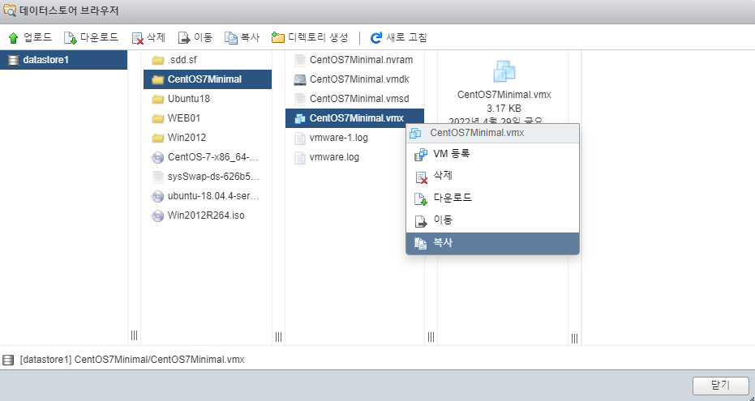
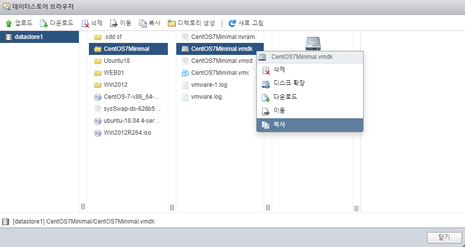
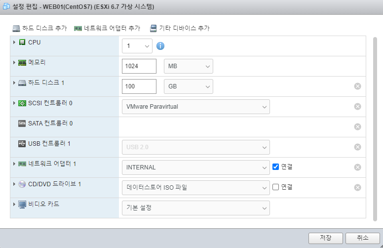
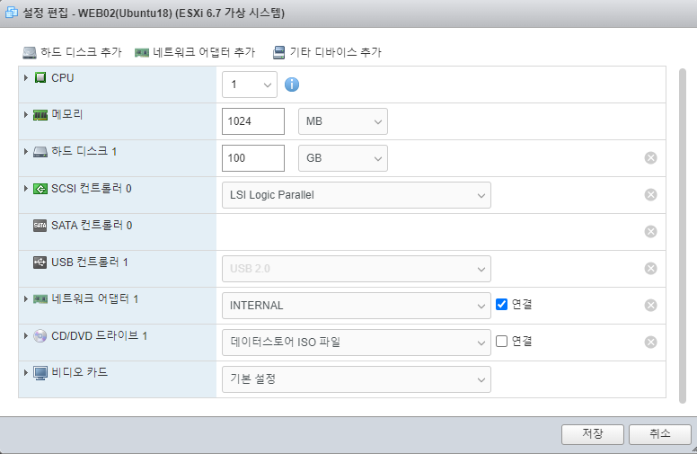

# 0429

## L7 기능 구현

* HAproxy가 접속자 환경 분석까지...


### web01 서버

* 경로이동

```
# cd /var/log/httpd
```


* 접속에 대한 로그 데이터

```
# cat access_log
0.0.23.1 - - [29/Apr/2022:18:25:21 +0900] "GET / HTTP/1.1" 200 53817 "-" "Mozilla/5.0 (Windows NT 10.0; Win64; x64) AppleWebKit/537.36 (KHTML, like Gecko) Chrome/100.0.4896.127 Safari/537.36"


10.0.23.1 - - [29/Apr/2022:18:25:57 +0900] "GET /favicon.ico HTTP/1.1" 404 209 "http://nat.xeomina.shop/" "Mozilla/5.0 (Windows NT 10.0; Win64; x64; rv:99.0) Gecko/20100101 Firefox/99.0"

10.0.23.1 - - [29/Apr/2022:18:48:06 +0900] "GET / HTTP/1.1" 200 53871 "-" "Mozilla/5.0 (iPhone; CPU iPhone OS 15_3 like Mac OS X) AppleWebKit/605.1.15 (KHTML, like Gecko) CriOS/100.0.4896.85 Mobile/15E148 Safari/604.1"
```


[HTTP Header](https://developer.mozilla.org/en-US/docs/Web/HTTP/Headers/User-Agent)

* User-agent : 접속자들의 정보 걸러서 ? 포워드 ?

### nat 서버

```
# cd /etc/haproxy/
# cp haproxy.cfg haproxy.cfg.bak2

#  vi /etc/haproxy/haproxy.cfg
global
    daemon

defaults
    mode               http

frontend  http-in
    bind *:80	# L4 S/W (TCP Port)
    acl firefox hdr_sub(User-Agent) Firefox	# acl : access control list(접근 제어 목록)
    acl trident hdr_sub(User-Agent) Trident	# L7 S/W (Content S/W)
    default_backend    backend_servers		# 조건에 맞지않는 서버는 default_backend
    use_backend bk_firefox if firefox
    use_backend bk_trident if trident

backend backend_servers
    balance            roundrobin
#    cookie  SVID insert indirect nocache maxlife 10s
    server             web01 10.0.23.2:80 cookie w1 check
    server             web02 10.0.23.4:80 cookie w2 check
    server             web03 10.0.23.5:80 cookie w3 check

backend bk_firefox
    server             web01 10.0.23.2:80
backend bk_trident
    server             web02 10.0.23.4:80
```


* 웹서버에서 php파일 말고 html 파일이 index로 되도록


* firefox


* Internet explorer


* Chrome은 web01,02,03


## ESXi 

* 프라이빗(ESXi ,Openstack), 퍼블릭(AWS, Azure, GCP, Alibaba) 클라우드 융복합 멀티 클라우드 설계 및 구축


* 중첩된 가상화


### 새 가상머신 생성

* VMware_EXSi.iso 이미지 사용


*  Customize Hardware


### ESXi 사양

* CPU : 4C
* RAM : 10G(10240MB)
* SSD : 128G
* NET : Bridge
* IMG : VMware_ESXi.iso


### CPU 가상화(HVM)

* Intel : VT-x
* AMD : AMD-V


### VM 실행

* 용량


* pwd : Test1234!


* install


* 192.168.0.241 접속
  * 호스트 ESXi의 관리 ip 주소
  * 하이퍼바이저


### ntp 추가


### iso 업로드


### 가상머신 생성

* VM CentOS 사양
  * CPU : 1C
  * RAM : 1G(10240MB)
  * SSD : 100G
  * NET : VM Network(Bridge)
  * IMG : CentOS7Minimal.iso


* 프로비저닝
  * thin : 동적할당 - 실제 크기는 2M ~ 1G, 최대 가상 크기 100G
  * thick : 고정크기 - 실제 크기 100G(점유)


* VM Ubuntu 사양
  * CPU : 1C
  * RAM : 1G
  * SSD : 100G
  * NET : VM Network(Bridge)
  * IMG : Ubuntu18.iso


VM Window사양

* CPU : 1C
* RAM : 2G
* SSD : 100G
* NET : VM Network(Bridge)
* IMG : Window2012.iso


### 망도


- 내부/외부 스위치의 가교 역할 = NAT
- W1,2,3 - 내부 스위치와 연결


### 가상 스위치 추가

* 네트워킹 > 가상 스위치
* vSwitch 1


### 포트설정

* 네트워킹 > 포트 그룹
* EXTERNAL / INTERNAL


### VM 복제 

* 스토리지 > 데이터스토어 > 데이터스토어 브라우저
* 디렉토리 생성


* vmx / vmdk 파일 복사






### 네트워크 변경

* NAT GW
  * EXTERNAL / INTERNAL 2개


* WEB01/WEB02/WEB03/DB
  * WEB01/WEB02/DB : 아직 ip 못받음
  * 윈도우(WEB03)는 169.254. 대역 - 윈도우의 ip





