# 0502

## 프로젝트 개요

- 실무 기초 : 인프라 [운영체제(리눅스, 윈도우), 서버(WEB, DNS, DB, SAMBA, NFS), 네트워크(NAT; 라우터, DHCP; IP 자동부여, HAProxy; L4, L7 S/W)]

- 실무 심화 : 가상화 [하이퍼바이저 타입 1 (ESXi)], 프라이빗 클라우드 [Openstack], 언어 [파이썬, 고언어], 퍼블릭 클라우드 [AWS, Azure, GCP, Alibaba], 클라우드 보안

- 실무 특화 : 자동화도구 [Terraform, Ansible], 컨테이너 기술 [Docker, Kubernetes], CI/CD [Jenkins, Gitlab, AWS CodeCommit, CodeBulid], CodePipeline]

- 2차 세미 프로젝트 과제명 : 프라이빗 클라우드(ESXi, Openstack)와 퍼블릭 클라우드(AWS, Azure, GCP, Alibaba)를 융복합한 멀티클라우드 설계 및 구축

- 최종 프로젝트 과제명 : 애자일 개발 환경을 위한  DevOps CI/CD 파이프라인 자동화 프로젝트


### 망도

* 물리랜카드 - 업링크

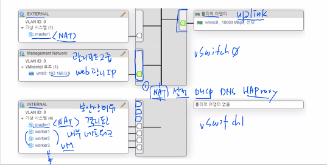


### Moba - key 접속

```
> cd .ssh
> ssh-copy-id -i id_rsa.pub root@192.168.0.43
```

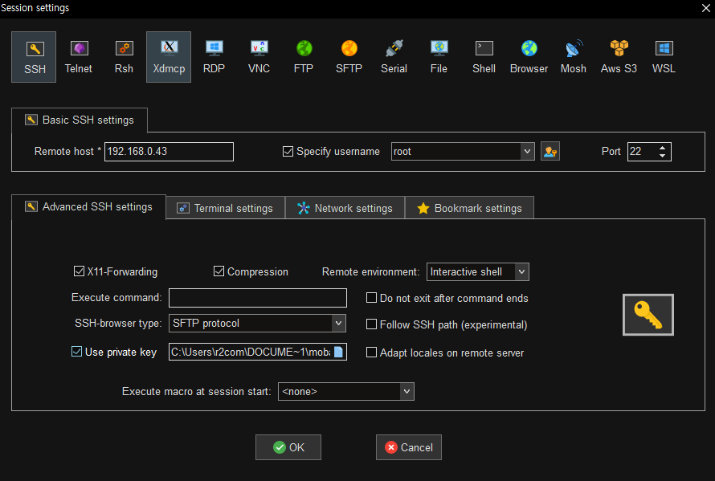

```
#  hostnamectl set-hostname nat
```


## 1. Router 

* IP 공유기 - AWS VPC NAT GateWay

> NAT 서버

### ip 고정

```
# vi /etc/sysconfig/network-scripts/ifcfg-ens192
TYPE=Ethernet
BOOTPROTO=none
NAME=ens192
DEVICE=ens192
ONBOOT=yes
IPADDR=192.168.0.43
NETMASK=255.255.255.0
GATEWAY=192.168.0.1
DNS1=8.8.8.8
DNS2=8.8.4.4
```

```
# vi /etc/sysconfig/network-scripts/ifcfg-ens224
TYPE=Ethernet
BOOTPROTO=none
NAME=ens224
DEVICE=ens224
ONBOOT=yes
IPADDR=10.0.23.1
NETMASK=255.255.255.0
```

```
# systemctl restart network
```


### 자동완성

```
# yum install -y bash-completion
```


### 랜카드 존 설정

```
# nmcli c mod ens192 connection.zone external
# nmcli c mod ens224 connection.zone internal
# firewall-cmd --get-active-zone
```


### ip 포워드

```
# sysctl -w net.ipv4.ip_forward=1 # 리눅스 시스템을 라우터로 만드는 셋팅
# sysctl -p # 설정 저장
# cat /proc/sys/net/ipv4/ip_forward
1
```


## 2. DHCP

* 동적 호스트 구성 프로토콜 (Dynamic Host Configuration Protocol; DHCP)

> NAT 서버

### dhcp 설치

```
# yum install dhcp -y
```

### dhcpd.conf 파일 설정

```
# vi /etc/dhcp/dhcpd.conf
ddns-update-style interim;
subnet 10.0.23.0 netmask 255.255.255.0 {
option routers 10.0.23.1;
option subnet-mask 255.255.255.0;
range dynamic-bootp 10.0.23.2 10.0.23.254;
option domain-name-servers 10.0.23.1, 8.8.8.8, 203.248.252.2;
default-lease-time 7200;
max-lease-time 86400;
}
```

### start & enable

```
# systemctl enable --now dhcpd
```

### ip 확인

- WEB01 : 10.0.23.3
- WEB02 : 10.0.23.2
- WEB03 : 10.0.23.5
- DB : 10.0.23.4

### 포트포워딩

* WEB01 : 192.168.0.43:221 > 10.0.23.3:22
* WEB02 : 192.168.0.43:222 > 10.0.23.2:22
* DB : 192.168.0.43:223 > 10.0.23.4:22

```
# firewall-cmd --permanent --zone=external --add-forward-port=port=221:proto=tcp:toport=22:toaddr=10.0.23.3
# firewall-cmd --permanent --zone=external --add-forward-port=port=222:proto=tcp:toport=22:toaddr=10.0.23.2
# firewall-cmd --permanent --zone=external --add-forward-port=port=223:proto=tcp:toport=22:toaddr=10.0.23.4
# firewall-cmd --permanent --zone=external --add-forward-port=port=3306:proto=tcp:toport=3306:toaddr=10.0.23.4		#unknown port 외부 3306 > 내부 3306	- mariadb
# firewall-cmd --permanent --zone=external --add-forward-port=port=3389:proto=tcp:toport=3389:toaddr=10.0.23.5		#unknown port 외부 3389 > 내부 3389 - rdp

# firewall-cmd --reload
```


### 포트 확인

```
# firewall-cmd --list-all --zone=external
  forward-ports: port=221:proto=tcp:toport=22:toaddr=10.0.23.3
        port=222:proto=tcp:toport=22:toaddr=10.0.23.2
        port=223:proto=tcp:toport=22:toaddr=10.0.23.4
        port=3389:proto=tcp:toport=3389:toaddr=10.0.23.5
        port=3306:proto=tcp:toport=3306:toaddr=10.0.23.4
  source-ports:
```


### key 복사

```
ssh-copy-id -p 221 -i id_rsa.pub root@192.168.0.43
ssh-copy-id -p 222 -i id_rsa.pub xeomina@192.168.0.43
ssh-copy-id -p 223 -i id_rsa.pub root@192.168.0.43
```


### WEB01 서버

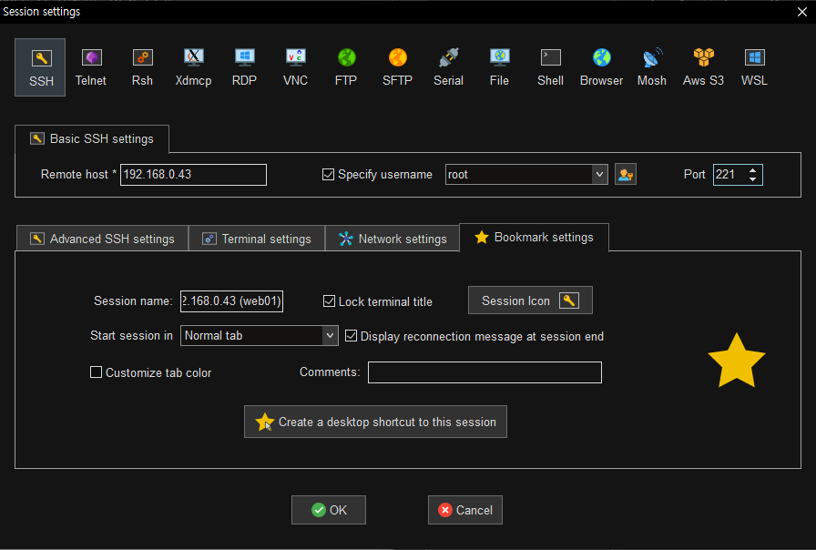

```
#  hostnamectl set-hostname web01
```


### WEB02 서버

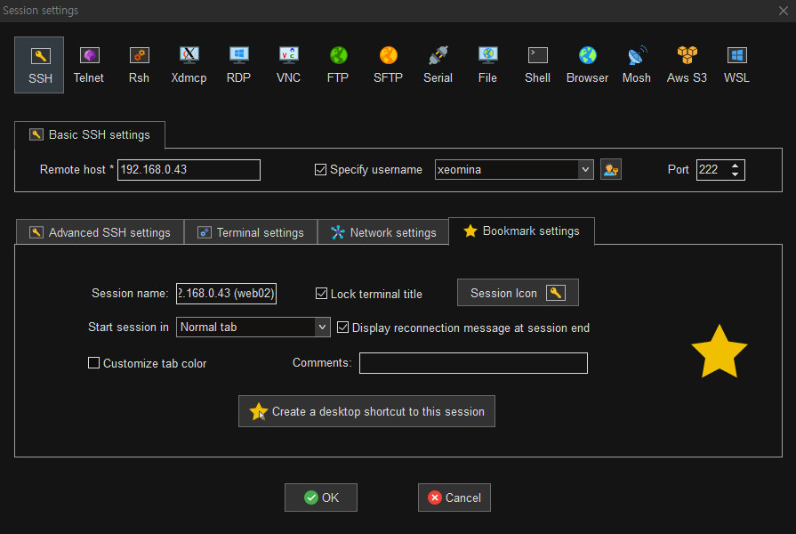

```
$ sudo hostnamectl set-hostname web02
```


### DB 서버

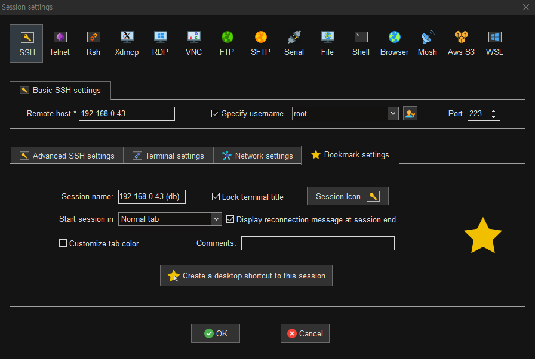

```
# hostnamectl set-hostname db
```


### WEB03 서버

* 원격 접속 허용

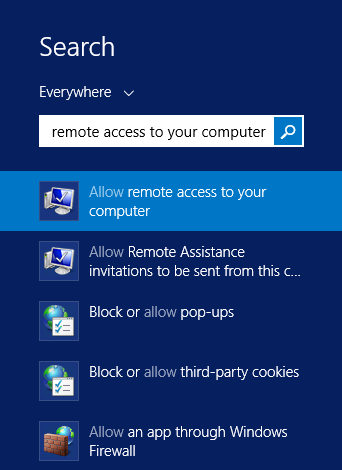


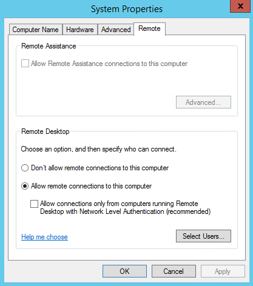

* RDP(Remote Desktop Protocol) 3380 port 방화벽 설정

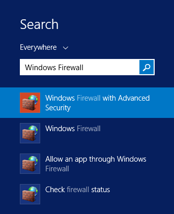

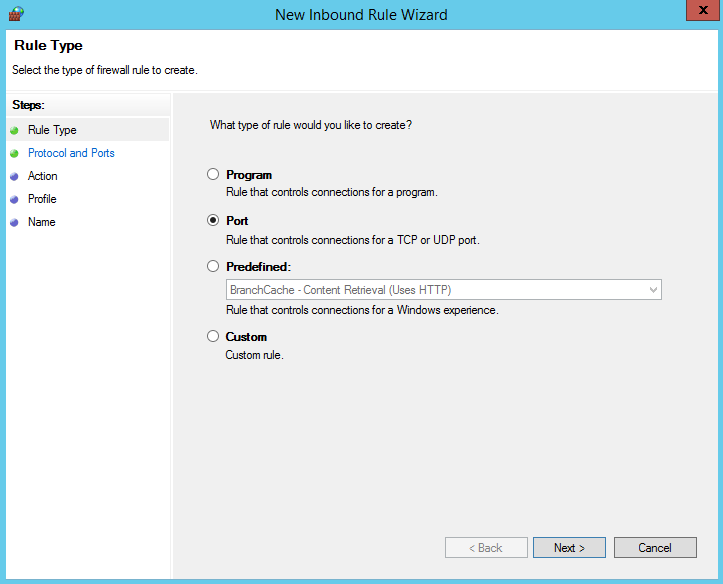

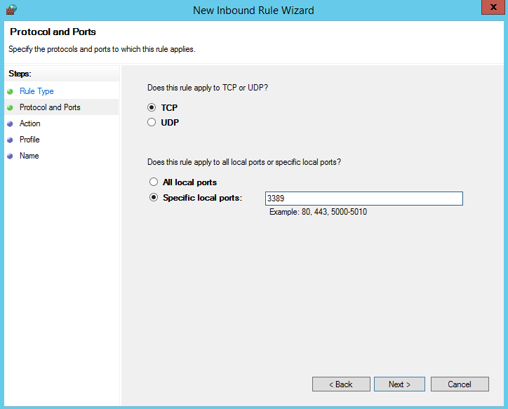

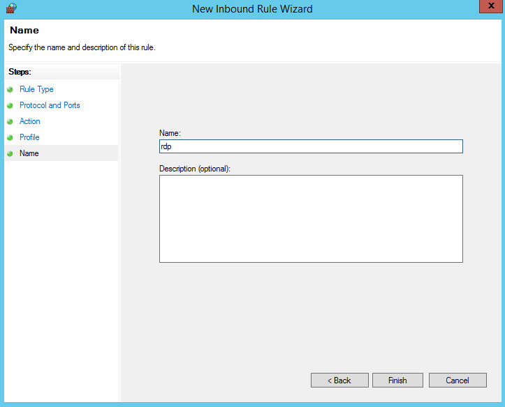

* HTTP(Hyper Text Transfer Protocol) 80 port 방화벽 설정

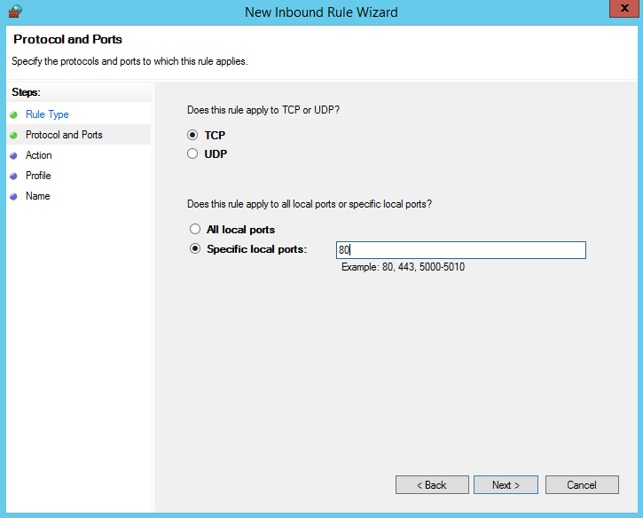

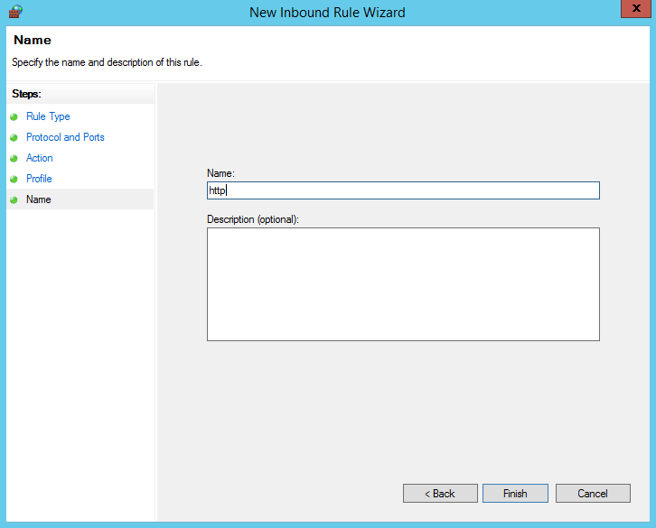

* RDP

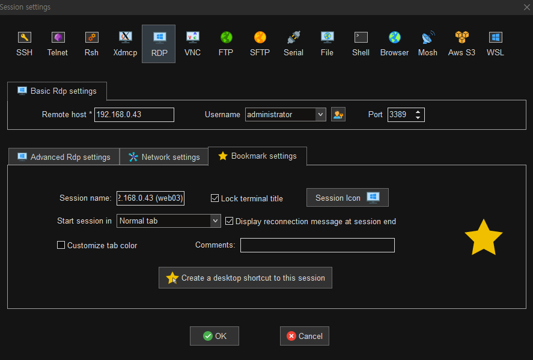


## 3. DNS

* 도메인 네임 시스템 (Domain Name System; DNS) - AWS Route53

> NAT 서버

### bind 설치

```
# yum -y install bind bind-chroot bind-utils
```

### named.conf 파일 설정

```
# vi /etc/named.conf
options {
        listen-on port 53 { 127.0.0.1; 192.168.0/24; 10.0.23/24; };
        listen-on-v6 port 53 { ::1; };
        directory       "/var/named";
        dump-file       "/var/named/data/cache_dump.db";
        statistics-file "/var/named/data/named_stats.txt";
        memstatistics-file "/var/named/data/named_mem_stats.txt";
        recursing-file  "/var/named/data/named.recursing";
        secroots-file   "/var/named/data/named.secroots";
        allow-query     { localhost; 192.168.0/24; 10.0.23/24; };
        forwarders { 8.8.8.8; 203.248.252.2; };

        recursion yes;

        dnssec-enable yes;
        dnssec-validation yes;

        /* Path to ISC DLV key */
        bindkeys-file "/etc/named.iscdlv.key";

        managed-keys-directory "/var/named/dynamic";

        pid-file "/run/named/named.pid";
        session-keyfile "/run/named/session.key";
};

logging {
        channel default_debug {
                file "data/named.run";
                severity dynamic;
        };
};
view "internal" {
        zone "." IN {
                type hint;
                file "named.ca";
        };

        include "/etc/named.rfc1912.zones";
        include "/var/named/xeomina.shop.zones"; # 호스팅 영역 생성
};
```

### shop.zones 파일 설정

```
zone "xeomina.shop" IN {
        type master;
        file "xeomina.shop.db";
        allow-update { none; };
};

zone "23.0.10.in-addr.arpa" IN {
        type master;
        file "23.0.10.in-addr.arpa.db";
        allow-update { none; };
};
```

### shop.db 파일 설정

```
# vi /var/named/xeomina.shop.db
$TTL    86400
@       IN      SOA     xeomina.shop.   root.xeomina.shop.(
                        2022050201 ; Serial
                        3h         ; Refresh
                        1h         ; Retry
                        1w         ; Expire
                        1h )       ; Minimum

        IN      NS      ns.xeomina.shop.
        IN      MX 10   ns.xeomina.shop.
ns      IN      A       10.0.23.1
web01   IN      A       10.0.23.3
web02   IN      A       10.0.23.2
web03   IN      A       10.0.23.5
db      IN      A       10.0.23.4
```

### 역방향 db 파일 설정

```
# vi /var/named/23.0.10.in-addr.arpa.db
$TTL	86400
@	IN	SOA	xeomina.shop.	root.xeomina.shop.(
			2022050201 ; Serial
			3h         ; Refresh
			1h         ; Retry
			1w         ; Expire
                        1h )       ; Minimum

	IN	NS	ns.xeomina.shop.
1	IN	PTR	ns.xeomina.shop.
```

### DNS설정

```
# vi /etc/sysconfig/network-scripts/ifcfg-ens192
TYPE=Ethernet
BOOTPROTO=none
NAME=ens192
DEVICE=ens192
ONBOOT=yes
IPADDR=192.168.0.43
NETMASK=255.255.255.0
GATEWAY=192.168.0.1
DNS1=10.0.23.1			# ns ip
DNS2=8.8.4.4
DNS3=203.248.252.2		 # 추가
PEERDNS=no				# 추가
PROXY_METHOD=none
BROWSER_ONLY=no
PREFIX=24
DEFROUTE=yes
IPV4_FAILURE_FATAL=no
IPV6INIT=no
UUID=03da7500-2101-c722-2438-d0d006c28c73
ZONE=external
```

### nameserver 추가

```
# systemctl restart NetworkManager

# cat /etc/resolv.conf
# Generated by NetworkManager
nameserver 10.0.23.1
nameserver 8.8.4.4
nameserver 203.248.252.2
```


##  4. DBMS

> DB 서버

* 데이터베이스 관리 시스템 (Database Management System; DBMS) - AWS RDS
* MariaDB

### MariaDB repo 설정

```
# vi /etc/yum.repos.d/MariaDB.repo
[mariadb]
name = MariaDB
baseurl = http://yum.mariadb.org/10.4/centos7-amd64
gpgkey=https://yum.mariadb.org/RPM-GPG-KEY-MariaDB
gpgcheck=1
```

### MariaDB 설치

```
# yum install -y MariaDB
# mariadb --version
```

### start & enable 

```
# systemctl enable --now mariadb
```

### secure 설정

```
# mysql_secure_installation
# systemctl restart mariadb
```

### mysql user 및 db 생성

```
# mysql -u root -p

> CREATE USER 'kosa'@'%' IDENTIFIED BY 'kosa0401';
> CREATE DATABASE IF NOT EXISTS wordpress;
> GRANT ALL PRIVILEGES ON wordpress.* TO 'kosa'@'%';
> quit
```

### 방화벽 설정

```
# firewall-cmd --permanent --add-service=mysql
# firewall-cmd --reload
```


## 5. SAMBA

* 서버 메시지 블록 (Server Message Block; SMB)

> DB 서버

### samba 설치

```
# yum install -y samba
```

### 공유 폴더

```
# mkdir -p /var/samba/share
# chmod 777 /var/samba/share
```

### user 생성

```
# adduser {user}
# passwd {user}
{passwd}

# smbpasswd -a {user}
{smbpasswd}
```

### smb.conf 파일 설정

```
# vi /etc/samba/smb.conf
[share]
        comment = Share Directory
        path = /var/samba/share
        browserable = yes
        writable = yes
        valid users = {user}
        create mask = 0777
        directory mask = 0777
```

### smb nmb start & enable 

```
systemctl enable --now smb nmb
```

### 방화벽 설정

```
# firewall-cmd --permanent --add-service=samba
# firewall-cmd --reload
```

### NAT에서 포트포워딩

* samba port : 139, 445

```
# firewall-cmd --permanent --zone=external --add-forward-port=port=139:proto=tcp:toport=139:toaddr=10.0.23.4
# firewall-cmd --permanent --zone=external --add-forward-port=port=445:proto=tcp:toport=445:toaddr=10.0.23.4
# firewall-cmd --list-all
```

### 로컬에서 samba

* wordpress.zip 파일

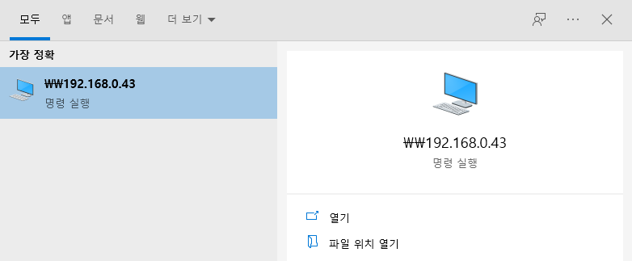

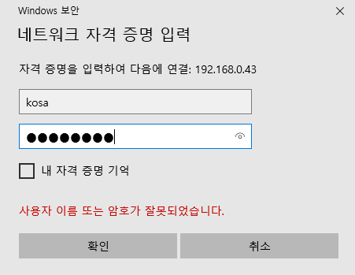

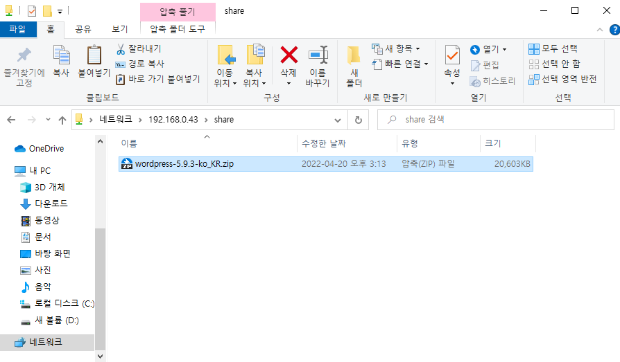


### WEB03에서 samba

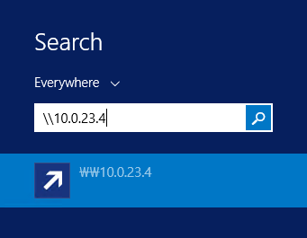

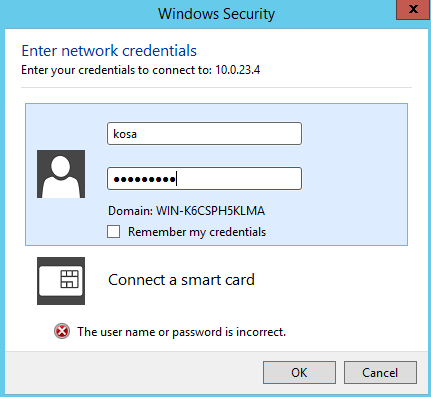

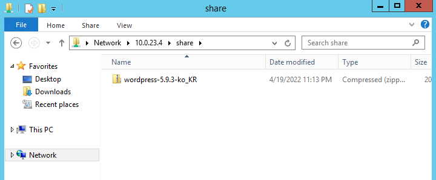


## 6. NFS

* 네트워크 파일 시스템 (Network File System; NFS)

### nfs 설치

```
# yum install -y nfs-utils
```

### 공유 폴더

```
# mkdir /share && cd $_
```

### exports 파일 설정

* 내부 리눅스 사용자만 공유폴더 접근

```
# vi /etc/exports
/share 10.0.23.0/24(rw,sync)

# exportfs -v
```

### 방화벽 설정

```
# firewall-cmd --permanent --add-service=nfs
# firewall-cmd --permanent --add-service=rpc-bind
# firewall-cmd --permanent --add-service=mountd
# firewall-cmd --reload
```

### CentOS 클라이언트

> NAT 서버, WEB01 서버

* nfs 설치

```
# yum install -y nfs-utils
```

* 마운트 가능여부 확인

```
# showmount -e db.xeomina.shop
```

* 공유폴더 생성

```
# mkdir share
```

* 마운트

```
# mount -t nfs db.xeomina.shop:/share share
```

* 마운트 확인

```
#  df -h
db.xeomina.shop:/share    97G  1.9G   96G   2% /root/share	# 마운트
```

* 마운트 고정

```
# cp /etc/fstab /etc/fstab.bak
# echo "db.xeomina.shop:/share /root/share nfs defaults 0 0" >> /etc/fstab
```

### Ubuntu 클라이언트

> WEB02 서버

* nfs 설치

```
$ sudo apt update
$ sudo apt install -y nfs-common
```

* 마운트 가능여부 확인

```
$ showmount -e db.xeomina.shop
```

* 공유폴더 생성

```
$ mkdir share
```

* 마운트

```
$ sudo mount -t nfs db.xeomina.shop:/share share
```

* 마운트 확인

```
$  df -h
db.xeomina.shop:/share    97G  1.9G   96G   2% /home/xeomina/share	# 마운트
```

* 마운트 고정

```
$ sudo cp /etc/fstab /etc/fstab.bak
$ sudo vi /etc/fstab
db.xeomina.shop:/share /home/xeomina/share nfs defaults 0 0
```


## 7.  nginx

### 업데이트 

```
$ sudo apt update && sudo apt upgrade -y
```

### nginx 및 php 설치

```
$ sudo apt install -y nginx php7.2 php7.2-mysql php7.2-mbstring php7.2-gd php7.2-fpm wget unzip
```

### public_html 폴더

```
$ sudo mkdir -p /var/www/html/wordpress/public_html
```

### conf 설정 파일

* sites-available/ wordpress.conf 파일

```
$ cd /etc/nginx/sites-available
$ sudo vi wordpress.conf
server {
            listen 80;		# default port
            root /var/www/html/wordpress/public_html;
            index index.php index.html;		# index 파일 우선순위
            server_name nat.xeomina.shop;

	    access_log /var/log/nginx/SUBDOMAIN.access.log;
    	    error_log /var/log/nginx/SUBDOMAIN.error.log;

            location / {
                         try_files $uri $uri/ =404;
            }

            location ~ \.php$ {
                         include snippets/fastcgi-php.conf;
                         fastcgi_pass unix:/run/php/php7.2-fpm.sock;
            }
            
            location ~ /\.ht {
                         deny all;
            }

            location = /favicon.ico {
                         log_not_found off;
                         access_log off;
            }

            location = /robots.txt {
                         allow all;
                         log_not_found off;
                         access_log off;
           }
       
            location ~* \.(js|css|png|jpg|jpeg|gif|ico)$ {
                         expires max;
                         log_not_found off;
           }
}
```

### nginx 실행

```
$ sudo nginx -t
```

### 심볼릭 링크 설정

* sites-enabled에 설정 파일인 sites-available/wordpress.conf 링크

```
$ cd /etc/nginx/sites-enabled
$ sudo ln -s ../sites-available/wordpress.conf .
```

### 재시작

* reload : restart와 비슷해보이지만 서버를 종료하지 않은채 conf 설정 파일들만 새로 갱신

```
$ sudo systemctl reload nginx
```

### DB 서버에서 wordpress.zip

* samba 공유폴더에서 nfs 공유폴더로

```
# cd /shar
# ls
test.txt

# cp /var/samba/share/wordpress-5.9.3-ko_KR.zip .

# ls
test.txt  wordpress-5.9.3-ko_KR.zip
```

### 워드프레스 설치

* wordpress.zip 압축해제 및 권한 설정

```
$ cd /var/www/html/wordpress/public_html
$ sudo cp /home/xeomina/share/wordpress-5.9.3-ko_KR.zip .
$ sudo unzip wordpress-5.9.3-ko_KR.zip
$ sudo mv wordpress/* .
$ sudo chown -R www-data:www-data *
$ sudo chmod -R 755 *
```


## 8. IIS

### Client for NFS 설치

* Manage > Add Roles and Features

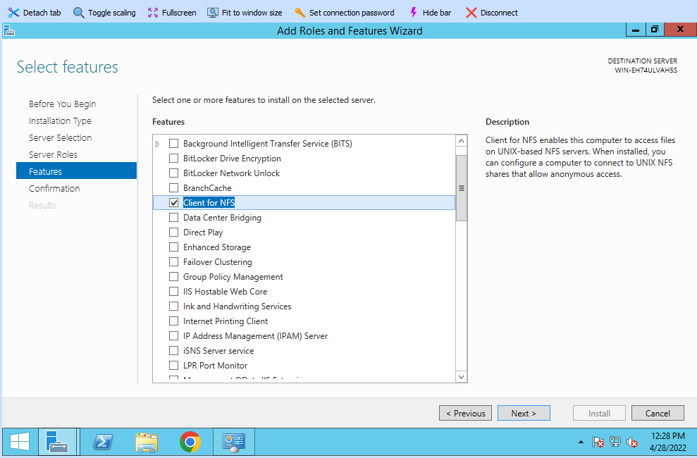


###  DB 서버에서 WebPlatformInstaller.msi

* samba

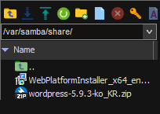

```
# ls
WebPlatformInstaller_x64_en-US.msi  wordpress-5.9.3-ko_KR.zip
```

### WebPlatformInstaller 설치

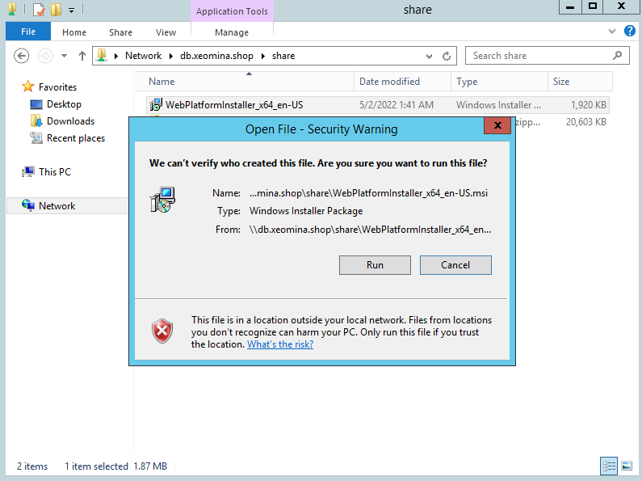

### PHP 설치

* Tools > IIS Mnager

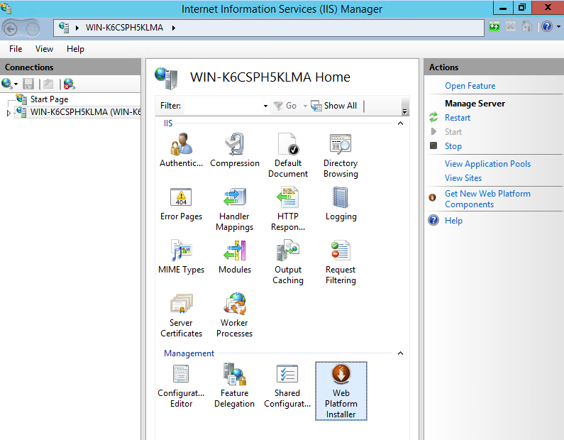

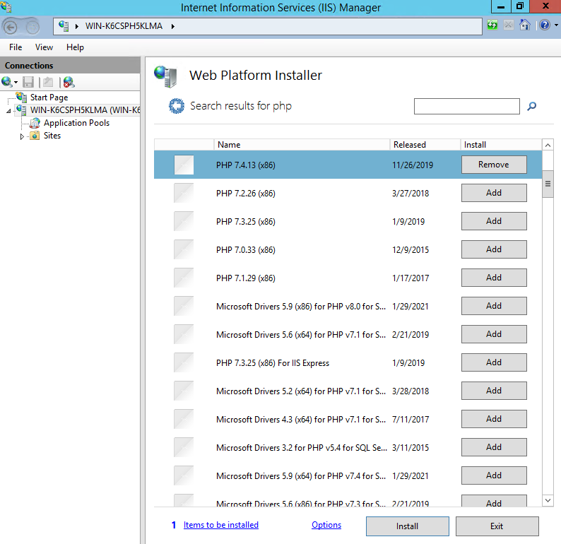