# 0503


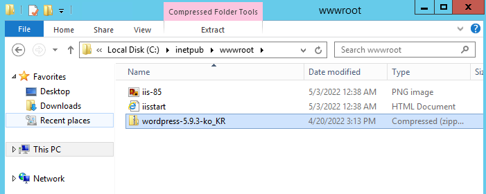


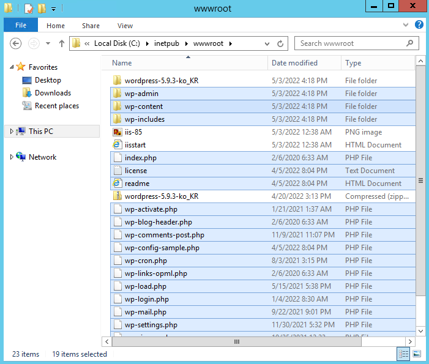


*

```
# firewall-cmd --permanent --add-service=http --zone=external
# firewall-cmd --reload
```


## 9. httpd

> WEB01 서버

### httpd 설치

```
# yum install -y httpd
# curl locallhost
```

### remi 저장소에 저장된 버전 설치

```
# yum -y install http://rpms.remirepo.net/enterprise/remi-release-7.rpm
```

### epel 설치

```
# yum -y install epel-release yum-utils
```

### php74

```
# yum-config-manager --enable remi-php74
```

### php 설치

```
# yum install -y httpd php php-mysql php-gd php-mbstring wget unzip
```

### wordpress 설치

```
# cd /var/www/html
# unzip ~/share/wordpress-5.9.3-ko_KR.zip
# mv wordpress/* .
```

### apache 접근 제어

```
# chown -R apache:apache /var/www/*
# systemctl restart httpd
```


## HAproxy

* AWS ELB - 로드밸런서 - 부하분산

> NAT 서버

### haproxy 설치

```
# yum install -y haproxy
```

### haproxy 설정

```
# vi /etc/haproxy/haproxy.cfg
defaults
    mode               http

frontend  http-in
    bind *:80
    acl firefox hdr_sub(User-Agent) Firefox
    acl trident hdr_sub(User-Agent) Trident
    default_backend    backend_servers
    use_backend bk_firefox if firefox
    use_backend bk_trident if trident

backend backend_servers
    balance            roundrobin
#    cookie  SVID insert indirect nocache maxlife 10s
    server             web01 web01.xeomina.shop:80 cookie w1 check
#    server             web02 web02.xeomina.shop:80 cookie w2 check
#    server             web03 web03.xeomina.shop:80 cookie w3 check

backend bk_firefox
    server             web01 web01.xeomina.shop:80
backend bk_trident
    server             web02 web02.xeomina.shop:80
```

### start & enable

```
# systemctl enable --now haproxy
```

### shop.db 파일 설정

```
# vi /var/named/xeomina.shop.db
$TTL    86400
@       IN      SOA     xeomina.shop.   root.xeomina.shop.(
                        2022050201 ; Serial
                        3h         ; Refresh
                        1h         ; Retry
                        1w         ; Expire
                        1h )       ; Minimum

        IN      NS      ns.xeomina.shop.
        IN      MX 10   ns.xeomina.shop.
ns      IN      A       10.0.23.1
web01   IN      A       10.0.23.3
web02   IN      A       10.0.23.2
web03   IN      A       10.0.23.5
db      IN      A       10.0.23.4
nat     IN      A       192.168.0.43
```

### 재시작

```
# systemctl restart named
```

### DNS 

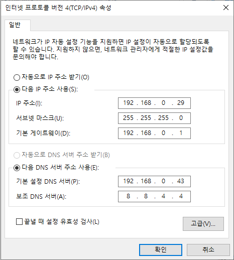

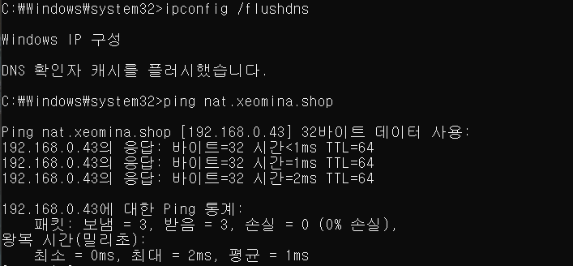

### 워드프레스


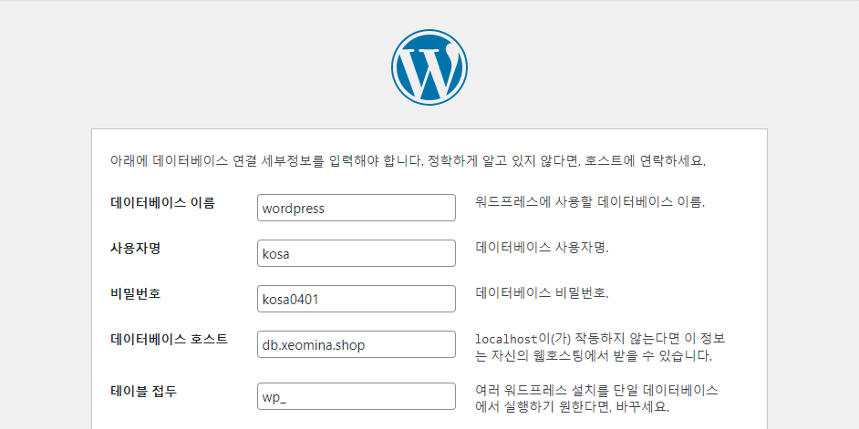

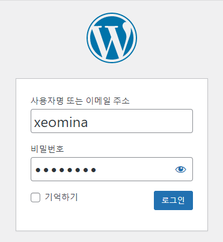

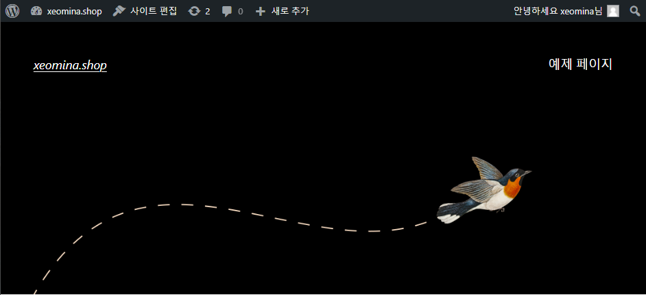


### wp-config.php 복사

> WEB01 서버

```
# cd /var/www/html
# cp wp-config.php ~/share/
```

> DB 서버

```
# cp /var/samba/share/wordpress-5.9.3-ko_KR.zip /share/
# cp /share/wp-config.php /var/samba/share/
```

> WEB02 서버

```
$ cd /var/www/html/wordpress/public_html
$ sudo cp ~/share/wp-config.php .
```


### 쿠키 주석

> NAT 서버

```
# vi /etc/haproxy/haproxy.cfg

backend backend_servers
    balance            roundrobin
#    cookie  SVID insert indirect nocache maxlife 10s
    server             web01 web01.xeomina.shop:80 cookie w1 check
    server             web02 web02.xeomina.shop:80 cookie w2 check
    server             web03 web03.xeomina.shop:80 cookie w3 check

# systemctl restart haproxy
```

> WEB03 서버

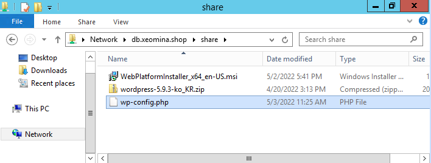

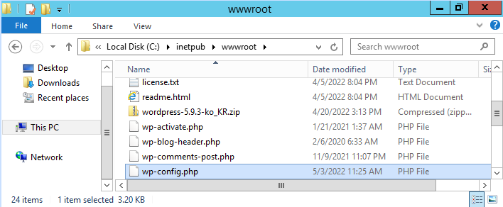

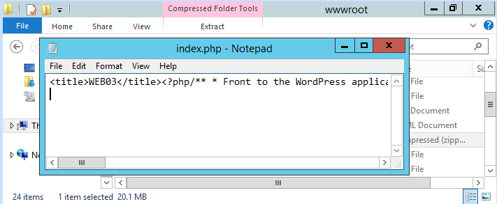

* Chrome

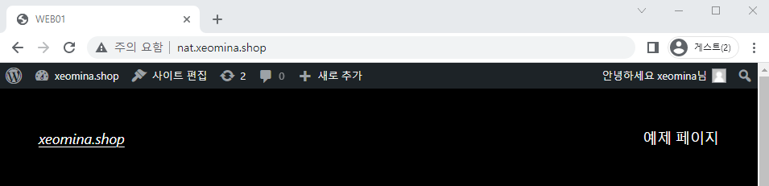

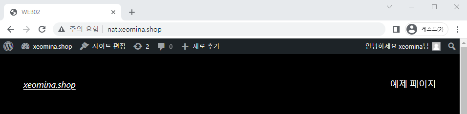


* Firefox

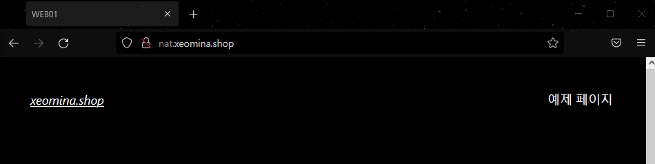

* Internet Explorer

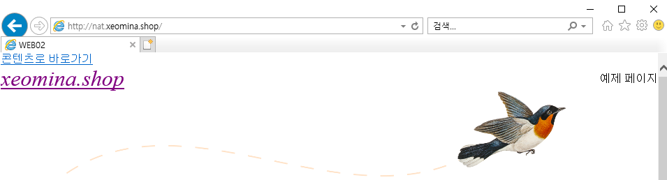


## Openstack

### 오픈스택(Openstack)

* 오픈스택은 IaaS(Infrastructure as a Service) 형태의 클라우드 컴퓨팅 오픈 소스 프로젝트다.
* 2012년 창설된 비영리 단체인 Openstack Foundation에서 유지, 보수하고 있으며 아파치 라이선스 하에 배포된다.
* AMD, 인텔, 캐노니컬, 수세 리눅스, 레드햇, 시스코 시스템즈, 델, HP, IBM, NEC, VM웨어, 야후 등 150개 이상의 회사가 이 프로젝트에 참가하고 있으며, 주로 리눅스 기반으로 운용과 개발이 이루어지고 있다.
* 프로세싱, 저장공간, 네트워킹의 가용자원을 제어하는 목적의 여러개의 하위 프로젝트로 이루어져 있고 대시보드 프로젝트는 다른 하위 프로젝트의 운영 제어를 웹 인터페이스를 통해 담당한다. 
* 오픈스택은 열린 설계와 개발을 지향하며 커뮤니티는 6개월의 릴리즈 사이클로 개발을 진행하고 있다.
* 매 사이클의 기획단계에서는 오픈스택 디자인 서밋(Openstack Design Summit)을 개최하여, 개발자 작업을 지원하고, 로드맵을 설정하고 있다.

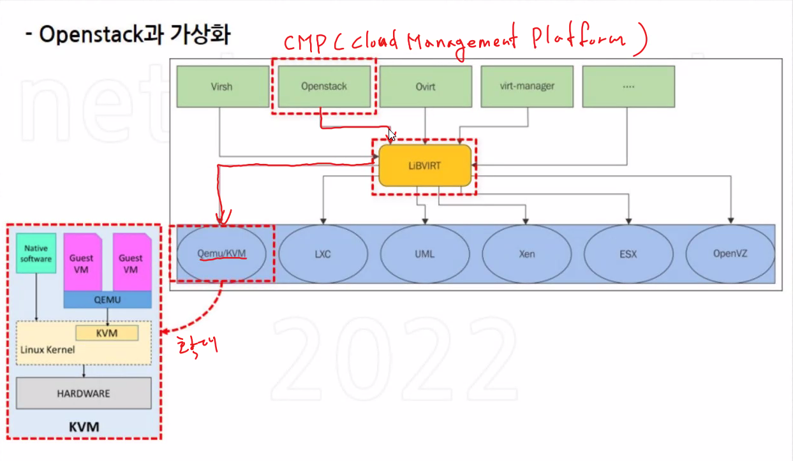


## 네트워크

### ip 범위

```
Network ID             Host ID
 8          8         8         8
192.       168.       0.        29
11000000  10101000  00000000   01111111
255.       255.       255.       0        기본 서브넷 마스크
11111111  11111111  11111111   00000000
                                0 ~ 255
192.       168.       0.        0		네트워크 주소
192.       168.       0.        255		브로드캐스트 주소

11111111  11111111  11111111   10000000 /25
                                0 ~ 127
192.       168.       0.        0		네트워크 주소
192.       168.       0.        127		브로드캐스트 주소
                                128 ~ 255
192.       168.       0.        128		네트워크 주소
192.       168.       0.        255		브로드캐스트 주소
255.       255.       255.      128

11111111  11111111  11111111   11000000 /26
255.       255.       255.        192
                               0   ~  63
                               64  ~ 127
                               128 ~ 191
                               192 ~ 255 

11111111  11111111  11111110   00000000 /23
255.       255.      254.           0
192.       168.        0       0 ~   255
192.       168.        1       1 ~   255

192.       168.       0.        0		네트워크 주소
192.       168.       0.        255		브로드캐스트 주소

11111111  11111111  11000000   00000000 /18
255.       255.      192.           0
192.       168.       0.        0		네트워크 주소
192.       168.       0.        255		
192.       168.       1.        255		
192.       168.       2.        255		
192.       168.       3.        255		브로드캐스트 주소

1 네트워크 비트
0 호스트 비트
```

### ip 공유기 설정 변경

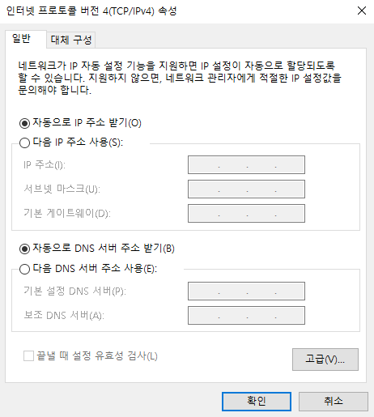