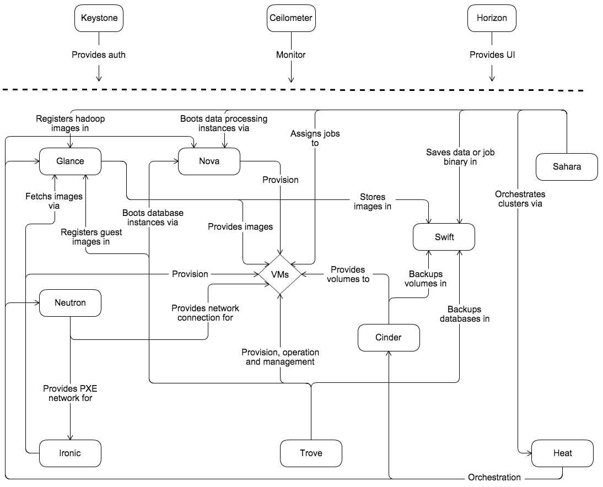
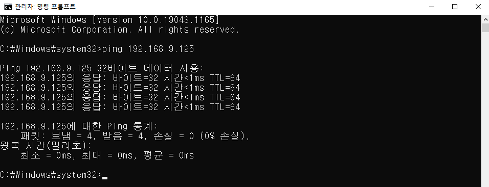

# 0504

## 오픈스택(Openstack)

### 서브넷마스크

| bit mask | Subnet Mask     | network | host        |
| -------- | --------------- | ------- | ----------- |
| /25      | 255.255.255.128 | 2       | 256/2 = 128 |
| /26      | 255.255.255.192 | 4       | 256/4 = 64  |
| /27      | 255.255.255.224 | 8       | 256/8 = 32  |
| /28      | 255.255.255.240 | 16      | 256/16 = 16 |
| /29      | 255.255.255.248 | 32      | 256/32 = 8  |
| /30      | 255.255.255.252 | 64      | 256/64 = 4  |
| /31      | 255.255.255.254 | 128     | 256/128 = 2 |
| /32      | 255.255.255.255 | 256     | 256/256 = 1 |

* 256/256 = 1 : 특정 ip 하나를 의미 (host only)
  * 192.168.0.100/32의 `/32`
  * 1의 갯수가 32개, 나머지가 호스트


### 개념적 아키텍처

* 출처 : [개념의 아키텍처](https://docs.openstack.org/ko_KR/install-guide/get-started-conceptual-architecture.html#get-started-conceptual-architecture)



* Core Service 5가지
  * nova : vm에게 cpu와 메모리 공급/설정, 인스턴스 (VM) 생성
  * giance : 이미지 os, 이미지 받아오는 곳
  * neutron : 네트워크 서비스 제공, 네트워크 관리
  * cinder :  블록 스토리지, 볼륨 관리
  * keystone : 보안, ID/PW, 오픈스택 인증 토큰 발급

* Optinal Service
  * swift : webshare 볼륨 백업, 파일 공유(오브젝트 스토리지), 이미지 저장하는 곳
  * horizon : 웹 ui, 유저 인터페이스
  * heat : IaC, 자동화도구, 오케스트레이션


### 논리적 아키텍처

* 출처 : [논리적 아키텍처](https://docs.openstack.org/ko_KR/install-guide/get-started-logical-architecture.html)


### 오픈스택 서비스 관계도


### 구성요소 (서비스)

* 클라우드 운영 체제라고도 하는 오픈스택 프로젝트는 여러 다른 프로젝트로 구성된다. 오픈스택 설치 시 여러 프로젝트 중 일부만 포함 가능하다.
* 5 Core Service
  1. Compute Service (CPU, RAM)  Nova, AWS EC2
  2. Storage Service (SSD, HDD) : Cinder, AWS EBS, AWS s3, Swift
  3. Network Service (G/W, S/W) : Neutron, AWS VPC
  4. Image Service (OS) : Glance, AWS AMI
  5. Identity Service (AUTH, Keypair) : KeyStone, AWS IAM
  6. Orchestration Service (IaC) : Heat, AWS CloudFormation

#### OpenStack Compute (Nova)

* 이 서비스는 모든 클러스터 노드 컴퓨터에 설치된다. 인스턴스 (프로세서, 메모리, 블록장치, 네트워크)의 추상화 수준을 관리한다. 또한 하이퍼 바이저 (KVM - type1)을 통햬 인스턴스(=vm)의 라이프 사이클을 관리한다. Nova는 가상 머신, 베어메탈 서버 생성을 지원하며 (ironic 사용을 통해) 시스템 컨테이너에 대한 지원이 제한적이다. Nova는 해당 서비스를 제공하기 위해 기존 linux 서버 위에 데몬세트로 실행된다.
* 노바 설치 = 설치된 노드 = vm 설치 > 노드 3개 위치 > 노드 안에 vm 위치 > 무중단 서비스를 위해 여러개의 클러스터 > 클러스터 안 vm ? > vm 유지! > 노드의 묶음 클러스터?
* compute node 3개 > 이를 제어할 control node (controller) => 이런 에코 시스템 클러스터!

#### OpenStack Identification (Neutron)

*  이 서비스는 네트워크 연결을 담당한다. 사용자는 가상 네트워크 및 가상 라우터를 생성하고 floating IP(공인 IP = AWS EIP) 기능을 통해 인터넷 공급자(IP) 주소를 설정할 수 있다. 이 메커니즘 덕분에 인스턴스는 외부로부터 고정 IP 주소를 얻을 수 있다. 또한 네트워크 부하분산 서비스와 방화벽, VPN 등의 기능을 모듈로 설치하여 이용 가능하다.

#### OpenStack Identification (Keystone)

* 이 서비스는 클라우드 운영 체제의 통합 인증 시스템으로 작동한다. 사용자 게정의 유효성과 OpenStack 프로젝트 및 역할에 대한 사용자의 일치 여부를 확인한다. 그리고 다른 서비스에 액세스하기 위한 토큰을 제공한다.

#### OpenStack Image Service (Glance)

* 이 서비스는 인스턴스의 이미지를 관리하며 인스턴스를 실행하기 위한 템플릿으로 사용 가능하다. 이 서비스는 또한 백업과 스냅샷 생성 기능을 제공한다. vhd, vmdk, vdi, iso, qcow2 및 ami를 포함한 다양한 형식을 지원한다.

#### OpenStack Block Stroage (Cinder)

* 이 서비스는 인스턴스를 실행하여 사용할 수 있는 블록 스트리지를 관리한다. 인스턴스를 위한 영구 데이터 스토리지이며 스냅샷을 사용할 수있다. 데이터 저장 및 복원 또는 복제 대부분의 경우 GNU/Linux 서버 기반의 데이터 스토리지는 Cinder와 함께 사용된다.

#### OpenStack Object Stroage (Swift)

* 이 서비스는 객체 저장소이며 사용자가 파일을 저장할 수 있다. 분산 아키텍처를 갖추고 있어 장애 조치를 위한 수평 확장 및 복제가 가능하다.

#### OpenStack Orchestration (Heat)

* 이 서비스는 AWS CloudFormation 형식의 템플릿을 사용하여 다른 모든 OpenStack을 관리한다. 대부분 유형의 리소스(가상 머신, 볼륨, 유동 IP, 사용자, 보안 그룹 등)를 생성할 수 있다. 또한 Ceilometer의 데이터를 사용해 응용 프로그램 스케일링을 자동으로 만들 수 있다.


## 실습 - 오픈스택 가상 네트워크 구축

### VM 생성


* Custmize Hardware

  * CPU : 4C
  * RAM : 10G(10240MB)
  * SSD : 128G
  * NET : Bridge
  * IMG : CentOS-Stream-8-x86_64-latest-boot.iso

  

* Processors > 중첩된 가상화


* New CD/DVD > ISO 이미지


### Openstack 싱글 노드 설치

* ip 고정

```
# vi /etc/sysconfig/network-scripts/ifcfg-ens32
TYPE=Ethernet
BOOTPROTO=none
NAME=ens32
DEVICE=ens32
ONBOOT=yes
IPADDR=192.168.0.51
NETMASK=255.255.240.0
GATEWAY=192.168.0.1
DNS1=8.8.8.8
DNS2=8.8.4.4
```

* selinux 설정

```
# vi /etc/sysconfig/selinux
# vi /etc/selinux/config	# 위와 동일
SELINUX=disabled
```

* network enable

```
# dnf install network-scripts -y		# dnf = yum
# systemctl disable --now firewalld		# stop & disable 
# systemctl disable --now NetworkManager	# centos8  NetworkManager가 메인 > 우리는 network 이용
# systemctl enable network
# systemctl start network
# reboot
```

* openstack-yoga 설치

```
# dnf update -y
# dnf config-manager --enable powertools	# powertools > openstack install 가능
# dnf install -y centos-release-openstack-yoga
```

* openstack-packstack 설치

```
# dnf update -y
# dnf install -y openstack-packstack	# openstack 자동화 도구 Puppet
```

* answers.txt 설정파일 생성
  * `/`로 검색

```
# packstack --gen-answer-file /root/answers.txt
# vi /root/answers.txt
CONFIG_DEFAULT_PASSWORD=Test1234!
CONFIG_KEYSTONE_ADMIN_PW=Test1234!
CONFIG_CINDER_VOLUMES_SIZE=100G		# lvm 장치 - cinder의 볼륨 조절
CONFIG_NTP_SERVERS=kr.pool.ntp.org	# ntp 서버 도메인
CONFIG_HEAT_INSTALL=y
CONFIG_NEUTRON_L2_AGENT=openvswitch
# L2 - S/W Hub Layer
CONFIG_NEUTRON_ML2_TYPE_DRIVERS=vxlan,flat
# vxlan = internal / flat = external driver
CONFIG_NEUTRON_ML2_TENANT_NETWORK_TYPES=vxlan
CONFIG_NEUTRON_ML2_MECHANISM_DRIVERS=openvswitch
CONFIG_NEUTRON_OVS_BRIDGE_MAPPINGS=extnet:br-ex
# extnet 네트워크 세팅
CONFIG_NEUTRON_OVS_BRIDGE_IFACES=br-ex:ens32
CONFIG_PROVISION_DEMO=n
```

* packstack --answer 설치 실행

```
# packstack --answer-file /root/answers.txt
```


### Openstack 접속

* 192.168.0.51


### DB 설정

* 192.168.0.66
* 각자의 도메인에 맞는 db 사용

```
# cd /var/named/db
# ls
mz11.shop.db  mz15.shop.db  mz19.shop.db  mz23.shop.db  mz27.shop.db  mz31.shop.db
mz12.shop.db  mz16.shop.db  mz20.shop.db  mz24.shop.db  mz28.shop.db  mz32.shop.db
mz13.shop.db  mz17.shop.db  mz21.shop.db  mz25.shop.db  mz29.shop.db  mz33.shop.db
mz14.shop.db  mz18.shop.db  mz22.shop.db  mz26.shop.db  mz30.shop.db
```

* shop.db 파일

```
# vi mz23.shop.db
$TTL    86400
@       IN      SOA     mz23.shop.   root.mz23.shop.(
                        2022050301 ; Serial
                        3h         ; Refresh
                        1h         ; Retry
                        1w         ; Expire
                        1h )       ; Minimum

        IN      NS      ns.mz23.shop.
ns      IN      A       192.168.0.66
open    IN      A       192.168.0.51
```

* dns 설정


### 외부 네트워크

* 관리 > 네트워크 > 네트워크
* 외부 네트워크 IP 대역 : 192.168.9.1 ~ 192.168.9.126


### 내부 네트워크

* 프로젝트 > 네트워크 > 네트워크
* 내부 네트워크 IP 대역 : 10.0.23.0/24


### 라우터

* 외부와 내부 네트워크 연결


* ROUTER 클릭 > 인터페이스


* ping 확인
  * 외부 ip : 192.168.9.125




### 클라우드 이미지 다운로드

- [CentOS 7 images](http://cloud.centos.org/centos/7/images/)
  - [CentOS-7-x86_64-GenericCloud-2111.qcow2](http://cloud.centos.org/centos/7/images/CentOS-7-x86_64-GenericCloud-2111.qcow2)
-  [Ubuntu-based images](https://cloud-images.ubuntu.com/)
  - [bionic-server-cloudimg-amd64-disk.img](https://cloud-images.ubuntu.com/bionic/current/bionic-server-cloudimg-amd64.img)


### Flavor

* 관리 > Compute > Flavor
* Cinder


### Images

* 프로젝트 > Compute > 이미지
* Glance


### Key Pairs

* 프로젝트 > Compute > 키 페어
* KeyStone


### 보안 그룹

* 프로젝트 > 네트워크 > 보안 그룹
  * 내보냄 = outbound = egress (오픈 스택에서 밖으로 내보냄)
  * 들어옴 = inbound = ingress (밖에서 오픈스택으로 들어옴)


* http 80 포트 허용


* ssh 22 포트 허용
  * 포트 번호로 추가 가능


* icmp 허용
  * ICMP (Internet Control Message Protocol, 인터넷 제어 메시지 프로토콜)
  * ping 확인


### Floating IP

* 프로젝트 > 네트워크 > Floating IP
* 5개 IP 생성


### 인스턴스

* 프로젝트 > Compute > 인스턴스


#### web01


