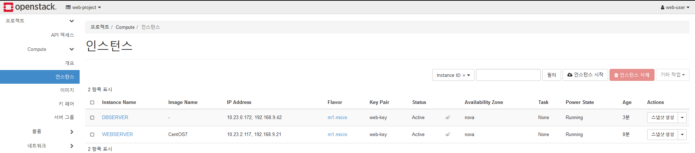

# 0506

* Openstack VM : 실제 랜카드(ens)는 전기적인 신호만, 가상의 랜카드(br-ex)가 ip


## 컨테이너

* 프로젝트 > 오브젝트 스토리지 > 컨테이너
* 오브젝트 스토리지 = swift
* wget으로 파일 받기 용이함 (링크로)

### mz23 컨테이너 생성


### images 폴더 생성 및 파일 업로드


### 링크 생성

* [이미지 링크](http://192.168.0.51:8080/v1/AUTH_411b41ddd72349db839001e555f89a81/mz23/images/two-rabbit.jpg)로 wget 사용 가능


```
$ wget http://192.168.0.51:8080/v1/AUTH_411b41ddd72349db839001e555f89a81/mz23/images/two-rabbit.jpg
```

* [html 링크](http://192.168.0.51:8080/v1/AUTH_411b41ddd72349db839001e555f89a81/mz23/index.html)로 index.html 접속 가능


## 워드프레스 설치 (CentOS7)

### WEB01 서버

* remi 저장소에서 특정버전의 php74 및 epel 설치

```
$ sudo yum -y install https://rpms.remirepo.net/enterprise/remi-release-7.rpm
$ sudo yum -y install epel-release yum-utils
$ sudo yum-config-manager --enable remi-php74
```

* php 설치

```
$ sudo yum install -y httpd php php-mysql php-gd php-mbstring wget unzip
```

* mz23 컨테이너에 wordpress 파일 업로드


* [wordpress.org 파일 다운 링크](http://192.168.0.51:8080/v1/AUTH_411b41ddd72349db839001e555f89a81/mz23/wordpress-5.9.3-ko_KR.zip) 생성


* wget으로 링크에서 파일 다운

```
$ wget http://192.168.0.51:8080/v1/AUTH_411b41ddd72349db839001e555f89a81/mz23/wordpress-5.9.3-ko_KR.zip
$ pwd
/home/centos/
$ ls
two-rabbit.jpg  wordpress-5.9.3-ko_KR.zip
```

* 경로 이동 및 wordpress.zip 압축해제

```
$ cd /var/www/html
$ sudo unzip /home/centos/wordpress-5.9.3-ko_KR.zip
```

* wordpress 파일 현재 경로로 이동

```
$ ls
wordpress
$ sudo mv wordpress/* .
$ ls
index.php        wp-admin              wp-cron.php        wp-mail.php
license.txt      wp-blog-header.php    wp-includes        wp-settings.php
readme.html      wp-comments-post.php  wp-links-opml.php  wp-signup.php
wordpress        wp-config-sample.php  wp-load.php        wp-trackback.php
wp-activate.php  wp-content            wp-login.php       xmlrpc.php
```

* 접근제어 및 재시작

```
$ sudo chown -R apache:apache /var/www/*
$ sudo systemctl restart httpd
```

* 설치확인

```
$ sudo php -v
```


## 볼륨 추가

* 컨테이너 > 인스턴스 : cpu, 메모리
* 프로젝트 > 볼륨 > 볼륨
* 볼륨은 따로
  * WEB01,02 내 /dev/vda : root 볼륨
* 순서 : attach > mount > umount > detach


### ADD 볼륨 생성


### Attatch

* 프로젝트 > 볼륨 > 볼륨 > 볼륨 연결 관리


### Mount 

* 볼륨 확인

```
$ lsblk
NAME   MAJ:MIN RM SIZE RO TYPE MOUNTPOINT
vda    253:0    0  10G  0 disk
└─vda1 253:1    0  10G  0 part /
vdb    253:16   0   1G  0 disk			# 추가
```

* 파일 시스템 포맷

```
$ sudo mkfs -t ext4 /dev/vdb	# xfs : centos / ext4 : etc... 

Block size=4096 (log=2)			# 블록 단위로 데이터 저장 (4kb)
```

* 마운트

```
$ sudo mount /dev/vdb /mnt/
$ df -h
Filesystem      Size  Used Avail Use% Mounted on
devtmpfs        472M     0  472M   0% /dev
tmpfs           496M     0  496M   0% /dev/shm
tmpfs           496M   13M  483M   3% /run
tmpfs           496M     0  496M   0% /sys/fs/cgroup
/dev/vda1        10G  1.2G  8.8G  12% /
tmpfs           100M     0  100M   0% /run/user/1000
/dev/vdb        976M  2.6M  907M   1% /mnt
```

* 파일 생성

```
$ sudo vi /mnt/test.txt
$ sudo cp wordpress-5.9.3-ko_KR.zip /mnt/
$ ls /mnt/
lost+found  test.txt  wordpress-5.9.3-ko_KR.zip
```


### Umount 

* 마운트해제

```
$ sudo umount /mnt
$ df -h
Filesystem      Size  Used Avail Use% Mounted on
devtmpfs        472M     0  472M   0% /dev
tmpfs           496M     0  496M   0% /dev/shm
tmpfs           496M   13M  483M   3% /run
tmpfs           496M     0  496M   0% /sys/fs/cgroup
/dev/vda1        10G  1.2G  8.8G  12% /
tmpfs           100M     0  100M   0% /run/user/1000
```


### Detach


## 볼륨 확장

* 수평적 확장 (Scale out)
  * Scale up : 늘어나는 부하를 처리하기 위해 부족한 자원(CPU, 메모리 등)을 늘려 서버를 수직으로 확장하는 방법
  * Scale out : 서버의 수를 늘리고 동작하는 애플리케이션의 복제본을 실행해 이중화, 삼중하를 하는 방식으로 부하를 분산시켜주는 방식
* 늘어난 볼륨은 줄어들지 않는다


## Ubuntu 

* WEB02

### 이미지 생성


### 인스턴스 생성


* vm이 만들어지는 과정에서 스크립트 실행
* `#!bin/bash` : bash shell script
* root 로 접근하기 때문에 sudo 필요 x

```
#!bin/bash
apt update					# $ sudo apt update
apt install -y nginx		 # $ sudo apt install -y nginx
```


### 유동 IP 연결


### 도메인 추가

* DB 서버 : 102.168.0.66

```
# vi mz23.shop.db
$TTL    86400
@       IN      SOA     mz23.shop.   root.mz23.shop.(
                        2022050301 ; Serial
                        3h         ; Refresh
                        1h         ; Retry
                        1w         ; Expire
                        1h )       ; Minimum

        IN      NS      ns.mz23.shop.
ns      IN      A       192.168.0.66
open    IN      A       192.168.0.51
web01   IN      A       192.168.9.33
web02   IN      A       192.168.9.70

# systemctl restart named
```

* ping 확인


* 웹 접속


* ssh


### 볼륨 추가

* attach


* 디스크 확인

````
$ lsblk
NAME    MAJ:MIN RM  SIZE RO TYPE MOUNTPOINT
vda     252:0    0   10G  0 disk
├─vda1  252:1    0  9.9G  0 part /
├─vda14 252:14   0    4M  0 part
└─vda15 252:15   0  106M  0 part /boot/efi
vdb     252:16   0    1G  0 disk			# 추가
````

* mount

```
$ sudo mount /dev/vdb /mnt/
```

* mount 확인

```
$ df -h
Filesystem      Size  Used Avail Use% Mounted on
udev            481M     0  481M   0% /dev
tmpfs            99M  648K   98M   1% /run
/dev/vda1       9.6G  1.3G  8.3G  14% /
tmpfs           493M     0  493M   0% /dev/shm
tmpfs           5.0M     0  5.0M   0% /run/lock
tmpfs           493M     0  493M   0% /sys/fs/cgroup
/dev/vda15      105M  4.4M  100M   5% /boot/efi
tmpfs            99M     0   99M   0% /run/user/1000
/dev/vdb        976M   23M  887M   3% /mnt

$ ls /mnt/
lost+found  test.txt  wordpress-5.9.3-ko_KR.zip
```


## 워드프레스 설치(Ubuntu18)

### WEB02 서버

* php 설치

```
$ sudo apt install -y php7.2 php7.2-mysql php7.2-mbstring php7.2-gd php7.2-fpm wget unzip
```

* public_html 폴더 생성 및 sites-available 경로이동

```
$ sudo mkdir -p /var/www/html/wordpress/public_html
$ cd /etc/nginx/sites-available
```

* wordpress.conf 파일 설정

```
$ sudo vi wordpress.conf
server {
            listen 80;		# default port
            root /var/www/html/wordpress/public_html;
            index index.php index.html;		# index 파일 우선순위
            server_name www.mz23.shop;

	    access_log /var/log/nginx/SUBDOMAIN.access.log;
    	    error_log /var/log/nginx/SUBDOMAIN.error.log;

            location / {
                         try_files $uri $uri/ =404;
            }

            location ~ \.php$ {
                         include snippets/fastcgi-php.conf;
                         fastcgi_pass unix:/run/php/php7.2-fpm.sock;
            }
            
            location ~ /\.ht {
                         deny all;
            }

            location = /favicon.ico {
                         log_not_found off;
                         access_log off;
            }

            location = /robots.txt {
                         allow all;
                         log_not_found off;
                         access_log off;
           }
       
            location ~* \.(js|css|png|jpg|jpeg|gif|ico)$ {
                         expires max;
                         log_not_found off;
           }
}
```

* nginx 실행

```
$ sudo nginx -t
$ cd /etc/nginx/sites-enabled
$ sudo ln -s ../sites-available/wordpress.conf .
$ sudo systemctl reload nginx
```

* wordpress.zip 파일 압축 해제 및 접근제어

```
$ cd /var/www/html/wordpress/public_html
$ sudo wget https://ko.wordpress.org/latest-ko_KR.zip
$ sudo unzip latest-ko_KR.zip
$ sudo mv wordpress/* .
$ sudo chown -R www-data:www-data *
$ sudo chmod -R 755 *
```


## 보안 그룹 생성

* 프로젝트 > 네트워크 > 보안 그룹


## 인스턴스 

### 인스턴스 생성

* 프로젝트 > Compute > 인스턴스


### 인스턴스 크기 변경

* 관리 > Compute > Flavor


-----------------


## web- project

> 새로운 프로젝트


### IP 변경

* 10.0.23.0/20 > 10.23.0.0/20

| 네트워크 주소          | 10   | 23   | 0    | 0    | /20    |
| ---------------------- | ---- | ---- | ---- | ---- | ------ |
| 사용 가능 IP 주소 범위 | 10   | 23   | 0    | 1    | ~      |
|                        | 10   | 23   | 15   | 254  | 4094개 |
| 브로드캐스트 주소      | 10   | 23   | 15   | 255  |        |


### 프로젝트 생성

* 인증 > 프로젝트


### 사용자 생성

* 인증 > 사용자


### Firefox에서 접속

​	* web-user로 로그인


### 네트워크 생성


### 라우터 생성

* 프로젝트 > 네트워크 > 라우터


* Router 클릭 > 인터페이스


### 네트워크 토폴로지

* 프로젝트 > 네트워크 > 네트워크 토폴로지


### EXTERNAL  네트워크 IP

#### admin 계정 

* 관리 > 네트워크 > 네트워크 > EXTERNAL


* ping 확인


### 유동 IP 할당

#### web-user

* 관리 > 네트워크 > Floating IP


### 보안 그룹 생성

#### web-user

* 프로젝트 > 네트워크 > 보안 그룹
* 관리 보안 그룹 규칙: SG-WEB / SG-DB


### 키 페어 생성

#### web-user

* 프로젝트 > Compute > 키 페어


### 이미지

#### admin 계정

* 공유 > 공용으로 변경


### 인스턴스 생성

### WEBSERVER


### DBSERVER


### 각 서버에 유동 IP 연결

* WEB서버 경유해서 DB서버로 - 원래는 DB에 유동 IP 할당하지 않음
* but 지금은 편의성을 위해 둘다 연결




```
# cd /var/named/db
# vi mz23.shop.db
$TTL    86400
@       IN      SOA     mz23.shop.   root.mz23.shop.(
                        2022050301 ; Serial
                        3h         ; Refresh
                        1h         ; Retry
                        1w         ; Expire
                        1h )       ; Minimum

        IN      NS      ns.mz23.shop.
ns      IN      A       192.168.0.66
blog    IN      A       192.168.9.42

# systemctl restart named
```

* ping 확인


