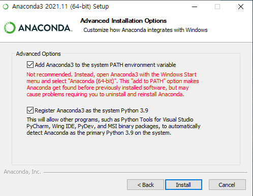

# 0509

## 파이썬 살펴보기

### 파이썬이란? 

* 파이썬이란 1991년 귀도 반 로섬이 만든 프로그램 언어
* 파이썬은 쉽고 간결하고 강력한 기능 덕분에 현재 가장 많이 사용하는 프로그램 언어

### 파이썬 언어의 특징 및 장점

* 파이썬은 인터프리터 언어
  * 프로그램 언어는 컴퓨터가 알아들을 수 있는 기계어로 바뀌어 컴퓨터에게 전달되어야 함.
  * 파이썬 언어는 인간이 만든 코드를 기계어로 변경하여 컴퓨터에게 전달하는 명령어 해석기가 존재함.
  * 우리가 코드를 만들고 실행하면 한 줄 한 줄 명령어 해석기가 코드를 해석하여 컴퓨터에게 전달하여 동작함.
  * 코드를 만들고 바로 실행 가능.
  * 프로그램 작성과 실행 단계로 코드의 실행이 가능.
*  간결한 코드와 쉬운 문법으로 배우기 쉬움
* 무료로 사용 가능
* 다른 언어와 쉽게 상호작용이 가능
* 윈도우, 맥os, 리눅스 등에서도 동일한 코드로 실행 시킬 수 있음
* 라이브러리가 많음

### 파이썬 언어 레퍼런스

- [대안 구현들](https://docs.python.org/ko/3/reference/introduction.html#alternate-implementations)
  - 눈에 띄게 널리 사용되는 파이썬 구현이 존재하기는 하지만, 특정한 관심사를 가진 대상들에게 호소력을 가진 여러 대안 구현들이 존재합니다.

  - 알려진 구현들
    - CPython : 원조이기도 하고 가장 잘 관리되고 있는 C로 작성된 파이썬 구현입니다. 언어의 새로운 기능은 보통 여기에서 처음 등장합니다.
    - Jython : 파이썬 자바구현. 이 구현은 자바 응용 프로그램을 위한 스크립트 언어로 사용되거나, 자바 클래스 라이브러리를 활용하는 응용 프로그램을 만드는데 사용될 수 있습니다. 종종 자바 라이브러리의 테스트를 만드는 데 사용되기도 합니다. 더 자세한 정보는 [Jython 웹사이트](http://www.jython.org/) 에서 찾을 수 있습니다.

    - Python for .NET : 이 구현은 실제로는 CPython 구현을 사용하지만, 매니지드(managed) .NET 응용 프로그램이고 .NET 라이브러리를 제공합니다. Bryan Lloyd가 만들었습니다다. 더 자세한 정보는 [Python for .NET 홈페이지](https://pythonnet.github.io/) 에서 제공됩니다.

    - IronPython : .NET을 위한 대안 파이썬. Python.NET 과는 달리 이것은 IL을 생성하고, 파이썬 코드를 .NET 어셈블리로 직접 컴파일하는 완전한 파이썬 구현입니다. Jim Hugunin 이 만들었는데, Jython 의 원저자이기도 합니다. 자세한 정보는 [IronPython 웹사이트](http://ironpython.net/) 에서 얻을 수 있습니다.

    - PyPy : 완전히 파이썬으로 작성된 파이썬 구현. 스택 리스(stackless) 지원이나 JIT 컴파일러와 같이 다른 구현에서는 찾을 수 없는 고급 기능을 제공합니다. 이 프로젝트의 목표 중 하나는 (파이썬으로 쓰였기 때문에) 인터프리터 수정을 쉽게 만들어서 언어 자체에 대한 실험을 북돋는 것입니다. 자세한 정보는 [PyPy 프로젝트의 홈페이지](http://pypy.org/) 에서 찾을 수 있습니다.

  - 각 구현은 이 설명서에서 설명되는 언어와 조금씩 각기 다른 방법으로 벗어나거나, 표준 파이썬 문서에서 다루는 범위 밖의 특별한 정보들을 소개합니다. 여러분이 사용 중인 구현에 대해 어떤 것을 더 알아야 하는지 판단하기 위해서는 구현 별로 제공되는 문서를 참조할 필요가 있습니다.


* [표기법](https://docs.python.org/ko/3/reference/introduction.html#notation)
  * 어휘 분석과 문법의 기술은 수정된 BNF 문법 표기법을 사용합니다. 이것은 다음과 같은 정의 스타일을 사용합니다.

```
name      ::=  lc_letter (lc_letter | "_")*
lc_letter ::=  "a"..."z"
```

- 첫 줄은 `name` 이 `lc_letter` 로 시작하고, 없거나 하나 이상의 `lc_letter` 나 밑줄이 뒤따르는 형태로 구성된다고 말합니다. 한편 `lc_letter` 는 `'a'` 와 `'z'` 사이의 문자 하나입니다. (사실 이 규칙은 이 문서에서 어휘와 문법 규칙에서 정의되는 이름들에 대한 규칙입니다.)

- 개별 규칙은 이름 (위 규칙에 등장하는 `name`)과 `::=` 로 시작합니다. 세로막대(`|`)는 대안들을 분리하는 데 사용됩니다; 이 표기법에서 우선순위가 가장 낮은 연산자입니다. 별표(`*`)는 앞에 나오는 항목이 생략되거나 한 번 이상 반복될 수 있다는 의미입니다; 비슷하게, 더하기(`+`)는 한 번 이상 반복될 수 있지만 생략할 수는 없다는 뜻이고, 대괄호(`[]`)로 둘러싸인 것은 최대 한 번 나올 수 있고, 생략 가능하다는 뜻입니다. `*` 와 `+` 연산자는 최대한 엄격하게 연결됩니다; 우선순위가 가장 높습니다; 괄호는 덩어리로 묶는 데 사용됩니다. 문자열 리터럴은 따옴표로 둘러싸입니다. 공백은 토큰을 분리하는 용도로만 사용됩니다. 규칙은 보통 한 줄로 표현됩니다; 대안이 많은 규칙은 여러 줄로 표현될 수도 있는데, 뒤따르는 줄들이 세로막대로 시작되게 만듭니다.

- 어휘 정의 (위에서 든 예와 같이) 에서는, 두 가지 추가 관례가 사용됩니다: 두 개의 리터럴 문자가 세 개의 점으로 분리되어 있으면 주어진 (끝의 두 문자 모두 포함하는) 범위의 ASCII 문자 중 어느 하나라는 뜻입니다. 홑화살괄호(`<...>`) 안에 들어있는 구문은, 정의되는 기호에 대한 비형식적 설명을 제공합니다. 즉 필요한 경우 ‘제어 문자’를 설명하는데 사용될 수 있습니다.

- 사용되는 표기법이 거의 같다고 하더라도, 어휘와 문법 정의 간에는 커다란 차이가 있습니다: 어휘 정의는 입력의 개별 문자에 적용되는 반면, 문법 정의는 어휘 분석기가 만들어내는 토큰들에 적용됩니다. 다음 장 (“어휘 분석(Lexical Analysis)”)에서 사용되는 모든 BNF는 어휘 정의입니다; 그 이후의 장에서는 문법 정의입니다.


### 프로그래밍

* 프로그래밍이란?
  * 해야할 일을 (순서에 맞게) 기술한 것
* 컴퓨터 프로그래밍이란?
  * 컴퓨터가 해야할 일을 (순서에 맞게) 기술한 것
* 컴퓨터의 세계 vs. 인간의 세계
  * 2진수 vs. 10진수, 12진수, 60진수
  * 온리 수 vs. 다양한 데이터 형
  * CPU vs. 두뇌
* 어셈블리어
  * 기계어와 일대일 대응
* 저수준 언어 vs. 고수준 언어
  * 기계(cpu)에 가깝냐 vs. 인간에 가깝냐
* 접착 언어(Glue Lang.)
* Library vs. Framework

## 파이썬 개발환경 구성

### PATH 설정


### 아나콘다 설치





* `>>>` : 인터렉티브 셸(Interactive shell) 


* cmd 실행 안될 경우  path 추가


* test.py 생성
  * 소스파일. 스크립트 파일. 모듈 파일

```
> notepad
x = 10
y = 100
x * y

24 * 60 * 60

print('say hi')

print(type(x))
```


* test.py 실행

```
>python test.py
say hi
<class 'int'>
```


### VS Code 설치


* python 설치


* 한국어 설치


* 폴더 지정


* base 환경


