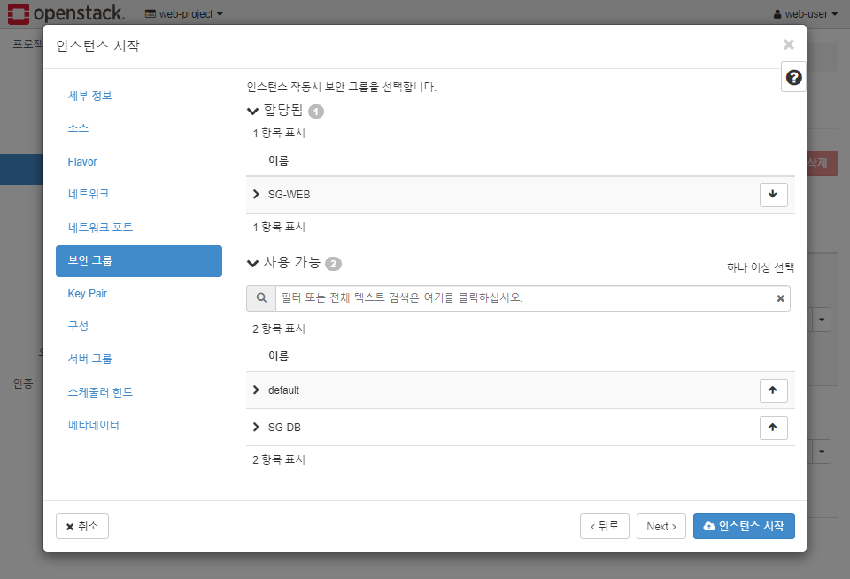
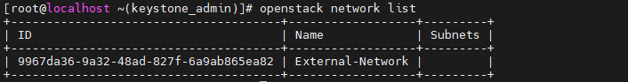
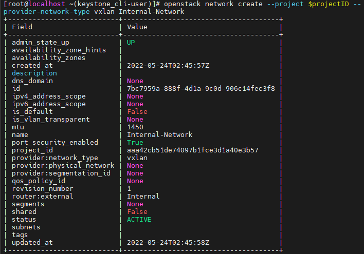
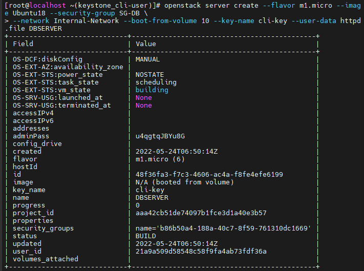
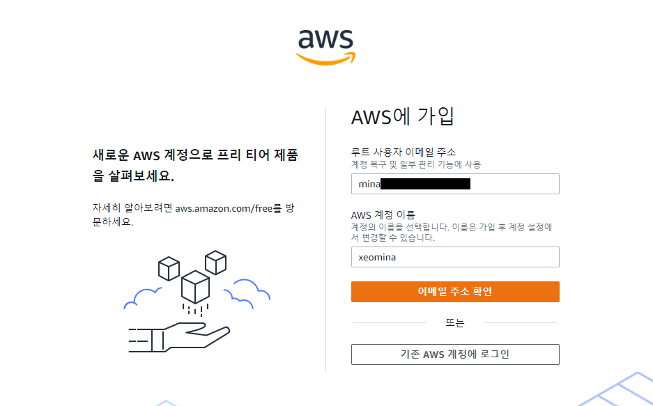
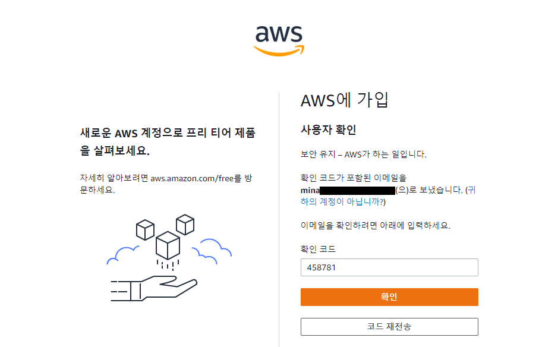

# 0524

## 볼륨확장

### 볼륨

* 프로젝트 > 볼륨 > 볼륨
* webserver


### 유동 IP 연결

* 어제 해제했었음..


### 디스크 공간 확인

```
$ lsblk
NAME   MAJ:MIN RM SIZE RO TYPE MOUNTPOINT
vda    253:0    0  15G  0 disk
└─vda1 253:1    0  15G  0 part /
```

```
$ df -h
Filesystem      Size  Used Avail Use% Mounted on
devtmpfs        472M     0  472M   0% /dev
tmpfs           496M     0  496M   0% /dev/shm
tmpfs           496M   13M  483M   3% /run
tmpfs           496M     0  496M   0% /sys/fs/cgroup
/dev/vda1        15G  1.1G   14G   8% /
tmpfs           100M     0  100M   0% /run/user/1000
```


## key 분실의 경우

* 파일 생성 후 확인해보기..

```
$ touch hello.txt
[centos@webserver ~]$ ls
hello.txt  wordpress-4.8.2-ko_KR.zip
```


### 유동 IP 연결 해제

* 프로젝트 > Compute > 인스턴스


### 인스턴스 삭제

* 컴퓨트 서비스(노바)는 삭제되고
* 스토리지 서비스(신더)는 남아있음


### 볼륨으로 인스턴스 생성

* 프로젝트 > 볼륨 > 볼륨


* 이름 : webserver


* 부팅 소스 : 볼륨


* flavor : m1.micro


* 보안 그룹 : SG-WEB



* 키 페어 : 새로 만든 new-key2


### 유동 IP 다시 연결


### 파일 확인

```
$ ls
hello.txt  wordpress-4.8.2-ko_KR.zip
```


## CLI 작업 (ad-hoc 애드혹)

### 관리 계정

* 그냥 프로젝트 생성 불가 x - 로그인 필요

```
# openstack project create --domain Default --description "cli-project" cli-project
Missing value auth-url required for auth plugin password
```

* `keystonerc_admin` : 토큰 정보가 있는 파일
  * `(keystone_admin)` : 로그인 되면 출력

```
# ls
anaconda-ks.cfg  answers.txt  keystonerc_admin

# cat keystonerc_admin
unset OS_SERVICE_TOKEN		# 토큰 정보
    export OS_USERNAME=admin
    export OS_PASSWORD='Test1234!'
    export OS_REGION_NAME=RegionOne
    export OS_AUTH_URL=http://192.168.0.136:5000/v3
    export PS1='[\u@\h \W(keystone_admin)]\$ '

export OS_PROJECT_NAME=admin
export OS_USER_DOMAIN_NAME=Default
export OS_PROJECT_DOMAIN_NAME=Default
export OS_IDENTITY_API_VERSION=3
```

* admin으로 로그인

```
# source keystonerc_admin
[root@localhost ~(keystone_admin)]#
```

### Project

* 다시 프로젝트 생성

```
# openstack project create --domain Default --description "cli-project" cli-project
+-------------+----------------------------------+
| Field       | Value                            |
+-------------+----------------------------------+
| description | cli-project                      |
| domain_id   | default                          |
| enabled     | True                             |
| id          | aaa42cb51de74097b1fce3d1a40e3b57 |
| is_domain   | False                            |
| name        | cli-project                      |
| options     | {}                               |
| parent_id   | dafault                          |
| tags        | []                               |
+-------------+----------------------------------+
```


* project 확인

```
# openstack project list
+----------------------------------+-------------+
| ID                               | Name        |
+----------------------------------+-------------+
| 918d6c422d914b87bc0d9210ba48e3a2 | admin       |
| a10cf2ce4aa841f6aabecc8240ec6691 | web-project |
| aaa42cb51de74097b1fce3d1a40e3b57 | cli-project |
| e962802b9ea941c999b6639933cbd091 | services    |
+----------------------------------+-------------+
```


### User

* User 생성
* `--password-prompt` : Prompt interactively for password

```
# openstack user create --domain Default --project cli-project --password-prompt cli-user
+---------------------+----------------------------------+
| Field               | Value                            |
+---------------------+----------------------------------+
| description         | cli-project                      |
| domain_id           | default                          |
| enabled             | True                             |
| id                  | 21a9a509d58548c58f9fa4ab73fdf36a |
| name                | cli-user                         |
| options             | {}                               |
| password_expires_at | None                             |
+---------------------+----------------------------------+
```


* User 확인

```
# openstack user list
+----------------------------------+------------+
| ID                               | Name       |
+----------------------------------+------------+
| e15efd5877274df28355e1bb4bce771e | admin      |
| 0a1ad9ca38d848b794f9d7e9c20a025f | heat_admin |
| 22d9c7397b904576894d42f1b61000a4 | glance     |
| d24c6455d53842e78d4549ba26b0fb0f | cinder     |
| 11fa43efd1654d60b55c0f37817b2dd4 | nova       |
| 6bc07433d05e41eda2cae424ba6f8cdd | placement  |
| 5b6c29fba92347a189b24ec39a197816 | neutron    |
| 16d134a31fda4ac4b7f0660236082ebf | swift      |
| ce468a260bfa43d081005525ee9490bc | heat       |
| 6eab6fa9adaf49e5afdcd7285784f4cc | heat-cfn   |
| 9a331d09456145f3a5c52828618adb38 | web-user   |
| 21a9a509d58548c58f9fa4ab73fdf36a | cli-user   |
+----------------------------------+------------+
```


* User role  추가

```
# openstack role add --project cli-project --user cli-user _member_
```

### Flavor

```
# openstack flavor create --id 6 --vcpus 1 --ram 1024 --disk 10 m1.micro
+----------------------------+----------+
| Field                      | Value    |
+----------------------------+----------+
| OS-FLV-DISABLED:disabled   | False    |
| OS-FLV-EXT-DATA:ephemeral  | 0        |
| description                | None     |
| disk                       | 10       |
| id                         | 6        |
| name                       | m1.micro |
| os-flavor-access:is_public | True     |
| properties                 |          |
| ram                        | 1024     |
| rxtx_factor                | 1.0      |
| swap                       |          |
| vcpus                      | 1        |
+----------------------------+----------+
```


* flavor 확인

```
# openstack flavor list
+----+-----------+-------+------+-----------+-------+-----------+
| ID | Name      |   RAM | Disk | Ephemeral | VCPUs | Is Public |
+----+-----------+-------+------+-----------+-------+-----------+
| 1  | m1.tiny   |   512 |    1 |         0 |     1 | True      |
| 2  | m1.small  |  2048 |   20 |         0 |     1 | True      |
| 3  | m1.medium |  4096 |   40 |         0 |     2 | True      |
| 4  | m1.large  |  8192 |   80 |         0 |     4 | True      |
| 5  | m1.xlarge | 16384 |  160 |         0 |     8 | True      |
| 6  | m1.micro  |  1024 |   10 |         0 |     1 | True      |
+----+-----------+-------+------+-----------+-------+-----------+
```


### External Network

#### External-Network

```
# openstack network create --project admin --provider-network-type flat --provider-physical-network extnet --external External-Network
+---------------------------+--------------------------------------+
| Field                     | Value                                |
+---------------------------+--------------------------------------+
| admin_state_up            | UP                                   |
| availability_zone_hints   |                                      |
| availability_zones        |                                      |
| created_at                | 2022-05-24T02:10:22Z                 |
| description               |                                      |
| dns_domain                | None                                 |
| id                        | 9967da36-9a32-48ad-827f-6a9ab865ea82 |
| ipv4_address_scope        | None                                 |
| ipv6_address_scope        | None                                 |
| is_default                | False                                |
| is_vlan_transparent       | None                                 |
| mtu                       | 1500                                 |
| name                      | External-Network                     |
| port_security_enabled     | True                                 |
| project_id                | 918d6c422d914b87bc0d9210ba48e3a2     |
| provider:network_type     | flat                                 |
| provider:physical_network | extnet                               |
| provider:segmentation_id  | None                                 |
| qos_policy_id             | None                                 |
| revision_number           | 1                                    |
| router:external           | External                             |
| segments                  | None                                 |
| shared                    | False                                |
| status                    | ACTIVE                               |
| subnets                   |                                      |
| tags                      |                                      |
| updated_at                | 2022-05-24T02:10:22Z                 |
+---------------------------+--------------------------------------+
```


* network 확인

```
# openstack network list
+--------------------------------------+------------------+---------+
| ID                                   | Name             | Subnets |
+--------------------------------------+------------------+---------+
| 9967da36-9a32-48ad-827f-6a9ab865ea82 | External-Network |         |
+--------------------------------------+------------------+---------+
```



#### External-Subnet

```
# openstack subnet create --network External-Network --project admin --subnet-range 192.168.0.0/20 --allocation-pool start=192.168.9.1,end=192.168.9.126 --gateway 192.168.0.1 --no-dhcp External-Subnet
+----------------------+--------------------------------------+
| Field                | Value                                |
+----------------------+--------------------------------------+
| allocation_pools     | 192.168.9.1-192.168.9.126            |
| cidr                 | 192.168.0.0/20                       |
| created_at           | 2022-05-24T02:18:40Z                 |
| description          |                                      |
| dns_nameservers      |                                      |
| dns_publish_fixed_ip | None                                 |
| enable_dhcp          | False                                |
| gateway_ip           | 192.168.0.1                          |
| host_routes          |                                      |
| id                   | 3519cf9a-13f5-4fe0-85a7-694ee0a065ea |
| ip_version           | 4                                    |
| ipv6_address_mode    | None                                 |
| ipv6_ra_mode         | None                                 |
| name                 | External-Subnet                      |
| network_id           | 9967da36-9a32-48ad-827f-6a9ab865ea82 |
| project_id           | 918d6c422d914b87bc0d9210ba48e3a2     |
| revision_number      | 0                                    |
| segment_id           | None                                 |
| service_types        |                                      |
| subnetpool_id        | None                                 |
| tags                 |                                      |
| updated_at           | 2022-05-24T02:18:40Z                 |
+----------------------+--------------------------------------+
```


* subnet 확인

```
[root@localhost ~(keystone_admin)]# openstack subnet list
+--------------------------------------+-----------------+--------------------------------------+----------------+
| ID                                   | Name            | Network                              | Subnet         |
+--------------------------------------+-----------------+--------------------------------------+----------------+
| 3519cf9a-13f5-4fe0-85a7-694ee0a065ea | External-Subnet | 9967da36-9a32-48ad-827f-6a9ab865ea82 | 192.168.0.0/20 |
+--------------------------------------+-----------------+--------------------------------------+----------------+
```


* 좀 더 자세히..IP까지!

```
[root@localhost ~(keystone_admin)]# openstack subnet show External-Subnet
+----------------------+--------------------------------------+
| Field                | Value                                |
+----------------------+--------------------------------------+
| allocation_pools     | 192.168.9.1-192.168.9.126            |
| cidr                 | 192.168.0.0/20                       |
| created_at           | 2022-05-24T02:18:40Z                 |
| description          |                                      |
| dns_nameservers      |                                      |
| dns_publish_fixed_ip | None                                 |
| enable_dhcp          | False                                |
| gateway_ip           | 192.168.0.1                          |
| host_routes          |                                      |
| id                   | 3519cf9a-13f5-4fe0-85a7-694ee0a065ea |
| ip_version           | 4                                    |
| ipv6_address_mode    | None                                 |
| ipv6_ra_mode         | None                                 |
| name                 | External-Subnet                      |
| network_id           | 9967da36-9a32-48ad-827f-6a9ab865ea82 |
| project_id           | 918d6c422d914b87bc0d9210ba48e3a2     |
| revision_number      | 0                                    |
| segment_id           | None                                 |
| service_types        |                                      |
| subnetpool_id        | None                                 |
| tags                 |                                      |
| updated_at           | 2022-05-24T02:18:40Z                 |
+----------------------+--------------------------------------+
```


###  Token 

* `keystonerc_cli-user` 파일 생성
  * `cli-user`의 토큰

```
# vi keystonerc_cli-user
unset OS_SERVICE_TOKEN
    export OS_USERNAME=cli-user
    export OS_PASSWORD='Test1234!'
    export OS_REGION_NAME=RegionOne
    export OS_AUTH_URL=http://192.168.0.136:5000/v3
    export PS1='[\u@\h \W(keystone_cli-user)]\$ '

export OS_PROJECT_NAME=cli-project
export OS_USER_DOMAIN_NAME=Default
export OS_PROJECT_DOMAIN_NAME=Default
export OS_IDENTITY_API_VERSION=3
```

* cli-user 로그인

```
# source keystonerc_cli-user
```

### Internal Network

* `policy.yaml` 파일 설정
  * `create_network/floatingip`를 `cli-user`가 사용할 수 있도록

```
# vi /etc/neutron/policy.yaml
"create_network:provider:network_type": "role:admin or project_id:%(project_id)s"
"create_floatingip:floating_ip_address": "role:admin or project_id:%(project_id)s"
```

* `projectID` 변수 생성

```
# projectID=$(openstack project list | grep cli-project | awk '{print $2}')
# echo $projectID
aaa42cb51de74097b1fce3d1a40e3b57
```

---------

**Cf) 변수 정의 방법**

```
# projectID=$(openstack project list | grep cli-project | awk '{print $2}')
```

```
# openstack project list | grep cli-project
| aaa42cb51de74097b1fce3d1a40e3b57 | cli-project |

# openstack project list | grep cli-project | awk '{print$2}'
aaa42cb51de74097b1fce3d1a40e3b57
```

--------

#### Internal-Network

```
# openstack network create --project $projectID --provider-network-type vxlan Internal-Network
+---------------------------+--------------------------------------+
| Field                     | Value                                |
+---------------------------+--------------------------------------+
| admin_state_up            | UP                                   |
| availability_zone_hints   |                                      |
| availability_zones        |                                      |
| created_at                | 2022-05-24T02:45:57Z                 |
| description               |                                      |
| dns_domain                | None                                 |
| id                        | 7bc7959a-888f-4d1a-9c0d-906c14fec3f8 |
| ipv4_address_scope        | None                                 |
| ipv6_address_scope        | None                                 |
| is_default                | False                                |
| is_vlan_transparent       | None                                 |
| mtu                       | 1450                                 |
| name                      | Internal-Network                     |
| port_security_enabled     | True                                 |
| project_id                | aaa42cb51de74097b1fce3d1a40e3b57     |
| provider:network_type     | vxlan                                |
| provider:physical_network | None                                 |
| provider:segmentation_id  | None                                 |
| qos_policy_id             | None                                 |
| revision_number           | 1                                    |
| router:external           | Internal                             |
| segments                  | None                                 |
| shared                    | False                                |
| status                    | ACTIVE                               |
| subnets                   |                                      |
| tags                      |                                      |
| updated_at                | 2022-05-24T02:45:58Z                 |
+---------------------------+--------------------------------------+
```



* network 확인

```
# openstack network list
+--------------------------------------+------------------+--------------------------------------+
| ID                                   | Name             | Subnets                              |
+--------------------------------------+------------------+--------------------------------------+
| 7bc7959a-888f-4d1a-9c0d-906c14fec3f8 | Internal-Network |                                      |
| 9967da36-9a32-48ad-827f-6a9ab865ea82 | External-Network | 3519cf9a-13f5-4fe0-85a7-694ee0a065ea |
+--------------------------------------+------------------+--------------------------------------+
```


#### Internal-Subnet

```
# openstack subnet create --network Internal-Network --subnet-range 10.23.0.0/20 --gateway 10.23.0.1 --dhcp --dns-nameserver 192.168.0.66 --dns-nameserver 8.8.8.8 Internal-Subnet
+----------------------+--------------------------------------+
| Field                | Value                                |
+----------------------+--------------------------------------+
| allocation_pools     | 10.23.0.2-10.23.15.254               |
| cidr                 | 10.23.0.0/20                         |
| created_at           | 2022-05-24T03:18:56Z                 |
| description          |                                      |
| dns_nameservers      | 192.168.0.66, 8.8.8.8                |
| dns_publish_fixed_ip | None                                 |
| enable_dhcp          | True                                 |
| gateway_ip           | 10.23.0.1                            |
| host_routes          |                                      |
| id                   | 3724cd89-3b5c-4988-b55d-6a22b7f926e7 |
| ip_version           | 4                                    |
| ipv6_address_mode    | None                                 |
| ipv6_ra_mode         | None                                 |
| name                 | Internal-Subnet                      |
| network_id           | 7bc7959a-888f-4d1a-9c0d-906c14fec3f8 |
| project_id           | aaa42cb51de74097b1fce3d1a40e3b57     |
| revision_number      | 0                                    |
| segment_id           | None                                 |
| service_types        |                                      |
| subnetpool_id        | None                                 |
| tags                 |                                      |
| updated_at           | 2022-05-24T03:18:56Z                 |
+----------------------+--------------------------------------+

```


* subnet 확인

```
# openstack subnet list
+--------------------------------------+-----------------+--------------------------------------+--------------+
| ID                                   | Name            | Network                              | Subnet       |
+--------------------------------------+-----------------+--------------------------------------+--------------+
| 3724cd89-3b5c-4988-b55d-6a22b7f926e7 | Internal-Subnet | 7bc7959a-888f-4d1a-9c0d-906c14fec3f8 | 10.23.0.0/20 |
+--------------------------------------+-----------------+--------------------------------------+--------------+

```


* 자세히..

```
# openstack subnet show Internal-Subnet
+----------------------+--------------------------------------+
| Field                | Value                                |
+----------------------+--------------------------------------+
| allocation_pools     | 10.23.0.2-10.23.15.254               |
| cidr                 | 10.23.0.0/20                         |
| created_at           | 2022-05-24T03:18:56Z                 |
| description          |                                      |
| dns_nameservers      | 192.168.0.66, 8.8.8.8                |
| dns_publish_fixed_ip | None                                 |
| enable_dhcp          | True                                 |
| gateway_ip           | 10.23.0.1                            |
| host_routes          |                                      |
| id                   | 3724cd89-3b5c-4988-b55d-6a22b7f926e7 |
| ip_version           | 4                                    |
| ipv6_address_mode    | None                                 |
| ipv6_ra_mode         | None                                 |
| name                 | Internal-Subnet                      |
| network_id           | 7bc7959a-888f-4d1a-9c0d-906c14fec3f8 |
| project_id           | aaa42cb51de74097b1fce3d1a40e3b57     |
| revision_number      | 0                                    |
| segment_id           | None                                 |
| service_types        |                                      |
| subnetpool_id        | None                                 |
| tags                 |                                      |
| updated_at           | 2022-05-24T03:18:56Z                 |
+----------------------+--------------------------------------+
```


### Router

```
# openstack router create Router
+-------------------------+--------------------------------------+
| Field                   | Value                                |
+-------------------------+--------------------------------------+
| admin_state_up          | UP                                   |
| availability_zone_hints |                                      |
| availability_zones      |                                      |
| created_at              | 2022-05-24T03:11:14Z                 |
| description             |                                      |
| external_gateway_info   | null                                 |
| flavor_id               | None                                 |
| id                      | b5c58578-461e-411e-8055-606086963b47 |
| name                    | Router                               |
| project_id              | aaa42cb51de74097b1fce3d1a40e3b57     |
| revision_number         | 1                                    |
| routes                  |                                      |
| status                  | ACTIVE                               |
| tags                    |                                      |
| updated_at              | 2022-05-24T03:11:14Z                 |
+-------------------------+--------------------------------------
```


* External-Network와 Router 연결

```
# openstack router set --external-gateway External-Network Router
```

* Router에 Internal-Subnet 추가

```
# openstack router add subnet Router Internal-Subnet
```


### Security Group

**Cf) outbound vs. inbound**

- 내보냄 = outbound = egress :
  - VM에서 밖으로, all allow
- 들어옴 = inbound = ingress :
  - 밖에서 VM으로, all deny(block)

**Cf) src vs. dst**

- 출발지 = source(src); src ip, src port
- 목적지 = destination(dst); dst ip, dst port

#### SG-WEB

```
# openstack security group create SG-WEB
```

* ICMP
  * ping

```
# openstack security group rule create --protocol icmp --ingress SG-WEB
+-------------------------+--------------------------------------+
| Field                   | Value                                |
+-------------------------+--------------------------------------+
| created_at              | 2022-05-24T03:24:07Z                 |
| description             |                                      |
| direction               | ingress                              |
| ether_type              | IPv4                                 |
| id                      | 3caf9a63-c9e3-4477-a8d8-d61786391da6 |
| name                    | None                                 |
| port_range_max          | None                                 |
| port_range_min          | None                                 |
| project_id              | aaa42cb51de74097b1fce3d1a40e3b57     |
| protocol                | icmp                                 |
| remote_address_group_id | None                                 |
| remote_group_id         | None                                 |
| remote_ip_prefix        | 0.0.0.0/0                            |
| revision_number         | 0                                    |
| security_group_id       | 372402a2-c421-43a0-ae1f-4609022b2d12 |
| tags                    | []                                   |
| tenant_id               | aaa42cb51de74097b1fce3d1a40e3b57     |
| updated_at              | 2022-05-24T03:24:07Z                 |
+-------------------------+--------------------------------------+
```


* tcp port 22 
  * SSH

```
# openstack security group rule create --protocol tcp --dst-port 22 SG-WEB
+-------------------------+--------------------------------------+
| Field                   | Value                                |
+-------------------------+--------------------------------------+
| created_at              | 2022-05-24T03:28:04Z                 |
| description             |                                      |
| direction               | ingress                              |
| ether_type              | IPv4                                 |
| id                      | f1f478b8-ceb7-43ab-af30-7b3c9f6bd791 |
| name                    | None                                 |
| port_range_max          | 22                                   |
| port_range_min          | 22                                   |
| project_id              | aaa42cb51de74097b1fce3d1a40e3b57     |
| protocol                | tcp                                  |
| remote_address_group_id | None                                 |
| remote_group_id         | None                                 |
| remote_ip_prefix        | 0.0.0.0/0                            |
| revision_number         | 0                                    |
| security_group_id       | 372402a2-c421-43a0-ae1f-4609022b2d12 |
| tags                    | []                                   |
| tenant_id               | aaa42cb51de74097b1fce3d1a40e3b57     |
| updated_at              | 2022-05-24T03:28:04Z                 |
+-------------------------+--------------------------------------+
```


* tcp port 80
  * HTTP

```
# openstack security group rule create --protocol tcp --dst-port 80 SG-WEB
+-------------------------+--------------------------------------+
| Field                   | Value                                |
+-------------------------+--------------------------------------+
| created_at              | 2022-05-24T03:33:11Z                 |
| description             |                                      |
| direction               | ingress                              |
| ether_type              | IPv4                                 |
| id                      | b22a6286-f66a-4707-9064-1b871bd80b81 |
| name                    | None                                 |
| port_range_max          | 80                                   |
| port_range_min          | 80                                   |
| project_id              | aaa42cb51de74097b1fce3d1a40e3b57     |
| protocol                | tcp                                  |
| remote_address_group_id | None                                 |
| remote_group_id         | None                                 |
| remote_ip_prefix        | 0.0.0.0/0                            |
| revision_number         | 0                                    |
| security_group_id       | 372402a2-c421-43a0-ae1f-4609022b2d12 |
| tags                    | []                                   |
| tenant_id               | aaa42cb51de74097b1fce3d1a40e3b57     |
| updated_at              | 2022-05-24T03:33:11Z                 |
+-------------------------+--------------------------------------+
```


#### SG-DB

```
# openstack security group create SG-DB
```

* ICMP

```
# openstack security group rule create --protocol icmp SG-DB
+-------------------------+--------------------------------------+
| Field                   | Value                                |
+-------------------------+--------------------------------------+
| created_at              | 2022-05-24T03:34:55Z                 |
| description             |                                      |
| direction               | ingress                              |
| ether_type              | IPv4                                 |
| id                      | 6b92d39d-ef2b-4a2b-a531-8bcee5a09201 |
| name                    | None                                 |
| port_range_max          | None                                 |
| port_range_min          | None                                 |
| project_id              | aaa42cb51de74097b1fce3d1a40e3b57     |
| protocol                | icmp                                 |
| remote_address_group_id | None                                 |
| remote_group_id         | None                                 |
| remote_ip_prefix        | 0.0.0.0/0                            |
| revision_number         | 0                                    |
| security_group_id       | b86b50a4-188a-40c7-8f59-761310dc1669 |
| tags                    | []                                   |
| tenant_id               | aaa42cb51de74097b1fce3d1a40e3b57     |
| updated_at              | 2022-05-24T03:34:55Z                 |
+-------------------------+--------------------------------------+
```


* SSH

```
# openstack security group rule create --protocol tcp --dst-port 22 SG-DB
+-------------------------+--------------------------------------+
| Field                   | Value                                |
+-------------------------+--------------------------------------+
| created_at              | 2022-05-24T03:37:23Z                 |
| description             |                                      |
| direction               | ingress                              |
| ether_type              | IPv4                                 |
| id                      | 58e04efd-0beb-4cb2-8b20-821b7f774deb |
| name                    | None                                 |
| port_range_max          | 22                                   |
| port_range_min          | 22                                   |
| project_id              | aaa42cb51de74097b1fce3d1a40e3b57     |
| protocol                | tcp                                  |
| remote_address_group_id | None                                 |
| remote_group_id         | None                                 |
| remote_ip_prefix        | 0.0.0.0/0                            |
| revision_number         | 0                                    |
| security_group_id       | b86b50a4-188a-40c7-8f59-761310dc1669 |
| tags                    | []                                   |
| tenant_id               | aaa42cb51de74097b1fce3d1a40e3b57     |
| updated_at              | 2022-05-24T03:37:23Z                 |
+-------------------------+--------------------------------------+
```


* 3306
  * MYSQL

```
# openstack security group rule create --protocol tcp --dst-port 3306 SG-DB
+-------------------------+--------------------------------------+
| Field                   | Value                                |
+-------------------------+--------------------------------------+
| created_at              | 2022-05-24T03:36:42Z                 |
| description             |                                      |
| direction               | ingress                              |
| ether_type              | IPv4                                 |
| id                      | 23292ab8-3648-4d67-8c24-0eb71b3ab43e |
| name                    | None                                 |
| port_range_max          | 3306                                 |
| port_range_min          | 3306                                 |
| project_id              | aaa42cb51de74097b1fce3d1a40e3b57     |
| protocol                | tcp                                  |
| remote_address_group_id | None                                 |
| remote_group_id         | None                                 |
| remote_ip_prefix        | 0.0.0.0/0                            |
| revision_number         | 0                                    |
| security_group_id       | b86b50a4-188a-40c7-8f59-761310dc1669 |
| tags                    | []                                   |
| tenant_id               | aaa42cb51de74097b1fce3d1a40e3b57     |
| updated_at              | 2022-05-24T03:36:42Z                 |
+-------------------------+--------------------------------------+
```


* 

```
# ls ~/.ssh/
authorized_keys  id_rsa  id_rsa.pub
```


### KeyPair

```
# openstack keypair create --public-key ~/.ssh/id_rsa.pub cli-key
+-------------+-------------------------------------------------+
| Field       | Value                                           |
+-------------+-------------------------------------------------+
| created_at  | None                                            |
| fingerprint | 98:d5:36:81:86:d9:cc:cc:a4:82:87:9b:3c:d5:97:aa |
| id          | cli-key                                         |
| is_deleted  | None                                            |
| name        | cli-key                                         |
| type        | ssh                                             |
| user_id     | 21a9a509d58548c58f9fa4ab73fdf36a                |
+-------------+-------------------------------------------------+
```


```
# openstack keypair list
+---------+-------------------------------------------------+------+
| Name    | Fingerprint                                     | Type |
+---------+-------------------------------------------------+------+
| cli-key | 98:d5:36:81:86:d9:cc:cc:a4:82:87:9b:3c:d5:97:aa | ssh  |
+---------+-------------------------------------------------+------+
```


### Image

#### CentOS7

*


*

```
# openstack image create --file CentOS-7-x86_64-GenericCloud-2111.qcow2 --disk-format qcow2 --container-format bare CentOS7
```

*

```
# openstack image list
+--------------------------------------+---------+--------+
| ID                                   | Name    | Status |
+--------------------------------------+---------+--------+
| bcd9cbd3-0d61-4af1-915c-4f8764ac6ba9 | CentOS7 | active |
+--------------------------------------+---------+--------+
```


#### Ubuntu18


*

```
# openstack image create --file bionic-server-cloudimg-amd64.img --disk-format qcow2 --container-format bare Ubuntu18
```

*

```
# openstack image list
+--------------------------------------+----------+--------+
| ID                                   | Name     | Status |
+--------------------------------------+----------+--------+
| bcd9cbd3-0d61-4af1-915c-4f8764ac6ba9 | CentOS7  | active |
| 3b1ff645-6fa2-4cef-b56f-00afedbe95c6 | Ubuntu18 | active |
+--------------------------------------+----------+--------+
```


### Container

* `files` 컨테이너 생성

```
# openstack container create files
+---------------------------------------+-----------+------------------------------------+
| account                               | container | x-trans-id                         |
+---------------------------------------+-----------+------------------------------------+
| AUTH_aaa42cb51de74097b1fce3d1a40e3b57 | files     | txc46846f23c0f4b4d8effb-00628c6e69 |
+---------------------------------------+-----------+------------------------------------+
```


* 컨테이너 확인

```
# openstack container list
+-------+
| Name  |
+-------+
| files |
+-------+
```


```
# vi httpd.file
#!/bin/bash
setenforce 0
sed -i 's/^SELINUX=enforcing$/SELINUX=disabled/' /etc/selinux/config
sed -i 's/^SELINUX=enforcing$/SELINUX=disabled/' /etc/sysconfig/selinux
yum install -y httpd php php-mysql php-gd php-mbstring wget unzip
cd /home/centos
wget http://192.168.0.136:8080/v1/AUTH_aaa42cb51de74097b1fce3d1a40e3b57/files/wordpress-4.8.2-ko_KR.zip
cd /var/www/html
unzip /home/centos/wordpress-4.8.2-ko_KR.zip
mv ./wordpress/* .
chown -R apache:apache /var/www/*
systemctl enable --now httpd
```


### Floating IP

* 외부 네트워크에서 임의의 유동 ip 생성
  * 192.168.9.66 

```
# openstack floating ip create External-Network
+---------------------+--------------------------------------+
| Field               | Value                                |
+---------------------+--------------------------------------+
| created_at          | 2022-05-24T05:23:09Z                 |
| description         |                                      |
| dns_domain          | None                                 |
| dns_name            | None                                 |
| fixed_ip_address    | None                                 |
| floating_ip_address | 192.168.9.66                         |
| floating_network_id | 9967da36-9a32-48ad-827f-6a9ab865ea82 |
| id                  | 0529aa7d-6e63-453c-8769-19851607c2c0 |
| name                | 192.168.9.66                         |
| port_details        | None                                 |
| port_id             | None                                 |
| project_id          | aaa42cb51de74097b1fce3d1a40e3b57     |
| qos_policy_id       | None                                 |
| revision_number     | 0                                    |
| router_id           | None                                 |
| status              | DOWN                                 |
| subnet_id           | None                                 |
| tags                | []                                   |
| updated_at          | 2022-05-24T05:23:09Z                 |
+---------------------+--------------------------------------+
```


* 지정하여 유동 ip 생성
  * 192.168.9.94

```
# openstack floating ip create --floating-ip-address 192.168.9.94 External-Network
+---------------------+--------------------------------------+
| Field               | Value                                |
+---------------------+--------------------------------------+
| created_at          | 2022-05-24T05:27:26Z                 |
| description         |                                      |
| dns_domain          | None                                 |
| dns_name            | None                                 |
| fixed_ip_address    | None                                 |
| floating_ip_address | 192.168.9.94                         |
| floating_network_id | 9967da36-9a32-48ad-827f-6a9ab865ea82 |
| id                  | 727618cd-627d-479d-b0e3-81a7e657819c |
| name                | 192.168.9.94                         |
| port_details        | None                                 |
| port_id             | None                                 |
| project_id          | aaa42cb51de74097b1fce3d1a40e3b57     |
| qos_policy_id       | None                                 |
| revision_number     | 0                                    |
| router_id           | None                                 |
| status              | DOWN                                 |
| subnet_id           | None                                 |
| tags                | []                                   |
| updated_at          | 2022-05-24T05:27:26Z                 |
+---------------------+--------------------------------------+
```


* ip 확인

```
# openstack floating ip list
+--------------------------------------+---------------------+------------------+------+--------------------------------------+----------------------------------+
| ID                                   | Floating IP Address | Fixed IP Address | Port | Floating Network                     | Project                          |
+--------------------------------------+---------------------+------------------+------+--------------------------------------+----------------------------------+
| 0529aa7d-6e63-453c-8769-19851607c2c0 | 192.168.9.66        | None             | None | 9967da36-9a32-48ad-827f-6a9ab865ea82 | aaa42cb51de74097b1fce3d1a40e3b57 |
| 727618cd-627d-479d-b0e3-81a7e657819c | 192.168.9.94        | None             | None | 9967da36-9a32-48ad-827f-6a9ab865ea82 | aaa42cb51de74097b1fce3d1a40e3b57 |
+--------------------------------------+---------------------+------------------+------+--------------------------------------+----------------------------------+
```


### Instance

#### WEBSERVER 

```
# openstack server create --flavor m1.micro --image CentOS7 --security-group SG-WEB --network Internal-Network --boot-from-volume 10 --key-name cli-key --user-data httpd.file WEBSERVER
+-----------------------------+---------------------------------------------+
| Field                       | Value                                       |
+-----------------------------+---------------------------------------------+
| OS-DCF:diskConfig           | MANUAL                                      |
| OS-EXT-AZ:availability_zone |                                             |
| OS-EXT-STS:power_state      | NOSTATE                                     |
| OS-EXT-STS:task_state       | scheduling                                  |
| OS-EXT-STS:vm_state         | building                                    |
| OS-SRV-USG:launched_at      | None                                        |
| OS-SRV-USG:terminated_at    | None                                        |
| accessIPv4                  |                                             |
| accessIPv6                  |                                             |
| addresses                   |                                             |
| adminPass                   | bh5V4fHoxM6B                                |
| config_drive                |                                             |
| created                     | 2022-05-24T06:36:56Z                        |
| flavor                      | m1.micro (6)                                |
| hostId                      |                                             |
| id                          | 98a68587-1b84-48f3-8512-e0c89cc7846b        |
| image                       | N/A (booted from volume)                    |
| key_name                    | cli-key                                     |
| name                        | WEBSERVER                                   |
| progress                    | 0                                           |
| project_id                  | aaa42cb51de74097b1fce3d1a40e3b57            |
| properties                  |                                             |
| security_groups             | name='372402a2-c421-43a0-ae1f-4609022b2d12' |
| status                      | BUILD                                       |
| updated                     | 2022-05-24T06:36:56Z                        |
| user_id                     | 21a9a509d58548c58f9fa4ab73fdf36a            |
| volumes_attached            |                                             |
+-----------------------------+---------------------------------------------+
```


* WEBSERVER에 ip 할당

```
# openstack server add floating ip WEBSERVER 192.168.9.94
```

* server 확인

```
# openstack server list
+--------------------------------------+-----------+--------+--------------------------------------------+--------------------------+----------+
| ID                                   | Name      | Status | Networks                                   | Image                    | Flavor   |
+--------------------------------------+-----------+--------+--------------------------------------------+--------------------------+----------+
| 98a68587-1b84-48f3-8512-e0c89cc7846b | WEBSERVER | ACTIVE | Internal-Network=10.23.1.164, 192.168.9.94 | N/A (booted from volume) | m1.micro |
+--------------------------------------+-----------+--------+--------------------------------------------+--------------------------+----------+
```


* 192.168.9.94 접속


### Volume

* WEB01-ADD 생성

```
# openstack volume create --size 8 WEB01-ADD
+---------------------+--------------------------------------+
| Field               | Value                                |
+---------------------+--------------------------------------+
| attachments         | []                                   |
| availability_zone   | nova                                 |
| bootable            | false                                |
| consistencygroup_id | None                                 |
| created_at          | 2022-05-24T06:46:25.960167           |
| description         | None                                 |
| encrypted           | False                                |
| id                  | 7b0f9ec5-b5ae-4deb-abb6-5d840aa320d5 |
| multiattach         | False                                |
| name                | WEB01-ADD                            |
| properties          |                                      |
| replication_status  | None                                 |
| size                | 8                                    |
| snapshot_id         | None                                 |
| source_volid        | None                                 |
| status              | creating                             |
| type                | iscsi                                |
| updated_at          | None                                 |
| user_id             | 21a9a509d58548c58f9fa4ab73fdf36a     |
+---------------------+--------------------------------------+
```


* volume 확인

```
# openstack volume list
+--------------------------------------+-----------+-----------+------+------------------------------------+
| ID                                   | Name      | Status    | Size | Attached to                        |
+--------------------------------------+-----------+-----------+------+------------------------------------+
| 7b0f9ec5-b5ae-4deb-abb6-5d840aa320d5 | WEB01-ADD | available |    8 |                                    |
| 74cf7cb0-b881-4c1c-a799-3d05f4b64ef0 |           | in-use    |   10 | Attached to WEBSERVER on /dev/vda  |
+--------------------------------------+-----------+-----------+------+------------------------------------+
```


* WEBSERVER에 WEB01-ADD attach

```
# openstack server add volume WEBSERVER WEB01-ADD
+-----------------------+--------------------------------------+
| Field                 | Value                                |
+-----------------------+--------------------------------------+
| ID                    | 7b0f9ec5-b5ae-4deb-abb6-5d840aa320d5 |
| Server ID             | 98a68587-1b84-48f3-8512-e0c89cc7846b |
| Volume ID             | 7b0f9ec5-b5ae-4deb-abb6-5d840aa320d5 |
| Device                | /dev/vdb                             |
| Tag                   | None                                 |
| Delete On Termination | False                                |
+-----------------------+--------------------------------------+
```


### Ssh

* ssh로 WEBSERVER 접근

```
# ssh -i .ssh/id_rsa centos@192.168.9.94
```


### Mount

* 디스크 마운트 확인

```
$ lsblk
NAME   MAJ:MIN RM SIZE RO TYPE MOUNTPOINT
vda    253:0    0  10G  0 disk
└─vda1 253:1    0  10G  0 part /
vdb    253:16   0   8G  0 disk
```


* 디스크 확인

```
$ df -h
Filesystem      Size  Used Avail Use% Mounted on
devtmpfs        472M     0  472M   0% /dev
tmpfs           496M     0  496M   0% /dev/shm
tmpfs           496M   13M  483M   3% /run
tmpfs           496M     0  496M   0% /sys/fs/cgroup
/dev/vda1        10G  1.1G  9.0G  11% /
tmpfs           100M     0  100M   0% /run/user/1000
```


* ext4 포맷

```
$ sudo mkfs -t ext4 /dev/vdb
mke2fs 1.42.9 (28-Dec-2013)
Filesystem label=
OS type: Linux
Block size=4096 (log=2)
Fragment size=4096 (log=2)
Stride=0 blocks, Stripe width=0 blocks
524288 inodes, 2097152 blocks
104857 blocks (5.00%) reserved for the super user
First data block=0
Maximum filesystem blocks=2147483648
64 block groups
32768 blocks per group, 32768 fragments per group
8192 inodes per group
Superblock backups stored on blocks:
        32768, 98304, 163840, 229376, 294912, 819200, 884736, 1605632

Allocating group tables: done
Writing inode tables: done
Creating journal (32768 blocks): done
Writing superblocks and filesystem accounting information: done
```


### Instance

#### DBSERVER 

```
# openstack server create --flavor m1.micro --image Ubuntu18 --security-group SG-DB \
> --network Internal-Network --boot-from-volume 10 --key-name cli-key --user-data httpd.file DBSERVER
+-----------------------------+---------------------------------------------+
| Field                       | Value                                       |
+-----------------------------+---------------------------------------------+
| OS-DCF:diskConfig           | MANUAL                                      |
| OS-EXT-AZ:availability_zone |                                             |
| OS-EXT-STS:power_state      | NOSTATE                                     |
| OS-EXT-STS:task_state       | scheduling                                  |
| OS-EXT-STS:vm_state         | building                                    |
| OS-SRV-USG:launched_at      | None                                        |
| OS-SRV-USG:terminated_at    | None                                        |
| accessIPv4                  |                                             |
| accessIPv6                  |                                             |
| addresses                   |                                             |
| adminPass                   | u4qgtqJBYu8G                                |
| config_drive                |                                             |
| created                     | 2022-05-24T06:50:14Z                        |
| flavor                      | m1.micro (6)                                |
| hostId                      |                                             |
| id                          | 48f36fa3-f7c3-4606-ac4a-f8fe4efe6199        |
| image                       | N/A (booted from volume)                    |
| key_name                    | cli-key                                     |
| name                        | DBSERVER                                    |
| progress                    | 0                                           |
| project_id                  | aaa42cb51de74097b1fce3d1a40e3b57            |
| properties                  |                                             |
| security_groups             | name='b86b50a4-188a-40c7-8f59-761310dc1669' |
| status                      | BUILD                                       |
| updated                     | 2022-05-24T06:50:14Z                        |
| user_id                     | 21a9a509d58548c58f9fa4ab73fdf36a            |
| volumes_attached            |                                             |
+-----------------------------+---------------------------------------------+
```



* server 확인

```
# openstack server list
+--------------------------------------+-----------+--------+--------------------------------------------+--------------------------+----------+
| ID                                   | Name      | Status | Networks                                   | Image                    | Flavor   |
+--------------------------------------+-----------+--------+--------------------------------------------+--------------------------+----------+
| 48f36fa3-f7c3-4606-ac4a-f8fe4efe6199 | DBSERVER  | ACTIVE | Internal-Network=10.23.0.64                | N/A (booted from volume) | m1.micro |
| 98a68587-1b84-48f3-8512-e0c89cc7846b | WEBSERVER | ACTIVE | Internal-Network=10.23.1.164, 192.168.9.94 | N/A (booted from volume) | m1.micro |
+--------------------------------------+-----------+--------+--------------------------------------------+--------------------------+----------+
```


###  Bastion host

* 배스천 호스트(bastion host)는 공인 IP 주소로 프로비저닝되고 SSH를 통해 액세스될 수 있는 인스턴스다.
* 설정되고 나면 배스천 호스트는 점프 서버 역할을 수행하여 공인 IP 주소 없이 프로비저닝된 인스턴스에 대한 보안 연결을 허용한다.
* 출처 : https://cloud.ibm.com/docs/solution-tutorials?topic=solution-tutorials-vpc-secure-management-bastion-server&locale=ko
* WEBSERVER를 경유하여 DBSERVER로...


* WEBSERVER로 key 복사

```
# scp -i .ssh/id_rsa .ssh/id_rsa centos@192.168.9.94:/home/centos
```


* key 확인

```
# ssh -i .ssh/id_rsa centos@192.168.9.94
Last login: Tue May 24 06:51:12 2022 from 192.168.0.136
$ ls
id_rsa  wordpress-4.8.2-ko_KR.zip
```


* key 권한 확인
  * `-rw-------` : 접근 가능 (600)

```
$ ls -al
total 9220
drwx------. 3 centos centos     142 May 24 08:12 .
drwxr-xr-x. 3 root   root        20 May 24 06:42 ..
-rw-------. 1 centos centos     250 May 24 06:57 .bash_history
-rw-r--r--. 1 centos centos      18 Apr  1  2020 .bash_logout
-rw-r--r--. 1 centos centos     193 Apr  1  2020 .bash_profile
-rw-r--r--. 1 centos centos     231 Apr  1  2020 .bashrc
-rw-------. 1 centos centos    2610 May 24 08:12 id_rsa
drwx------. 2 centos centos      29 May 24 06:42 .ssh
-rw-r--r--. 1 root   root   9418591 May 24 06:12 wordpress-4.8.2-ko_KR.zip
```


* Bastion Host

```
$ ssh -i id_rsa ubuntu@10.23.0.64
```


## Maria DB 설치

* update

```
$ sudo apt-get update -y
```

* mariadb server 설치

```
$ sudo apt-get install -y mariadb-server
```

* mysql secure 설정

```
$ sudo mysql_secure_installation
```

* bind-address  비활성화

```
$ sudo vi /etc/mysql/mariadb.conf.d/50-server.cnf
#bind-address            = 127.0.0.1
```

* restart

```
$ sudo systemctl restart mysql
```

* root 계정으로 mysql 접속

```
$ sudo mysql -u root -p
```

* mysql 계정 생성

```
MariaDB [(none)]> CREATE USER 'wpuser'@'%' IDENTIFIED BY 'wppass';
Query OK, 0 rows affected (0.04 sec)

MariaDB [(none)]> CREATE DATABASE IF NOT EXISTS wordpress;
Query OK, 1 row affected (0.03 sec)

MariaDB [(none)]> GRANT ALL PRIVILEGES ON wordpress.* TO 'wpuser'@'%';
Query OK, 0 rows affected (0.01 sec)

MariaDB [(none)]> quit
```


## 워드프레스


##  AWS








