# 0525


# 퍼블릭 클라우드

## 1. 클라우드 컴퓨팅 기술

클라우드 컴퓨팅(cloud computing)은 인터넷 기반 컴퓨팅의 일종으로 정보를 자신의 컴퓨터가 아닌 인터넷에 연결된 다른 컴퓨터로 처리하는 기술을 의미한다. 컴퓨터 처리 자원을 공유하고 데이터를 컴퓨터와 다른 장치들에 요청 시 제공한다. 구성 가능한 컴퓨팅 자원(예: 컴퓨터 네트워크, 서버, 스토리지, 애플리케이션, 서비스)에 대해 어디서나 접근이 가능한, 주문형 접근을 가능케하는 모델이며 최소한의 관리 노력으로 빠르게 예비 및 릴리스를 가능케 한다.

## 2. 클라우드 종류


* AWS - web , Openstack - DB

출처 : http://www.apple-economy.com/news/articleView.html?idxno=62261

### 프라이빗 클라우드

폐쇄형 클라우드(private cloud, 프라이빗 클라우드) 는 오직 하나의 회사 또는 단체를 위해서만 운영되는 클라우드 인프라스트럭처의 하나로, 내부적으로나 서드파이테 의해 관리를 받거나 내외부적으로 호스팅된다.

### 퍼블릭 클라우드

공개형 클라우드(public cloud, 퍼블릭 클라우드)는 공개적 이용을 위해 열린 네트워크를 통해 렌더링되는 클라우드다. 아마존 웹 서비스(AWS), 마이크로소프트, 구글과 같은 공개형 클라우드 서비스 제공자들은 자신들의 데이터 센터를 소유, 운영하고 있으며 접근 방법은 일반적으로 인터넷을 이용한다. AWS와 마이크로소프트는 각각 "AWS Direct Connect"와 "Azure ExpressRoute"라는 직접 연결 서비스들을 제공하며, 이러한 연결은 클라우드 제공자가 제공하는 피어링 포인트에 대한 폐쇄형 연결의 구매나 임대를 고객에게 요구한다.

### 하이브리드 클라우드

혼합형 클라우드(hybrid cloud, 하이브리드 클라우드)는 뚜렷한 실체는 유지하지만 함께 묶여있는 둘 이상의 클라우드(폐쇄형, 커뮤니키, 또는 공개형)의 조합으로, 여러 개의 배치 모델들의 이점을 제공한다. 혼합형 클라우드는 병설(collocation), 매니지드 및 데디케이티드 서비스를 클라우드 자원과 연결하는 기능을 의미할 수도 있다. 가트너는 혼합형 클라우드를 다른 서비스 제공자들로부터 제공되는 폐쇄형, 공개형, 커뮤니티 클라우드 서비스들이 어느 정도 복합된 하나의 클라우드 컴퓨팅  서비스로 정의하고 있다.

### 멀티 클라우드

멀티 클라우드(multi cloud)는 여러 퍼블릭 클라우드, 하이브리드, 온프레미스 및 엣지의 상위 세트다. 멀티 클라우드 배포 모델은 다른 프라이빗 클라우드 또는 온프레미스 인프라의 사용과 관계없이, 컴퓨팅 또는 스토리지 리소스에 대해 둘 이상의 퍼블릭 클라우드 서비스 공급업체를 사용한다. 프라이빗 클라우드 또는 온프레미스 인프라를 포함하는 멀티 클라우드 구축은 하이브리드 멀티 클라우드로 간주된다. 멀티 클라우드 전략은 기업이 사용하기로 선택한 클라우드 서비스에 대해 더 많은 유연성을 제공할 뿐만 아니라 단일 클라우드 호스팅 공급업체(CSP; Cloude Service Provider)에 대한 의존도를 줄인다. (의존도 높아지면 종속됨)

규모면에서는 퍼블릭 클라우드가 제일 크다. 

## 3. 퍼블릭 클라우드

관리 노력과 서비스 공급자의 상호 작용을 최소화하면서 신속하게 제공하거나 해제할 수 있는 구성 가능한 컴퓨팅 리소스(CPU, RAM, 네트워크, 서버, 스토리지, 애플리케이션, 서비스 등)의 공유 풀에 어디서나 편리하게 필요한 시점에 네트워크(인터넷)로 접근할 수 있게 하는 모델이다.

* 필요한 만큼만 원할 때마다 + 인터넷으로 IT 자원을 + 사용할 만큼만 지불하는 + 대용량 서비스

### 퍼블릭 클라우드 서비스 마켓 쉐어


## 4. 퍼블릭 클라우드를 사용하는 이유

* 용이한 IT 인프라 자원 관리
* 빠른 인프라 구축 속도
* 신속한 글로벌 서비스 전개
* **급증하는 과폭주 트래픽에 대한 자동 확대 조정**
* 다양한 서비스로의 확장성 제공

## 5. 서비스로서의 퍼블릭 클라우드 유형


출처: https://docs.microsoft.com/ko-kr/archive/blogs/eva/iaas-paas-saas

* 운영자 점점 사라짐..
* 클라우드 + 데브옵스 : NoOps = 운영자 필요없음
* 최근 과거로 돌아가려는 움직임도.. 종속 회피! (퍼블릭 > 프라이빗)

### 가상화 비교


### 스케일 아웃과 스케일 업 비교

가장 기본적인 수준에서 데이터베이스 스케일링 성능은 다음과 같은 두 가지 유형으로 나눌 수 있습니다. 

1) 스케일 업 : 성능 수준을 변경하거나 탄력적 데이터베이스 풀을 사용하여 워크로드 요구에 맞게 자동으로 조정하지 않고 필요에 따라 컴퓨팅 성능 또는 데이터베이스를 늘리거나 줄이는 **수직적 확장 또는 축소**
2) 스케일 아웃 : 서버 간에 더 빠르고 쉽게 관리할 수 있는 분할이라는 데이터 분할 방법을 사용하여 데이터베이스를 더 추가하거나 큰 데이터베이스를 더 작은 노드로 나누는 **수평적 또는 확장 또는 축소**

대부분 스케일 아웃 (특히, 클라우드 환경에서)


출처 : https://docs.microsoft.com/ko-kr/dotnet/architecture/cloud-native/infrastructure-resiliency-azure

#### 수직으로 스케일 업

수직 스케일링은 쿼리 변경 또는 인덱싱과 같은 기존 데이터베이스 최적화 기술을 사용하여 해결할 수 없는 성능 문제를 해결하기 위해 빠르게 대응해야 하는 경우에 사용됩니다. 스케일 업은 현재 성능 수준이 모든 수요를 충족할 수 없는 워크로드의 급증을 처리하는 데 유용합니다. 스케일 업을 통해 더 많은 리소스를 추가하여 최대 워크로드를 쉽게 처리할 수 있습니다. 그런 다음, 리소스가 더 이상 필요하지 않으면 스케일 다운하여 원래 상태로 돌아가서 클라우드 비용을 절감할 수 있습니다.

반대는 스케일 다운

스케일 업하는 경우:

- 워크로드가 CPU 또는 I/O 제한과 같은 몇 가지 성능 제한에 도달합니다.
- 기존 데이터베이스 최적화로 해결할 수 없는 성능 문제를 해결하기 위해 빠르게 대응해야 합니다.
- 변화하는 대기 시간 요구 사항에 맞게 적응하기 위해 서비스 계층을 변경할 수 있는 솔루션이 필요합니다.

#### 수평으로 스케일 아웃

앱 개발자는 최고 성능 수준에서 작동하는 경우에도 워크로드에 충분한 리소스를 이용할 수 없으면 스케일 아웃 또는 수평 스케일링을 고려하기 시작합니다. 수평 스케일링을 사용하면 데이터가 서버 간에 여러 데이터베이스(또는 분할된 데이터베이스)로 나뉘고 분할된 각 데이터베이스를 독립적으로 스케일 업 또는 스케일 다운할 수 있습니다.

데이터 분할은 어떻게 스케일링 성능을 개선하나요? VM(가상 머신)과 같은 리소스를 추가하여 단일 데이터베이스를 스케일 업하면 결국 실제 하드웨어 제한에 도달하게 됩니다. 데이터 파티션은 각각 별도의 서버에서 호스트되므로 여러 분할된 데이터베이스 간에 데이터를 나누면 시스템을 거의 무제한으로 스케일 아웃할 수 있습니다.

일부 데이터베이스 기술 유형(특히, 비관계형 또는 [NoSQL 데이터베이스](https://azure.microsoft.com/ko-kr/overview/nosql-database/))은 대규모의 관련 없는, 확정되지 않거나 빠르게 변화하는 데이터를 처리할 수 있는 [분할](https://azure.microsoft.com/ko-kr/overview/what-is-database-sharding/)이라는 방식으로 데이터를 수평으로 스케일 아웃하는 고유한 기능으로 개발되었습니다.

또한 원래 스케일 업하거나 스케일 다운하는 서비스를 제공한 일부 관계형(SQL) 데이터베이스 서비스는 비관계형 데이터베이스의 스케일링 성능 이점에 필적하는 흥미로운 옵션을 제공하기 시작했습니다. [Microsoft Azure SQL Database 하이퍼스케일](https://docs.microsoft.com/ko-kr/azure/azure-sql/database/service-tier-hyperscale) 및 [Azure Database for PostgreSQL 하이퍼스케일](https://docs.microsoft.com/ko-kr/azure/postgresql/hyperscale-overview)과 같은 하이퍼스케일 서비스를 사용하면 스토리지를 최대 100TB까지 빠르게 스케일링하고, 필요에 따라 스토리지를 늘릴 수 있는 유연한 클라우드 네이티브 아키텍처를 이용할 수 있으며, 거의 즉시 백업이 가능하고 몇 분 만에 빠른 데이터베이스 복원을 수행할 수 있습니다.

반대는 스케일 인

스케일 아웃하는 경우:

- 모든 앱이 해당 지역에 있는 일부 데이터에 액세스해야 하는 지리적으로 분산된 애플리케이션이 있습니다. 각 앱은 분할된 다른 데이터베이스에 영향을 주지 않고 해당 지역에 연결되어 있는 분할된 데이터베이스에만 액세스합니다.
- 데이터를 분할된 전용 데이터베이스에 삽입하는 지리적으로 분산된 다수의 클라이언트가 있는 글로벌 분할 시나리오(예: 부하 분산)가 있습니다.
- 서비스의 최고 성능 계층에서도 또는 데이터를 단일 데이터베이스에 맞출 수 없는 경우 성능 요구 사항의 최댓값에 도달했습니다.

https://azure.microsoft.com/ko-kr/overview/scaling-out-vs-scaling-up/


## 6. AWS/Azure/GCP 서비스 비교

출처 : https://cloud.google.com/free/docs/aws-azure-gcp-service-comparison


| 서비스 카테고리 | 서비스 유형 | Google Cloud 제품                                            | Google Cloud 제품 설명                                       | AWS 제공                             | Azure 제공                                        |
| :-------------- | :---------- | :----------------------------------------------------------- | :----------------------------------------------------------- | :----------------------------------- | :------------------------------------------------ |
| 컴퓨팅          | 코어 컴퓨팅 | [Cloud GPU](https://cloud.google.com/gpu)                    | 전보다 빠르게 머신러닝 모델을 학습시키고 실행                | Amazon Elastic Compute Cloud(EC2) P3 | GPU Optimized VMs                                 |
| 컴퓨팅          | 코어 컴퓨팅 | [Cloud TPU](https://cloud.google.com/tpu)                    | 그 어느 때보다 빠르게 머신러닝 모델을 학습시키고 실행        | AWS UltraClusters                    | Azure Virtual Machines                            |
| 컴퓨팅          | 코어 컴퓨팅 | [Compute Engine](https://cloud.google.com/compute)           | 고성능 VM을 사용하여 디지털 혁신 속도를 높이세요.            | Amazon Elastic Compute Cloud(EC2)    | Azure Virtual Machines                            |
| 컴퓨팅          | 코어 컴퓨팅 | [Compute Engine 자동 확장 처리](https://cloud.google.com/compute/docs/autoscaler) | 부하의 증감에 따라 관리형 인스턴스 그룹(MIG)에서 VM 인스턴스를 자동으로 추가하거나 삭제합니다. | AWS Autoscaling                      | Azure Autoscale, Azure Virtual Machine Scale Sets |
| 컴퓨팅          | 코어 컴퓨팅 | [OS 로그인](https://cloud.google.com/compute/docs/oslogin)   | 개별 SSH 키를 생성하고 관리할 필요 없이 IAM을 사용하여 인스턴스에 대한 SSH 액세스를 관리합니다. | Amazon EC2 Instance Connect          |                                                   |
| 컴퓨팅          | 코어 컴퓨팅 | [Persistent Disk](https://cloud.google.com/persistent-disk)  | VM 인스턴스를 위한 안정적인 고성능 블록 스토리지입니다.      | Amazon Elastic Block Store(EBS)      | Azure 관리형 디스크                               |


| 서비스 카테고리 | 서비스 유형       | Google Cloud 제품                                            | Google Cloud 제품 설명                                       | AWS 제공                                | Azure 제공                 |
| :-------------- | :---------------- | :----------------------------------------------------------- | :----------------------------------------------------------- | :-------------------------------------- | :------------------------- |
| 네트워킹        | CDN               | [Cloud CDN](https://cloud.google.com/cdn)                    | 웹 콘텐츠와 동영상 콘텐츠를 전역에서 효율적이고 안정적으로 제공합니다. | Amazon CloudFront                       | Azure 콘텐츠 전송 네트워크 |
| 네트워킹        | 연결 관리         | [Network Connectivity Center](https://cloud.google.com/network-connectivity-center) | Google Cloud는 물론 외부에서 네트워크를 배포, 관리, 확장하는 방법을 재정립합니다. | Amazon Transit Gateway, Amazon CloudWAN | Azure Virtual WAN          |
| 네트워킹        | 도메인 및 DNS     | [Cloud DNS](https://cloud.google.com/dns)                    | 자체 DNS 서버와 소프트웨어 관리 부담 없이 DNS에 영역 및 레코드를 게시합니다. | Amazon Route 53                         | Azure DNS                  |
| 네트워킹        | 도메인 및 DNS     | [Cloud Domains](https://cloud.google.com/domains/docs/overview) | Google Cloud에서 도메인을 등록하고 구성합니다.               | Amazon Route 53                         | Azure App Service          |
| 네트워킹        | 부하 분산기       | [Cloud Load Balancing](https://cloud.google.com/load-balancing) | Compute Engine VM 간에 네트워크 트래픽을 효율적으로 분산합니다. | AWS Elastic 부하 분산                   | Azure 부하 분산            |
| 네트워킹        | 네트워크 모니터링 | [Network Intelligence Center](https://cloud.google.com/network-intelligence-center) | 네트워크 모니터링 기능을 중앙화하여 네트워크 구성을 확인하고, 네트워크 성능을 최적화하고, 네트워크 보안을 강화하고, 문제 해결 시간을 단축합니다. | AWS CloudWatch                          | Azure Network Watcher      |

# AWS

## 1.  AWS란?

Amazon Web Services(AWS)는 전 세계적으로 분포한 데이터 센터에서 200개가 넘는 완벽한 기능의 서비스를 제공하는 세계적으로 가장 포괄적이며, 널리 채택되고 있는 클라우드 플랫폼이다. 빠르게 성장하는 스타트업, 가장 큰 규모의 엔터프라이즈, 주요 정부 기관을 포함하여 수백만명의 고객이 AWS를 사용하여 비용을 절감하고, 민첩성을 향상시키고 더 빠르게 혁신하고 있다.

출처: what is aws

## 2. AWS 계정 생성

### 1) 루트 사용자 로그인


### 2) 리전


리전은 동일한 지리적 영역에 위치한 AWS 리소스 집합이다. AWS 리소스를 생성했지만 콘솔에 해당 리소스가 표시되지 않을 경우, 콘솔에 다른 리전의 리소스가 표시되어 있을 수 있다. 일부 리소스(예: Amazon EC2 인스턴스)는 해당 리소스가 생성된 리전에 한정된다. 해당 리소스를 보려면 리전 선택기를 사용하여 리소스가 포함된 리전을 선택한다.

* ap-northeast-2 : 서울 리전(Region)
  * 기본 vpc - 172.31.0.0/16 > 쪼개기!
  * 16 비트 > 20 비트로
* ap-northeast-2a : 가용 영역(Availability Zone; AZ)
  * 2개 이상의 데이터 센터(100km 이내)가 있다.
  * 서브넷(subnet)
  * 172.31.0.0/20
* ap-northeast-2b : 172.31.16.0/20
* ap-northeast-2c : 172.31.32.0/20
* ap-northeast-2d : 172.31.48.0/20


## 3. IAM 

### 1)  IAM 시작

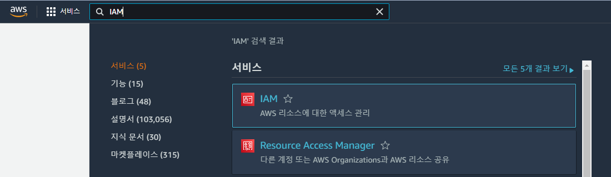

### 2) 사용자 그룹 생성

* admin

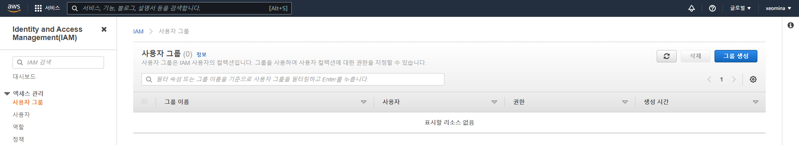

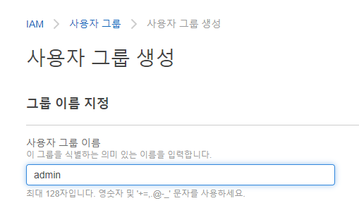

* AdministratorAccess 허용


* 생성 완료


### 3) 사용자 추가

* 콘솔 비밀번호 : 자동 생성 후 재설정


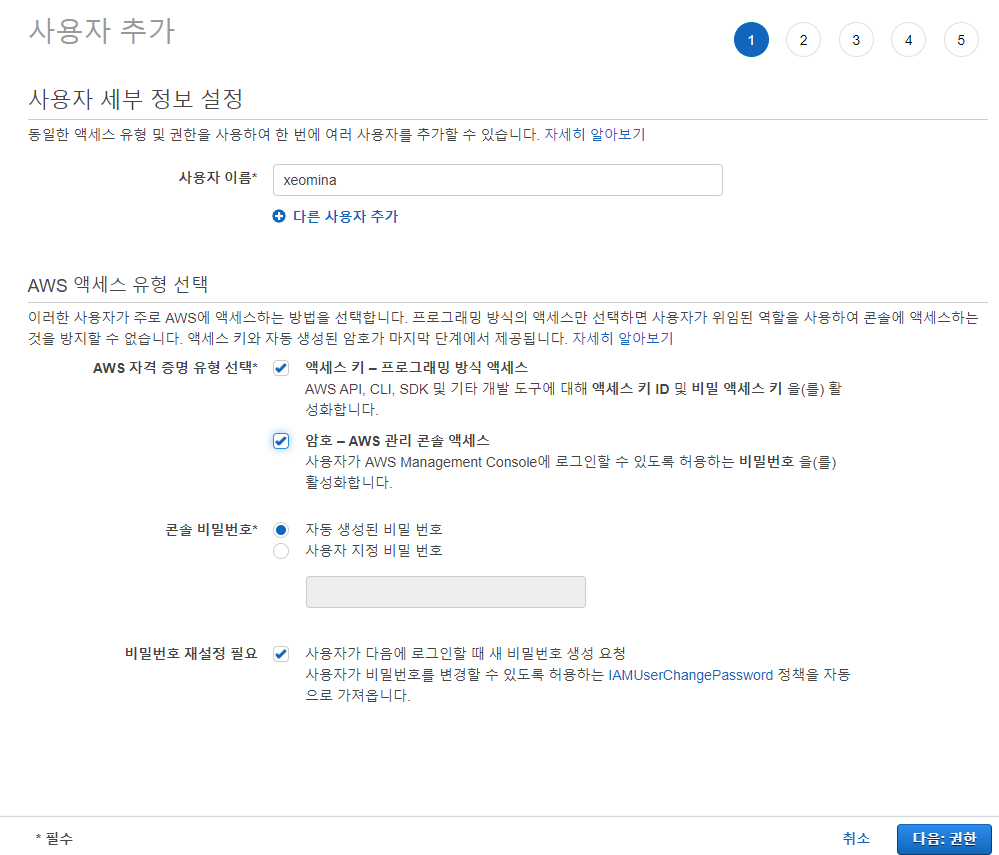

* admin 그룹에 추가

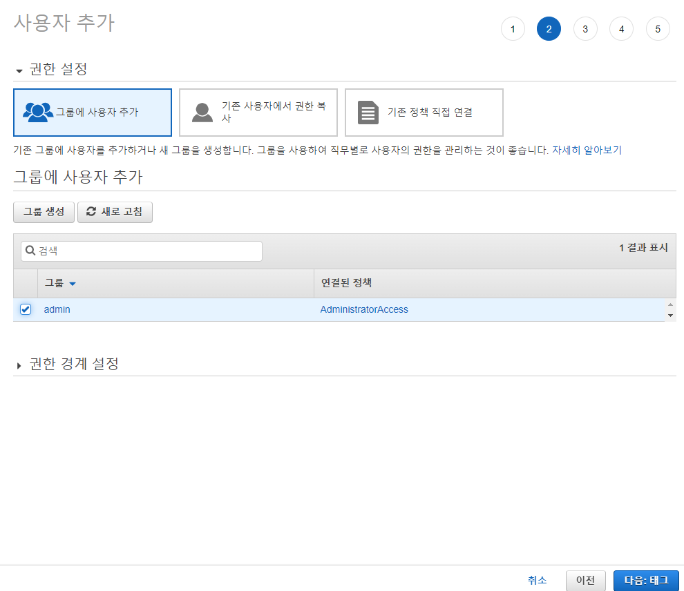

* 사용자 생성

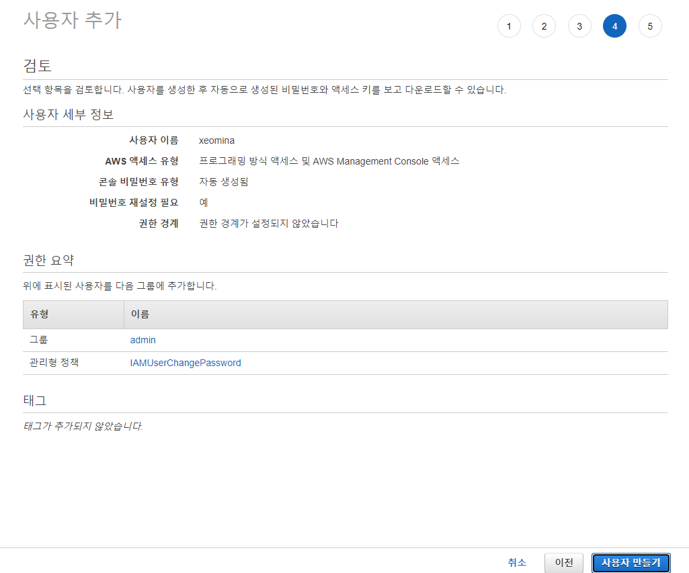

* `.csv` 파일 다운로드


* 생성 완료

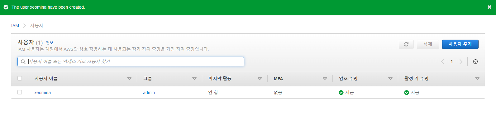

* 암호 정책 수정


### 4) IAM 사용자 로그인

* IAM : AWS 리소스에 대한 액세스 관리

* AWS 계정 ID 복사


* 계정 ID 붙여넣기


* `.csv` 파일에서 password 복사


* 비밀번호 변경


* 로그인 완료


### 5) 보안자격증명

* 다요소 인증
  * 지식 : ID/PW
  * 속성 : OTP
  * 소유 : 홍채, 지문, 안면 


* MFA 디바이스 할당 클릭


* 모바일


* QR 코드 스캔


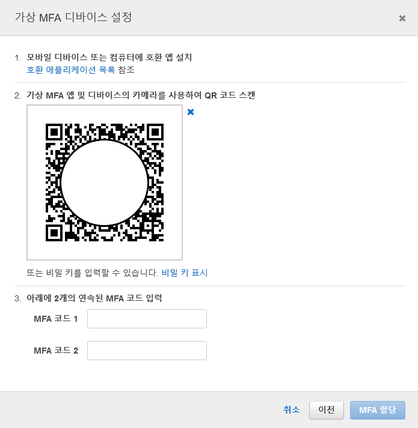

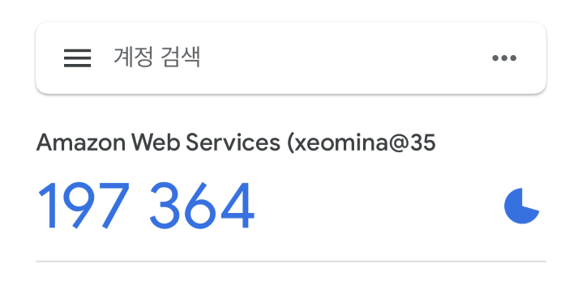

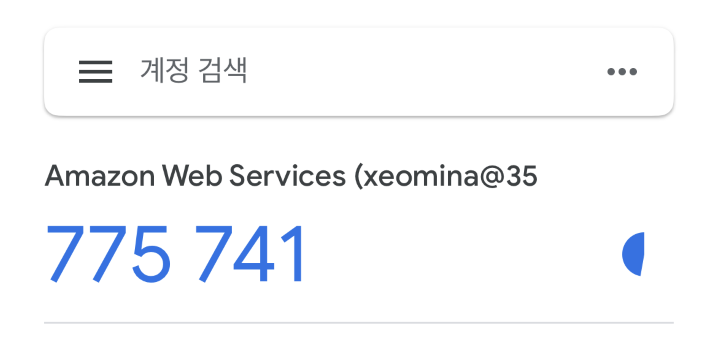


* 재로그인


## 4. EC2

Amazon Elastic Compute Cloud(Amazon EC2)는 Amazon Web Services(AWS) 클라우드에서 확장 가능 컴퓨팅 용량을 제공한다. Amazon EC2를 사용하면 하드웨어에선 투자할 필요가 없어 더 빠르게 애플리케이션을 개발하고 배포할 수 있다. Amazon EC2를 통해 원하는 만큼 가상 서버를 구축하고 보안 밑 네트워크 구성과 스토리지 관리가 가능하다. 또한 Amazon EC2는 요구사항이나 갑작스러운 인기 증대 등 변동 사항에 따라 신속하게 규모를 확장하거나 축소할 수 있어 서버 트래픽 예측 필요성이 줄어든다.

### 1) EC2 시작


### 2) 보안그룹


### 3) 인스턴스 

* 인스턴스 시작
  * 이전 경험으로 옵트아웃
* 단계 :
  1. AMI 선택
  2. 인스턴스 유형 선택
  3. 인스턴스 구성 
  4. 스토리지 추가
  5. 태그 추가 
  6. 보안 그룹 구성 
  7. 검토


#### 1단계: Amazon Machine Image(AMI) 선택

AMI는 인스턴스를 시작하는 데 필요한 소프트웨어 구성(운영 체제, 애플리케이션 서버, 애플리케이션)이 포함된 템플릿이다. AWS, 사용자 커뮤니티 또는 AWS Marketplace에서 제공하는 AMI를 선택하거나, 자체 AMI 중 하나를 선택할 수도 있다.

AL2 (Amazon Linux 2) = CentOS7, Redhat7, Fedora

이미지

* `Amazon Linux 2 AMI (HVM) - Kernel 5.10, SSD Volume Type` 선택


#### 2단계: 인스턴스 유형 선택

Amazon EC2는 각 사용 사례에 맞게 최적화된 다양한 인스턴스 유형을 제공합니다. 인스턴스는 애플리케이션을 실행할 수 있는 가상 서버다. 이러한 인스턴스에는 CPU, 메모리, 스토리지 및 네트워킹 용량의 다양한 조합이 있으며, 애플리케이션에 사용할 적절한 리소스 조합을 유연하게 선택할 수 있다. 

컴퓨트 기능(nova) : EC2의 핵심 기능


#### 3단계: 인스턴스 세부 정보 구성

요구 사항에 적합하게 인스턴스를 구성합니다. 동일한 AMI의 여러 인스턴스를 시작하고 스팟 인스턴스를 요청하여 보다 저렴한 요금을 활용하며 인스턴스에 액세스 관리 역할을 할당하는 등 다양한 기능을 사용할 수 있습니다

네트워크(neutron)

* 프리티어 계정은 가용영역 제한(네 영역 모두 사용 불가)
  * 2a, 2c 서브넷만 사용 가능

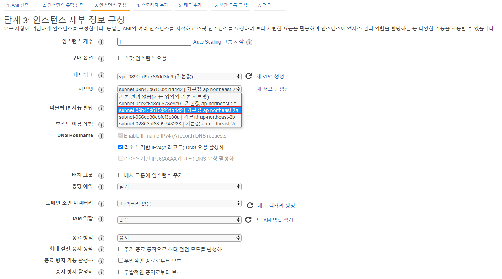

* 사용자 데이터 입력

```
#!/bin/bash
yum install -y httpd
systemctl enable --now httpd
```

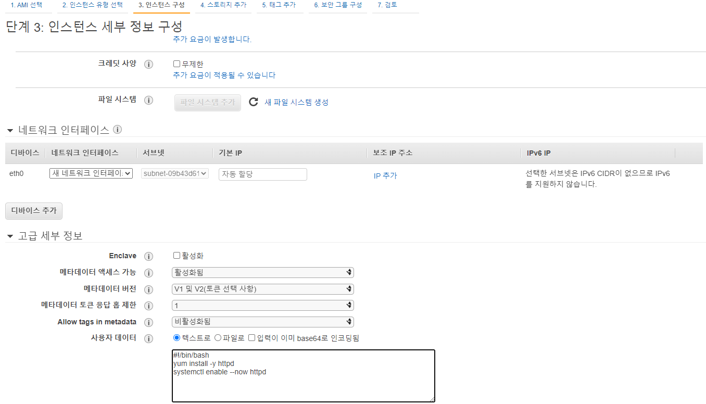

#### 4단계: 스토리지 추가

인스턴스가 다음 스토리지 디바이스 설정으로 시작된다. 추가 EBS 볼륨 및 인스턴스 스토어 볼륨을 인스턴스에 연결하거나 루트 볼륨의 설정을 편집할 수 있다. 인스턴스를 시작한 후 추가 EBS 볼륨을 연결할 수도 있지만, 인스턴스 스토어 볼륨은 연결할 수 없다.


#### 5단계: 태그 추가

태그는 대소문자를 구별하는 키-값 페어로 이루어져 있다. 예를 들어 키가 Name이고 값이 Webserver인 태그를 정의할 수 있다. 태그 복사본은 볼륨, 인스턴스 또는 둘 다에 적용될 수 있다.

* 키가 Name이고 값이 WEB01인 태그 생성

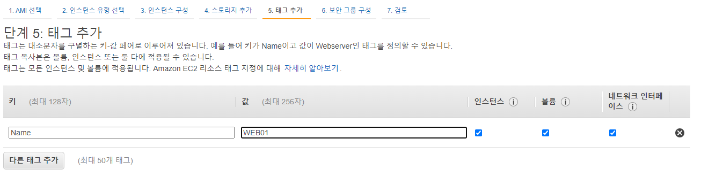

#### 단계 6: 보안 그룹 구성

보안 그룹은 인스턴스에 대한 트래픽을 제어하는 방화벽 규칙 세트다. 이 페이지에서는 특정 트래픽을 인스턴스에 도달하도록 허용할 규칙을 추가할 수 있다. 예를 들면 웹 서버를 설정하여 인터넷 트래픽을 인스턴스에 도달하도록 허용하려는 경우 HTTP 및 HTTPS 트래픽에 대한 무제한 액세스를 허용하는 규칙을 추가한다. 새 보안 그룹을 생성하거나 아래에 나와 있는 기존 보안 그룹 중에서 선택할 수 있다.


#### 7단계: 인스턴스 시작 검토

인스턴스 시작 세부정보를 검토하십시오. 이전으로 돌아가서 각 섹션에 대한 변경 내용을 편집할 수 있다. 키 페어를 인스턴스에 할당하고 시작 프로세스를 완료하려면 [시작]을 클릭한다.

* 새 키 페어 생성 및 다운로드


* 인스턴스 시작


* 인스턴스 생성 완료
* 퍼블릭 IP와 프라이빗 IP 연결되어 있음 : 일대일 NAT


* IP 접속


