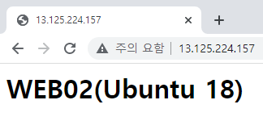

# 0526

# AWS EC2


## WEB01 인스턴스 생성

* 이전 경험으로 옵트아웃


### 1. AMI  선택

* Amazon Linux 2 Kernel 5.10 AMI 


### 2. 인스턴스 유형 선택


### 3. 인스턴스 구성


### 4. 스토리지 추가


### 5. 태그 추가


### 6. 보안 그룹 구성


### 7. 검토


### 생성 완료


### WEB 01 IP 접속


## WEB02 인스턴스 생성

* 새로운 시작 경험으로 옵트인
* Ubuntu

### 1. 이름 및 태그


### 2. 애플리케이션 및 OS 이미지 (AMI)

AMI는 인스턴스를 시작하는 데 필요한 소프트웨어 구성(운영 체제, 애플리케이션 서버 및 애플리케이션)이 포함된 템플릿입니다. 아래에서 찾고 있는 항목이 보이지 않으면 AMI를 검색하거나 찾아보십시오.

* Ubuntu 18.04 LTS


### 3. 인스턴스 유형


### 4. 키 페어 (로그인)


### 5. 네트워크 설정

* 서브넷


* 방화벽 (보안 그룹)


### 6. 스토리지 구성

* SSD 종류 네가지
  * 범용 SSD(gp3)
  * 범용 SSD(gp2)
  * 프로비저닝된 IOPS SSD(io 1)
  * 프로비저닝된 IOPS SSD(io 2)
    * 제일 성능이 좋다


### 7. 고급 세부 정보


### 8. 요약


### 생성 완료


### WEB 02 IP 접속




# Mobaxterm

## WEB01


* IP 확인

```
$ ip a
```


* 디스크 확인

```
$ lsblk
```


```
$ df -h
```


```
$ free -h
```


* `Virtualization: xen`

```
$ hostnamectl
```


## WEB02


* IP 확인

```
$ ip a
```


```
$ lsblk
```


```
$ df -h
```


```
$ free -h
```


* `Virtualization: xen`

```
$ hostnamectl
```


# AWS ELB (Elastic Load Balancer) 

**로드 밸런서 유형**

1. Application Load Balancer
   * HTTP 및 HTTPS 트래픽을 사용하는 애플리케이션을 위한 유연한 기능이 필요한 경우 Application Load Balancer를 선택합니다. 요청 수준에 따라 작동하는 Application Load Balancer는 마이크로서비스 및 컨테이너를 비롯한 애플리케이션 아키텍처를 대상으로 하는 고급 라우팅 및 표시 기능을 제공합니다.
2. Network Load Balancer
   * 애플리케이션에 초고성능, 대규모 TLS 오프로딩, 중앙 집중화된 인증서 배포, UDP에 대한 지원 및 고정 IP 주소가 필요한 경우 Network Load Balancer를 선택합니다. 연결 수준에서 작동하는 Network Load Balancer는 안전하게 초당 수백만 개의 요청을 처리하면서도 극히 낮은 지연 시간을 유지할 수 있습니다.
3. Gateway Load Balancer
   * GENEVE를 지원하는 서드 파티 가상 어플라이언스 플릿을 배포 및 관리해야 할 경우 Gateway Load Balancer를 선택합니다. 이러한 어플라이언스를 사용하면 보안, 규정 준수 및 정책 제어를 개선할 수 있습니다.


## ELB  시작


## 로드 밸런서 생성 (NLB)


### 1) 로드 밸런서 유형 선택

* Network Load Balancer


### 2) Network Load Balancer 생성

Network Load Balancer는 수신하는 TCP 및 UDP 트래픽을 Amazon EC2 인스턴스, 마이크로서비스 및 컨테이너와 같은 여러 대상에 분산합니다. 로드 밸런서는 연결 요청을 수신하면 리스너 구성에 지정된 프로토콜 및 포트와 기본 작업으로 지정된 라우팅 규칙을 기반으로 대상을 선택합니다.


### 3) 네트워크 매핑

로드 밸런서는 IP 주소 설정에 따라 선택한 서브넷의 대상으로 트래픽을 라우팅합니다.

* WEB01, WEB02 서버와 같은 VPC
  * WEB01 : ap-northeast-2a
  * WEB02 : ap-northeast-2c


### 4) 리스너 및 라우팅

* IP와 Port

#### 대상 그룹 생성


#### 대상 그룹 선택


### 5) 요약


### 생성 완료


## DNS 접속


* 라운드 로빈 X (서로 다른 브라우저)


## 상태 확인


## 로드 밸런서 생성 (ALB)

### 1) 로드 밸런서 유형 선택

* Application Load Balancer


### 2) Application Load Balancer 생성

Application Load Balancer는 수신 HTTP 및 HTTPS 트래픽을 요청 속성을 기반으로 Amazon EC2 인스턴스, 마이크로서비스 및 컨테이너와 같은 여러 대상에 배포합니다. 로드 밸런서는 연결 요청을 수신하면 우선 순위에 따라 리스너 규칙을 평가하여 적용할 규칙을 결정한 다음 해당되는 경우, 대상 그룹에서 규칙 작업의 대상을 선택합니다.


### 3) 네트워크 매핑

로드 밸런서는 IP 주소 설정에 따라 선택한 서브넷의 대상으로 트래픽을 라우팅합니다.


### 4) 보안 그룹

보안 그룹은 로드 밸런서에 대한 트래픽을 제어하는 방화벽 규칙 세트입니다.

#### 새 보안 그룹 생성


* 80 포트만 열기


#### 보안 그룹 선택


### 5) 리스너 및 라우팅

#### 대상 그룹 생성


* 성공코드 200
  * [참고](https://ko.wikipedia.org/wiki/HTTP_%EC%83%81%ED%83%9C_%EC%BD%94%EB%93%9C)


#### 대상 그룹 선택


### 생성 완료


### 상태 확인


### DNS 접속


* 라운드 로빈 (새로고침)


# 여기서 잠깐 :hand:

## 왜 ALB만 보안그룹을 설정할까 ? 

* 현재 WEB 01, WEB 02에 퍼블릭 IP로 접속이 가능한 상태
  * 즉, 로드밸런서 거치지 않고 다이렉트로 접속이 가능 (우회 경로)
  * **문제 발생할 수 있음 !!**
* **Why?** 트래픽 조절 및 부하 분산이 불가
* **보안 그룹**을 통해 다이렉트로 접속하는 것을 방지할 수 있음 !


### 보안 그룹 > 인바운드 규칙 편집

* SG-WEB 보안 그룹 선택


### IP로 필터링

* 소스(출발지)를 내 IP로 설정
  * 모바일로는 접속 불가...오직 내 IP만!
  * 특정 IP를 차단할 수는 없음 but 특정 IP만 **허용**은 가능


### 보안그룹으로 필터링 - 소스(출발지)

* SG-ALB에서 출발하는 트래픽만 허용


* 다이렉트 접속 차단됨


NLB는 IP 차단이 아예 안됨 - 퍼블릭 IP 할당하지 않아야!


# 웹페이지 꾸미기

## WEB01


* aws.tar 아카이브 풀기
  * index, img 등 파일...


## WEB02

* azure.tar 아카이브 풀기


# 경로 기반 라우팅

## EC2 콘솔

### 대상 그룹 생성


#### TG-FOOD


#### TG-SALE


### 대상 그룹 생성 확인


## 로드 밸런서

### ELB-ALB > 리스너 > 규칙 보기/편집


#### FOOD 규칙 삽입


#### SALE 규칙 삽입


### 규칙 확인


### DNS 접속


#### FOOD 접속


#### SALE 접속


# HTTP 헤더 기반 라우팅

## index.html 파일 수정

```
[ec2-user@ip-172-31-7-113 ~]$ sudo vi /var/www/html/index.html
<h1>WEB01(AL2)-FIREFOX</h1>
```

```
ubuntu@ip-172-31-44-185:~$ sudo vi /var/www/html/index.html
<h1>WEB02(Ubuntu 18)-Mobile</h1>
```

## EC2 콘솔

### 대상 그룹 생성

### TG-FIREFOX


### TG-MOBILE


### 대상 그룹 생성 확인


## 로드 밸런서

### ELB-ALB > 리스너 > 규칙 보기/편집

#### FIREFOX 규칙 삽입


#### MOBILE 규칙 삽입


### 규칙 확인


### DNS 접속

#### FIREFOX


#### MOBILE

