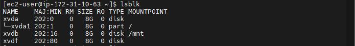
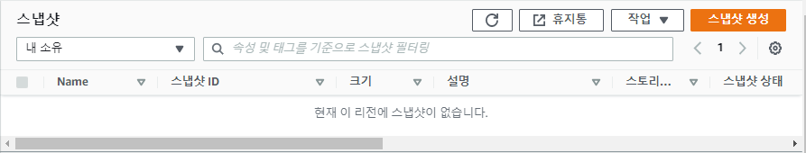
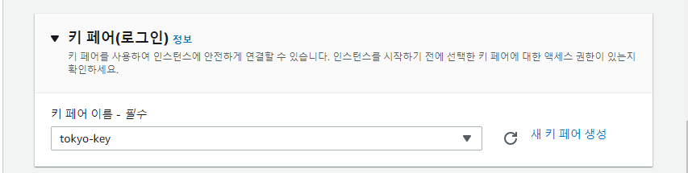

# 0527

# AWS 스토리지 서비스

AWS 클라우드 스토리지는 데이터 스토리지를 서비스로서 관리하고 운영하는 클라우드 컴퓨팅 공급자를 통해 데이터를 인터넷에 저장하는 클라우드 컴퓨팅 모델이다. JIT(Just-In-Time) 용량 및 비용이 온디맨드로 제공되며 자체 데이터 스토리지 인프라를 구매하거나 관리할 필요가 없습니다. 따라서 '언제 어디서든' 데이터에 액세스할 수 있는 민첩성, 세계적 규모 및 안정성을 제공한다.

AWS 클라우드 데이터 스토리지에는 객체 스토리지, 파일 스토리지, 블록 스토리지의 3가지 유형이 있다.

- 블록 스토리지 - OS, App 설치
- 객체 스토리지 - HTTP, URL 링크 생성, 네트워크
- 파일 스토리지 - 공유폴더 (NFS, SAMBA)


## 1. EBS (블록 스토리지)

### 1)  WEB01 인스턴스 생성


* 애플리케이션 및 OS 이미지
  * Amazon Linux 2


* 인스턴스 유형


* 키 페어(로그인)
  * aws-key


* 네트워크 설정
  * 서브넷 : 2a
  * 보안그룹 : SG-WEB


* 스토리지 구성
  * 볼륨 추가 : 8GB


* 고급 세부 정보
  * 사용자 데이터

```
#!/bin/bash
yum install -y httpd
systemctl enable --now httpd
echo "<h1>WEB01</h1>" > /var/www/html/index.html
```


* 요약


* 스토리지 확인
  * xvda : 루트 볼륨


### 2) 추가 볼륨 생성

* WEB01 퍼블릭 IP 복사
  * 52.78.77.89


* SSH로 MobaXterm


* 디스크 확인
  * `df-h`에는 8G가 없고 `lsblk`에는 있음... **Why?** 마운트가 안됨!

```
$ df -h
Filesystem      Size  Used Avail Use% Mounted on
devtmpfs        474M     0  474M   0% /dev
tmpfs           483M     0  483M   0% /dev/shm
tmpfs           483M  416K  482M   1% /run
tmpfs           483M     0  483M   0% /sys/fs/cgroup
/dev/xvda1      8.0G  1.6G  6.5G  20% /
tmpfs            97M     0   97M   0% /run/user/1000
```

```
$ lsblk
NAME    MAJ:MIN RM SIZE RO TYPE MOUNTPOINT
xvda    202:0    0   8G  0 disk
└─xvda1 202:1    0   8G  0 part /
xvdb    202:16   0   8G  0 disk
```


* 디스크 포맷
  * `mkfs` : make file system
  * `ext4` 타입 : 호환성 좋음
* `/dev/xvdb` : 8G 공간 
  * 마운트 가능

```
$ sudo mkfs -t ext4 /dev/xvdb
```


* `mnt` : 마운트 폴더

```
$ ls /
bin   dev  home  lib64  media  opt   root  sbin  sys  usr
boot  etc  lib   local  mnt    proc  run   srv   tmp  var
```

* `/dev/xvdb`와 `/mnt` 마운트
  * `xvdb` 추가 볼륨에 데이터 저장됨

```
$ sudo mount /dev/xvdb /mnt
$ df -h
```


* 볼륨 생성


* 볼륨 설정
  * 볼륨 유형 중 HDD는 저렴 but 성능은 SSD보다 안좋음...백업에 쓰는 것이 좋다 ?
    * 우리는 프리티어..무료를 쓰자


* 태그


* 볼륨 연결


* 디스크 확인
  * `xvdf` 디스크 장치 추가됨

```
$ lsblk
```



* 추가한 `xvdf` 볼륨 포맷

```
$  sudo mkfs -t ext4 /dev/xvdf
```


* `ebs-share` 폴더 생성 및 마운트

```
$ mkdir ebs-share
$ ls
```

```
$ sudo mount /dev/xvdf ebs-share
$ df -h
```


* `aws.tar` 파일 업로드
  * 홈페이지 소스


* 아카이브 압축 해제

```
$ ls
$ sudo tar -xvf aws.tar -C /var/www/html/
```


* 디스크 확인 밑 파일 이동

```
$ df -h
$ sudo mv aws.tar ebs-share/
```


* WEB01 접속


### 3) WEB02 인스턴스 생성


* 애플리케이션 및 OS 이미지
  * Ubuntu


* 인스턴스 유형


* 키페어


* 네트워크 설정
  * 서브넷 : 2c
  * 보안그룹 : SG-WEB


* 스토리지 구성


* 고급 세부 정보
  * 사용자 데이터

```
#!/bin/bash
apt update
apt install -y apache2
```


* 요약


### 4)  루트 볼륨 확장

* WEB02 퍼블릭 IP 복사
  * 3.35.4.195


* SSH로 MobaXterm


* 볼륨 수정


* 볼륨 세부 정보
  * 크기 : 10GB


* 디스크 확인

```
$ df -h
```


* 파티션 확장

```
$ sudo growpart /dev/xvda 1
$ df -h
$ lsblk
```


* XFS 파일 시스템 확장

```
$ df -Th
$ sudo xfs_growfs -d /
$ df -Th
```


* 마운트 해제
  * `xvdf` 분리

```
$ sudo umount /home/ec2-user/ebs-share
$ df -h
```


* 볼륨 분리


### 5) 스냅샷

* 가용영역이 볼륨과 인스턴스 다름... -> 스냅샷 이용
  * `WEB01-ADD`와 `WEB02`

* 스냅샷 생성
  * WEB-ADD-SNAPSHOT




* 스냅샷 작업
  * 볼륨 생성 / 이미지 생성 / 복사

* 스냅샷에서 볼륨 생성


* 가용영역 : 2c


* 태그 : WEB01-ADD-SNAPSHOT-12-VOL


* 생성완료


* 볼륨 연결
  * WEB02(Ubuntu)


* 현 상태

```
$ lsblk
S df -h
```


* 폴더 생성

```
$ mkdir ebs-share
```


* 마운트
  * `aws.tar` 파일

```
$ sudo mount /dev/xvdf ebs-share
```


* `aws.tar` 아카이브 압축 해제

```
$ sudo tar -xvf ebs-share/aws.tar -C /var/www/html/
```


* WEB02 퍼블릭 IP 접속


---

**VM 안에서 퍼블릭 IP 확인하는 방법**

* `ip a` 명령어는 프라이빗 ip 밖에 안나옴

````
$ ip a
````


* `curl` 명령어로 정보를 가져옴
  * http API :

```
$ curl http://169.254.169.254/latest/meta-data/public-ipv4
```


---

**Cf) 인스턴스 메타데이터 검색**

* 이 중에서 퍼블릭 ip를 가져오는 것
* [참고 사이트](https://docs.aws.amazon.com/ko_kr/AWSEC2/latest/UserGuide/instancedata-data-retrieval.html)

```
$ curl http://169.254.169.254/latest/meta-data/
```


---


* 볼륨 태그 생성


* 스냅샷 생성


* 스냅샷 복사
  * 비용 발생


* 도쿄 : ap-northeast-1


* 리전 변경


* 도쿄에서 스냅샷 복사됨


* 스냅샷에서 이미지 생성


* 이미지 - AMI


* 인스턴스 생성





**Cf**

* 크로스 리전 : 서울 - 도쿄 연결
  * ELB 불가 - 루트 53 서비스 이용(글로벌)
  * 서울 & 도쿄의 웹서버 = Multi AZ 
  * 똑같은 웹서버 - 로드밸런싱 / 페일오버 가능
  * 페일오버 : 도쿄 스탠바이 - 서울 액티브 > 문제 발생


