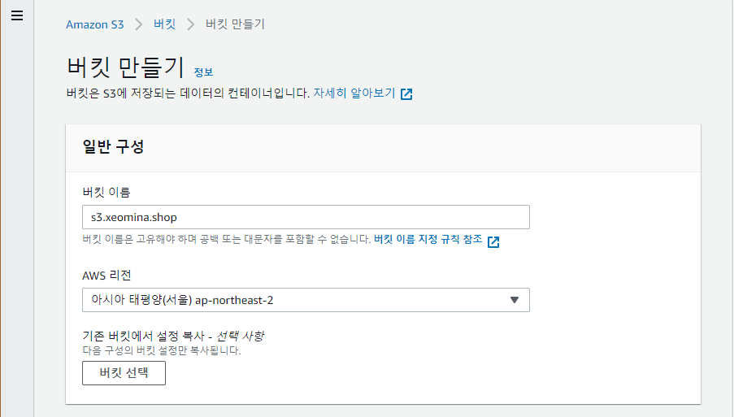
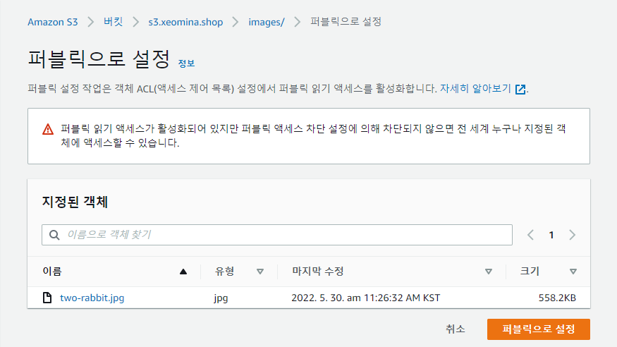
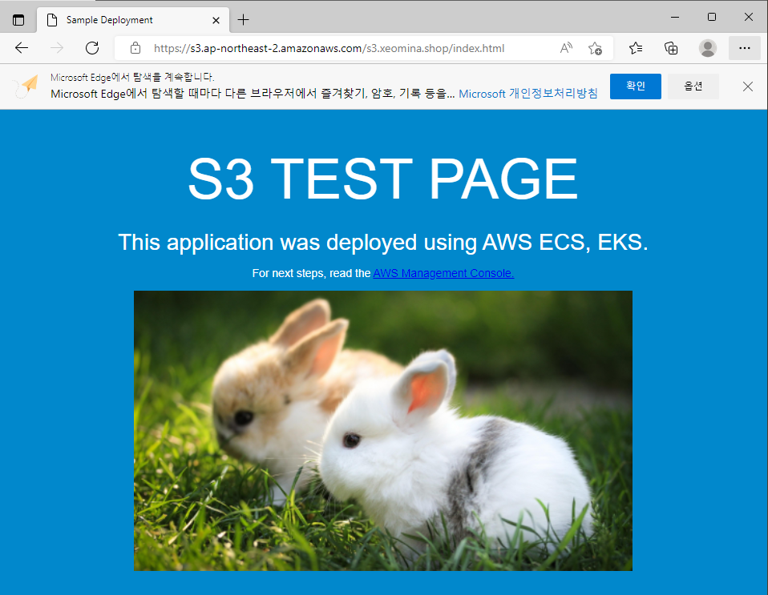

# 0530

# EFS (EC2용 관리형 파일 스토리지)

## EC2 인스턴스 생성

WEB01

* AL2

## EFS 파일 시스템 생성

* NFS

비용 : 리전 > One Zone & 가용성 : 리전 > One Zone

### 연결

* 아직 연결 안됨... 보안그룹!

### 보안 그룹 생성

# S3(클라우드의 확장 가능한 객체 스토리지)

* URL 복사

* public access 비활성화

* 유사시 우회 사이트로 활용...공사중 

구글 드라이버는 웹브라우저 없으면 못받음

* 객체 스토리지와 거리가 멀다...
* `wgwt` 사용 불가

* s3 이용 

# GABIA

## 도메인 구매

# VPC

## 서브넷 생성

### PUBLIC-SUBNET

## 서브넷 연결 편집

## 라우팅 테이블 생성

