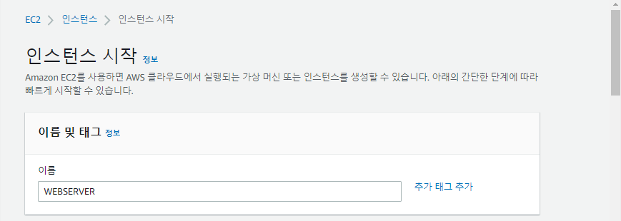
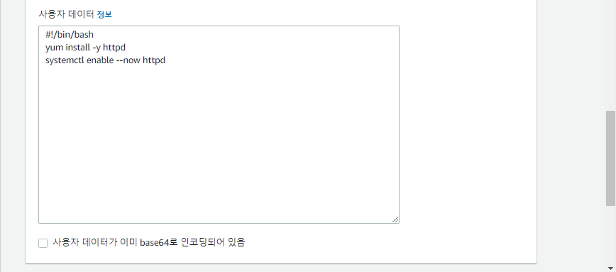
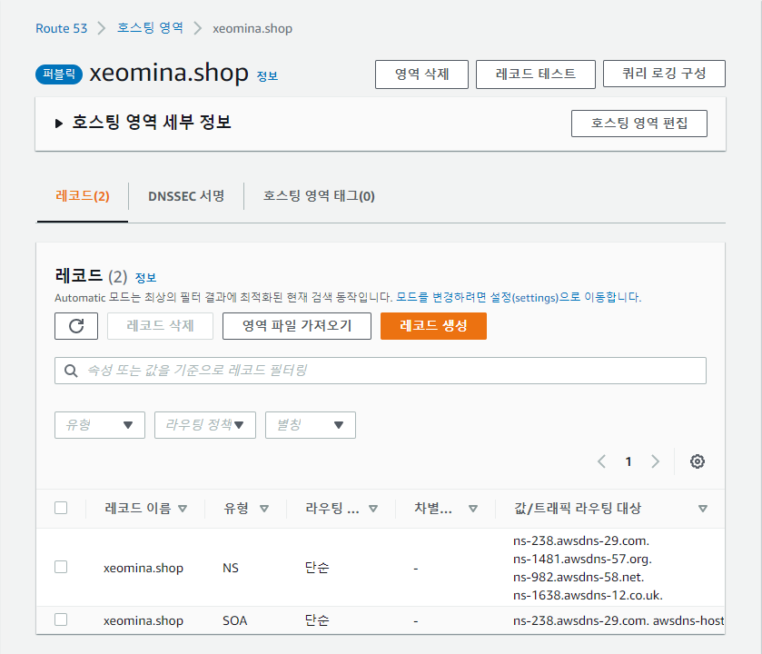
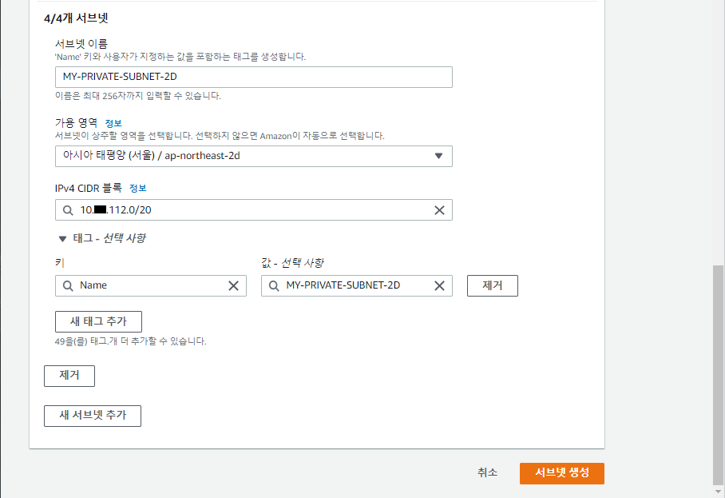
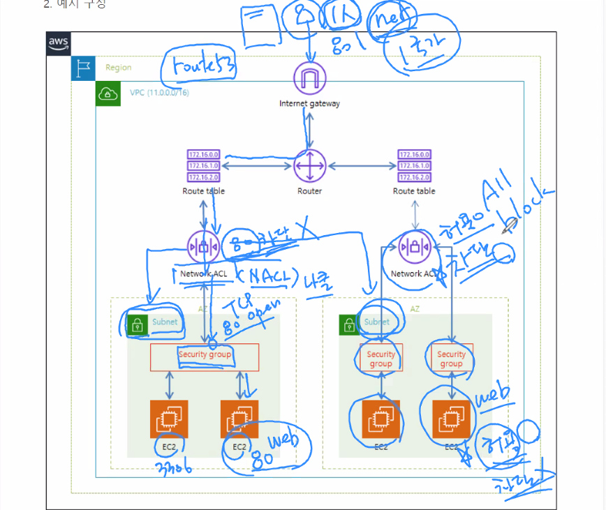
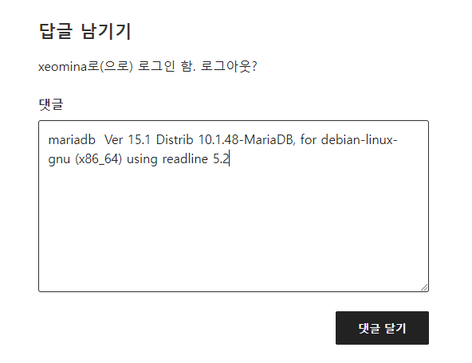
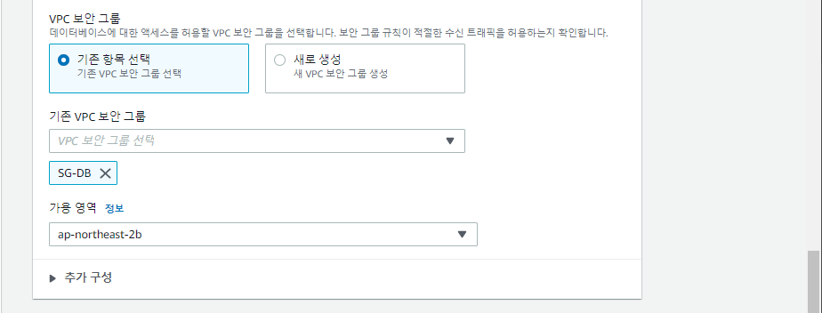
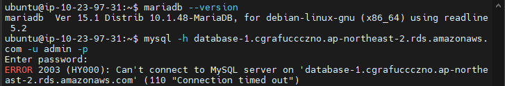
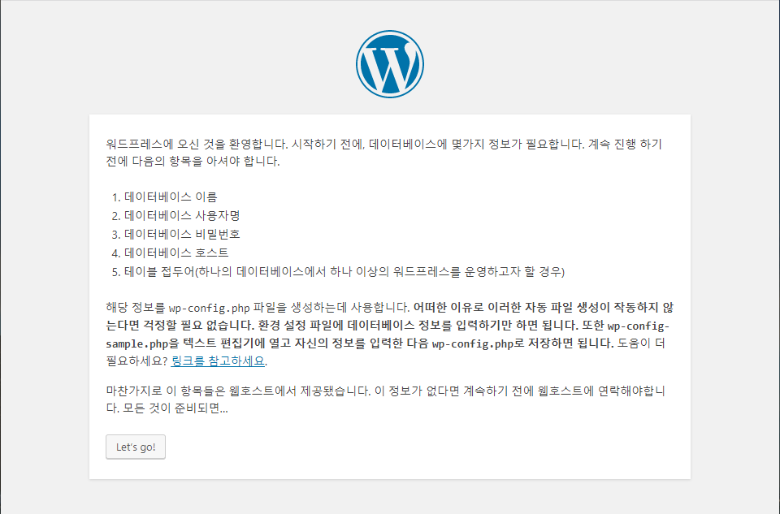

# 0531

# Route 53


* 53 : 포트번호
  * DNS, 라우팅, 로드밸런싱 기능...
* 각 다른 리전(Multi AZ)들의 ELB 연결 : 크로스 리전

## 호스팅 영역 생성


# GABIA

* 가비아에서 네임서버 설정
  * ns-238.awsdns-29.com
  * ns-1481.awsdns-57.org
  * ns-982.awsdns-58.net
  * ns-1638.awsdns-12.co.uk


# 인스턴스

## WEBSERVER




* 네트워크 설정
  * MY-VPC
  * MY-PUBLIC-SUBNET-2A
  * 퍼블릭 IP 자동 할당
  * 보안 그룹 생성 : SG-WEB


* 사용자 데이터

```
#!/bin/bash
yum install -y httpd
systemctl enable --now httpd
```




# Route 53

## 레코드 생성



* WEBSERVER의 퍼블릭 IP 복사


* 레코드 값에 붙여넣기


* 도메인 접속


* SSH


# VPC

## 서브넷 생성

### 서브넷마스크


### PRIVATE-SUBNET





## 라우팅 테이블 생성


## 서브넷 연결 편집


# 인스턴스

## DBSERVER


## DB서버 아이피로 접속


# VPC

https://docs.aws.amazon.com/ko_kr/vpc/latest/userguide/VPC_Scenario2.html

## NAT  게이트웨이 생성


* 탄력적 IP 보유만 하면 과금...사용해야!


## 라우팅 편집

* NAT 게이트웨이


* ping 


## MariaDB 설치

```
$ sudo apt-get update -y
$ sudo apt-get install -y mariadb-server unzip nfs-common
$ sudo mysql_secure_installation
as4914
```

*

```
$ sudo vi /etc/mysql/mariadb.conf.d/50-server.cnf
#bind-address
```

*

```
$ sudo systemctl restart mysql
```

*

```
$ sudo mysql -u root -p
CREATE USER 'wpuser'@'%' IDENTIFIED BY 'wppass';
CREATE DATABASE IF NOT EXISTS wordpress;
GRANT ALL PRIVILEGES ON wordpress.* TO 'wpuser'@'%';
quit
```


*

```
# wget https://ko.wordpress.org/wordpress-4.8.2-ko_KR.zip
ls
```


*

```
# sudo yum install -y httpd php php-mysql php-gd php-mbstring wget unzip
```

*

```
# cd /var/www/html
# sudo unzip /home/ec2-user/wordpress-4.8.2-ko_KR.zip
```

*

```
$ sudo unzip /home/ec2-user/wordpress-4.8.2-ko_KR.zip
$ sudo mv ./wordpress/* .
$ sudo chown -R apache:apache /var/www/*
$ sudo systemctl restart httpd
```


## 워드프레스


## 라우팅 편집

* 인터넷 게이트웨이


# 보안그룹


 출처: https://library.gabia.com/contents/8892/



* 보안그룹은 특정 사용자만 차단할 수는 없음..
  * 허용은 가능
* ACL은 허용 차단 둘다 가능


* 내 IP 차단


# AWS 데이터베이스 서비스

Amazon Relational Database Service(RDS)를 사용하면 클라우드에서 관계형 데이터베이스를 간편하게 설정, 운영 및 확장할 수 있다. 하드웨어 프로비저닝, 데이터베이스 설정, 패치 및 백업과 같은 시간 소모적인 관리 작업을 자동화하면서 비용 효율적이고 크기 조정 가능한 용량을 제공한다. 사용자가 애플리케이션에 집중하여 애플리케이션에 필요한 빠른 성능, 고가용성, 보안 및 호환성을 제공할 수 있도록 지원한다.




##  데이터베이스 생성





## mysql 

cmd 라우팅 안됨


ssh 보안그룹




## 보안그룹 설정


* mysql 접근

```
$ mysql -h database-1.cgrafuccczno.ap-northeast-2.rds.amazonaws.com -u admin -p
```


*

```
mysqldump -u[사용자아이디] -p[패스워드] 데이터베이스명 테이블명 > 경로 및 저장될 파일명.sql
sudo mysqldump -uwpuser -pwppass wordpress > wordpress.sql

mysql -h [호스트] -u[사용자아이디] -p[패스워드] 데이터베이스명 < 경로 및 덤프 파일명.sql
sudo mysql -h database-1.cgrafuccczno.ap-northeast-2.rds.amazonaws.com -uwpuser -pwppass wordpress < wordpress.sql
```


* 백업


* 워드프레스 접속




