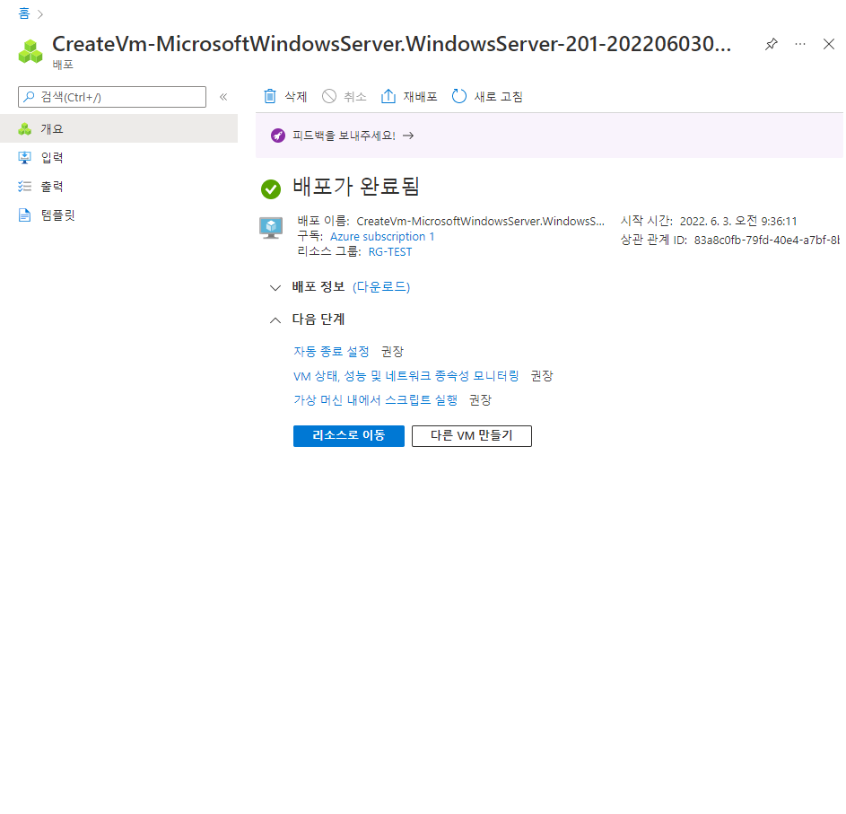
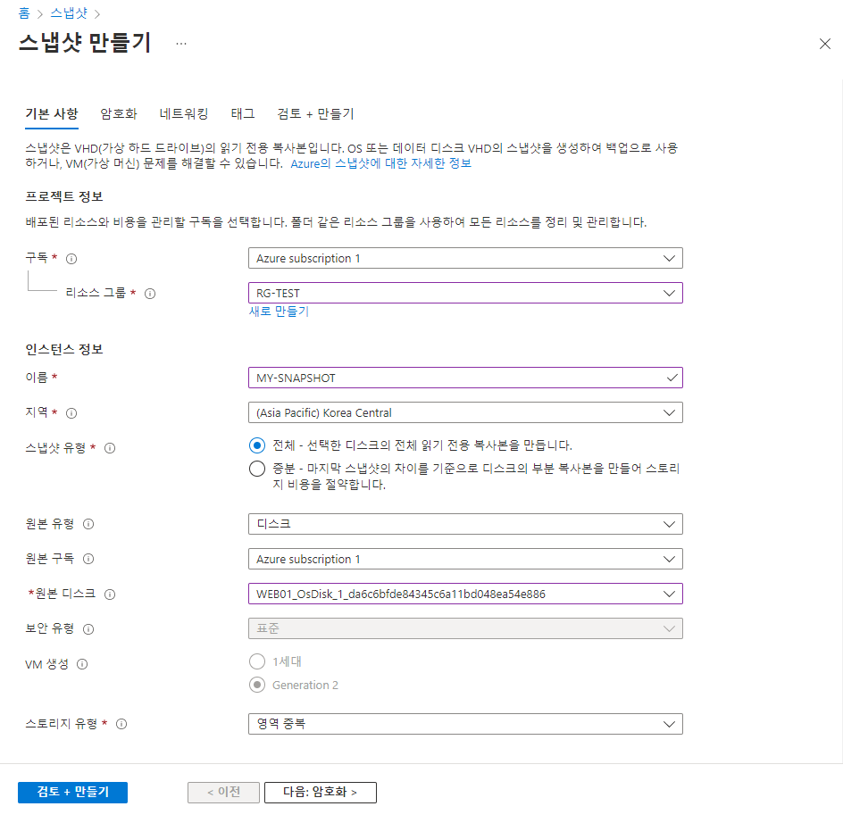
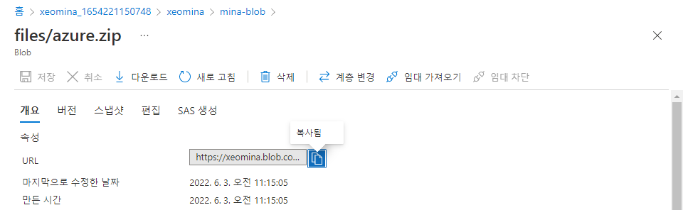
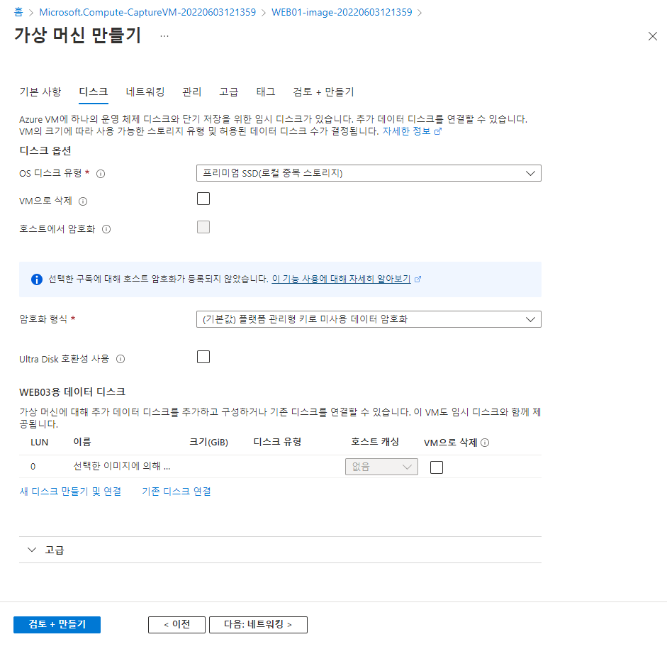
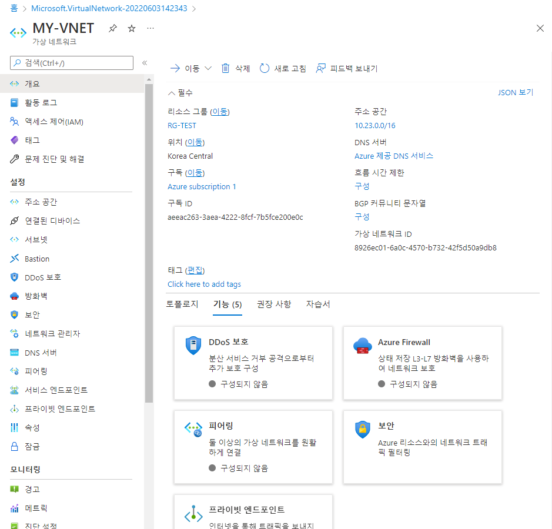
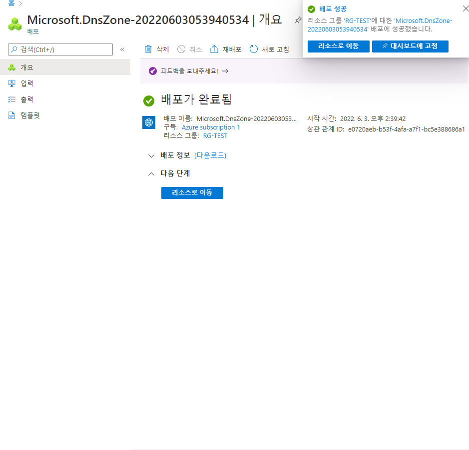

# 0603

# Azure

# 가상머신

## VM 생성

* WEB01
  * Win

### 디스크 추가 및 연결

### IIS

## 스냅샷으로 VM 생성

### 스냅샷 생성

### 디스크 생성

* MY-DISK

### VM 생성

* WEB02

* 디스크 가용영역과 일치해야
  * 1

# 스토리지

## 저장소 계정 생성

## 컨테이너

### 컨테이너 생성

### 파일 업로드

* 다운로드

* URL 접속
  * 권한 x

### 액세스 수준 변경

* URL 재접속
  * 다운로드 됨

## 파일 공유

### 파일 공유 생성

### VM 접속

	* SMB

# 이미지 생성

## 가상머신 캡처

## VM 만들기

* WEB03

## WEB01

# 가상 네트워크

## 가상 네트워크 생성

* 서브넷 20 bit

# 도메인 설정

## DNS 영역 만들기

* ns1-34.azure-dns.com.
* ns2-34.azure-dns.net.
* ns3-34.azure-dns.org.
* ns4-34.azure-dns.info.

## 레코드 집합 생성

* WEB01의 IP 가져오기

* IP 직접 넣기도 가능
  * WEB02 IP : `20.39.186.84`

