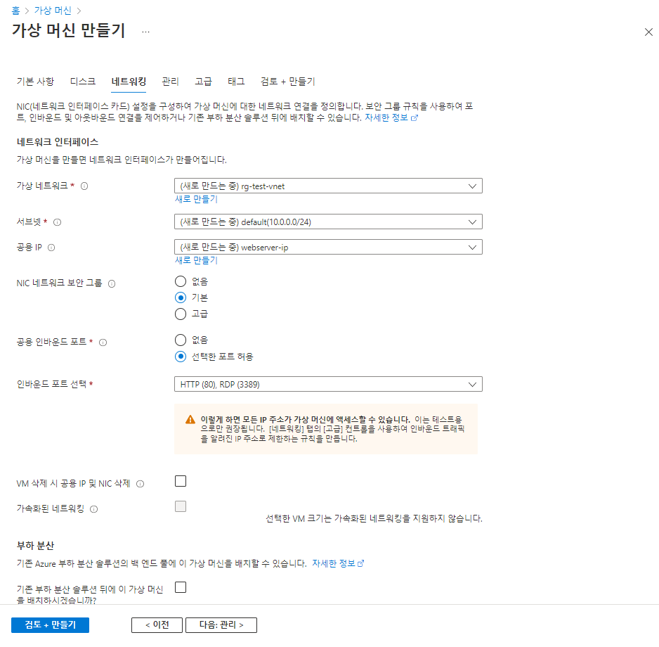
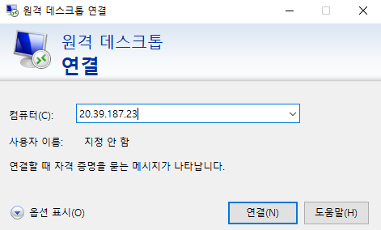
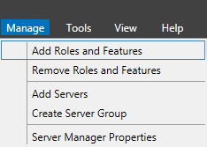

# 0607

# Azure

## 가상 머신 만들기

- 리소스 그룹 :  rg-test

- 위치 : Korea Central (1 영역)

- 구독 : Azure subscription 1

- 가용성 영역 : 1

- 운영 체제 :  Windows (Windows Server 2012 R2 Datacenter)

- 크기 : Standard B1s(1개 vcpu, 1GiB 메모리)

- 공용 IP 주소 : 20.39.187.23

- 가상 네트워크/서브넷 : rg-test-vnet/default





## MariaDB 서버 만들기

- 리소스 그룹 : rg-test
- 위치 : Korea Central
- 구독 : Azure subscription 1
- 서버 이름 : xeomina.mariadb.database.azure.com
- 서버 관리자 로그인 이름 : azureuser@xeomina
- MariaDB 버전 : 10.3
- 성능 구성 : 기본, vCore 1개, 5GB
- SSL 적용 상태 : 사용됨


## 원격 데스크톱 연결





## 디스크 포맷


## IIS Management




## Web Platform Install


## key 설정


## 연결 보안 설정


## mysql 접속

* 서버 이름 : xeomina.mariadb.database.azure.com
* 서버 관리자 로그인 이름 : azureuser@xeomina


## 워드프레스


* 메모장으로 `wp-config.php` 파일 수정

```
// ** MySQL settings - You can get this info from your web host ** //
- 수정
/** The name of the database for WordPress */
define('DB_NAME', 'wordpress');

/** MySQL database username */
define('DB_USER', 'wpuser@xeomina');

/** MySQL database password */
define('DB_PASSWORD', 'wppass');

/** MySQL hostname */
define('DB_HOST', 'xeomina.mariadb.database.azure.com');

/** Database Charset to use in creating database tables. */
define('DB_CHARSET', 'utf8');

/** The Database Collate type. Don't change this if in doubt. */
define('DB_COLLATE', '');

- 추가
/** Connect with SSL */
define('MYSQL_CLIENT_FLAGS', MYSQLI_CLIENT_SSL);

/** SSL CERT */
define('MYSQL_SSL_CERT','BaltimoreCyberTrustRoot.crt.pem');
```

