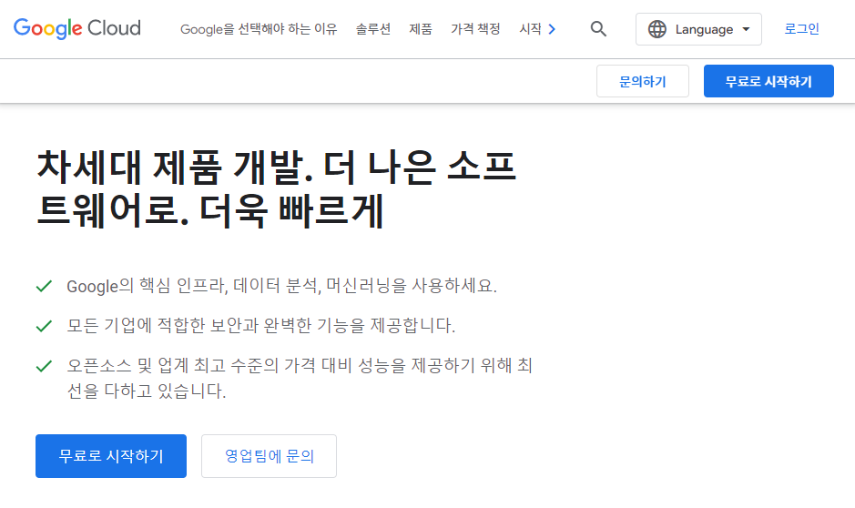
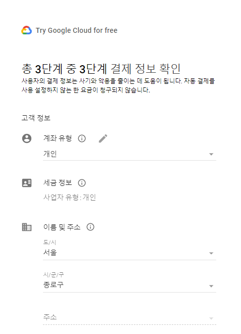
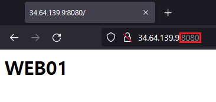
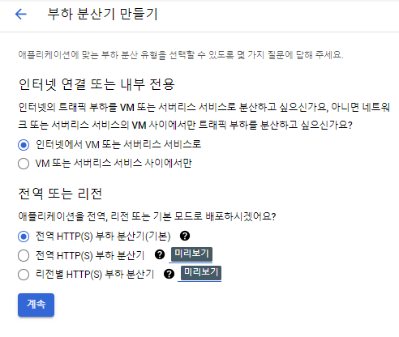
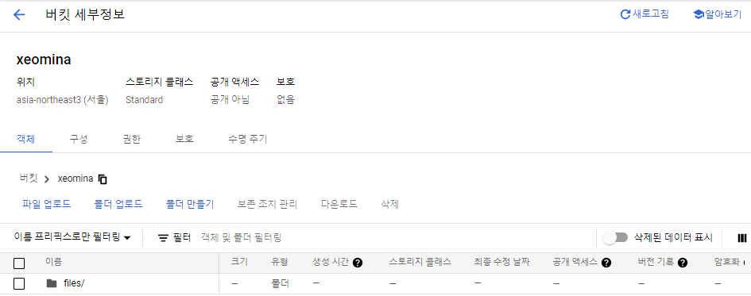
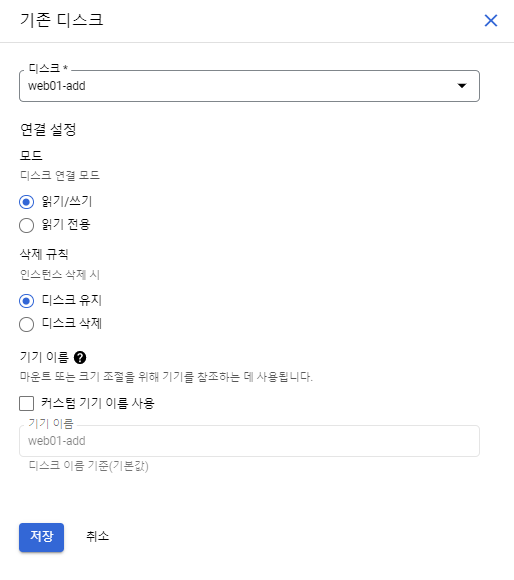

# 0608

# GCP

## GCP 계정 생성







## 새 프로젝트 생성


## IAM


# GCP 컴퓨트 서비스

Compute Engine 인스턴스에서는 Google에서 제공하는 Linux 및 Windows Server용 공개 이미지 뿐만 아니라 사용자가 만들거나 기존 시스템에서 가져올 수있는 비공개 커스텀 이미지를 실행할 수 있다. 또한 Container-Optimized OS 공개 이미지를 실행하는 인스턴스에서 자동으로 시작되는 Docker 컨테이너를 배포할 수도 있다. 사전 정의된 머신 유형 세트를 사용하거나 자체 커스텀 머신 유형을 만들어 가상 CPU 수 및 메모리 용량과 같은 인스턴스의 머신 속성을 선택할 수 있다.

* Compute Engine API 

## VM 인스턴스 생성

Compute Engine을 통해 Google의 인프라에서 실행되는 가상 머신을 사용할 수 있습니다. 마이크로 VM은 물론 Debian, Windows 또는 다른 표준 이미지를 실행하는 대형 인스턴스를 만들 수 있습니다. 첫 번째 VM 인스턴스를 만들거나, 마이그레이션 서비스를 사용하여 가져오거나, 빠른 시작을 사용하여 샘플 앱을 빌드해 보세요.

### web01


## port 변경

````
$ sudo vi /etc/httpd/conf/httpd.conf
````


* 포트 확인

```
$ ss -ant
```


## 방화벽 설정

* GCP Console에서 8080 포트 번호 추가





## VM 인스턴스 생성

### web02

* 같은 리전에 생성
  * 다른 영역에 생성하면 로드밸런싱 x
* 디스크 이미지 : Debian
  * ubuntu


### 메타데이터

Compute Engine 메타데이터를 통해 프로젝트의 모든 VM 인스턴스에서 사용할 수 있는 키-값 쌍을 지정할 수 있습니다. VM 인스턴스는 필요에 따라 메타데이터를 쿼리하거나 변경사항 알림을 받도록 대기할 수 있습니다.


## centos 방화벽 변천사 - os 수준의 방화벽 All Accept

* netfilter > iptables -L(All Accept) -> firewalld(All Block)


# 부하 분산

## 인스턴스 그룹

인스턴스 그룹을 사용하면 VM 인스턴스를 구성하거나 부하 분산 백엔드 서비스에서 인스턴스를 사용할 수 있습니다. 기존 인스턴스를 그룹화하거나 인스턴스 템플릿을 기반으로 그룹을 생성할 수 있다.

인스턴스 그룹은 단일 항목으로 관리할 수 있는 가상 머신(VM) 인스턴스의 모음입니다.

Compute Engine은 관리형 및 비관리형이라는 두 가지 VM 인스턴스 그룹을 제공합니다.

- **관리형 인스턴스 그룹**(MIG)을 사용하면 동일한 여러 VM에서 앱을 운영할 수 있습니다. 자동 확장, 자동 복구, 리전(멀티 영역) 배포, 자동 업데이트 등의 자동화된 MIG 서비스를 활용하여 워크로드의 확장성 및 가용성을 높일 수 있습니다.
- **비관리형 인스턴스 그룹**을 사용하면 직접 관리하는 여러 VM에서 부하 분산을 수행할 수 있습니다.

[참고](https://cloud.google.com/compute/docs/instance-groups/?_ga=2.197559407.-1388022017.1654651548&_gac=1.129126014.1654651548.CjwKCAjw7vuUBhBUEiwAEdu2pGbW_c7eOGW7qBnLBRXH2l0M_oYVjovXodZ7zUpSAG-6aMWHCHscDBoCPewQAvD_BwE)


## 인스턴스 그룹 생성


## 네트워크 서비스


* HTTP(S) 부하 분산 = ALB
  * L7
* TCP 부하 분산 / UDP 부하 분산
  * L4

### HTTP(S) 부하 분산 선택





* 라운드로빈


# GCP 스토리지 서비스

> AWS S3M Azure blob

* 객체 스토리지 : 기업용 객체 스토리지입니다. 양에 상관없이 모든 유형의 데이터를 저장하고 원할때마다 데이터를 검색할 수 있습니다.
  * AWS EBS / Azure Disk
* 블록 스토리지 : Compute Engine 및 GKE와 같은 Google Cloud 제품과 완전히 통합된 블록 스토리지 서비스입니다.
  * AWS EBS
* 파일 스토리지 : 파일 마이그레이션과 스토리지를 지원하는 완전 관리형 서비스입니다. 파일 공유 항목을 손쉽게 Compute Engine VM에 마운트할 수 있습니다.
  * Azure files / NFS 공유폴더 마운트 SMB ...

## 객체 스토리지(Cloud Storage)


* 버킷 이름 지정


* 데이터 저장 위치 선택


* 데이터의 기본 스토리지 클래스 선택


* 객체 액세스를 제어하는 방식 선택


* 객체 데이터를 보호하는 방법 선택





* 아카이브 압축해제

```
$ sudo tar -xvf gcp.tar -C /var/www/html/
```


* IP 접속


## 블록 스토리지(Persistent Disk)


* 디스크 유형 비교





* 디스크 포맷
  * ubuntu와 유사한 Debian .. : type `ext4`가 무난함

```
$ lsblk
$ sudo mkfs -t ext4 /dev/sdb
```


* 마운트

```
$ sudo mount /dev/sdb /mnt
$ df -h
```


* 파일 이동


## 파일 스토리지(Filestore)

* 다음 시간에....