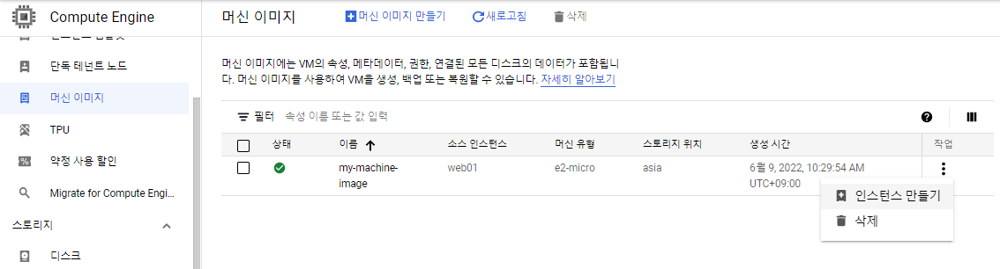
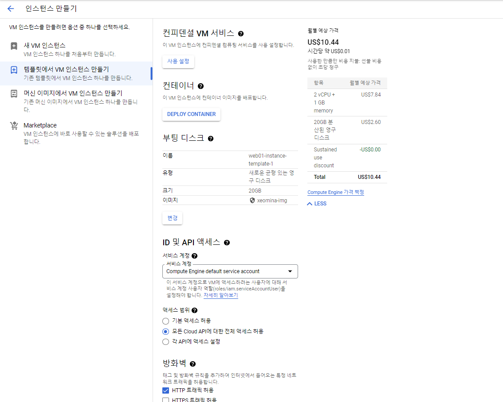
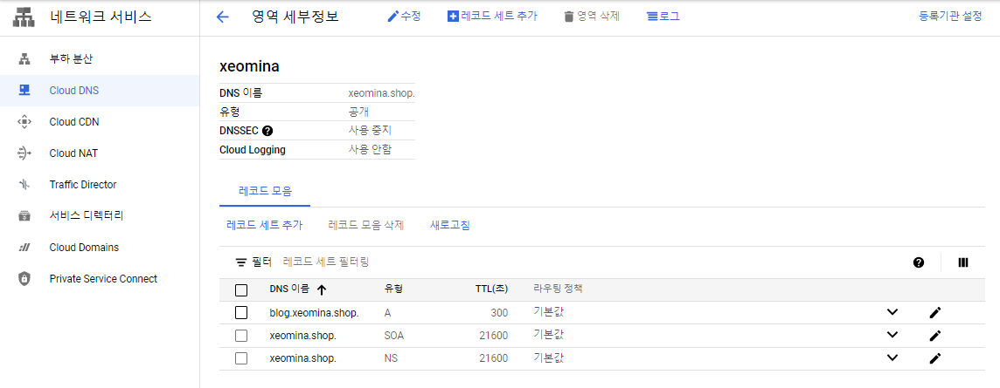
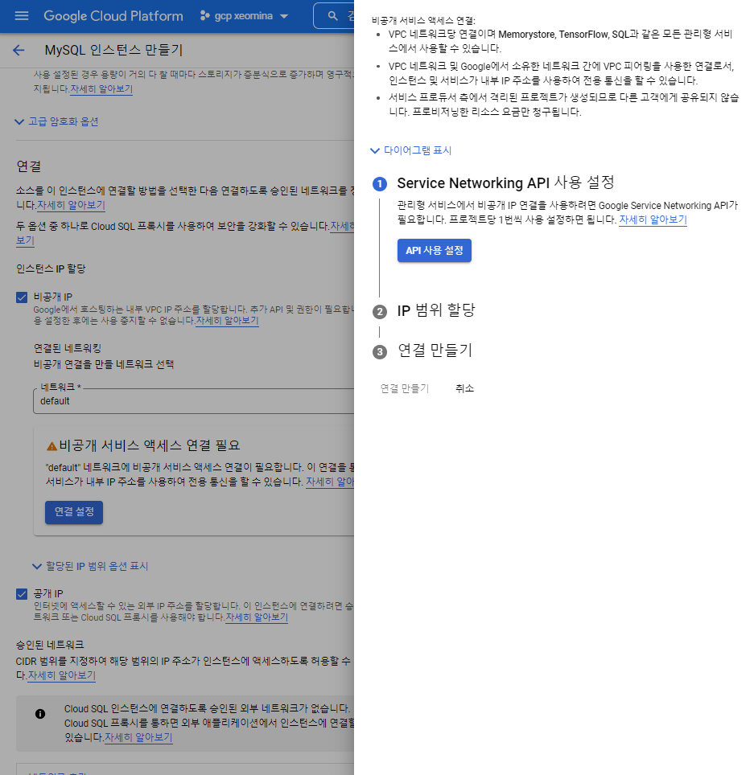
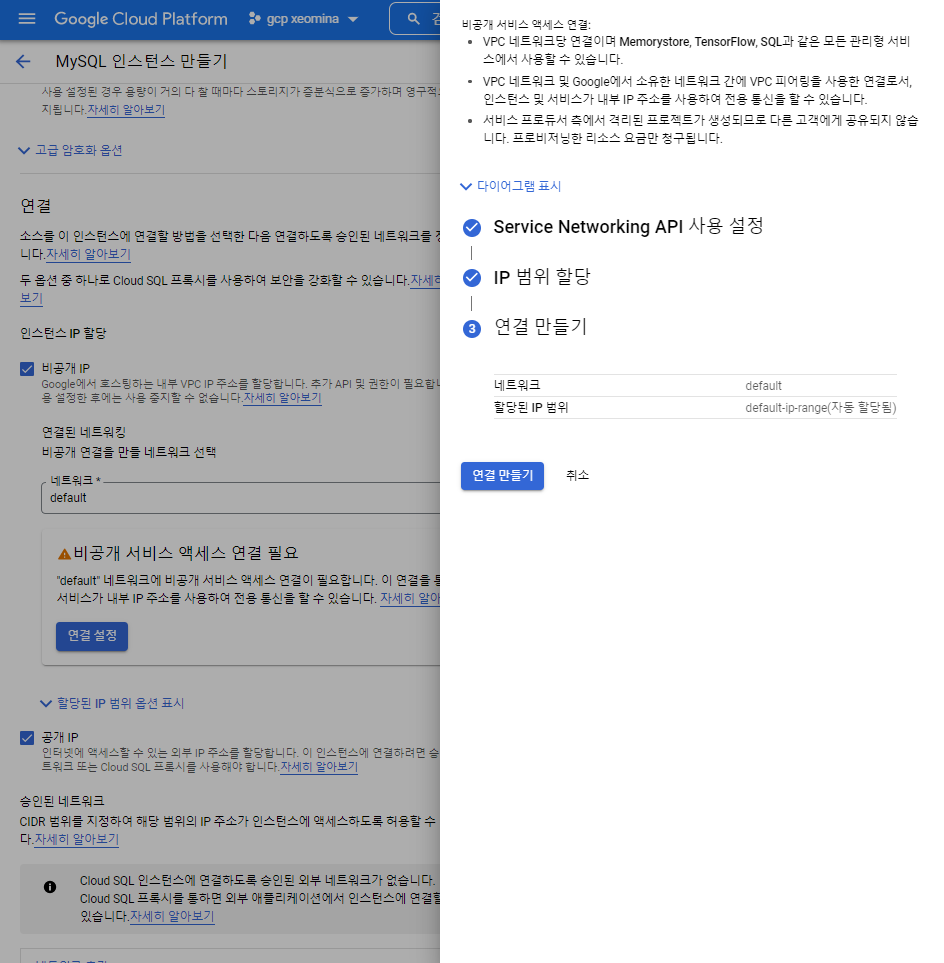

# 0609

# GDP


# moba


```
$ sudo yum install -y nfs-utils^C
$ sudo mount -t nfs 10.151.55.18:/share /mnt
$ df -h
```


```
$ sudo cp gcp.tar /mnt
$ ls /mnt
gcp.tar  lost+found
```


```
$ sudo tar -xvf gcp.tar -C /var/www/html/
```


# VM 인스턴스 만들기

# 컨테이너 - 도커

* halilinux/homepage:v1.0


# 머신 이미지





# 머신 이미지에서 VM 인스턴스만들기


# 스냅샷


# 스냅샷으로 vm


# 스냅샷


# 이미지 만들기

* 머신 이미지랑 다름


* 인스턴스로 이미지 만들기 > 중단해야
* 스냅샷을 이용하면 중단할 필요 x


# 인스턴스 템플릿 만들기

인스턴스 템플릿

인스턴스 템플릿을 사용하여 VM 인스턴스를 설명할 수 있습니다. 그런 다음 템플릿을 기반으로 동일한 인스턴스 그룹을 만들 수 있습니다. [Learn more](https://cloud.google.com/compute/docs/instance-templates)


# 템플릿으로 vm 만들기





* 머신이미지 쉽게 vm
* 템플릿 - 나중에 자동화... vm 복제 (오토 스케일링) 
  * 오토 스케일링의 주재료 템플릿
  * 템플릿 주재료 ... 이미지 ?


# VPC 네트워크 만들기

* 192.168.0.0/16
* 192.123.100 서버 IP


* 서브넷 IP 범위 : 10.23.0.0/16


* 이걸로


# 방화벽 규칙 만들기


-------- 오후

# vm 인스턴스 만들기

## web03


* 네트워크


# 클라우드 DNS


* ns-cloud-b1.googledomains.com.
* ns-cloud-b2.googledomains.com.
* ns-cloud-b3.googledomains.com.
* ns-cloud-b4.googledomains.com.


## 레코드 세트 추가





# MySQL








```
$ sudo setenforce 0
$ sestatus

$ sudo yum install -y mysql
$ mysql -h 10.76.144.3 -u root -p
CREATE USER 'wpuser'@'%' IDENTIFIED BY 'wppass';
CREATE DATABASE IF NOT EXISTS wordpress;
GRANT ALL PRIVILEGES ON wordpress.* TO 'wpuser'@'%';
quit
```


# wordpress

```
# sudo yum install -y httpd php php-mysql php-gd php-mbstring wget unzip
# wget https://ko.wordpress.org/wordpress-4.8.2-ko_KR.zip
# cd /var/www/html
# sudo unzip /home/r2com/wordpress-4.8.2-ko_KR.zip
# sudo mv ./wordpress/* .
# sudo chown -R apache:apache /var/www/*
# sudo systemctl restart httpd
```


