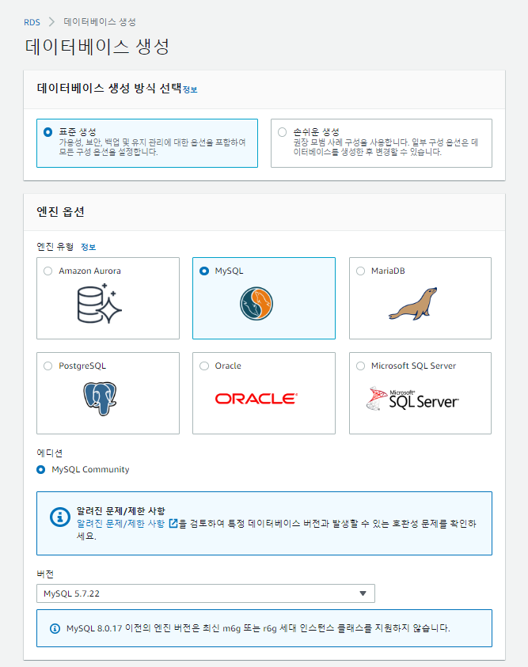
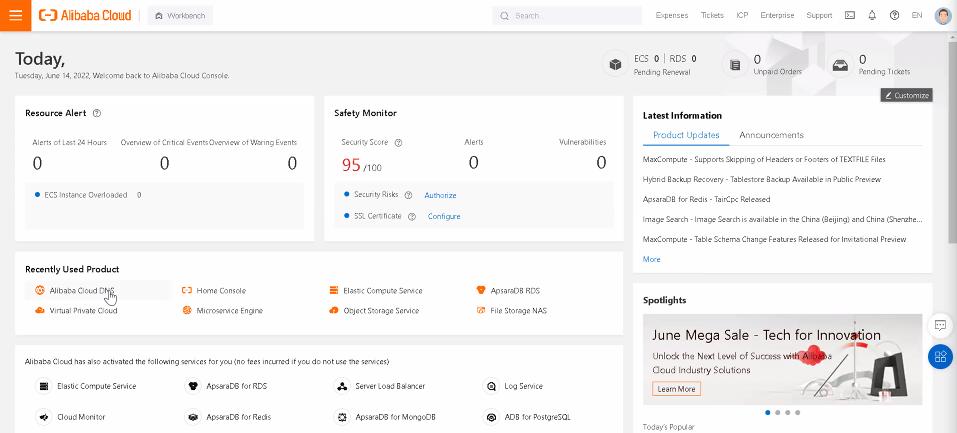
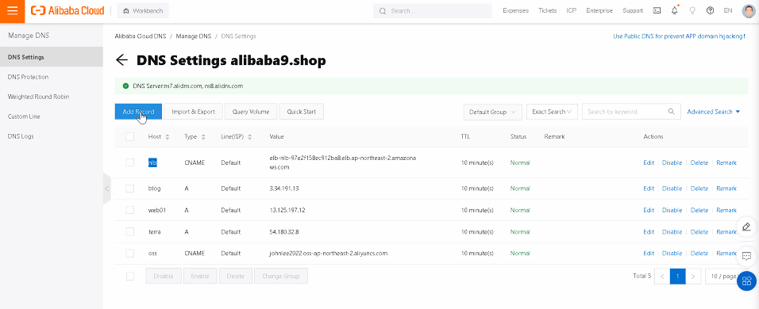

# 0614

# EBS Snapshot

* 볼륨 생성 / 이미지 생성 -> EC2 생성 / 복사(백업) 

EBS 볼륨의 특정 시점 스냅샷을 생성하여 새 볼륨이나 데이터 백업의 기준으로 사용할 수 있습니다. 볼륨의 스냅샷이 주기적으로 새성되는 경우 스냅샷은 증분식이어서 새 스냅샷은 마지막 스냅샷 이후 변경된 블록만 저장합니다. 연결되어 사용중인 볼륨의 스냅샷을 만들 수 있습니다. 하지만 스냅샷은 snapshot 명령을 실행할 때 Amazon EBS 볼륨에 기록된 데이터만 캡처합니다. 이때 애플리케이션이나 운영 체제에 의해 캐시된 데이터가 제외될 수 있습니다.

# IAM(Identity and Access Management)

* EC2 read only, 서비스 접근 제어

AWS 서비스에 대한 액세스를 안전하게 제어하는 웹 서비스입니다. IAM을 통해 사용자, 액세스 키와 같은 보안 자격 증명, 사용자와 애플리케이션이 어떤 AWS 리소스에 액세스할 수 있는지 제어하는 권한을 한 곳에서 관리할 수 있습니다.


# RDS(Relational Database Service)

* 완전 관리형 서비스 : 고가용성, 자동백업, 자동조정

AWS 클라우드에서 관계형 데이터베이스를 더 쉽게 설치, 운영 및 확장할 수 있는 웹 서비스입니다. 이 서비스는 산업 표준 관계형 데이터베이스를 위한 경제적이고 크기 조절이 가능한 용량을 제공하고 공통 데이터베이스 관리 작업을 관리합니다. DB 인스턴스는 AWS 클라우드에 이쓴ㄴ 격리된 데이터베이스 환경입니다. DB 인스턴스에 사용자가 만든 여러개의 데이터베이스가 포함될 수 있습니다. 독립 실행형 데이터베이스 인스턴스와 함께 사용하는 것과 동일한 도구 및 애플리케이션을 사용하여 DB 인스턴스에 액세스할 수 있습니다.

 





**cf) **

개발(Dev) -> 테스트(QA; 품질보증;품보) -> 스테이징 -> 프로덕션(Ops)


## WEBSERVER 생성

```
#!/bin/bash
yum install -y httpd git
systemctl enable --now httpd
cd /tmp
git clone https://github.com/hali-linux/html.git
cp -r /tmp/html/* /var/www/html/
```


# Alibaba 연결




# Moba


## 워드프레스 설치

```
$ wget https://ko.wordpress.org/wordpress-4.8.2-ko_KR.zip
$ sudo yum install -y httpd php php-mysql php-gd php-mbstring wget unzip
```

```
$ cd /var/www/html
$ sudo unzip /home/ec2-user/wordpress-4.8.2-ko_KR.zip
$ ls
$ sudo mv ./wordpress/* .
$ ls
$ sudo chown -R apache:apache /var/www/*
$ sudo systemctl restart httpd
```

```
$ sudo vi /etc/httpd/conf/httpd.conf
$ sudo rm -rf index.html
$ ls
```

* 웹브라우저 http://blog.alibaba9.shop/


private IP : 웹서버 경유

```
$ mysql -h database-1.su6sk7mwf2an.ap-northeast-2.rds.amazonaws.com -u johnlee2022 -p
$ ping database-1.su6sk7mwf2an.ap-northeast-2.rds.amazonaws.com
```


각 자리 오픈스택 - 웹서버 > db 서버 RDS로 연결... > VPC 내 자리 컴퓨터 - 웹서버 사설 IP로 연결....VPN으로 ! 

-> VPN : 사설 IP로 통신 - 피어링 !


* 포트 안열림


## web02


세부정보

```
#!/bin/bash
yum install -y httpd git
systemctl enable --now httpd
cd /tmp
git clone https://github.com/hali-linux/html.git
cp -r /tmp/html/* /var/www/html/
```


* web02에서 web01 ping
  * 같은 네트워크.. 라우팅 테이블


* ping 안나오게 할 수도 있다
* 보안그룹 SG-WEB - 인바운드 규칙에서 ping 삭제 (ICP)


* 같은 보안그룹에 있어도....인바운드 포트 설정 필요


* PING도 나가고 웹 접석도 가능//

# VPC


* PRIVATE SUBNET - RTB


* MYSQL 접속됨


왜? 가용영역 2b... - public / private 2개 - RDS가 public으로 가면(설치되면) 접속되고 private으로 가면 안됨 (랜덤)

- public access 사용하지 말것

RDS 생성 전에 db를 위한 서브넷 그룹 설정 가능

### DB 서브넷 그룹 생성


* public subnet만 선택


* RDS 데이터베이스 클릭
  * 서브넷 그룹 변경


* 서브넷은 변경 불가..


* 지금 하는 것은 퍼블릭을 굳이 사용하고 싶을때..... - 안하면 된다


# ELB

## EC2 - 로드밸런서


## NLB


### 대상그룹 생성


* 대상그룹부분 : 백엔드
* 포트번호 : 프론트엔드


### HEALTH CHECK


* web01 unhealthy... 왜? 아까 index.html 지워서....
* web02 는 보안그룹 - 모든 트래픽 : 내부에서만 통신 ?
  * 인바운드 규칙 편집


왜 둘다 healthy? 


#### 엔드포인트 주소가 너무 길다...... 어떻게?

* 알리바바 cname


## ALB


* 퍼블릭 서브넷


### 보안 그룹 생성


#### 대상그룹생성


CNAME : 도메인을 다시 도메인으로 매핑




* ALB 보안그룹 있는 이유......
  * ALB가 아닌 주소로 들어갈 수 있다...다이렉트..(예. IP, blog.alibaba.....etc)
  * 부하분산 / 조절 불가 !
  * 

