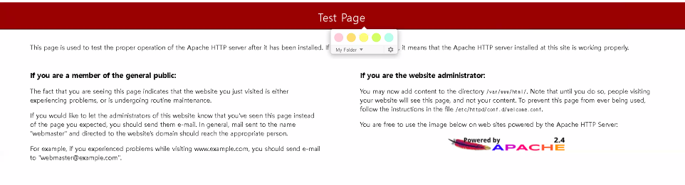
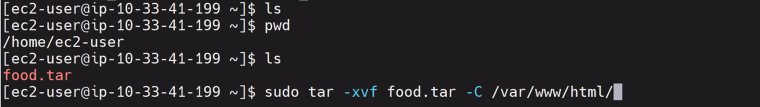
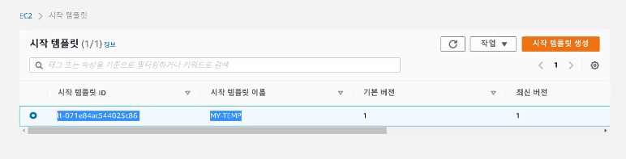
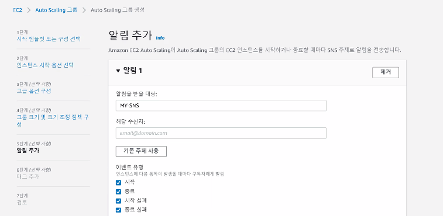
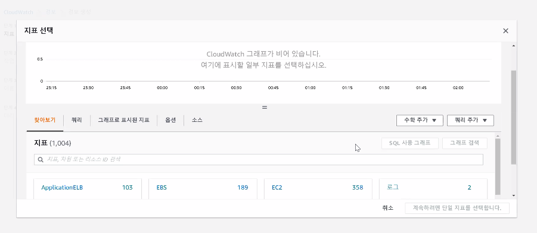

# 0615

# EC2

## ORIGIN  인스턴스 생성


* 사용자 데이터

```
#!/bin/bash
yum install -y httpd git
systemctl enable --now httpd
```


* alibaba





* `food.tar` 


```
$ sudo tar -xvf food.tar -C /var/www/html/
```




## AMI 생성


## 시작 템플릿 생성


* subnet 나중에 수정할 것




## Auto Scaling Group

https://docs.aws.amazon.com/ko_kr/autoscaling/ec2/userguide/auto-scaling-groups.html

*Auto Scaling 그룹*에는 자동 크기 조정 및 관리를 위해 논리적 그룹으로 취급되는 Amazon EC2 인스턴스 모음이 포함되어 있습니다. Auto Scaling 그룹을 통해 상태 검사 교체 및 크기 조정 정책과 같은 Amazon EC2 Auto Scaling 기능도 사용할 수 있습니다. Auto Scaling 그룹 내 인스턴스 수 유지와 및 자동 크기 조정, 이 두 가지가 Amazon EC2 Auto Scaling 서비스의 핵심 기능입니다.

Auto Scaling 그룹의 크기는 사용자가 원하는 용량으로 설정한 인스턴스 수에 따라 달라집니다. 수동으로 또는 자동 크기 조정을 사용하여 수요에 맞게 크기를 조정할 수 있습니다.

Auto Scaling 그룹은 원하는 용량을 충족하도록 충분한 인스턴스를 실행하여 시작합니다. 그룹 내 인스턴스에 대한 주기적인 상태 확인을 수행하여 이 인스턴스 수를 유지합니다. Auto Scaling 그룹은 인스턴스 상태가 이상이 있는 경우에도 고정된 수의 인스턴스를 계속 유지합니다. 인스턴스가 비정상 상태가 되면 그룹에서는 비정상 인스턴스를 종료하고 이를 대체할 다른 인스턴스를 시작합니다. 자세한 정보는 [Auto Scaling 인스턴스의 상태 확인](https://docs.aws.amazon.com/ko_kr/autoscaling/ec2/userguide/ec2-auto-scaling-health-checks.html)을 참조하십시오.

조정 정책을 사용하여 바뀌는 조건을 충족하도록 그룹의 인스턴스 수를 동적으로 늘리거나 줄일 수 있습니다. 조정 정책의 효력이 발생되면, Auto Scaling 그룹이 해당 그룹의 희망 용량을 사용자가 지정하는 최소 및 최대 용량 값 사이에서 조절하고 필요에 따라 인스턴스를 시작 또는 종료합니다. 일정에서도 확장이 가능합니다. 자세한 정보는 [Auto Scaling 그룹의 크기 조정](https://docs.aws.amazon.com/ko_kr/autoscaling/ec2/userguide/scale-your-group.html)을 참조하십시오.

Auto Scaling 그룹은 온디맨드 인스턴스, 스팟 인스턴스 또는 둘 모두를 시작할 수 있습니다. 시작 템플릿을 사용하도록 그룹을 구성 하는 경우에만 Auto Scaling 그룹에 대해 여러 구매 옵션을 지정할 수 있습니다. (Amazon EC2의 최신 기능을 사용하려면 시작 구성 대신 시작 템플릿을 사용하는 것이 좋습니다.)


* SNS (Simple Notification Service) - email, SMS, 




* ali cname





