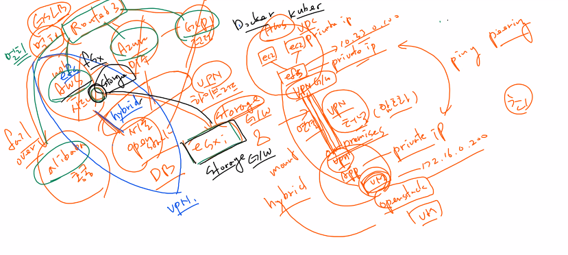

# 0616


# 클라우드 프론트

글로벌 콘텐츠 전송 네트워크 (CDN)


## WAF(Web Application Firewall) 

웹방화벽


* 인증서는 버지니아 북부


## Route 53

* 레코드 생성


* 임의로 주소 붙여넣기 불가


* 루트 53 라우팅 기능




# Openstack(VirtualBox)

- CPU : 4C
- RAM : 12GB(SWAP 12GB) - 12,288MB
- SSD : 128GB(동적할당)
- OS : CentOS8
- NET : Bridge
- IP : 192.168.0.83


## --- Openstack 싱글 노드 설치

* moba

```
# vi /etc/sysconfig/network-scripts/ifcfg-ens160
TYPE=Ethernet
BOOTPROTO=none
NAME=ens160
DEVICE=ens160
ONBOOT=yes
IPADDR=192.168.0.83
NETMASK=255.255.240.0
GATEWAY=192.168.0.1
DNS1=192.168.0.66
DNS2=8.8.4.4
```

```
# vi /etc/selinux/config
SELINUX=disabled
```

```
# dnf install network-scripts -y
```

```
# systemctl disable firewalld
# systemctl disable NetworkManager
# systemctl enable --now network
# reboot
```

```
# dnf update -y
# dnf config-manager --enable powertools
# dnf install -y centos-release-openstack-yoga
# dnf update -y
# dnf install -y openstack-packstack
```

```
# packstack --gen-answer-file /root/answers.txt
# vi /root/answers.txt
CONFIG_DEFAULT_PASSWORD=as4914
CONFIG_KEYSTONE_ADMIN_PW=as4914
CONFIG_CINDER_VOLUMES_SIZE=100G
CONFIG_NTP_SERVERS=0.kr.pool.ntp.org
CONFIG_CEILOMETER_INSTALL=n
CONFIG_AODH_INSTALL=n
CONFIG_HEAT_INSTALL=y
CONFIG_NEUTRON_L2_AGENT=openvswitch
CONFIG_NEUTRON_ML2_TYPE_DRIVERS=vxlan,flat
CONFIG_NEUTRON_ML2_TENANT_NETWORK_TYPES=vxlan
CONFIG_NEUTRON_ML2_MECHANISM_DRIVERS=openvswitch
CONFIG_NEUTRON_OVS_BRIDGE_MAPPINGS=extnet:br-ex
CONFIG_NEUTRON_OVS_BRIDGE_IFACES=br-ex:ens160
CONFIG_PROVISION_DEMO=n

# packstack --answer-file /root/answers.txt
```

