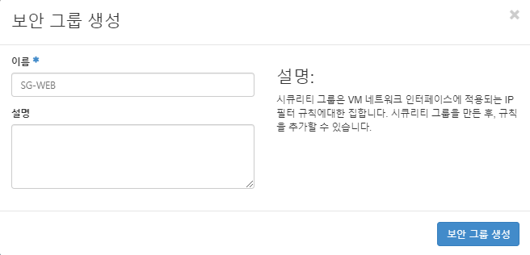
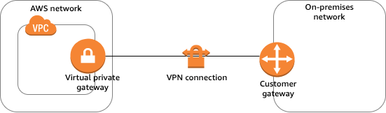
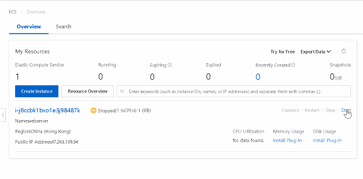
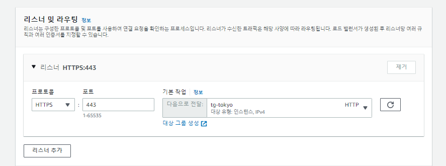
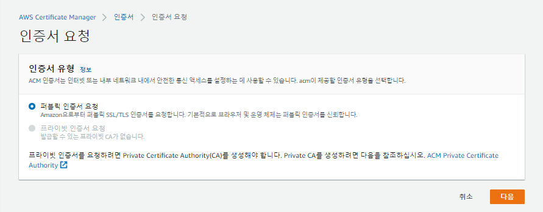
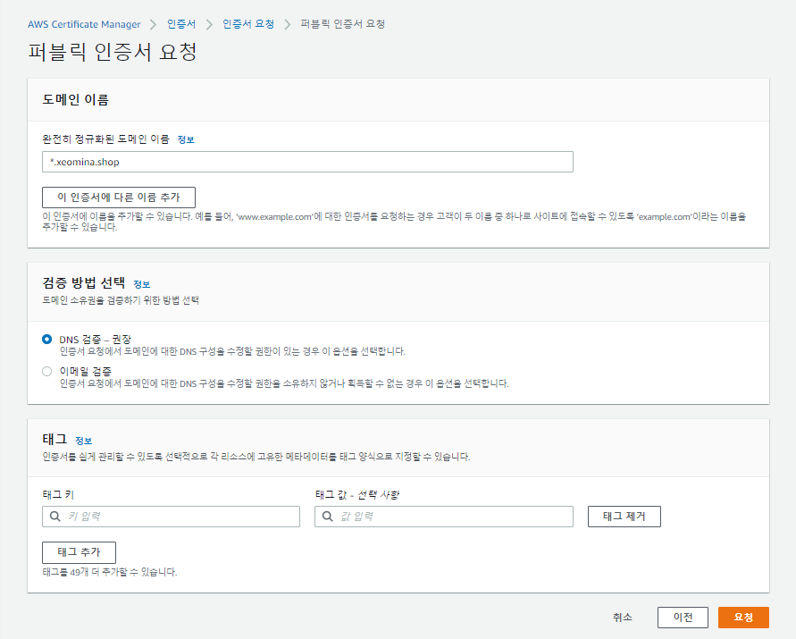

# 0617

# 

## Hybrid 

* public(AWS) + private(Openstack, EXSi) cloud - VPN 연결

* Storage Gateway

## GSLB (Global Server Load Balancing)

[삼성SDS](https://www.samsungsds.com/kr/network-gslb/gslb.html)

특정 지역에 집중되는 트래픽을 분산하는 DNS 기반의 로드 밸런싱

GSLB (Global Server Load Balancing)는 글로벌 특정 지역에 트래픽이 증가할 경우에 DNS 기반으로 인접 지역으로 네트워크 트래픽을 자동 분산합니다. 특정 서버에 장애가 발생할 경우에는 네트워크 트래픽을 정상 리소스로 로드 밸런싱함으로써 서비스가 안정적으로 지속될 수 있도록 합니다.

- 안정적인 서비스 제공

  연결된 리소스의 정상 작동 여부를 확인 (Health Check)하여 특정 서버에 장애가 발생하면 해당 리소스를 즉시 Fail over 처리하여 도메인 응답에서 제거함으로써 트래픽이 다른 리소스로 우회하여 안정적인 서비스를 제공합니다.

- 서비스 포트 간편 설정

  웹 기반 콘솔을 통해 편리하게 GSLB를 생성하고 서비스 포트를 설정/관리할 수 있습니다. L4단위 로드 밸런싱의 경우 다중포트 설정이 가능하며 (80, 443, 8080-8090 등), 여러 개의 로드 밸런싱 규칙을 동시에 적용하여 관리할 수 있습니다.

- 편리한 호스팅 환경 관리

  인터넷을 통해 외부에서 접근이 가능한 Public GSLB를 활용하여 타입에 맞는 리소스를 간편하게 추가할 수 있습니다.

- 효율적인 비용 관리

  구성된 도메인의 개수와 추가된 Health Check 리소스 개수, 그리고 쿼리 수에 따라 요금이 결정되도록 세분화 된 과금 방식을 적용하였기 때문에 효율적인 비용 관리가 가능합니다.

## 서비스 구성도


- 인터넷 → DNS Request / Response → DNS → Domain 등록/위임 → GSLB → Primary (Active) → (A data center, B data center) Health Check → Firewall → Security Group : Subnet - VM, VM ... / Security Group : Subnet - VM, VM ... → A Data center
- 인터넷 → DNS Request / Response → DNS → Domain 등록/위임 → GSLB → Secondary (Inactive) → (A data center, B data center) Health Check → Firewall → Security Group : Subnet - VM, VM ... / Security Group : Subnet - VM, VM ... → B Data center

## 주요 기능

- GSLB 생성/관리

  \- 리소스 및 포트 정보 등록
  \- 하나의 GSLB에 여러 개의 리소스 등록 가능

- 분산 알고리즘 선택

  \- Round Trip Time : 리소스의 위치를 기반으로 트래픽을 분배
  \- Ratio : 사용자가 입력하는 값을 기준으로 리소스별 트래픽 분배. 입력 값에 따라 Fail over 가능

- Health Check 설정

  \- 체크 주기 (Interval), 서비스 다운 인지 시간 (Timeout), 응답 대기 시간 (Probe Timeout) 설정
  \- 프로토콜 설정 (ICMP, TCP, HTTP, HTTPS), 서비스 포트 설정
  \- DB Health Check는 DB를 점검할 수 있는 스크립트 기반으로 구현 (Ishell 기능 활용)

* SLB(Server Load Balancing) : ELB
  * L7 S/W : ALB
  * L4 S/W : NLB
* Cross region


* ELB 자신의 리전 벗어날 수 없음.... VM / HAproxy 필수!
* ELB에 https 연결시켜보자......


# Openstack

## 보안그룹

* 프로젝트
* 네트워크
* 보안 그룹




## Floating IP

- 프로젝트
- 네트워크
- Floating IP


## 이미지

- 프로젝트
- Compute
- 이미지


## 키 페어

* 프로젝트
* Compute
* 키 페어


## 인스턴스


# Site to Site VPN (Virtual Private Network)

* 가상 사설 망

https://docs.aws.amazon.com/ko_kr/vpn/latest/s2svpn/VPC_VPN.html




출처 : https://docs.aws.amazon.com/ko_kr/vpn/latest/s2svpn/how_it_works.html


# AWS

## VPC 고객 게이트웨이


## VPC 가상 프라이빗 게이트웨이


## seoul 인스턴스


# Azure

## 리소스 그룹


## 가상머신


# GCP

## VM 인스턴스


# Alibaba





* username : root
* key : alibaba-key


# IP 정리

SEOUL(AWS) : 3.38.97.139

LONDON(AZURE) : 20.77.67.78

OREGON(GCP) : 34.82.164.108

HONKONG(ALIBABA) : 


# 도메인 설정

## AWS - Route 53

### 호스팅 영역 생성

* xeomina.shop


* NS

````
ns-1474.awsdns-56.org
ns-577.awsdns-08.net
ns-453.awsdns-56.com
ns-1951.awsdns-51.co.uk
````

## 가비아

### 네임서버 설정


## AWS - ACM

* SSL/TLS 인증서 프로비저닝, 관리 및 배포


### 인증서 요청


### DNS 레코드 생성


## AWS - EC2

### HA-seoul 생성


### HAproxy 설정


```
# sudo yum install -y haproxy
# sudo vi /etc/haproxy/haproxy.cfg
global
    daemon

defaults
    mode               http

frontend  http-in
    bind *:80
    default_backend    backend_servers

backend backend_servers
    balance            roundrobin
#    cookie  SVID insert indirect nocache maxlife 3m
    server             seoul 3.38.97.139:80 cookie w1 check
    server             london 20.77.67.78:80 cookie w2 check
    server             oregon 34.82.164.108:80 cookie w3 check
    server             honkong 47.243.76.195:80 cookie w4 check
```

```
$ sudo systemctl enable --now haproxy
```

### HA-seoul ip 접속


## AWS - EC2

### 이미지 생성


### 도쿄 리전 이동


### AMI 확인


### 스냅샷 확인


### HA-tokyo 생성


## AWS - EC2 

### 로드 밸런서 생성

### tokyo-alb


## 보안그룹

* 서울 / 도쿄


* 전면 HTTPS
* 후면 HTTP

### 대상 그룹 생성




* 새 ACM 인증서 요청







* 방금 생성한 인증서 선택


## Route 53

* 레코드 생성


## 서울 ALB


#### 대상그룹


## Route 53 

* failover
* 단순 라우팅 : 도메인 하나에 여러개의 ip


### 장애조치

* 상태 검사 생성
* 도메인 이름 엔드포인트


### 레코드 생성

1. [호스팅 영역](https://us-east-1.console.aws.amazon.com/route53/v2/hostedzones#)
2. [xeomina.shop](https://us-east-1.console.aws.amazon.com/route53/v2/hostedzones#)


