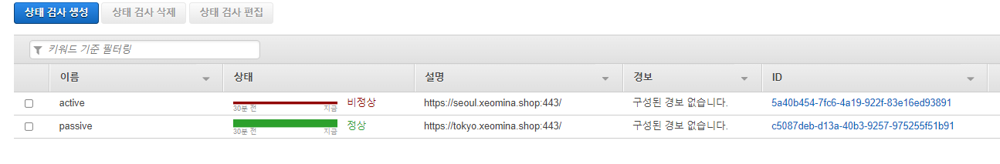
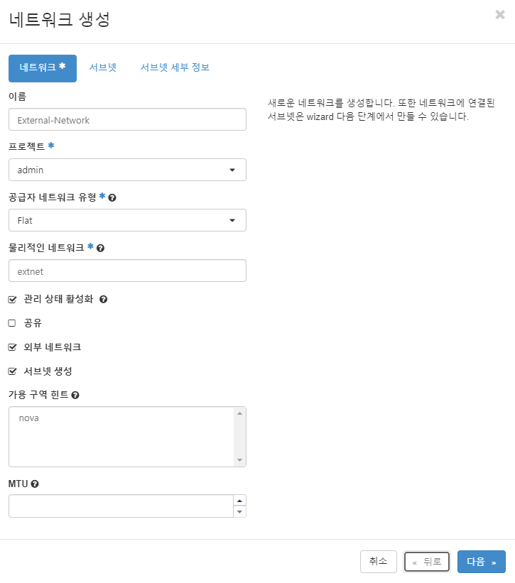
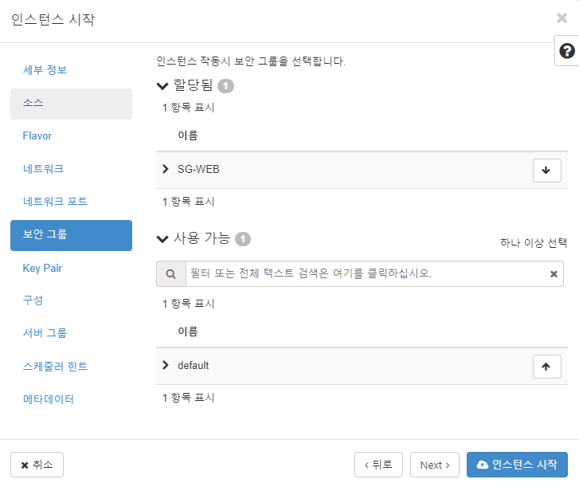
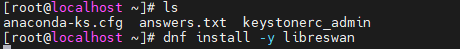
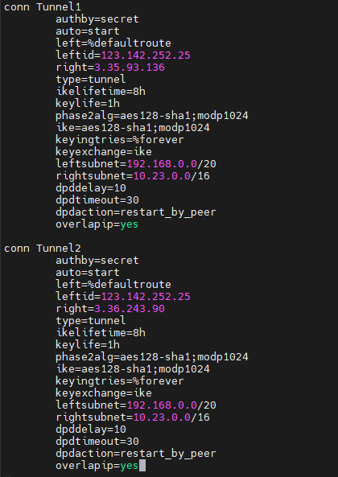
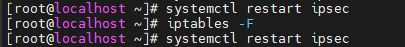

# 0620


# 개요

- route53 (GSLB 구현)
- AWS VPN 연결 (하이브리드 클라우드 구현)
- AWS Storage Gateway (온프레미스 애플리케이션에 사실상 무제한의 클라우드 스토리지 액세스 제공)

## 1. Hybrid Cloud 

* Public과 Private Cloud 연결

### AWS Storage를 활용하는 방법

* AWS (EFS) <- VPN -> Openstack (On-Prem) --> EFS
* AWS (S3) <- Storage Gateway -> ESXi (On-Prem) --> S3
* 


## 2.Route 53 

* 복구 컨트롤러
  * 장애조치: 도메인 서비스만 제공 - Route 53을 지나는 것은 아님..! 
  * Route 53 통과해서 지나는 것이 아닌 도메인 서비스.... 경로에 대한 정보 정도 트래픽 실제적으로 지나지 않음! 
  * 선 연결 x, 통과 x
  *  [Amazon Route 53 Application Recovery Controller](https://aws.amazon.com/ko/blogs/korea/amazon-route-53-application-recovery-controller/)


* GSLB(Global Server Load Balancing) : Cross Region
  * GSLB는 전통적인 DNS와 같이 동작하며 추가적으로 health check와 active/backup을 지정 가능하게 하여 재해 복구(DR), 지역적인 부하분산, 응답시간 중심의 서비스를 제공 가능
  * GSLB는 전통적인 DNS 서비스가 발전 된 형태로, 기존의 DNS가 back-end 서버의 상태와 상관 없이 요청에 대한 IP 값을 제공하는 반면 서버의 상태정보를 확인한 후에 IP를 제공
  * 이러한 장점을 통해 지역별 트래픽 기반의 부하 분산, DR(Disaster Recovery) 구축, 클라우드 서비스를 기존 고객 보유 시스템의 백업센터로 이용하는 등 다양한 응용 구성이 가능
  * https://cloud.kt.com/portal/user-guide/network-GSLB-intro


* VRRP: 이중화
* Fail Over: Active, Passive (Inactive, Standby) - 무중단 서비스
* AWS (Seoul), Azure (London), GCP (Oregon), Alibaba (Hongkong)
* DB..(완전 관리형 서비스 이용했음) - 하나의 DB public -> 네개의 플랫폼 연결 -> 워드프레스 설치


# Openstack

- CPU : 4C
- RAM : 12GB(SWAP 12GB) - 12,288MB
- SSD : 128GB(동적할당)
- OS : CentOS8
- NET : Bridge
- IP : 192.168.0.107


* `ifcfg-ens160` 파일 설정

```
# vi /etc/sysconfig/network-scripts/ifcfg-ens160
TYPE=Ethernet
BOOTPROTO=none
NAME=ens160
DEVICE=ens160
ONBOOT=yes
IPADDR=192.168.0.107
NETMASK=255.255.240.0
GATEWAY=192.168.0.1
DNS1=192.168.0.66
DNS2=8.8.4.4
```

* selinux 설정

```
# vi /etc/selinux/config
SELINUX=disabled
```

* network 설정

```
# dnf install network-scripts -y
# systemctl disable firewalld NetworkManager
# systemctl enable --now network
# reboot
```

* powertools / openstack-yoga 설치

```
# dnf update -y										# os 업데이트
# dnf config-manager --enable powertools
# dnf install -y centos-release-openstack-yoga
# dnf update -y
```

* packstack 설치
  * openstack 자동화 도구

```
# dnf install -y openstack-packstack
# packstack --gen-answer-file /root/answers.txt
```

* `answers.txt` 파일 설정

```
# vi /root/answers.txt
CONFIG_DEFAULT_PASSWORD=as4914		# 웹 ui passwd
CONFIG_KEYSTONE_ADMIN_PW=as4914		# cli passwd
CONFIG_CINDER_VOLUMES_SIZE=100G
CONFIG_NTP_SERVERS=0.kr.pool.ntp.org
CONFIG_CEILOMETER_INSTALL=n
CONFIG_AODH_INSTALL=n
CONFIG_HEAT_INSTALL=y		# 스크립트로 자동화
CONFIG_NEUTRON_L2_AGENT=openvswitch
CONFIG_NEUTRON_ML2_TYPE_DRIVERS=vxlan,flat
CONFIG_NEUTRON_ML2_TENANT_NETWORK_TYPES=vxlan
CONFIG_NEUTRON_ML2_MECHANISM_DRIVERS=openvswitch
CONFIG_NEUTRON_OVS_BRIDGE_MAPPINGS=extnet:br-ex		# OVS = openvswitch
CONFIG_NEUTRON_OVS_BRIDGE_IFACES=br-ex:ens160
CONFIG_PROVISION_DEMO=n
```

* openstack 설치
  * 10:24 ~ 10:49

```
# packstack --answer-file /root/answers.txt
```


# AWS

## 상태검사


## 레코드 생성

### gslb


* 기본 : active


* https://gslb.xeomina.shop 접속
  * active


* HA -seoul 중단

```
$ sudo systemctl stop haproxy
```





# Openstack

## External-Network

1. 관리
2. 네트워크
3. 네트워크




## Flavor

1. 관리
2. Compute
3. Flavor


## Internal-Network

1. 프로젝트
2. 네트워크
3. 네트워크


## 라우터

1. 프로젝트
2. 네트워크
3. 라우터


### 인터페이스

1. 프로젝트
2. 네트워크
3. 라우터
4. Router


## 네트워크 토폴로지

1. 프로젝트
2. 네트워크
3. 네트워크 토폴로지


## 보안그룹

1. 프로젝트
2. 네트워크
3. 보안 그룹


## Floating IP

1. 프로젝트
2. 네트워크
3. Floating IP


## Images

1. 프로젝트
2. Compute
3. 이미지


## Key Pairs

1. 프로젝트
2. Compute
3. 키 페어


## 인스턴스

1. 프로젝트
2. Compute
3. 인스턴스





* 퍼블릭이 아닌 프라이빗으로 VPC Peering
  * 라우팅 테이블 : 정적인 라우트 프로토콜...


## 라우팅 테이블

1. 프로젝트
2. 네트워크
3. [라우터](http://192.168.0.107/dashboard/project/routers/)
4. Router

### 정적 경로추가

* 상대방의 내부 IP에 접속하는 법
* IP 리스트

```
# 교수님
Openstack IP : 192.168.0.103
Floating IP : 192.168.14.16
외부 IP (Router): 192.168.14.88
사설/내부 IP (Server): 10.133.0.220
```

```
# 내꺼
Openstack IP : 192.168.0.107
Floating IP : 192.168.9.54

외부 IP (Router): 192.168.9.67
사설/내부 IP (Server): 10.133.0.89
```


```

```


# AWS VPN 연결

> 하이브리드 클라우드 구현

## 개요

* 데이터 백업.. On-Prem이 아닌 AWS의 EFS 파일 스토리지에 저장
* 윈도우는 작업 스케쥴러...리눅스는 크???


터널링 : IP 변조

* 출발지와 목적지 IP
* 그 안의 데이터는 Plain Text가 아닌 암호화... -> VPN !!
* 현재 우리가 할 것.. S2S (Site to Site)
* 오픈스택 CentOS8에  VPN S/W 설치
  * **libre swan**
  * VPN H/W 도 있지만..우리는 소프트웨어!

**Libreswan**은 **IPsec** 및 인터넷 키 교환 ( **IKE** ) 을 사용하여 가장 널리 지원되고 표준화된 VPN 프로토콜의 무료 소프트웨어 구현입니다 . 이러한 표준은 **IETF** ( Internet Engineering Task Force )에서 생성 및 유지 관리합니다.


* Custom G/W : 공유기의 IP
* VP G/W - VPN G/W - Custom G/W : 다 AWS에서 설정
* 연결 - 터널링 - 암호화
* 서로 통신 ... EFS - 무조건 사설 IP -> Openstack 이용 (반드시 VPN 거쳐야 함)


# AWS

## VPC

### Custom G/W (고객 게이트웨이)

* 이미 세팅됨


### VP G/W (가상 프라이빗 게이트웨이)

* 만들어짐... VPC와 attach 필요


### VPN G/W 연결

# Openstack

## SSH

* libreswan 설치

```
# dnf install -y libreswan
```



* 관리 및 운영은 ipsec

```
# systemctl enable --now ipsec
```

* `sysctl.conf` 설정

```
# vi /etc/sysctl.conf
net.ipv4.ip_forward = 1					# 리눅스 시스템을 라우터로 만드는 방법
net.ipv4.conf.all.accept_redirects = 0
net.ipv4.conf.default.accept_redirects = 0
net.ipv4.conf.all.send_redirects = 0
net.ipv4.conf.default.rp_filter = 0
net.ipv4.conf.default.accept_source_route = 0
net.ipv4.conf.default.send_redirects = 0
net.ipv4.icmp_ignore_bogus_error_responses = 1
net.ipv6.conf.all.disable_ipv6 = 1
net.ipv6.conf.default.disable_ipv6 = 1
```


```
# for vpn in /proc/sys/net/ipv4/conf/*;
do echo 0 > $vpn/accept_redirects;
echo 0 > $vpn/send_redirects;
done
```


```
# sysctl -p
```


# AWS - VPC

## VPN 연결 생성


* 정적으로 하면 IP 네트워크
* 로컬은 강의실 원격은 AWS MY-VPC IP 범위
  * VPC Peering을 위해..


* 구성 다운로드
  * 설정 파일 미리 다운로드


* Openswan : Centos7까지
* Liberswan : Centos8에서 설치됨
* 두개 호환되기 때문에 여기서는 Openswan 선택


* `vpn-0c7aed891da0...f.txt` 파일
  * leftid = 강의장 IP
    * 123.142.252.25
  * right = AWS IP
    * 3.35.93.136
  * leftsubnet = LOCAL NETWORK (강의장)
    * 192.168.0.0/20 
  * rightsubnet = REMOTE NETWORK (AWS my-vpc)
    * 10.23.0.0/16

```
----------------
IPSEC Tunnel #1
----------------
conn Tunnel1
	leftid=123.142.252.25
	right=3.35.93.136
	leftsubnet=<LOCAL NETWORK>
	rightsubnet=<REMOTE NETWORK>
```

```
123.142.252.25 3.35.93.136: PSK "qB-----Wu"
```

```
----------------
IPSEC Tunnel #2
----------------
conn Tunnel2
	leftid=123.142.252.25
	right=3.36.243.90
	leftsubnet=<LOCAL NETWORK>
	rightsubnet=<REMOTE NETWORK>
```

```
123.142.252.25 3.36.243.90: PSK "Jw-----hC"
```


* `aws.conf` 파일 설정

```
# vi /etc/ipsec.d/aws.conf
```




* `aws.secrets` 설정

```
# vi /etc/ipsec.d/aws.secrets
```


* ipsec 재시작 및 상태 확인

```
# systemctl restart ipsec
# systemctl status ipsec
```


* 터널 확인
  * Up


## 라우팅 테이블

### 라우팅 편집

* Public Subnet


* 다음 홉 : 192.168.0.0/20
  * Floationg IP 범위


* Private Subnet


# Openstack 

## 라우터

1. 프로젝트
2. 네트워크
3. 라우터
4. Router

### 정적 경로 추가

* 다음 홉 : 192.168.0.107
  * Openstack IP : VPN G/W와 비슷한 기능..VPN의 정보를 담고 있다


# Moba

## ping 확인

* Openstack `SERVER` 서버에서 AWS `seoul` 서버 ping 확인

  * 세션 : 192.168.9.54 (centos)

  * AWS `seoul` 서버 프라이빗 IP : 10.23.13.163
  * 아직 안나감

```
$ ping 192.168.9.54
```


* AWS `seoul` 서버에서 Openstack `SERVER` 서버 ping 확인

  * 세션 : 3.38.97.139 (ec2-user)

  * Openstack `SERVER` Floating IP : 192.168.9.54
  * 아직 안나감

```
$ ping 192.168.9.54
```


* Openstack
  * 192.168.0.107(root)

```
 # systemctl restart ipsec
 # iptables -F
 # systemctl restart ipsec
```



* Openstack `SERVER` 서버에서 AWS `seoul` 서버 ping 확인

```
$ ping 10.23.13.163
```


* AWS `seoul` 서버에서 Openstack `SERVER` 서버 ping 확인

```
$ ping 192.168.9.54
```

