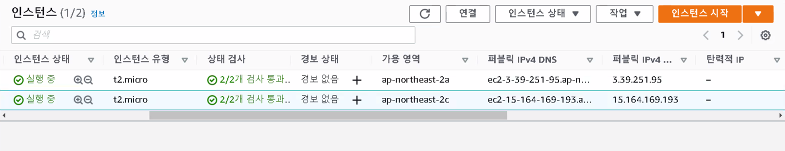
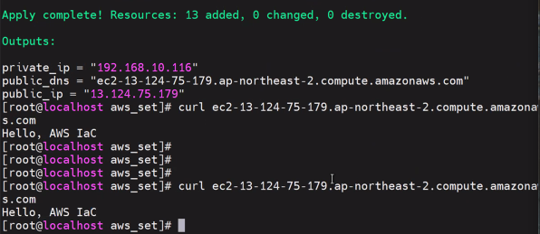

# 0704

# Terraform

## IaC(코드형 인프라)란?

코드(스크립트)를 작성 및 실행하여 인프라를 생성, 배포, 수정, 정리하는 것을 말한다. 이는 서버를 물리적으로 설치하는 등의 하드웨어 측면을 포함하여 운영의 모든 측면을 소프트웨어적으로 생각하는 중대한 사고 전환을 보여준다. 코드형 인프라의 핵심은 서버, 데이터베이스, 네트워크, 로그 파일, 애플리케이션 구성, 문서, 자동화된 테스트, 배포 프로세스 등 거의 모든 것을 코드(스크립트)로 관리할 수 있다는 것이다.

코드형 인프라 도구로는 애드혹 스크립트, 구성 관리 도구, 서버 템플릿 도구, 오케스트레이션 도구, 프로비전 도구가 있다.


### 1. 애드혹 스크립트

수행할 작업을 단계별로 나누고 배시(Bash)와 같은 언어를 사용하여 각 단계를 코드로 정의하고 작성된 스크립트를 서버에서 수동으로 실행하는 것이다. 코드를 직접 작성하여 매번 수동으로 맞춤 코드를 작성해야 되기 때문에 간단한 설치에 적합하다.

```
#!/bin/bash
yum install -y httpd
systemctl enable --now httpd
echo "Hello World" > /var/www/html/index.html
```


### 2. 구성 관리 도구(Configuration)

세프, 퍼핏, 앤서블, 솔트스택 등은 모두 구성 관리 도구로써 대상 서버에 소프트웨어를 설치하고 관리하도록 설계되어 있다. 배시 스크립트와 비슷해 보이지만 애드혹 스크립트를 사용할 떄와 다른 여러가지 장점이 있다.

1) 코딩 규칙

   구성 관리 도구는 문서화, 파일 레이아웃, 명확하게 이름 붙여진 매개 변수, 시크릿 관리 등을 포함하는 코딩 규칙으로 일관되고 예측 가능한 구조를 제공한다.

2) 멱등성

   구성 관리 도구는 실행 횟수에 관계없이 설정 파일을 사용하여 소프트웨어가 설치되지 않았을 경우에만 설치하고 소프트웨어가 동작하지 않는 경우에만 동작하도록 한다.

3. 분산형 구조

   애드혹 스크립트는 단일 로컬 머신에서만 실행되도록 설계되어 있지만 앤서블과 가은 구성 관리 도구는 원격의 수많은 서버를 관리하기 위해 특별히 설계된 것이다. 관리가 필요한 서버들의 IP를 정리한 hosts 파일을 생성하고 플레이북을 정의하여 실행한다.

### 3. 서버 템플릿 도구

도커, 패커, 베이그런트와 같은 서버 템플릿 도구는 여러 서버를 시작하고 각각 동일한 코드를 실행하여 서버를 구성하는 기존 방식과 다르게, 운영체제, 소프트웨어, 파일 및 기타 필요한 모든 내용을 포함하고 있는 스냅샷으로 이미지를 생성하여 모든 서버에 이미지를 설치할 수 있다. 실행은 서버에 이미지를 배포하고 할 수 있다.

### 4. 오케스트레이션 도구

서버 템플릿 도구는 VM이나 컨테이너를 생성하기에 좋은 도구이지만 관리 부분이 부족하기 때문에 오케스트레이션 도구가 필요하다. 오케스트레이션 도구는 VM과 컨테이너 배포, 효율적 업데이트 및 롤백, 자동복구(치유), 자동 확장(조정), 로드밸런싱, 서로 식별하고 통신할 수 있게 서비스 검색 기능을 제공한다. 쿠버네티스를 사용하면 도커 컨테이너를 어떻게 관리할지를 코드로 정의할 수 있다. 오케스트레이션 도구의 종류로는 온-프렘에서 클러스터를 구축할 수 있는 쿠버네티스, 마라톤/메소스, 도커 스웜, 노마드 등이 있으며 퍼블릭 클라우드에서는 AWS EKS, Azure AKS, GCP GKE가 있다.

### 5. 프로비전 도구

 구성관리, 서버 템플릿 및 오케스트레이션 도구가 각 서버에서 실행되는 코드를 정의한다면 테라폼, 클라우드포메이션, 오픈스택 히트와 같은 히트와 같은 프로비전 도구는 서버 자체를 생성한다. 서버 생성만 하는 것이 아니라 사실상 설정도 하고 있어서 인프라에 관한 거의 모든 부분을 프로비저닝할 수 있다.

## IaC(코드형 인프라) 장점

수동으로 코드를 변환하지 않아도 되므로 소프트웨어를 효율적으로 배포할 수 있다. IaC(코드형 인프라)는 데브옵스의 일종으로 이를 도입한 조직은 배포 횟수를 200배 늘렸고 오류를 24배 빠르게 개선하며 배포 시간을 2,555배 줄였다.

### 1. 자급식 배포

'마법의 명령어'를 알고 있는 소수의 시스템 관리자만 프로덕션 환경에 접속하며 배포를 진행해 왔다. 하지만 인프라를 코드로 정의하면 전체 배포 프로세스를 자동화할 수 있으며 개발자도 필요할 때마다 자체적으로 배포를 진행할 수 있다.

### 2. 속도와 안정성

배포 프로세스를 자동화하면 사람이 진행하는 것보다 훨씬 빠르게 컴퓨터가 배포를 진행할 수 있다. 자동화된 프로세스는 일관되고 반복 가능하며 수동으로 진행했을 때 보다 오류가 적게 발생하기 때문에 더 안전하다.

### 3. 문서화

시스템 관리자뿐만 아니라 누구나 읽을 수 있는 소스 파일로 인프라 상태를 나타낼 수 있다. 즉 모든 사람이 인프라 구조를 이해하고 업무를 볼 수 있도록 해준다.

### 4. 버전 관리

인프라의 변경 내용이 모두 기록된 코드형 인프라 소스 파일을 저장할 수 있으므로 버전을 쉽게 관리할 수 있다. 시스템에 문제가 생겼을 때 문제가 발생한 지점을 찾기가 수월하다. 문제의 내용을 확인한 다음 문제가 ㅇ벗던 이전 코드로 다시 되돌리면 문제가 해결된다.

### 5. 유효성 검증

인프라 상태가 코드로 정의되어 있으면 코드가 변경될 때마다 검증을 수행하고 일련의 자동화된 테스트를 실행할 수 있다.

### 6. 재사용성

인프라를 재사용 가능한 모듈로 패키징할 수 있으므로 모든 제품을 매번 처음부터 배포하는 대신 문서화되고 검증된 모듈로 일관되게 배포할 수 있다.

## 테라폼이란?

HashiCorp Terraform은 버전을 지정하고 재사용하고 공유할 수 있는 사람이 읽을 수 있는 구성 파일에서 클라우드 및 온프레미스 리소스를 모두 정의할 수 있는 코드형 인프라 도구이다. 그런 다음 일관된 워크플로를 사용하여 수명 주기 동안 모든 인프라를 프로비저닝하고 관리할 수 있다. Terraform은 컴퓨팅, 스토리지 및 네트워킹 리소스와 같은 하위 수준 구성 요소는 물론 DNS 항목 및 SaaS 기능과 같은 상위 수준 구성 요소를 관리할 수 있다.

## 테라폼은 어떻게 작동합니까?

Terraform은 API(응용 프로그래밍 인터페이스)를 통해 클라우드 플랫폼 및 기타 서비스에서 리소스를 생성하고 관리한다. 제공자를 통해 Terraform은 액세스 가능한 API를 통해 거의 모든 플랫폼 또는 서비스와 함께 작동할 수 있다.


HashiCorp와 Terraform 커뮤니티는 이미 수천가지 유형의 리소스와 서비스를 관리하기 위해 1700개 이상의 공급자를 작성했으며 이 숫자는 계속해서 증가하고 있다. AWS, Azure, GCP, Kubernetesm, Helm, Github, Splunk, DataDog 등을 포함하여 Terraform Registry에서 공개적으로 사용 가능한 모든 공급자를 찾을 수 있다.

핵심 Terraform 워크플로는 세 단계로 구성된다.

### 1. 쓰기

여러 클라우드 공급자 및 서비스에 걸쳐 있을 수 있는 리소스를 정의한다. 예를 등러 보안 그룹 및 로드 밸런서가 있는 Virtual Private Cloud(VPC) 네트워크의 가상 머신에 애플리케이션을 배포하기 위한 구성을 생성할 수 있다.

### 2. 계획

Terraform은 기존 인프라 및 구성을 기반으로 생성, 업데이트 또는 파괴할 인프라를 설명하는 실행 계획을 생성한다.

### 3. 적용

승인시 Terraform은 리소스 종속성을 고려하여 제안된 작업을 올바른 순서로 수행한다. 예를 들어 VPC의 속성을 업데이트하고 해당 VPC의 가상 머신 수를 변경하면 Terraform은 가상 머신을 확장하기 전에 VPC를 다시 생성한다.


# 테라폼(Terraform)

https://registry.terraform.io/

## main.tf

* vi main.tf

```
# vi main.tf
provider "aws" {
  region = "ap-northeast-2"
}

### new-vpc ###

resource "aws_vpc" "new_vpc" {
  cidr_block  = "192.168.0.0/16"
  enable_dns_hostnames = true
  enable_dns_support = true
  instance_tenancy = "default"

  tags = {
    Name = "NEW-VPC"
  }
}

data "aws_availability_zones" "available" {
  state = "available"
}

resource "aws_subnet" "new_public_subnet_2a" {
  vpc_id = aws_vpc.new_vpc.id
  cidr_block = "192.168.0.0/20"
  map_public_ip_on_launch = true
  availability_zone = data.aws_availability_zones.available.names[0]
  tags = {
    Name = "NEW-PUBLIC-SUBNET-2A"
  }
}

resource "aws_subnet" "new_public_subnet_2b" {
  vpc_id = aws_vpc.new_vpc.id
  cidr_block = "192.168.16.0/20"
  map_public_ip_on_launch = true
  availability_zone = data.aws_availability_zones.available.names[1]
  tags = {
    Name = "NEW-PUBLIC-SUBNET-2B"
  }
}

resource "aws_subnet" "new_public_subnet_2c" {
  vpc_id = aws_vpc.new_vpc.id
  cidr_block = "192.168.32.0/20"
  map_public_ip_on_launch = true
  availability_zone = data.aws_availability_zones.available.names[2]
  tags = {
    Name = "NEW-PUBLIC-SUBNET-2C"
  }
}

resource "aws_subnet" "new_public_subnet_2d" {
  vpc_id = aws_vpc.new_vpc.id
  cidr_block = "192.168.48.0/20"
  map_public_ip_on_launch = true
  availability_zone = data.aws_availability_zones.available.names[3]
  tags = {
    Name = "NEW-PUBLIC-SUBNET-2D"
  }
}

resource "aws_internet_gateway" "new_igw" {
  vpc_id = aws_vpc.new_vpc.id
  tags = {
    Name = "NEW-IGW"
  }
}

resource "aws_route_table" "new_public_rtb" {
  vpc_id = aws_vpc.new_vpc.id

  route {
    cidr_block = "0.0.0.0/0"
    gateway_id = aws_internet_gateway.new_igw.id
  }
  tags = {
    Name = "NEW-PUBLIC-RTB"
  }
}

resource "aws_route_table_association" "new_public_subnet_2a_association" {
  subnet_id = aws_subnet.new_public_subnet_2a.id
  route_table_id = aws_route_table.new_public_rtb.id
}

resource "aws_route_table_association" "new_public_subnet_2b_association" {
  subnet_id = aws_subnet.new_public_subnet_2b.id
  route_table_id = aws_route_table.new_public_rtb.id
}

resource "aws_route_table_association" "new_public_subnet_2c_association" {
  subnet_id = aws_subnet.new_public_subnet_2c.id
  route_table_id = aws_route_table.new_public_rtb.id
}

resource "aws_route_table_association" "new_public_subnet_2d_association" {
  subnet_id = aws_subnet.new_public_subnet_2d.id
  route_table_id = aws_route_table.new_public_rtb.id
}

### asg ###

resource "aws_security_group" "instance" {
  name   = var.instance_security_group_name
  vpc_id = aws_vpc.new_vpc.id

  ingress {
    from_port   = var.http_port
    to_port     = var.http_port
    protocol    = "tcp"
    cidr_blocks = ["0.0.0.0/0"]
  }
  ingress {
    from_port   = 22
    to_port     = 22
    protocol    = "tcp"
    cidr_blocks = ["0.0.0.0/0"]
  }
  ingress {
    from_port   = -1
    to_port     = -1
    protocol    = "icmp"
    cidr_blocks = ["0.0.0.0/0"]
  }
  egress {
    from_port   = 0
    to_port     = 0
    protocol    = "-1"
    cidr_blocks = ["0.0.0.0/0"]
  }
}

resource "aws_launch_configuration" "example" {
  image_id        = "ami-0fd0765afb77bcca7"
  instance_type   = "t2.micro"
  security_groups = [aws_security_group.instance.id]
  key_name        = "new-key"
  user_data       = file("user-data.sh")

  # Required when using a launch configuration with an auto scaling group.
  lifecycle {
    create_before_destroy = true
  }
}

resource "aws_autoscaling_group" "example" {
  launch_configuration = aws_launch_configuration.example.name
  vpc_zone_identifier  = [
    aws_subnet.new_public_subnet_2a.id,
    aws_subnet.new_public_subnet_2b.id,
    aws_subnet.new_public_subnet_2c.id,
    aws_subnet.new_public_subnet_2d.id
  ]

  target_group_arns = [aws_lb_target_group.asg.arn]
  health_check_type = "ELB"

  min_size         = 2
  desired_capacity = 2
  max_size         = 4

  tag {
    key                 = "Name"
    value               = "terraform-asg-example"
    propagate_at_launch = true
  }
}

resource "aws_lb" "example" {

  name               = var.alb_name

  load_balancer_type = "application"
  subnets            = [
    aws_subnet.new_public_subnet_2a.id,
    aws_subnet.new_public_subnet_2b.id,
    aws_subnet.new_public_subnet_2c.id,
    aws_subnet.new_public_subnet_2d.id
  ]
  security_groups    = [aws_security_group.alb.id]
}

resource "aws_lb_listener" "http" {
  load_balancer_arn = aws_lb.example.arn
  port              = var.http_port
  protocol          = "HTTP"

  # By default, return a simple 404 page
  default_action {
    type = "fixed-response"

    fixed_response {
      content_type = "text/plain"
      message_body = "404: page not found"
      status_code  = 404
    }
  }
}

resource "aws_lb_target_group" "asg" {

  name = var.alb_name

  port     = var.http_port
  protocol = "HTTP"
  vpc_id   = aws_vpc.new_vpc.id

  health_check {
    path                = "/"
    protocol            = "HTTP"
    matcher             = "200"	# 성공 코드
    interval            = 15
    timeout             = 3
    healthy_threshold   = 2
    unhealthy_threshold = 2
  }
}

resource "aws_lb_listener_rule" "asg" {
  listener_arn = aws_lb_listener.http.arn
  priority     = 100

  condition {
    path_pattern {
      values = ["*"]
    }
  }

  action {
    type             = "forward"
    target_group_arn = aws_lb_target_group.asg.arn
  }
}

resource "aws_security_group" "alb" {
  vpc_id = aws_vpc.new_vpc.id
  name   = var.alb_security_group_name

  # Allow inbound HTTP requests
  ingress {
    from_port   = var.http_port
    to_port     = var.http_port
    protocol    = "tcp"
    cidr_blocks = ["0.0.0.0/0"]
  }

  ingress {
    from_port   = 443		# https
    to_port     = 443
    protocol    = "tcp"
    cidr_blocks = ["0.0.0.0/0"]
  }

  # Allow all outbound requests
  egress {
    from_port   = 0
    to_port     = 0
    protocol    = "-1"
    cidr_blocks = ["0.0.0.0/0"]
  }
}
resource "aws_autoscaling_policy" "scale_in" {
  name                   = "ScaleInPolicy"
  autoscaling_group_name = aws_autoscaling_group.example.name
  adjustment_type        = "ChangeInCapacity"		# desired capacity
  scaling_adjustment     = -1
  cooldown               = 300
}

resource "aws_cloudwatch_metric_alarm" "scale_in" {
  alarm_description   = "Monitors CPU utilization for Terramino ASG"
  alarm_actions       = [aws_autoscaling_policy.scale_in.arn]
  alarm_name          = "ScaleInAlarm"
  comparison_operator = "LessThanOrEqualToThreshold"
  namespace           = "AWS/EC2"
  metric_name         = "CPUUtilization"
  threshold           = "30"
  evaluation_periods  = "1"
  period              = "300"
  statistic           = "Average"

  dimensions = {
    AutoScalingGroupName = aws_autoscaling_group.example.name
  }
}

resource "aws_autoscaling_policy" "scale_out" {
  name                   = "ScaleOutPolicy"
  autoscaling_group_name = aws_autoscaling_group.example.name
  adjustment_type        = "ChangeInCapacity"
  scaling_adjustment     = 1
  cooldown               = 300
}

resource "aws_cloudwatch_metric_alarm" "scale_out" {
  alarm_description   = "Monitors CPU utilization for Terramino ASG"
  alarm_actions       = [aws_autoscaling_policy.scale_out.arn]
  alarm_name          = "ScaleOutAlarm"
  comparison_operator = "GreaterThanOrEqualToThreshold"
  namespace           = "AWS/EC2"
  metric_name         = "CPUUtilization"
  threshold           = "70"
  evaluation_periods  = "1"
  period              = "300"
  statistic           = "Average"

  dimensions = {
    AutoScalingGroupName = aws_autoscaling_group.example.name
  }
}
```

> 자세히...

### VPC

- #### new-vpc

```
### new-vpc ###

resource "aws_vpc" "new_vpc" {
  cidr_block  = "192.168.0.0/16"
  enable_dns_hostnames = true
  enable_dns_support = true
  instance_tenancy = "default"

  tags = {
    Name = "NEW-VPC"
  }
}
```

- #### availability_zones

````
data "aws_availability_zones" "available" {
  state = "available"
}
````

- #### public_subnet

````
resource "aws_subnet" "new_public_subnet_2a" {
  vpc_id = aws_vpc.new_vpc.id
  cidr_block = "192.168.0.0/20"
  map_public_ip_on_launch = true
  availability_zone = data.aws_availability_zones.available.names[0]
  tags = {
    Name = "NEW-PUBLIC-SUBNET-2A"
  }
}

resource "aws_subnet" "new_public_subnet_2b" {
  vpc_id = aws_vpc.new_vpc.id
  cidr_block = "192.168.16.0/20"
  map_public_ip_on_launch = true
  availability_zone = data.aws_availability_zones.available.names[1]
  tags = {
    Name = "NEW-PUBLIC-SUBNET-2B"
  }
}

resource "aws_subnet" "new_public_subnet_2c" {
  vpc_id = aws_vpc.new_vpc.id
  cidr_block = "192.168.32.0/20"
  map_public_ip_on_launch = true
  availability_zone = data.aws_availability_zones.available.names[2]
  tags = {
    Name = "NEW-PUBLIC-SUBNET-2C"
  }
}

resource "aws_subnet" "new_public_subnet_2d" {
  vpc_id = aws_vpc.new_vpc.id
  cidr_block = "192.168.48.0/20"
  map_public_ip_on_launch = true
  availability_zone = data.aws_availability_zones.available.names[3]
  tags = {
    Name = "NEW-PUBLIC-SUBNET-2D"
  }
}
````

- #### internet_gateway

```
resource "aws_internet_gateway" "new_igw" {
  vpc_id = aws_vpc.new_vpc.id
  tags = {
    Name = "NEW-IGW"
  }
}

```

- #### public_rtb

````
resource "aws_route_table" "new_public_rtb" {
  vpc_id = aws_vpc.new_vpc.id

  route {
    cidr_block = "0.0.0.0/0"
    gateway_id = aws_internet_gateway.new_igw.id
  }
  tags = {
    Name = "NEW-PUBLIC-RTB"
  }
}
````

- #### route_table_association

```
resource "aws_route_table_association" "new_public_subnet_2a_association" {
  subnet_id = aws_subnet.new_public_subnet_2a.id
  route_table_id = aws_route_table.new_public_rtb.id
}

resource "aws_route_table_association" "new_public_subnet_2b_association" {
  subnet_id = aws_subnet.new_public_subnet_2b.id
  route_table_id = aws_route_table.new_public_rtb.id
}

resource "aws_route_table_association" "new_public_subnet_2c_association" {
  subnet_id = aws_subnet.new_public_subnet_2c.id
  route_table_id = aws_route_table.new_public_rtb.id
}

resource "aws_route_table_association" "new_public_subnet_2d_association" {
  subnet_id = aws_subnet.new_public_subnet_2d.id
  route_table_id = aws_route_table.new_public_rtb.id
}
```


### Auto Scaling Group

- #### instance security group

  - #### ingress / egress

```
### asg ###

resource "aws_security_group" "instance" {
  name   = var.instance_security_group_name
  vpc_id = aws_vpc.new_vpc.id

  ingress {
    from_port   = var.http_port
    to_port     = var.http_port
    protocol    = "tcp"
    cidr_blocks = ["0.0.0.0/0"]
  }
  ingress {
    from_port   = 22
    to_port     = 22
    protocol    = "tcp"
    cidr_blocks = ["0.0.0.0/0"]
  }
  ingress {
    from_port   = -1
    to_port     = -1
    protocol    = "icmp"
    cidr_blocks = ["0.0.0.0/0"]
  }
  egress {
    from_port   = 0
    to_port     = 0
    protocol    = "-1"
    cidr_blocks = ["0.0.0.0/0"]
  }
}
```

- launch configuration
  - 시작 템플릿과 유사하지만 다름
  - 버전 관리가 안됨 (롤백 기능 = 과거버전으로 되돌리는 것)
  - 유사시에 똑같은 리소스 

```
resource "aws_launch_configuration" "example" {
  image_id        = "ami-0fd0765afb77bcca7"
  instance_type   = "t2.micro"
  security_groups = [aws_security_group.instance.id]
  key_name        = "new-key"
  user_data       = file("user-data.sh")	# 수정할 파일

  # Required when using a launch configuration with an auto scaling group.
  lifecycle {
    create_before_destroy = true
  }
}
```

* vi user-data.sh

```
#!bin/bash
yum install -y httpd
systemctl enable --now httpd
ech "Hello AWS Terraform" > /var/www/html/index.html
timedatectl set-timezone Asia/Seoul
rdate -s time.bora.net
echo $(date +"%H:%M:%S") >> /var/www/html/index.html
sleep 600
yes > /dev/null &		# 과부하
```

- asg

```
resource "aws_autoscaling_group" "example" {
  launch_configuration = aws_launch_configuration.example.name
  vpc_zone_identifier  = [
    aws_subnet.new_public_subnet_2a.id,
    aws_subnet.new_public_subnet_2b.id,
    aws_subnet.new_public_subnet_2c.id,
    aws_subnet.new_public_subnet_2d.id
  ]

  target_group_arns = [aws_lb_target_group.asg.arn]
  health_check_type = "ELB"

  min_size         = 2
  desired_capacity = 2
  max_size         = 4

  tag {
    key                 = "Name"
    value               = "terraform-asg-example"
    propagate_at_launch = true
  }
}
```

- #### load balancer

* asg 설치 과정에서 alb 생성

```
resource "aws_lb" "example" {

  name               = var.alb_name

  load_balancer_type = "application"
  subnets            = [
    aws_subnet.new_public_subnet_2a.id,
    aws_subnet.new_public_subnet_2b.id,
    aws_subnet.new_public_subnet_2c.id,
    aws_subnet.new_public_subnet_2d.id
  ]
  security_groups    = [aws_security_group.alb.id]		# 앞으로 생성할 보안그룹
}
```

- #### alb listener

  - #### frontend

```
resource "aws_lb_listener" "http" {
  load_balancer_arn = aws_lb.example.arn
  port              = var.http_port
  protocol          = "HTTP"

  # By default, return a simple 404 page
  default_action {
    type = "fixed-response"

    fixed_response {
      content_type = "text/plain"
      message_body = "404: page not found"
      status_code  = 404
    }
  }
}
```

- #### alb target group

```
resource "aws_lb_target_group" "asg" {

  name = var.alb_name

  port     = var.http_port
  protocol = "HTTP"
  vpc_id   = aws_vpc.new_vpc.id

  health_check {
    path                = "/"
    protocol            = "HTTP"
    matcher             = "200"		# 성공 코드
    interval            = 15
    timeout             = 3
    healthy_threshold   = 2
    unhealthy_threshold = 2
  }
}
```

- #### alb listener rule

  - firefox, mobile...

```
resource "aws_lb_listener_rule" "asg" {
  listener_arn = aws_lb_listener.http.arn
  priority     = 100

  condition {
    path_pattern {
      values = ["*"]
    }
  }

  action {
    type             = "forward"
    target_group_arn = aws_lb_target_group.asg.arn
  }
}
```

- #### alb security group

  - alb

```
resource "aws_security_group" "alb" {
  vpc_id = aws_vpc.new_vpc.id
  name   = var.alb_security_group_name

  # Allow inbound HTTP requests
  ingress {
    from_port   = var.http_port
    to_port     = var.http_port
    protocol    = "tcp"
    cidr_blocks = ["0.0.0.0/0"]
  }

  ingress {
    from_port   = 443		# https
    to_port     = 443
    protocol    = "tcp"
    cidr_blocks = ["0.0.0.0/0"]
  }

  # Allow all outbound requests
  egress {
    from_port   = 0
    to_port     = 0
    protocol    = "-1"
    cidr_blocks = ["0.0.0.0/0"]
  }
}
```

- #### autoscaling scale in policy

```
resource "aws_autoscaling_policy" "scale_in" {
  name                   = "ScaleInPolicy"
  autoscaling_group_name = aws_autoscaling_group.example.name
  adjustment_type        = "ChangeInCapacity"
  scaling_adjustment     = -1
  cooldown               = 300
}
```

- #### cloudwatch scale in alarm

```
resource "aws_cloudwatch_metric_alarm" "scale_in" {
  alarm_description   = "Monitors CPU utilization for Terramino ASG"
  alarm_actions       = [aws_autoscaling_policy.scale_in.arn]
  alarm_name          = "ScaleInAlarm"
  comparison_operator = "LessThanOrEqualToThreshold"
  namespace           = "AWS/EC2"
  metric_name         = "CPUUtilization"
  threshold           = "30"
  evaluation_periods  = "1"
  period              = "300"
  statistic           = "Average"

  dimensions = {
    AutoScalingGroupName = aws_autoscaling_group.example.name
  }
}
```

- #### autoscaling scale out policy

```
resource "aws_autoscaling_policy" "scale_out" {
  name                   = "ScaleOutPolicy"
  autoscaling_group_name = aws_autoscaling_group.example.name
  adjustment_type        = "ChangeInCapacity"
  scaling_adjustment     = 1
  cooldown               = 300
}
```

- #### cloudwatch scale out alarm

```
resource "aws_cloudwatch_metric_alarm" "scale_out" {
  alarm_description   = "Monitors CPU utilization for Terramino ASG"
  alarm_actions       = [aws_autoscaling_policy.scale_out.arn]
  alarm_name          = "ScaleOutAlarm"
  comparison_operator = "GreaterThanOrEqualToThreshold"
  namespace           = "AWS/EC2"
  metric_name         = "CPUUtilization"
  threshold           = "70"
  evaluation_periods  = "1"
  period              = "300"
  statistic           = "Average"

  dimensions = {
    AutoScalingGroupName = aws_autoscaling_group.example.name
  }		# 다른 리소스도 가능
}
```

**Scale In/Out을 Scale Down/Up으로 표현하기도 한다**

* Terraform registry에서도 Down/Up으로


## outputs.tf

* vi outputs.tf

```\
# vi outputs.tf
output "alb_dns_name" {		# 출력되는 이름 - 내가 부여
  value       = aws_lb.example.dns_name
  description = "The domain name of the load balancer"
}
```

*

```
# terraform init
# terraform validate
# terraform plan
# terraform apply
# terraform output alb_dns_name
```


* AWS 확인


* 원하는 용량이 먼저 바뀜 - ChangeInCapacity


* az별로 배치



* ScaleOutAlarm


* 인스턴스


* terraform 종료

```
# terraform destroy
yes
```


## aws_set

* git 설치

```
# yum install -y git
```

* git clone

```
# git clone https://github.com/hali-linux/aws_set.git
# ls
```


* aws_set 으로 이동

```
# cd aws_set/
# ls
```


* user data.sh 파일 이름 main.tf와 일치시켜야... - 확인!


* terraform 시작

```
# terraform init
# terraform apply
yes
```



* terraform 종료

```
# terraform destroy
yes
```


## Azure CLI

* azure_cli 폴더 생성 및 이동

```
# mkdir azure_cli && cd $_
```

* azure-cli repository 설정

```
# echo -e "[azure-cli]
name=Azure CLI
baseurl=https://packages.microsoft.com/yumrepos/azure-cli
enabled=1
gpgcheck=1
gpgkey=https://packages.microsoft.com/keys/microsoft.asc" | sudo tee /etc/yum.repos.d/azure-cli.repo
```

* az 도구(azure-cli) 설치

```
# yum install -y azure-cli
# az upgrade
# az --version
```

* login

```
# az login
```


* 로그인됨


* 리소스그룹 생성

```
# resourceGroup=VMTutorialResources
# location=koreacentral
# az group create --name $resourceGroup --location $location
```


* vnet & subnet
  * `\` : 개행문자
  * `--` : 옵션

```
# vnetName=TutorialVNet1
# subnetName=TutorialSubnet1
# vnetAddressPrefix=10.123.0.0/16
# subnetAddressPrefix=10.123.0.0/24
# az network vnet create \
--name $vnetName \
--resource-group $resourceGroup \
--address-prefixes $vnetAddressPrefix \
--subnet-name $subnetName \
--subnet-prefixes $subnetAddressPrefix
```

* vnet 확인

```
# az network vnet list
```

* vm 생성

```
# vmName=TutorialVM1
# vi httpd.txt
#!/bin/bash
apt update
apt install -y apache2
echo "<h1>Hello Azure CLI</h1>" > /var/www/html/index.html

# az vm create \
--resource-group $resourceGroup \
--name $vmName \
--image UbuntuLTS \
--vnet-name $vnetName \
--subnet $subnetName \
--size Standard_B1s \
--custom-data httpd.txt \
--admin-username azureuser \
--generate-ssh-keys \
--output json \
--verbose
```


* 아직 port 설정 x
  * curl 안나옴


* NSG rule 생성
  * nsg(network security group)는 vm 만들때 이미 생성됨...규칙만 추가

```
# az network nsg rule create \
--resource-group $resourceGroup \
--nsg-name TutorialVM1NSG \
--name myNetworkSecurityGroupRule \
--protocol tcp \
--priority 900 \
--destination-port-range 80
```


* ip-addresses

```
# az vm list-ip-addresses
```


* 443 port (https)
* `--priority` : 다르게 해주어야 함

```
# az vm open-port -n $vmName -g $resourceGroup --port 443 --priority 999
```

* ssh

```
# ssh -i /root/.ssh/id_rsa azureuser@[vm IP]
yes
```


* exit


애드혹...

* vm 삭제

```
# az vm delete --resource-group $resourceGroup --name $vmName --yes
# az group delete -n $resourceGroup
# az group delete -n NetworkWatcherRG
```

## azure_set

https://docs.microsoft.com/ko-kr/azure/developer/terraform/create-resource-group?tabs=azure-cli

*

```
# git clone https://github.com/hali-linux/azure_set.git
```

### variables.tf

```
# vi variables.tf
variable "resource_group_name_prefix" {
  default       = "rg"					# resource group
  description   = "Prefix of the resource group name that's combined with a random ID so name is unique in your Azure subscription."
}

variable "resource_group_location" {
  default = "koreacentral"
  description   = "Location of the resource group."
}
```

### main.tf

* resource_group 생성

```
# Configure the Microsoft Azure Provider
provider "azurerm" {		# resource manager
  features {}
}

# Create random pet names as unique identifiers for other resources
resource "random_pet" "rg-name" {	
  prefix    = var.resource_group_name_prefix	# rg
}

# Create a resource group
resource "azurerm_resource_group" "rg" {
  name      = random_pet.rg-name.id				# rg name random하게 생성
  location  = var.resource_group_location		# koreacentral
}
```

* virtual network 

```
# Create virtual network
resource "azurerm_virtual_network" "myterraformnetwork" {
  name                = "myVnet"
  address_space       = ["10.223.0.0/16"]
  location            = azurerm_resource_group.rg.location
  resource_group_name = azurerm_resource_group.rg.name
}
```

* subnet

```
# Create subnet
resource "azurerm_subnet" "myterraformsubnet" {
  name                 = "mySubnet"
  resource_group_name  = azurerm_resource_group.rg.name
  virtual_network_name = azurerm_virtual_network.myterraformnetwork.name
  address_prefixes     = ["10.233.0.0/24"]
}
```

* public IPs

```
# Create public IPs
resource "azurerm_public_ip" "myterraformpublicip" {
  name                = "myPublicIP"		# IP에 이름 붙이기 가능
  location            = azurerm_resource_group.rg.location
  resource_group_name = azurerm_resource_group.rg.name
  allocation_method   = "Dynamic"
}
```

* Network Security Group

```
# Create Network Security Group and rule
resource "azurerm_network_security_group" "myterraformnsg" {
  name                = "myNetworkSecurityGroup"
  location            = azurerm_resource_group.rg.location
  resource_group_name = azurerm_resource_group.rg.name

  security_rule {
    name                       = "SSH"
    priority                   = 1001		# between 100 and 4096
    direction                  = "Inbound"	# Inbound or Outbound
    access                     = "Allow"	# Allow or Deny
    protocol                   = "Tcp"
    source_port_range          = "*"
    destination_port_range     = "22"
    source_address_prefix      = "112.221.225.165/32"	# 내 ip
    destination_address_prefix = "*"
  }
  security_rule {
    name                       = "HTTP"
    priority                   = 1002
    direction                  = "Inbound"
    access                     = "Allow"
    protocol                   = "Tcp"
    source_port_range          = "*"
    destination_port_range     = "80"
    source_address_prefix      = "*"
    destination_address_prefix = "*"
  }
}
```

* network interface
  * 일종의 랜카드...aws는 자동으로 생성됨

```
# Create network interface
resource "azurerm_network_interface" "myterraformnic" {
  name                = "myNIC"
  location            = azurerm_resource_group.rg.location
  resource_group_name = azurerm_resource_group.rg.name

  ip_configuration {
    name                          = "myNicConfiguration"
    subnet_id                     = azurerm_subnet.myterraformsubnet.id
    private_ip_address_allocation = "Dynamic"
    public_ip_address_id          = azurerm_public_ip.myterraformpublicip.id
  }
}
```

* Connect SG & NI

```
# Connect the security group to the network interface
resource "azurerm_network_interface_security_group_association" "example" {
  network_interface_id      = azurerm_network_interface.myterraformnic.id
  network_security_group_id = azurerm_network_security_group.myterraformnsg.id
}
```

* SSH key

```
# Create (and display) an SSH key
resource "tls_private_key" "example_ssh" {
  algorithm = "RSA"
  rsa_bits  = 4096		# 4k : 높을수록 복잡
}
```

* virtual machine

```
# Create virtual machine
resource "azurerm_linux_virtual_machine" "myterraformvm" {
  name                  = "myVM"
  location              = azurerm_resource_group.rg.location
  resource_group_name   = azurerm_resource_group.rg.name
  network_interface_ids = [azurerm_network_interface.myterraformnic.id]
  size                  = "Standard_B1s"

  os_disk {
    name                 = "myOsDisk"
    caching              = "ReadWrite"
    storage_account_type = "Premium_LRS"
  }

  source_image_reference {
    publisher = "Canonical"
    offer     = "UbuntuServer"
    sku       = "18.04-LTS"
    version   = "latest"
  }

  computer_name                   = "myvm"
  admin_username                  = "azureuser"
  custom_data                     = filebase64("httpd-azure.txt")
  disable_password_authentication = true

  admin_ssh_key {
    username   = "azureuser"
    public_key = tls_private_key.example_ssh.public_key_openssh
  }

}
```

