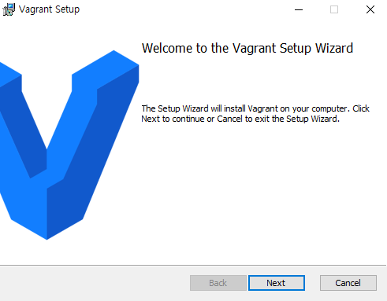
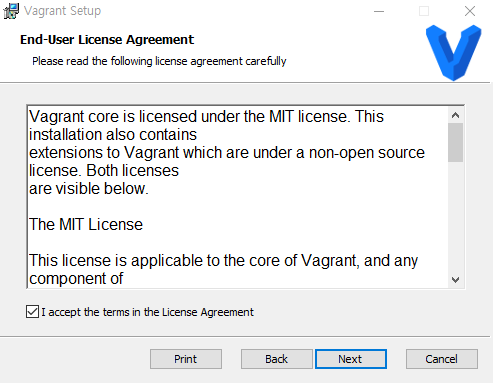
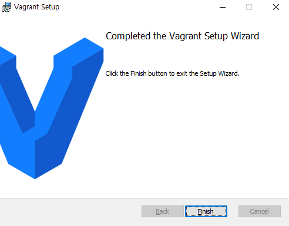

# 0706

# Ansible

## 앤서블 이해하기

Ansible(앤서블)은 여러개의 서버를 효율적으로 관리할 수 있게 해주는 환경 구성 자동화 도구이다. 2012년에 마이클 데한이라는 개발자가 만들어 소스코드를 공개한 오픈소스 소프트웨어이다. 2015년에 오픈소스 업계의 큰 손인 레드헷이 인수했다.

앤서블은 플레이북이라는 파일에 실행할 구성을 선언해놓으면, 필요할 때마다 자동으로 실행시킬수 있는 것이 가장 큰 특징이다. 웹 서버의 구성과 DB 서버의 구성을 선언해놓으면 관리자들은 필요할 때마다  그 구성대로 서버의 설정을 배포할 수 있게 해주는 것이다.

기존 리눅스에서 동일한 환경을 구성하기 위해 Bash 쉘 스크립트에 패키지의 설치, 설정파일 수정 등을 나열하여 이를 실행하는 것이 일반적이었다. IT의 기술력이 진보함에 따라 인프라 환경도 기존 Data Center에서 Cloud 환경으로 변화되고 있으며, 한명의 관리자(Admin)가 관리해야 하는 서버의 숫자가 증가하게 되었다.

따라서 클러스터에 존재하는 많은 서버들에 동시에, 동일한 환경을 배포해야 하는 상황이 발생하게 되었고, Bash 쉘 스크립트의 한계점을 갖게 되었다. 이를 위해 고안된 Infrastructure as a code 개념이다. 이것은 환경의 배포와 구성을 규격화된 코드로 정의해 사용하는 것을 의미한다. Infrastucture as a code가 가능한 자동화 도구를 이용하여 인프라의 상태를 코드로 작성하고 이를 모든 서버에 배포함으로써 특정 환경을 동일하게 유지할 수 있도록 돕게 되었다.

이런 자동화 도구 중 가장 대표적인 툴이 바로 앤서블(Ansible)이다.

## 앤서블의 3가지 요소

앤서블은 크게 3가지인 인벤토리, 플레이북, 모듈로 이루어져 있다.

1. 인벤토리는 어디서 수행할 것인지?
2. 플레이북은 무엇을 수행할 것인지?
3. 모듈은 어떻게 수행할 것인지? 를 정의한다.

### 1. 인벤토리(Inventory)

인벤토리는 앤서블에 의해 제어될 대상을 정의한다. 일반적으로 hosts.ini 파일에 정의해 사용하며, 여러 서버들의 SSH 접근 IP, 포트, 리눅스 사용자와 같은 접속 정보를 아래와 같이 정의한다.

```
[webserver]
web1 ansible_host = aaa.app.host
web2 ansible_host = bbb.app.host
[db]
db1 ansible_host = aaa.db1.host
db2 ansible_host = bbb.db2.host

```

### 2. 플레이북(Playbook)

플레이북(각본)은 인벤토리 파일에서 정의한 대상들이 무엇을 수행할 것인지 정의하는 역할을 하며, yaml 포맷으로 설정한다. 앤서블을 사용하려면 이 playbook을 잘 다룰 줄 알아야하며, 단독으로 사용되는 것이 아닌 인벤토리와 플레이북의 조합으로 같이 사용한다. 플레이북 yaml 파일의 예시는 아래와 같다.

```
---
- name: ngins install
  host: all
  become: true
  tasks:
   - name: ngix package install
     yum:
      name:nginx
      state:installed
```

 ### 3. 모듈(Module)

모듈은 플레이북에서 task가 어떻게 수행될지를 정의하는 요소이다. 타켓 호스트로 실제 작업을 처리하는 단위로 이 모듈이라는 개념을 사용한다. 앤서블은 Python Code를 호출하여 실행하기 때문에 Python이 필수적으로 필요하며, 실제로 앤서블을 설치해보면 다양한 모듈이 같이 설치되는 것을 볼 수 있다 (yum, sysctl, systemd, copy, git, docker_container 등). 예를 들어 yum 명령어를 통해 패키지를 설치할 떄 yum 모듈을 사용하면 되며 위 플레이북 예시에서 yum부분이 yum 모듈을 정의하고 이를 사용하겠다는 의미이다.


## 베이그런트(Vagrant)

베이그런트(Vagrant)는 가상 시스템 환경을 관리하기 위한 도구이다. 가상 환경 셋팅 시간을 줄이고 개발성과 생산성을 높일 수 있도록 개발 환경이나 테스트 환경을 자동으로 설정하도록 도와준다. 베이그런트(Vagrant)는 포터블 가상화 소프트웨어 개발 환경(예: 개발 생산성 증가를 위해 가상화의 소프트웨어 구성 관리의 단순화를 시도하는 버추얼박스, 하이퍼-V, 도커 컨테이너, VM웨어, AWS)의 생성 및 유지보수를 위한 오픈 소스 소프트웨어 제품의 하나이다. 베이그런트는 루비언어로 작성되어 있지만 생태계는 몇가지 언어로 개발을 지원한다.


## 실습 환경

| Name           | ISO      | CPU  | RAM  | IP           |
| -------------- | -------- | ---- | ---- | ------------ |
| ansible-server | centos7  | 1C   | 1G   | 192.168.1.20 |
| centos-node01  | centos7  | 1C   | 1G   | 192.168.1.49 |
| centos-node02  | centos7  | 1C   | 1G   | 192.168.1.50 |
| ubuntu-node01  | ubuntu18 | 1C   | 1G   | 192.168.1.8  |
| ubuntu-node02  | ubuntu18 | 1C   | 1G   | 192.168.1.48 |


### centos7 서버 생성

```
# yum install -y bash-completion wget unzip rdate
# rdate -s time.bora.net
# setenforce 0
# sed -i s/^SELINUX=.*$/SELINUX=disabled/ /etc/selinux/config
# cd /tmp
# systemctl disable --now firewalld
# yum update -y
# poweroff
```


###   ubuntu18 서버 생성

```
xeomina@ubuntu:~$ sudo vi /etc/ssh/sshd_config
[sudo] password for xeomina:

#LoginGraceTime 2m
PermitRootLogin yes		# 수정
#StrictModes yes
#MaxAuthTries 6
#MaxSessions 10

xeomina@ubuntu:~$ sudo su -
root@ubuntu:~# passwd root
Enter new UNIX password:
Retype new UNIX password:
passwd: password updated successfully

xeomina@ubuntu:~$ sudo systemctl restart sshd
```


* hostname 변경

```
hostnamectl set-hostname [server-name]
```


## Download Vagrant

* https://www.vagrantup.com/downloads










## 환경 변수 편집


* path에 아래의 환경 변수 추가

```
%SYSTEMROOT%\System32\WindowsPowerShell\v1.0\
```


## CMD

* vagrant로 프로비저닝
  * `vagrant init`

```
>cd c:\HashiCorp
c:\HashiCorp>vagrant init
>dir
>notepad vagrantfile
```


* Vagrantfile 수정
  * 이미지 변경 : `config.vm.box = "centos/7"`
  * 브릿지 활성화 : `config.vm.network "public_network"`


* vagrant를 이용한 가상 머신 만들기
  * `vagrant up`

```
>vagrant up
```


* vagrant 가상 머신에 접속
  * `vagrant ssh`


```
$ sudo yum install -y httpd
$ sudo systemctl enable --now httpd
```

* ip로 접속


```
$ exit
>vagrant destory
```


