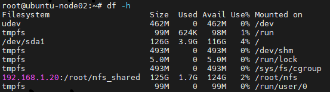

# 0707

* 실습 전에 스냅샷으로 복원


# Ansible

## 앤서블 서버 설치

* 192.168.1.20

```
# yum install epel-release -y
# yum --enablerepo=epel -y install ansible
# ansible --version
```


* 환경 설정

```
# mkdir env && cd $_
```

* 앤서블 환경 설정 자동화
* 이거 먼저

```
# vi keyscan.yml
- name: Setup for the Ansible's Environment
  hosts: localhost
  gather_facts: no

  tasks:
    - name: Keyscan
      shell: "{{ item }}"
      with_items:
        - "ssh-keyscan 192.168.1.49 >> ~/.ssh/known_hosts"
        - "ssh-keyscan 192.168.1.50 >> ~/.ssh/known_hosts"
        - "ssh-keyscan 192.168.1.8 >> ~/.ssh/known_hosts"
        - "ssh-keyscan 192.168.1.48 >> ~/.ssh/known_hosts"

```


*

```
# ansible-playbook keyscan.yml
```


* blockinfile : 여러 라인(블록)을 파일 안에

```
# vi ansible_env.yml
- name: Setup for the Ansible's Environment
  hosts: localhost
  gather_facts: no
  
  tasks:
    - name: Add "/etc/ansible/hosts"
      blockinfile: 
        path: /etc/ansible/hosts
        block: |
          [centos]
          192.168.1.49
          192.168.1.50

          [ubuntu]
          192.168.1.8 ansible_python_interpreter=/usr/bin/python3
          192.168.1.48 ansible_python_interpreter=/usr/bin/python3

    - name: Configure Bashrc
      lineinfile:   
        path: /root/.bashrc		# 숨겨진 경로
        line: "{{ item }}"		# 반복문
      with_items:
        - "alias ans='ansible'"
        - "alias anp='ansible-playbook'"
```


*

```
# ansible-playbook ansible_env.yml
```


* 자동으로 hosts에 추가

```
# cat /etc/ansible/hosts
```


* ping test
* alias는 껐다켜야 적용됨

```
# ans all -m ping -k
```


## keypair 설정

*

```
# rm -rf /root/.ssh/known_hosts
```


* 매직 변수 : ansible_host / ansible_password

```
# vi keypair_new.yml
- name: Create known_hosts between server and nodes
  hosts: all				# hosts는 다 가져오지만 connect는 local만 (ssh 사용x)
  connection: local
  serial: 1					# host 당 1번
  gather_facts: no

  tasks:
    - name: ssh-keyscan for known_hosts file
      command: /usr/bin/ssh-keyscan -t ecdsa {{ ansible_host }} 		# 매직 변수 ansible_host 활용하여 hosts ip 호출
      register: keyscan		# 결과값 저장

    - name: input key
      lineinfile:
        path: ~/.ssh/known_hosts
        line: "{{ item }}"
        create: yes				# 없으면 생성
      with_items:
        - "{{ keyscan.stdout_lines }}"

- name: Create authorized_keys between server and nodes
  hosts: all
  connection: local
  gather_facts: no
  vars:
    ansible_password: as4914	# 매직 변수

  tasks:
    - name: ssh-keygen for authorized_keys file
      openssh_keypair: 			# ssh-keygen -t rsa
        path: ~/.ssh/id_rsa
        size: 2048				# 암호화 수준 : 2048 bit
        type: rsa
        force: False 			# overwrite하지 않는다는 False라고 값을 넣거나 or 삭제

    - name: input key for each node
      connection: ssh
      authorized_key:			# pub key
        user: root
        state: present
        key: "{{ lookup('file', '~/.ssh/id_rsa.pub') }}"	# lookup : 파일 가져오기
```


*

```
# anp keypair_new.yml
```


* ubuntu key 전송 에러... > 수동으로 보내기

```
# ssh-copy-id root@192.168.1.8
# ssh-copy-id root@192.168.1.48
```


-------

## nginx

## 센토스, 우분투 엔진엑스 설치 플레이북

* 

```
# cd ~
# mkdir nginx && cd $_
```

*

```
# vi nginx_install.yml
- name: Install nginx on centos
  hosts: centos
  gather_facts: no

  tasks:
    - name: install epel-release
      yum:
        name: epel-release
        state: latest

    - name: install nginx web server
      yum:
        name: nginx
        state: present

    - name: upload default index.html for web server
      get_url:
        url: https://www.nginx.com 
        dest: /usr/share/nginx/html/
        mode: 0644
    - name: start nginx web server
      service:
        name: nginx
        state: started

- name: Install nginx on ubuntu
  hosts: ubuntu
  gather_facts: no

  tasks:
    - name: install nginx web server
      apt:
        pkg: nginx
        state: present
        update_cache: yes

    - name: Upload default index.html for web server
      get_url:
        url: https://www.nginx.com
        dest: /var/www/html/
        mode: 0644
        validate_certs: no
```


```
# anp nginx_install.yml
```


-----

**Cf) key ERROR**

```
# anp nginx_install.yml

PLAY [Install nginx on centos] ***********************************************************

TASK [install epel-release] **************************************************************
fatal: [192.168.1.49]: UNREACHABLE! => {"changed": false, "msg": "Failed to connect to the host via ssh: Permission denied (publickey,gssapi-keyex,gssapi-with-mic,password).", "unreachable": true}
fatal: [192.168.1.50]: UNREACHABLE! => {"changed": false, "msg": "Failed to connect to the host via ssh: Permission denied (publickey,gssapi-keyex,gssapi-with-mic,password).", "unreachable": true}
```

* 

```
# cat /root/.ssh/known_hosts
192.168.1.49 ssh-ed25519 AAAAC3NzaC1lZDI1NTE5AAAAIB0M6kSTbKR6jw5k1US20ZzAxDk+qR9R0x1ywfkCbKKe
192.168.1.49 ssh-rsa AAAAB3NzaC1yc2EAAAADAQABAAABAQC2dHS/ie5d16uJPLcx6kfYcy/VuluhEBkRNjrwcTL2A7Xezv0udJ3zJE96Dq7R3eMH09ATX7dD2rzVCmTdcJC1QwziC6M0xYoDgXXB/LsZEyM4ZxANytyt4fJ4WHwliBEcTXYFoESdw539ZbYNDH//tySlEX00MW7phcfbm4MQvTeQIx2jt/sJhIR0OLil9xEtdvcJwwpgdjDrnfPykhiFqo6okJxKiHqJK0ONJgGRHXQsazqxtPYJjt+N4um9BzTOsKJXyeIoDnOGZGE1Lzf94U/v5FTdHlWy1CRwqr9Q79BhwlUt+n/VA4VYfBFwq1my3gYj+ZLX06Mj3gmBicvl
192.168.1.49 ecdsa-sha2-nistp256 AAAAE2VjZHNhLXNoYTItbmlzdHAyNTYAAAAIbmlzdHAyNTYAAABBBHggWSPL4imVR7DSgl2YNYa84yeGJ1xopaxhxO0B7283mnt3QMy5O+c/7aIjrSjul7VKGbP+0IIR82STjwdpMIQ=
192.168.1.50 ssh-ed25519 AAAAC3NzaC1lZDI1NTE5AAAAIB0M6kSTbKR6jw5k1US20ZzAxDk+qR9R0x1ywfkCbKKe
192.168.1.50 ssh-rsa AAAAB3NzaC1yc2EAAAADAQABAAABAQC2dHS/ie5d16uJPLcx6kfYcy/VuluhEBkRNjrwcTL2A7Xezv0udJ3zJE96Dq7R3eMH09ATX7dD2rzVCmTdcJC1QwziC6M0xYoDgXXB/LsZEyM4ZxANytyt4fJ4WHwliBEcTXYFoESdw539ZbYNDH//tySlEX00MW7phcfbm4MQvTeQIx2jt/sJhIR0OLil9xEtdvcJwwpgdjDrnfPykhiFqo6okJxKiHqJK0ONJgGRHXQsazqxtPYJjt+N4um9BzTOsKJXyeIoDnOGZGE1Lzf94U/v5FTdHlWy1CRwqr9Q79BhwlUt+n/VA4VYfBFwq1my3gYj+ZLX06Mj3gmBicvl
192.168.1.50 ecdsa-sha2-nistp256 AAAAE2VjZHNhLXNoYTItbmlzdHAyNTYAAAAIbmlzdHAyNTYAAABBBHggWSPL4imVR7DSgl2YNYa84yeGJ1xopaxhxO0B7283mnt3QMy5O+c/7aIjrSjul7VKGbP+0IIR82STjwdpMIQ=
192.168.1.8 ecdsa-sha2-nistp256 AAAAE2VjZHNhLXNoYTItbmlzdHAyNTYAAAAIbmlzdHAyNTYAAABBBEOFyIm1tAoGckpKjcHL4Mld6EC4jalQ9CAEuyJwWTwbulbWQYU9PnoZ+2SVHha+bHUSMrAk8I3J3Hnr9J1qGOc=
192.168.1.8 ssh-rsa AAAAB3NzaC1yc2EAAAADAQABAAABAQDHWJ5JIenNjfAeiDl0XkbXVRJeYEdPWor+Zebm7JgiM0b9EPOuAYjkpy2Y1gcBeZl3T56KOrTmlG+0ZD5mBqzaJwp/8Gi3AbTL2mxB1u9D5a1UufUCjVDsc6fDQCqJl6lmmNmO8GCDjfR70fxxTb5mIzExLyiLBNPD3QPVfhgq50gk7IafSmwXQyOKyWrzDJwH4Cu41buAr4SQ1VDFcqkTVn1HJ2WEiXoB8hdIu2DCcTKB6YeRIKCqBjzka/+pTjiKqiEKjSEZY3tPoVXUzoeRC1DhJAdCy79tuzWLOd2yKq1lJhLEne7TDvTx5PmJiIrWS+9SUECbnYYAuTwY4KDX
192.168.1.8 ssh-ed25519 AAAAC3NzaC1lZDI1NTE5AAAAIKB3jvfkIz4go3t2ZiydYv63cRIkJALyHSRTQSdSbAuz
192.168.1.48 ssh-ed25519 AAAAC3NzaC1lZDI1NTE5AAAAIKB3jvfkIz4go3t2ZiydYv63cRIkJALyHSRTQSdSbAuz
192.168.1.48 ssh-rsa AAAAB3NzaC1yc2EAAAADAQABAAABAQDHWJ5JIenNjfAeiDl0XkbXVRJeYEdPWor+Zebm7JgiM0b9EPOuAYjkpy2Y1gcBeZl3T56KOrTmlG+0ZD5mBqzaJwp/8Gi3AbTL2mxB1u9D5a1UufUCjVDsc6fDQCqJl6lmmNmO8GCDjfR70fxxTb5mIzExLyiLBNPD3QPVfhgq50gk7IafSmwXQyOKyWrzDJwH4Cu41buAr4SQ1VDFcqkTVn1HJ2WEiXoB8hdIu2DCcTKB6YeRIKCqBjzka/+pTjiKqiEKjSEZY3tPoVXUzoeRC1DhJAdCy79tuzWLOd2yKq1lJhLEne7TDvTx5PmJiIrWS+9SUECbnYYAuTwY4KDX
192.168.1.48 ecdsa-sha2-nistp256 AAAAE2VjZHNhLXNoYTItbmlzdHAyNTYAAAAIbmlzdHAyNTYAAABBBEOFyIm1tAoGckpKjcHL4Mld6EC4jalQ9CAEuyJwWTwbulbWQYU9PnoZ+2SVHha+bHUSMrAk8I3J3Hnr9J1qGOc=
```

*

```
[root@ansible-server ~]# ssh-copy-id root@192.168.1.49
/usr/bin/ssh-copy-id: INFO: Source of key(s) to be installed: "/root/.ssh/id_rsa.pub"
/usr/bin/ssh-copy-id: INFO: attempting to log in with the new key(s), to filter out any that are already installed
/usr/bin/ssh-copy-id: INFO: 1 key(s) remain to be installed -- if you are prompted now it is to install the new keys
root@192.168.1.49's password:

Number of key(s) added: 1

Now try logging into the machine, with:   "ssh 'root@192.168.1.49'"
and check to make sure that only the key(s) you wanted were added.

[root@ansible-server ~]# ssh-copy-id root@192.168.1.50
/usr/bin/ssh-copy-id: INFO: Source of key(s) to be installed: "/root/.ssh/id_rsa.pub"
/usr/bin/ssh-copy-id: INFO: attempting to log in with the new key(s), to filter out any that are already installed
/usr/bin/ssh-copy-id: INFO: 1 key(s) remain to be installed -- if you are prompted now it is to install the new keys
root@192.168.1.50's password:

Number of key(s) added: 1

Now try logging into the machine, with:   "ssh 'root@192.168.1.50'"
and check to make sure that only the key(s) you wanted were added.
```

*

```
# cat /root/.ssh/known_hosts                                       192.168.1.49 ssh-ed25519 AAAAC3NzaC1lZDI1NTE5AAAAIB0M6kSTbKR6jw5k1US20ZzAxDk+qR9R0x1ywfkCbKKe
192.168.1.49 ssh-rsa AAAAB3NzaC1yc2EAAAADAQABAAABAQC2dHS/ie5d16uJPLcx6kfYcy/VuluhEBkRNjrwcTL2A7Xezv0udJ3zJE96Dq7R3eMH09ATX7dD2rzVCmTdcJC1QwziC6M0xYoDgXXB/LsZEyM4ZxANytyt4fJ4WHwliBEcTXYFoESdw539ZbYNDH//tySlEX00MW7phcfbm4MQvTeQIx2jt/sJhIR0OLil9xEtdvcJwwpgdjDrnfPykhiFqo6okJxKiHqJK0ONJgGRHXQsazqxtPYJjt+N4um9BzTOsKJXyeIoDnOGZGE1Lzf94U/v5FTdHlWy1CRwqr9Q79BhwlUt+n/VA4VYfBFwq1my3gYj+ZLX06Mj3gmBicvl
192.168.1.49 ecdsa-sha2-nistp256 AAAAE2VjZHNhLXNoYTItbmlzdHAyNTYAAAAIbmlzdHAyNTYAAABBBHggWSPL4imVR7DSgl2YNYa84yeGJ1xopaxhxO0B7283mnt3QMy5O+c/7aIjrSjul7VKGbP+0IIR82STjwdpMIQ=
192.168.1.50 ssh-ed25519 AAAAC3NzaC1lZDI1NTE5AAAAIB0M6kSTbKR6jw5k1US20ZzAxDk+qR9R0x1ywfkCbKKe
192.168.1.50 ssh-rsa AAAAB3NzaC1yc2EAAAADAQABAAABAQC2dHS/ie5d16uJPLcx6kfYcy/VuluhEBkRNjrwcTL2A7Xezv0udJ3zJE96Dq7R3eMH09ATX7dD2rzVCmTdcJC1QwziC6M0xYoDgXXB/LsZEyM4ZxANytyt4fJ4WHwliBEcTXYFoESdw539ZbYNDH//tySlEX00MW7phcfbm4MQvTeQIx2jt/sJhIR0OLil9xEtdvcJwwpgdjDrnfPykhiFqo6okJxKiHqJK0ONJgGRHXQsazqxtPYJjt+N4um9BzTOsKJXyeIoDnOGZGE1Lzf94U/v5FTdHlWy1CRwqr9Q79BhwlUt+n/VA4VYfBFwq1my3gYj+ZLX06Mj3gmBicvl
192.168.1.50 ecdsa-sha2-nistp256 AAAAE2VjZHNhLXNoYTItbmlzdHAyNTYAAAAIbmlzdHAyNTYAAABBBHggWSPL4imVR7DSgl2YNYa84yeGJ1xopaxhxO0B7283mnt3QMy5O+c/7aIjrSjul7VKGbP+0IIR82STjwdpMIQ=
192.168.1.8 ecdsa-sha2-nistp256 AAAAE2VjZHNhLXNoYTItbmlzdHAyNTYAAAAIbmlzdHAyNTYAAABBBEOFyIm1tAoGckpKjcHL4Mld6EC4jalQ9CAEuyJwWTwbulbWQYU9PnoZ+2SVHha+bHUSMrAk8I3J3Hnr9J1qGOc=
192.168.1.8 ssh-rsa AAAAB3NzaC1yc2EAAAADAQABAAABAQDHWJ5JIenNjfAeiDl0XkbXVRJeYEdPWor+Zebm7JgiM0b9EPOuAYjkpy2Y1gcBeZl3T56KOrTmlG+0ZD5mBqzaJwp/8Gi3AbTL2mxB1u9D5a1UufUCjVDsc6fDQCqJl6lmmNmO8GCDjfR70fxxTb5mIzExLyiLBNPD3QPVfhgq50gk7IafSmwXQyOKyWrzDJwH4Cu41buAr4SQ1VDFcqkTVn1HJ2WEiXoB8hdIu2DCcTKB6YeRIKCqBjzka/+pTjiKqiEKjSEZY3tPoVXUzoeRC1DhJAdCy79tuzWLOd2yKq1lJhLEne7TDvTx5PmJiIrWS+9SUECbnYYAuTwY4KDX
192.168.1.8 ssh-ed25519 AAAAC3NzaC1lZDI1NTE5AAAAIKB3jvfkIz4go3t2ZiydYv63cRIkJALyHSRTQSdSbAuz
192.168.1.48 ssh-ed25519 AAAAC3NzaC1lZDI1NTE5AAAAIKB3jvfkIz4go3t2ZiydYv63cRIkJALyHSRTQSdSbAuz
192.168.1.48 ssh-rsa AAAAB3NzaC1yc2EAAAADAQABAAABAQDHWJ5JIenNjfAeiDl0XkbXVRJeYEdPWor+Zebm7JgiM0b9EPOuAYjkpy2Y1gcBeZl3T56KOrTmlG+0ZD5mBqzaJwp/8Gi3AbTL2mxB1u9D5a1UufUCjVDsc6fDQCqJl6lmmNmO8GCDjfR70fxxTb5mIzExLyiLBNPD3QPVfhgq50gk7IafSmwXQyOKyWrzDJwH4Cu41buAr4SQ1VDFcqkTVn1HJ2WEiXoB8hdIu2DCcTKB6YeRIKCqBjzka/+pTjiKqiEKjSEZY3tPoVXUzoeRC1DhJAdCy79tuzWLOd2yKq1lJhLEne7TDvTx5PmJiIrWS+9SUECbnYYAuTwY4KDX
192.168.1.48 ecdsa-sha2-nistp256 AAAAE2VjZHNhLXNoYTItbmlzdHAyNTYAAAAIbmlzdHAyNTYAAABBBEOFyIm1tAoGckpKjcHL4Mld6EC4jalQ9CAEuyJwWTwbulbWQYU9PnoZ+2SVHha+bHUSMrAk8I3J3Hnr9J1qGOc=
```

---

*

```
# anp nginx_install.yml
```


## 센토스, 우분투 엔진엑스 삭제 플레이북

*

```
# vi nginx_remove.yml
- name: Remove nginx on centos
  hosts: centos
  gather_facts: no

  tasks:
    - name: remove nginx web server
      yum:
        name: nginx
        state: absent

- name: Remove nginx on ubuntu
  hosts: ubuntu
  gather_facts: no

  tasks:
    - name: remove nginx web server
      apt:
        pkg: nginx*
        state: absent
```


*

```
# anp nginx_remove.yml
```


## 센토스, 우분투 NFS 설치 플레이북

*

```
# vi nfs.yml
- name: Setup for nfs server
  hosts: localhost
  gather_facts: no

  tasks:
    - name: make nfs_shared directory
      file:		# mkdir 기능 포함
        path: /root/nfs_shared
        state: directory
        mode: 0777

    - name: configure /etc/exports
      lineinfile:
        path: /etc/exports
        line: /root/nfs_shared 192.168.0.0/20(rw,sync)

    - name: Install NFS
      yum:
        name: nfs-utils
        state: present

    - name: nfs service start
      service:
        name: nfs-server
        state: restarted		# 없으면 설치 있으면 restart
        enabled: yes			# start or restart와 함께 - 단독으로는 x

- name: Setup for nfs clients Centos	# mount 설정
  hosts: centos
  gather_facts: no

  tasks:
    - name: make nfs_client directory
      file:
        path: /root/nfs
        state: directory

    - name: Install NFS-Centos
      yum:
        name: nfs-utils
        state: present

    - name: mount point directory as client
      mount:
        path: /root/nfs
        src: 192.168.1.20:/root/nfs_shared		# 내 앤서블 서버
        fstype: nfs
        state: mounted

- name: Setup for nfs clients Ubuntu
  hosts: ubuntu
  gather_facts: no

  tasks:
    - name: make nfs_client directory
      file:
        path: /root/nfs
        state: directory

    - name: Install NFS-U
      apt:
        pkg: nfs-common		# centos와 다름
        state: present
        update_cache: yes

    - name: mount point directory as client
      mount:
        path: /root/nfs
        src: 192.168.1.20:/root/nfs_shared
        fstype: nfs
        opts: nfsvers=3		# 버전 필요
        state: mounted
```


*

```
# anp nfs.yml
```


* 마운트 확인





## 워드프레스 만들기

*

```
# cd ~
[root@ansible-server ~]# ls
anaconda-ks.cfg  env  nfs_shared  nginx
[root@ansible-server ~]# cd env
[root@ansible-server env]# ls
ansible_env.yml  keypair_new.yml  keyscan.yml
[root@ansible-server env]# vi ansible_env.yml
```


*

```
- name: Setup for the Ansible's Environment
  hosts: localhost
  gather_facts: no

  tasks:
    - name: Add "/etc/ansible/hosts"
      blockinfile:
        path: /etc/ansible/hosts
        block: |
          [centos]
          192.168.1.49

          [webserver]
          192.168.1.50

          [ubuntu]
          192.168.1.8  ansible_python_interpreter=/usr/bin/python3

          [dbserver]
          192.168.1.48  ansible_python_interpreter=/usr/bin/python3

    - name: Configure Bashrc
      lineinfile:
        path: /root/.bashrc
        line: "{{ item }}"
      with_items:
        - "alias ans='ansible'"
        - "alias anp='ansible-playbook'"
```


*

```
# anp ansible_env.yml
```


*

```
```


*

```
# vi wordpress.yml
- name: Setup for webserver
  hosts: webserver
  gather_facts: no

  tasks:
    - name: Install http
      yum:
        name: "{{ item }}"
        state: present
      with_items:
        - httpd
        - php
        - php-mysql
        - php-gd
        - php-mbstring
        - wget
        - unzip

    - name: Unarchive a file that needs to be downloaded
      ansible.builtin.unarchive:
        src: https://ko.wordpress.org/wordpress-4.8.2-ko_KR.zip
        dest: /var/www/html
        remote_src: yes

    - name: chown
      file:
        path: /var/www/html/wordpress
        owner: "apache"
        group: "apache"
        recurse: "yes"

    - name: web service restart
      service:
        name: httpd
        state: restarted

- name: Setup for dbserver
  hosts: dbserver
  gather_facts: no

  tasks:
    - name: Install mariadb
      apt:
        pkg: mariadb-server
        state: present
        update_cache: yes

    - name: Install pymysql
      apt:
        pkg: python-pymysql
        state: present

    - name: Install pymysql3
      apt:
        pkg: python3-pymysql
        state: present

    - name: set root password
      mysql_user:
        name: 'root'
        password: '{{ mysql_root_password }}'
        login_unix_socket: /var/run/mysqld/mysqld.sock		# dbserver에 접근(login)하기 위한 socket - 연결정보
        state: present

    - name: edit file
      replace:
        path: /etc/mysql/mariadb.conf.d/50-server.cnf
        regexp: "bind-address"		# 찾기
        replace: "#bind-address"	# 주석처리

    - name: db service restart
      service:
        name: mysql
        state: restarted

    - name: Create database
      mysql_db:
        db: wordpress
        login_unix_socket: /var/run/mysqld/mysqld.sock
        state: present

    - name: Create database user
      mysql_user:
        user: wpuser
        password: wppass
        priv: "wordpress.*:ALL,GRANT"	# 모든 table에 권한(privilege)
        host: '%'	# remote 접속
        login_unix_socket: /var/run/mysqld/mysqld.sock
        state: present
```


*

```
# anp wordpress.yml --extra-vars "mysql_root_password=as4914"
```


* wordpress 접속


# Docker & Container


