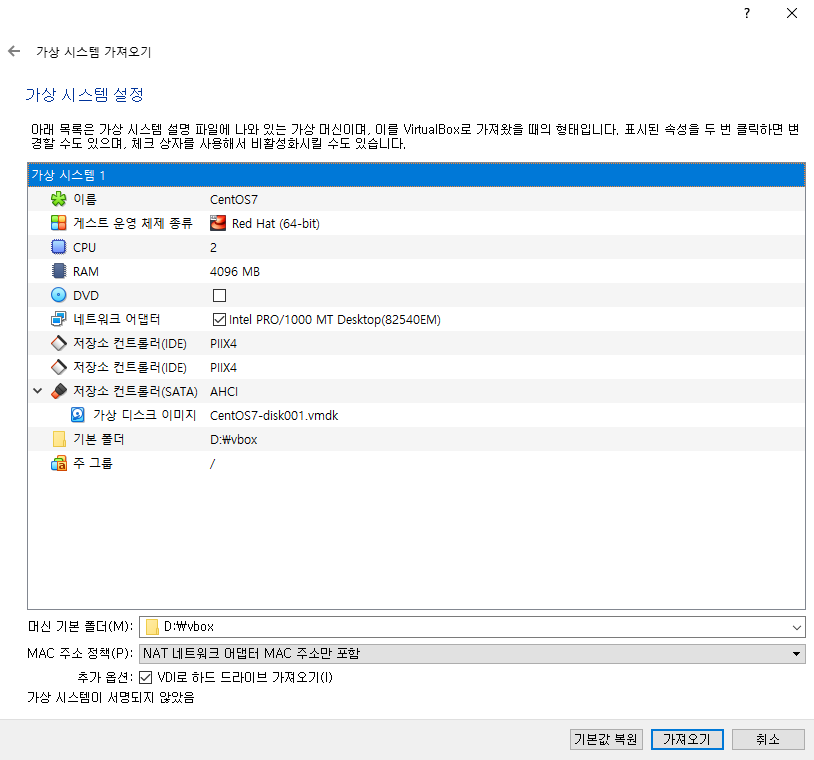
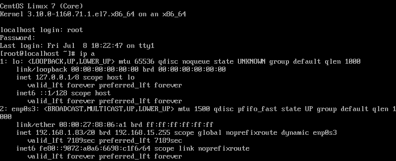
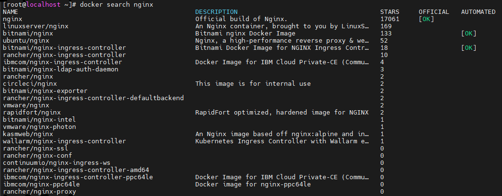

# 0708

> 리뷰

* 테라폼 - public ip 얻기 위한 문장


# Docker & Container

## Docker 컨테이너

Docker 는 컨테이너형 가상화 기술 중에 하나이다. 컨테이너란 호스트 OS상에 논리적인 구획을 만들고, 애플리케이션을 작동시키기 위해 필요한 라이브러리나 애플리케이션 등을 하나로 모아, 마치 별도의 서버인 것처럼 사용할 수 있게 만든 것이다.

호스트 OS의 리소스를 논리적으로 분리시키고, 여러개의 컨테이너가 공유하여 사용하며 컨테이너는 오버헤드가 적기 때문에 가볍고 고속으로 작동한다.

Docker는 애플리케이션의 실행에 필요한 환경을 하나의 이미지로 모아두고,  그 이미지를 사용하여 다양한 환경에서 애플리케이션 실행 환경을 구축 및 운용하기 위한 오픈소스 플랫폼이다. Docker 내부에서 컨테이너형 가상화 기술을 사용하고 있다.

### Docker의 기능

1. Docker 이미지를 만드는 기능 : docker image build
2. Docker 이미지를 공유하는 기능 : docker image push/pull
3. Docker 컨테이너를 작동시키는 기능 : docker container run


### Docker의 역사

* 2013년 봄 닷클라우드(dotCloud, 현재는 Docker)사의 엔지니어였던 솔로몬 하익스가 최초로 Docker를 오픈 소스로 공개했다. 이때부터 그 편리함 덕분에 Docker는 점차 널리 퍼져 나가고 있으며 현재는 컨테이너 관련 기술의 표준이 되었다.

### Docker의 기본 개념

* Docker는 컨테이너형 가상화 기술(운영체제 수준 가상화)을 사용한다. 커테이너형 가상화 자체는 Docker 이전에도 KXC(Linux Containers)가 있었으며 Docker 초기에는 컨테이너형 가상화를 구현하는데 LXC를 런타임으로 사용했다.


* 컨테이너 : 어플만.. - 무거운 OS 없음 > 어떻게 어플 올리고 실행?
  - 공유! - 운영체제의 기능을 중앙에서 공유
* 운영체제(OS) 수준 가상화
  * 컨테이너 가상화 X
  * OS가 없음 - 오버헤드 발생 X - 가볍고 빠름

* 가상머신(VM)은 하드웨어 기반의 여러 게스트 운영 체제로, 하이퍼바이저를 통해 에뮬레이션된다. 컨테이너는 애플리케이션 수준 구성이며 커널 하나를 공유하는 여러 가상 환경을 에뮬레이션한다.

  

### Docker 이미지 

* Docker 컨테이너를 구성하는 파일 시스템과 실행할 애플리케이션 설정을 하나로 합친 것으로, 컨테이너를 생성하는 템플릿 역할을 한다.

### Docker 컨테이너 

* Docker 이미지를 기반으로 생성되며, 파일 시스템과 애플리케이션이 구체화되어 실행되는 상태이다.

**Docker 이미지와 컨테이너의 관계!**

* 이미지(AMI) > 스냅샷... EBS > 부팅 > 컨테이너(VM)


## 실습





* ip 확인
  * 192.168.1.83




### 센토스 도커 설치

* CE(Community Edition) 버전 도커 설치
  * 도커 엔진 or 호스트

```
# curl -fsSL https://get.docker.com/ | sh
```


* 여러 툴 설치

```
# yum -y install bash-completion wget unzip net-tools mysql telnet rdate
```

* 시간

```
# rdate -s time.bora.net && clock -w
# date
```


* 자동완성 기능

```
# curl https://raw.githubusercontent.com/docker/docker-ce/master/components/cli/contrib/completion/bash/docker -o /etc/bash_completion.d/docker.sh
```

* 설치 확인

```
# systemctl enable --now docker
# docker --version
```


### 도커 기본 명령어

* [도커 허브](https://hub.docker.com/) : 도커 이미지 저장소(레지스트리)

```
# docker search nginx
```

