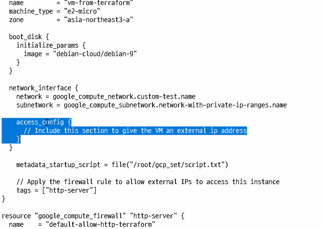
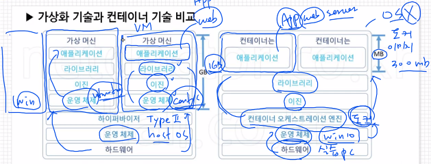
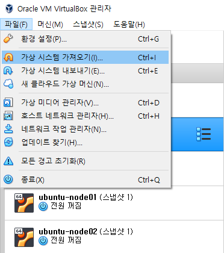
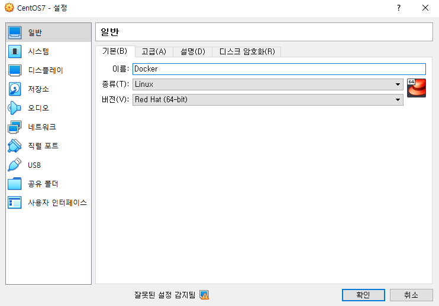
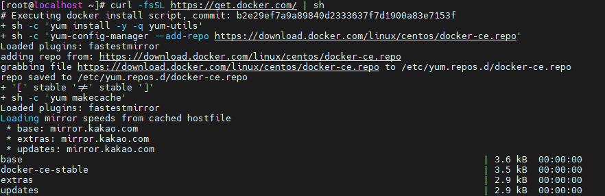
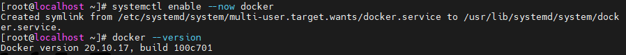
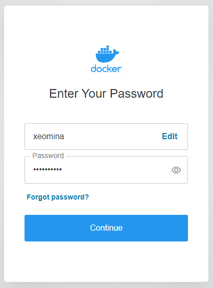

# 0708

> 리뷰

* 테라폼 - public ip 얻기 위한 문장




# Docker & Container

## Docker 컨테이너

Docker 는 컨테이너형 가상화 기술 중에 하나이다. 컨테이너란 호스트 OS상에 논리적인 구획을 만들고, 애플리케이션을 작동시키기 위해 필요한 라이브러리나 애플리케이션 등을 하나로 모아, 마치 별도의 서버인 것처럼 사용할 수 있게 만든 것이다.

호스트 OS의 리소스를 논리적으로 분리시키고, 여러개의 컨테이너가 공유하여 사용하며 컨테이너는 오버헤드가 적기 때문에 가볍고 고속으로 작동한다.

Docker는 애플리케이션의 실행에 필요한 환경을 하나의 이미지로 모아두고,  그 이미지를 사용하여 다양한 환경에서 애플리케이션 실행 환경을 구축 및 운용하기 위한 오픈소스 플랫폼이다. Docker 내부에서 컨테이너형 가상화 기술을 사용하고 있다.

### Docker의 기능

1. Docker 이미지를 만드는 기능 : docker image build
2. Docker 이미지를 공유하는 기능 : docker image push/pull
3. Docker 컨테이너를 작동시키는 기능 : docker container run


### Docker의 역사

* 2013년 봄 닷클라우드(dotCloud, 현재는 Docker)사의 엔지니어였던 솔로몬 하익스가 최초로 Docker를 오픈 소스로 공개했다. 이때부터 그 편리함 덕분에 Docker는 점차 널리 퍼져 나가고 있으며 현재는 컨테이너 관련 기술의 표준이 되었다.

### Docker의 기본 개념

* Docker는 컨테이너형 가상화 기술(운영체제 수준 가상화)을 사용한다. 커테이너형 가상화 자체는 Docker 이전에도 KXC(Linux Containers)가 있었으며 Docker 초기에는 컨테이너형 가상화를 구현하는데 LXC를 런타임으로 사용했다.



* 컨테이너 : 어플만.. - 무거운 OS 없음 > 어떻게 어플 올리고 실행?
  - 공유! - 운영체제의 기능을 중앙에서 공유
* 운영체제(OS) 수준 가상화
  * 컨테이너 가상화 X
  * OS가 없음 - 오버헤드 발생 X - 가볍고 빠름

* 가상머신(VM)은 하드웨어 기반의 여러 게스트 운영 체제로, 하이퍼바이저를 통해 에뮬레이션된다. 컨테이너는 애플리케이션 수준 구성이며 커널 하나를 공유하는 여러 가상 환경을 에뮬레이션한다.

  

### Docker 이미지 

* Docker 컨테이너를 구성하는 파일 시스템과 실행할 애플리케이션 설정을 하나로 합친 것으로, 컨테이너를 생성하는 템플릿 역할을 한다.

### Docker 컨테이너 

* Docker 이미지를 기반으로 생성되며, 파일 시스템과 애플리케이션이 구체화되어 실행되는 상태이다.

**Docker 이미지와 컨테이너의 관계!**

* 이미지(AMI) > 스냅샷... EBS > 부팅 > 컨테이너(VM)


## 실습






* ip 확인
  * 192.168.1.83


### Centos 도커 설치

* CE(Community Edition) 버전 도커 설치
  * 도커 엔진 or 호스트

```
# curl -fsSL https://get.docker.com/ | sh
```



* 여러 툴 설치

```
# yum -y install bash-completion wget unzip net-tools mysql telnet rdate
```

* 시간 설정

```
# rdate -s time.bora.net && clock -w
# date
```


* 자동완성 기능

```
# curl https://raw.githubusercontent.com/docker/docker-ce/master/components/cli/contrib/completion/bash/docker -o /etc/bash_completion.d/docker.sh
```

* docker 설치 확인

```
# systemctl enable --now docker
# docker --version
```



* Cf) 교재는 이렇게..

```
# curl https://download.docker.com/linux/centos/docker-ce.repo-o /etc/yum.repos.d/docker-ce.repo
# sed -i -e "s/enabled=1/enabled=0/g" /etc/yum.repos.d/docker-ce.repo
# yum --enalberepo=docker-ce-stable -y install docker-ce-19.03.15-3.el7
# systemctl enable --now docker
```


### Docker  이미지 저장소 

* https://hub.docker.com/
* Docker 이미지 저장소에는 앞서 `docker image pull` 명령을 통해 다운로드한 CentOS 베이스 이미지와 nginx와 같은 웹 서버 애플리케이션을 다운받아 이용할 수 있다,


### Docker Hub에서 이미지 검색 (docker search)

* 기본 구문

```
# docker search [옵션] 이미지 키워드
```

* 주요 옵션

| 옵션             | 설명                        |
| ---------------- | --------------------------- |
| --no-trunc       | 결과를 모두 표시            |
| --limit          | 최대 검색 결과 수           |
| --filter=stars=n | 별표가 n개 이상인 것만 표시 |

* 사용 예시
  * 웹서버 구축 : OS 이미지가 아닌 nginx 어플 설치
  * 도커는 os 이미지가 없다...base 이미지만

```
# docker search nginx
```


### 이미지 목록 보기 (docker image ls)

* 기본 구문

```
# docker image ls [옵션] [리포지토리명]
```

* 주요 옵션

| 옵션        | 설명             |
| ----------- | ---------------- |
| --no-trunc  | 결과를 모두 표시 |
| --quiet, -q | 이미지 ID만 표시 |

* 사용 예시

```
# docker image ls
# docker image ls -q
```


### 레지스트리에서 이미지 가져오기(docker image pull)

* 기본 구문

```
# docker image pull [옵션] 이미지명 [:태그명] 
```

* 주요 옵션

| 옵션                    | 설명                                            |
| ----------------------- | ----------------------------------------------- |
| --all-tags, -a          | 저장소에서 태그가 지정된 이미지를 모두 다운로드 |
| --disable-content-trust | 이미지 확인 건너뛰기                            |

* 사용 예시
  * 도커 이미지 이름 : `REPOSIROTY` + `TAG`
    * `REPOSIROTY` : 저장소
    * `TAG` : 버전

```
# docker image pull nginx
```


### 하나 이상의 이미지에 대한 자세한 정보 표시 (docker image inspect)

* 기본 구문

```
# docker image inspect [옵션] 이미지 [이미지...]
```

* 주요 옵션

| 옵션         | 설명               |
| ------------ | ------------------ |
| --format, -f | 원하는 정보만 출력 |

* 사용 예시

```
# docker image inspect nginx
# docker image inspect --format="{{ .Os}}" nginx	# os 필터링
```


---

**Cf) 필터링**

* `최상위.키워드.하위항목`

```
# docker image inspect --format="{{ .Metadata.LastTagTime}}" nginx
```


* 쿠버네티스 시험에 나온다...실습에서는 grep

```
# docker image inspect nginx | grep LastTagTime
```


------

### 컨테이너 생성 (docker container create)

* 기본 구문

```
# dockker container create [옵션] 이미지
```

* 사용 예시
  * `-p` : 포트포워드 옵션
  * `:` 을 경계로 왼쪽이 호스트, 오른쪽은 컨테이너

```
# docker container create -p 80:80 --name webserver nginx
# docker container ls -a		# a 옵션 붙여야 나옴
```


* 현상태 Created > 아직 실행 안됨 > 프로세스에 올라가지 않음 > 정적인 상태로 멈춰있음
  * `ls`에 `-a` 옵션 붙여야 확인 가능


### 컨테이너 시작 (docker container start)

* 기본 구문

```
# docker container start [옵션] 컨테이너 [컨테이너...]
```

* 사용 예시

```
# docker container start webserver
webserver
# docker container ls
```


* 도커 호스트 IP 접속
  * 192.168.1.83


### 컨테이너 정지 (docker container stop)

* 기본 구문

```
# docker container stop [옵션] 컨테이너 [컨테이너...]
```

* 사용 예시

```
# docker container stop webserver
# docker container ls	# Exited 안나옴
# docker container ls -a
```


### 컨테이너 삭제 (docker container rm)

* 기본 구문

```
# docker container rm [옵션] 컨테이너 [컨테이너...]
```

* 사용예시
  * 실행중인 container는 `-f` 옵션을 줘야 삭제됨

```
# docker container rm webserver
# docker container rm -f webserver
```


### 컨테이너 생성 및 시작 (docker container run)

* 기본 구문

```
# docker container run [옵션] 이미지 [:태그] [인수]
```

* 옵션

| 옵션              | 설명                     |
| ----------------- | ------------------------ |
| --detach, -d      | 백그라운드에서 실행한다. |
| --interactive, -i | 표준 입력을 연다.        |
| --tty, -t         | 터미널을 사용한다.       |

* 사용 예시
  * ceontos 이미지를 이용해 외부에서 명령어 실행
    * `-it` : 컨테이너를 종료하지 않은체로, 터미널의 입력을 계속해서 컨테이너로 전달하기 위해서 사용
    * `bash` : 쉘명령어

```
# docker container run --name test_cal centos /bin/cal
# docker container run -it --name test_bash centos /bin/bash
```


* 컨테이너 이름은 주지 않아도 호스트에 의해 주어짐


### 컨테이너 접속 포트 설정 (docker container run)

* `test_port` 컨테이너

```
# docker container run -d -p 8080:80 --name test_port nginx
# docker container stats test_port	# 자원 사용량
```


* 8080 포트로 접속


* 왜 cpu를 지표로 사용? 가장 빨리 반응
  * 웹 페이지 새로고침 할때마다 변함


* `webserver` 컨테이너

```
# docker container run -p 80:80 --name webserver nginx
```


* 웹 ip 접속


* 다른 브라우저에서 접속할 때마다 로그 발생..
  * foreground 실행 - prompt에서 명령 불가 !
  * background 실행해야 !


### 컨테이너 백그라운드 실행 (docker container run)

* 기본구문
  * `-d` : 컨테이너가 detached 모드에서 실행

```
# docker container run -d 이미지 [:태그] [인수]
```

* `webserver` 컨테이너

```
# docker container run -d -p 80:80 --name webserver nginx
```


* 컨테이너 추가로 생성할 때 컨테이너 이름 및 호스트 포트 달라야 함
  * 이름 충돌일 경우 컨테이너 생성 x
  * 포트 충돌일 경우 컨테이너 생성됨..

```
docker container run -d -p 81:80 --name webserver nginx		# 이름 충돌
docker container run -d -p 81:80 --name webserver2 nginx

docker container run -d -p 81:80 --name webserver3 nginx	# 포트 충돌
docker container run -d -p 82:80 --name webserver3 nginx	# error

docker container ls -a
```


* `test_ping` 컨테이너

```
# docker container run -d --name test_ping centos /bin/ping localhost
# docker container logs -t test_ping		# 로그 확인
```


### 컨테이너 리소스 지정 (docker container run)

> 지정하지 않을 시 이용할 수 있는 최대로..

* 기본 구문

```
# docker container run [자원 옵션] 이미지 [:태그] [인수]
```

* 사용 예시
  * `--memory=256m` = `--memory 256m`

```
# docker container run -d -p 8181:80 --cpus 1 --memory 256m --name test_resource nginx
# docker container stats test_resource
```


* 만약 도커 호스트 자원을 초과한다면? 에러!

```
# docker container run -d -p 8181:80 --cpus 4 --memory 256m --name test_resource nginx		# 도커 호스트 cpu = 2
```


### 컨테이너 디렉토리 공유 (docker container run)

* `-v` : 볼륨
  * **바인드 마운트** : 디렉토리 공유
  * 컨테이너 볼륨과는 다르다
  * `:`을 경계로 왼쪽은 호스트 경로 오른쪽은 컨테이너 경로

```
# docker container run -d -p 8282:80 --cpus 1 --memory 256m -v /tmp:/usr/share/nginx/html --name volume-container nginx
```


### 컨테이너 리스트 표시 (docker container ls)

* 기본 구문

```
# docker container ls [옵션]
```

* 사용 예시

```
# docker container ls
# docker container ls -a
# docker container ls -a -f name=test_
# docker container ls -a -f exited=0
# docker container ls -a --format "table {{.Names}}\t{{.Status}}"	# Names와 Status 필드만
```


### 동작중인 컨테이너 연결 (docker container attach)

* 사용 예시

```
# docker container ls -a -f name=test_bash
# docker container start test_bash
# docker container attach test_bash		# 컨테이너 안으로 진입
```


* 나올때는 `ctrl` + `p` + `q`를 입력
  * `read escape sequence` 자동으로 입력됨
  * exit는 stop됨


### 동작중인 컨테이너에서 프로세스 실행 (docker container exec)

* 기본 구문

```
# docker container exec [옵션] <컨테이너> <실행명령> [인수]
```

* 사용 예시

```
# docker container exec -it test_bash /bin/echo "Hello World"
# docker container exec -it test_bash /bin/cal
# docker container exec -it test_bash /bin/bash
```


* `exec + bash`(실행 명령어) 일 경우에는 프로세스 죽지 않는다! - attach와 다른 점


* `index.html` 파일 설정


### 동작중인 컨테이너 프로세스 확인 (docker container top)

```
# docker container top test_port
```

### 동작중인 컨테이너의 포트 전송 확인 (docker container port)

```
# docker container port test_port
```

### 컨테이너의 이름 변경 (docker container rename)

```
# docker container rename test_port test_webserver
# docker container ls -a -f name=test_
```


### 컨테이너 안의 파일을 복사 (docker container cp)

* 파일 복사

```
# docker container cp webserver:/usr/share/nginx/html/index.html /root/index.html
# cd ~
# ls
anaconda-ks.cfg  index.html
# echo "Hola" >> index.html
# docker container cp index.html webserver:/usr/share/nginx/html/index.html
```


* 폴더 복사

```
# mkdir html
# ls
anaconda-ks.cfg  aws.tar  html  index.html
# tar -xvf aws.tar -C ./html
# ls ./html/

# docker container cp ./html webserver:/usr/share/nginx
```


* 웹 접속


### 컨테이너와 원본 이미지의 차이점 확인 (docker container diff)

* `A` : 추가된 항목
* `C` : 변경된 항목
* `D` : 삭제된 항목

```
# docker container diff webserver
```


### 컨테이너를 이미지로 만들기 (docker container commit)

* 기본 구문

```
# docker container commit [옵션] 컨테이너 이미지 [:태그]
```

* 옵션

| 옵션          | 설명               |
| ------------- | ------------------ |
| --author, -a  | 작성자명 기입      |
| --message, -m | 간단한 메시지 기입 |

* 사용 예시

```
# docker container commit -a "xeomina<test@example.com>" -m "NICE TO MEET YOU" webserver test_commit:v1.0
# docker image ls
```

### 이미지 저장 (docker image save)

* 기본 구조

```
# docker image save [옵션] <저장 파일명> [이미지]
```

* 사용 예시

```
# docker image save -o test_commit.tar test_commit:v1.0
# ls
```

* ubuntu에 파일 전송

```
# scp test_commit.tar root@192.168.1.8:/root
```


### Ubuntu 도커 설치

* ubuntu-node01에서 작업
  * 현재 root이기 때문에 sudo 생략 가능

```
$ sudo apt update
$ sudo apt install apt-transport-https ca-certificates curl software-properties-common
$ curl -fsSL https://download.docker.com/linux/ubuntu/gpg | sudo apt-key add -
$ sudo add-apt-repository "deb [arch=amd64] https://download.docker.com/linux/ubuntu bionic stable"
$ sudo apt update
$ sudo apt-cache policy docker-ce
$ sudo apt install docker-ce
$ docker --version
```


### tar 이미지 불러오기 (docker image load)

* 기본 구문

```
# docker image save [옵션] <저장 파일명> [이미지]
```

* 사용 예시

```
# ls
# docker image load -i test_commit.tar
# docker image ls
# docker container run -d -p 80:80 --name webserver test_commit:v1.0
# docker image ls
```


**중요한 것들**

* `-it`
* `-d`
* `-v`, `bind mount`
* `docker container exec -it [컨테이너] /bin/bash`
* `exec`
* `cp`
* `commit`


## Docker Hub 가입하기





