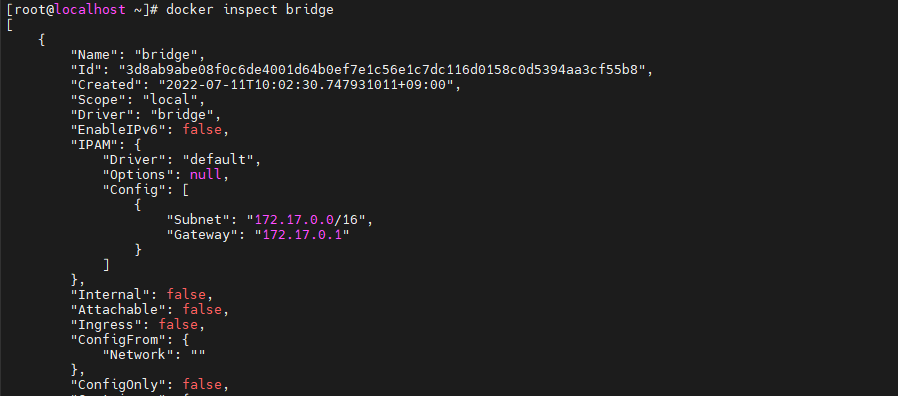
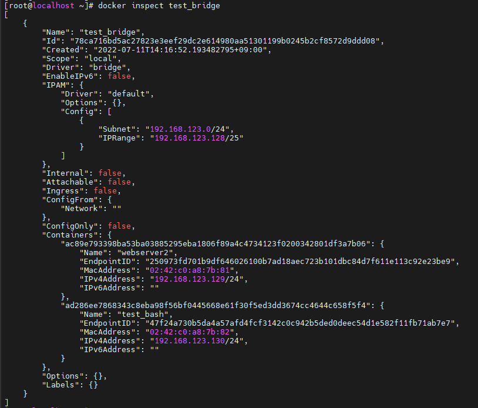
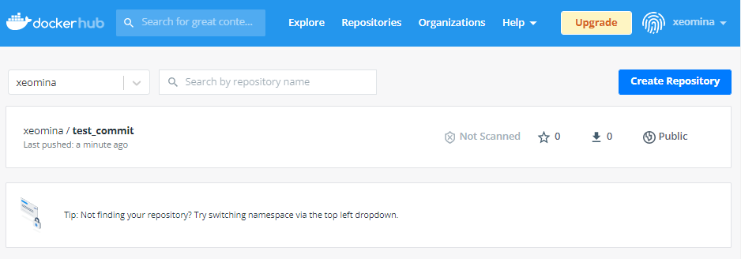

# 0711

# Docker

## 컨테이너 / 이미지 목록 및 삭제

* 컨테이너 목록

```
# docker ps
```


* 컨테이너 한번에 삭제
  * `ps` : list
  * `-a` : all
  * `-q` : id

```
# docker rm -f $(docker ps -a -q)
```


* 이미지 목록

```
# docker images
```

* 이미지 한번에 삭제

```
# docker rmi $(docker images -q)
```


## 컨테이너 생성 및 시작

* ceontos7 버전으로 `test_cal` 생성
  * 한번 실행하고 멈춤

```
# docker run --name test_cal centos:7 /bin/cal
```


* 컨테이너 바로 삭제
  * `-rm`

```
# docker run --name test_cal1 --rm centos:7 /bin/cal
```


##  터미널과 컨테이너 연결

* `-it``
* ``-i` : 표준 입력
  * 안붙이면 명령어 x


* `-t` : 터미널
  * 안붙이면 prompt x


## 백그라운드 실행

* `-d`
  * `logs`로 확인

```
# docker run -d --name test_ping centos:7 /bin/ping localhost
# docker ps
# docker logs -t test_ping
```


## 접속 포트 설정

```
# docker run -d -p 8080:80 test_port nginx
# docker ps
```


* 리소스 확인

```
# docker stats test_prot
```


## 리소스 지정

```
# docker run -d -p 8181:80 --cpus 1 --memory=256m --name test_resource nginx
# docker ps
```


```
# docker stats test_resource
```


## 디렉토리 공유

```
# docker run -d -p 8282:80 --cpus 1 --memory 512m -v /tmp:/usr/share/nginx/html --name volume-container nginx
# docker ps
```


## 컨테이너 리스트

```
# docker ps -a --format "table {{.Command}}\t{{.Ports}}"
```


```
# docker ps -a -f name=test_
```


## 동작중인 컨테이너 프로세스 실행

* `exec`

```
# docker exec -it test_bash /bin/bash
```


## 이름 변경

```
# docker rename test_port webserver
```


## 컨테이너 안의 파일 복사

*

```
# docker cp webserver:/usr/share/nginx/html/index.html /root/index.html
# vi /root/index.html
```


* 다시 복사

```
# docker cp ./index.html webserver:/usr/share/nginx/html/index.html
```


## 컨테이너와 원본 이미지의 차이점 확인

```
# docker diff webserver
```


## tar 압축파일 풀기

```
# pwd
# ls
# tar -xvf food.tar -C html
# ls html/
# docker cp ./html webserver:/usr/share/nginx
```


## 컨테이너를 이미지로 만들기

```
# docker commit -a "xeomina<test@example.com>" -m "FOOD" webserver test_commit:v1.0
```


## 이미지 저장

```
# docker save -o test_commit.tar test_commit:v1.0
```

* tar 파일은 사이즈가 줄지 않는다


## 

# Docker 네트워크 구조


* 2개의 컨테이너 > docker 0와 연결 = 공유기 (NAT GW의 기능)

  

* IP 확인

```
# ip a
```


```
# docker exec -it test_bash /bin/bash
# yum install -y iproute
# ip a
```


## 네트워크 리스트 표시

* 기본 구문

```
# docker network ls [옵션]
```

* 옵션

| 옵션            | 설명                   |
| --------------- | ---------------------- |
| -f, --filter=[] | 필터링하여 출력한다    |
| --no-trunc      | 모든 정보를 출력한다   |
| -q, --quiet     | 네트워크 ID만 출력한다 |


* 사용예시

```
# docker network ls
# docker network ls -q --filter driver=bridge
```


* `bridge` 네트워크 정보
  * `docker0` 
  * container 5개

```
# docker inspect bridge
```




## 네트워크 생성 및 삭제

* 기본 구문

```
# docker network create
```

* 옵션

| 옵션         | 설명                                   |
| ------------ | -------------------------------------- |
| --driver, -d | 네트워크 브리지 또는 오버레이          |
| --ip-range   | 컨테이너에 할당하는 IP주소의 범위 지정 |
| --subnet     | 서브넷을   CIDR 형식으로 지정          |

* 사용 예시

```
# docker network create -d bridge --subnet 192.168.123.0/24 --ip-range 192.168.123.128/25 test_bridge
# docker network ls
```


* `webserver2` 컨테이너 생성
  * 네트워크 : `test_bridge`
  * 이미지 : `nginx`

```
# docker run -d -p 8383:80 --name webserver2 --network test_bridge nginx
```


* ip 확인
  * test_brigde :  `br-78ca716bd5ac`
    * G/W IP :  192.168.123.128
  * `44: veth8511c23@if43` : container 안쪽의 인터페이스
    * `if43` : test_bridge의 인터페이스 포트번호

```
# ip a
```


## 네트워크 연결

* 기본 구문

```
# docker network connect [옵션] 네트워크 컨테이너
```

* 사용 예시
* `test_bash` 컨테이너 네트워크 확인

````
# docker inspect test_bash
````


* `test_bash` 컨테이너에 `test_bridge` 네트워크 연결

```
# docker network connect test_bridge test_bash
# docker inspect test_bash
```


* `test_bash` 컨테이너에서 `bridge` 네트워크 연결 끊기

```
# docker network disconnect bridge test_bash
# docker inspect test_bash
```


* `test_bridge`에 연결된 컨테이너 확인

```
# docker inspect test_bridge
```



* 내부적으로 같은 도커 (test_bridge) 안에서는 ip가 아닌 컨테이너 이름을 도메인처럼 사용 가능
  * ip 바뀌어도 링크 유지

```
# docker exec -it test_bash /bin/bash
# ping webserver2
```


```
# cat /etc/hosts
```


# 워드프레스

* https://hub.docker.com/_/mariadb

## dbserver 생성

* `-e` : 환경 변수 정의

```
- dbserver
# docker run -d -p 3306:3306 --name dbserver \
-e MYSQL_DATABASE=wordpress \
-e MYSQL_USER=wpuser \
-e MYSQL_PASSWORD=wppass \
-e MYSQL_ROOT_PASSWORD=password --network test_bridge mariadb
```


## webserver 생성

* apache 설치

```
- webserver
# docker run -itd -p 8888:80 --name apache --network test_bridge centos:7
# docker exec -it apache bash
# yum install -y httpd php php-mysql php-gd php-mbstring wget unzip
# wget https://ko.wordpress.org/wordpress-4.8.2-ko_KR.zip
# cd /var/www/html
# unzip /wordpress-4.8.2-ko_KR.zip
# mv wordpress/* .
# chown -R apache:apache /var/www
# httpd &
httpd
```


* wordpress 접속
  * 192.168.1.83:8888


* 데이터베이스 호스트 : dbserver 


**도커에서는 위처럼 설치하지 않는다..**


# Docker Hub

## SOURCE_IMAGE를 참조하는 TARGET_IMAGE 태그 작성

* 기본 구문

```
# docker tag SOURCE_IMAGE[:TAG] TARGET_IMAGE[:TAG]
```

* 사용 예시
  * docker ID : xeomina
  * 이미지 이름 : test_commit:v1.0 
  * tag : 별칭
    * `test_commit` = `xeomina/test_commit`
    * docker hub에 전송하기 위해..

```
# docker tag test_commit:v1.0 xeomina/test_commit:v1.0
# docker images
```


## 이미지를 Docker Hub 업로드

* 기본 구문

```
# docker push <Docker Hub 사용자명>/이미지 [:태그]
```

* 사용 예시
  * 로그인 안하면 error

```
# docker push xeomina/test_commit:v1.0
```


## Docker Hub 로그인

* 기본 구문

```
# docker login [옵션] [서버]
```

* 옵션

| 옵션           | 설명     |
| -------------- | -------- |
| --password, -p | 비밀번호 |
| --username, -u | 사용자명 |

* 사용 예시

```
# docker login
# docker login -u username -p password hub.docker.com
```


* 다시 업로드


* Docker Hub 확인




## ubuntu 도커 설치

```
# apt update
# apt install apt-transport-https ca-certificates curl software-properties-common
# curl -fsSL https://download.docker.com/linux/ubuntu/gpg | sudo apt-key add -
# add-apt-repository "deb [arch=amd64] https://download.docker.com/linux/ubuntu bionic stable"
# apt update
# apt-cache policy docker-ce
# apt install docker-ce
```


* `webserver` 컨테이너 생성
  * docker hub에 있는 `xeomina/test_commit` 이미지를 이용


* `webserve` 접속


# Dockerfile이란?

앞서 다루어 본 Docker 이미지 생성 방법은 베이스 이미지를 바탕으로 일일이 컨테이너를 생성하고, 파라미터를 설정하며, 미들웨어 설치를 통해 만들어진 컨테이너를 Docker 이미지로 생성하였다. 반면에 Docker 파일은 컨테이너를 생성하는 여러 구성 정보를 하나의 파일로 정리하고 일괄 실행하여 docker build 명령을 통해 Docker 이미지를 작성하는 스크립트이다.

## Dockerfile을 구성하는 명령어

| COMMAND    | 설명               | COMMAND    | 설명               |
| ---------- | ------------------ | ---------- | ------------------ |
| FROM       | 베이스 이미지 지정 | ADD        | 파일 추가          |
| MAINTAINER | 작성자 지정        | COPY       | 파일 복사          |
| RUN        | 명령어 실행        | VOLUME     | 볼륨 마운트        |
| CMD        | 데몬 실행          | ENTRYPOINT | 데몬 실행          |
| LABEL      | 라벨 설정          | USER       | 사용자 설정        |
| EXPOSE     | 포트 내보내기      | WORKDIR    | 작업 디렉토리 지정 |
| ENV        | 환경 변수 설정     | ONBUILD    | 빌드 후 실행 명령  |


## Dockerfile 작성

```
# mkdir test && cd $_ 
# vi Dockerfile
```

```
FROM ubuntu:18.04
MAINTAINER xeomina@example.com
LABEL "name"="webserver"
ENV aloha=date
ENV path=/var/www/html
RUN sed -i 's/archive.ubuntu.com/ftp.daumkakao.com/g' /etc/apt/sources.list
RUN apt-get update
RUN apt-get install apache2 -y
COPY nihao /var/www/html/nihao
COPY hello.html $path
ADD aws.tar /var/www/html
```

