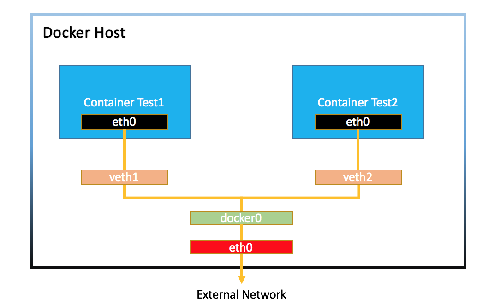

# 0711

# Docker

## 컨테이너 / 이미지 목록 및 삭제

* 컨테이너 목록

```
# docker ps
```


* 컨테이너 한번에 삭제
  * `ps` : list
  * `-a` : all
  * `-q` : id

```
# docker rm -f $(docker ps -a -q)
```


* 이미지 목록

```
# docker images
```

* 이미지 한번에 삭제

```
# docker rmi $(docker images -q)
```


## 컨테이너 생성 및 시작

* ceontos7 버전으로 `test_cal` 생성
  * 한번 실행하고 멈춤

```
# docker run --name test_cal centos:7 /bin/cal
```


* 컨테이너 바로 삭제
  * `-rm`

```
# docker run --name test_cal1 --rm centos:7 /bin/cal
```


##  터미널과 컨테이너 연결

* `-it``
* ``-i` : 표준 입력
  * 안붙이면 명령어 x


* `-t` : 터미널
  * 안붙이면 prompt x


## 백그라운드 실행

* `-d`
  * `logs`로 확인

```
# docker run -d --name test_ping centos:7 /bin/ping localhost
# docker ps
# docker logs -t test_ping
```


## 접속 포트 설정

```
# docker run -d -p 8080:80 test_port nginx
# docker ps
```


* 리소스 확인

```
# docker stats test_prot
```


## 리소스 지정

```
# docker run -d -p 8181:80 --cpus 1 --memory=256m --name test_resource nginx
# docker ps
```


```
# docker stats test_resource
```


## 디렉토리 공유

```
# docker run -d -p 8282:80 --cpus 1 --memory 512m -v /tmp:/usr/share/nginx/html --name volume-container nginx
# docker ps
```


## 컨테이너 리스트

```
# docker ps -a --format "table {{.Command}}\t{{.Ports}}"
```


```
# docker ps -a -f name=test_
```


## 동작중인 컨테이너 프로세스 실행

* `exec`

```
# docker exec -it test_bash /bin/bash
```


## 이름 변경

```
# docker rename test_port webserver
```


## 컨테이너 안의 파일 복사

*

```
# docker cp webserver:/usr/share/nginx/html/index.html /root/index.html
# vi /root/index.html
```


* 다시 복사

```
# docker cp ./index.html webserver:/usr/share/nginx/html/index.html
```


## 컨테이너와 원본 이미지의 차이점 확인

```
# docker diff webserver
```


## tar 압축파일 풀기

```
# pwd
# ls
# tar -xvf food.tar -C html
# ls html/
# docker cp ./html webserver:/usr/share/nginx
```


## 컨테이너를 이미지로 만들기

```
# docker commit -a "xeomina<test@example.com>" -m "FOOD" webserver test_commit:v1.0
```


## 이미지 저장

```
# docker save -o test_commit.tar test_commit:v1.0
```

* tar 파일은 사이즈가 줄지 않는다


## 

# Docker 네트워크 구조



* 2개의 컨테이너 > docker 0와 연결 = 공유기 (NAT GW의 기능)

  

* IP 확인

```
# ip a
```


```
# docker exec -it test_bash /bin/bash
# yum install -y iproute
# ip a
```


## 네트워크 리스트 표시

* 기본 구문

```
# docker network ls [옵션]
```

* 옵션

| 옵션            | 설명                   |
| --------------- | ---------------------- |
| -f, --filter=[] | 필터링하여 출력한다    |
| --no-trunc      | 모든 정보를 출력한다   |
| -q, --quiet     | 네트워크 ID만 출력한다 |


* 사용예시

```
# docker network ls
# docker network ls -q --filter driver=bridge
```


* `bridge` 네트워크 정보
  * `docker0` 
  * container 5개

```
# docker inspect bridge
```


## 네트워크 생성 및 삭제

* 기본 구문

```
# docker network create
```

* 옵션

| 옵션         | 설명                                   |
| ------------ | -------------------------------------- |
| --driver, -d | 네트워크 브리지 또는 오버레이          |
| --ip-range   | 컨테이너에 할당하는 IP주소의 범위 지정 |
| --subnet     | 서브넷을   CIDR 형식으로 지정          |

* 사용 예시

```
# docker network create -d bridge --subnet 192.168.123.0/24 --ip-range 192.168.123.128/25 test_bridge
# docker network ls
```


* `webserver2` 컨테이너 생성
  * 네트워크 : `test_bridge`
  * 이미지 : `nginx`

```
# docker run -d -p 8383:80 --name webserver2 --network test_bridge nginx
```


* ip 확인
  * test_brigde :  `br-78ca716bd5ac`
    * G/W IP :  192.168.123.128
  * `44: veth8511c23@if43` : container 안쪽의 인터페이스
    * `if43` : test_bridge의 인터페이스 포트번호

```
# ip a
```


## 네트워크 연결

* 기본 구문

```
# docker network connect [옵션] 네트워크 컨테이너
```

* 사용 예시
* `test_bash` 컨테이너 네트워크 확인

````
# docker inspect test_bash
````


* `test_bash` 컨테이너에 `test_bridge` 네트워크 연결

```
# docker network connect test_bridge test_bash
# docker inspect test_bash
```


* `test_bash` 컨테이너에서 `bridge` 네트워크 연결 끊기

```
# docker network disconnect bridge test_bash
# docker inspect test_bash
```


* `test_bridge`에 연결된 컨테이너 확인

```
# docker inspect test_bridge
```


* 내부적으로 같은 도커 (test_bridge) 안에서는 ip가 아닌 컨테이너 이름을 도메인처럼 사용 가능
  * ip 바뀌어도 링크 유지

```
# docker exec -it test_bash /bin/bash
# ping webserver2
```


```
# cat /etc/hosts
```


# 워드프레스

## dbserver 생성

* `-e` : 환경 변수 정의

```
- dbserver
# docker run -d -p 3306:3306 --name dbserver \
-e MYSQL_DATABASE=wordpress \
-e MYSQL_USER=wpuser \
-e MYSQL_PASSWORD=wppass \
-e MYSQL_ROOT_PASSWORD=password --network test_bridge mariadb
```


## webserver 생성

* apache 설치

```
- webserver
# docker run -itd -p 8888:80 --name apache --network test_bridge centos:7
# docker exec -it apache bash
# yum install -y httpd php php-mysql php-gd php-mbstring wget unzip
# wget https://ko.wordpress.org/wordpress-4.8.2-ko_KR.zip
# cd /var/www/html
# unzip /wordpress-4.8.2-ko_KR.zip
# mv wordpress/* .
# chown -R apache:apache /var/www
# httpd &
httpd
```


* wordpress 접속
  * 192.168.1.83:8888


* 데이터베이스 호스트 : dbserver 

