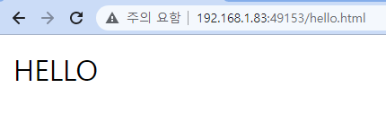
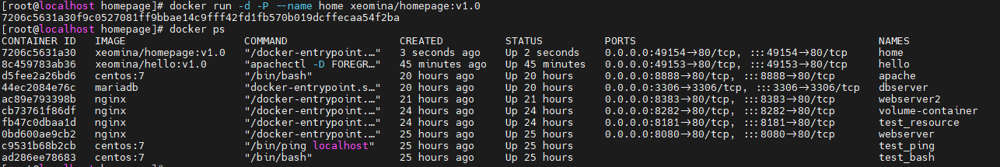
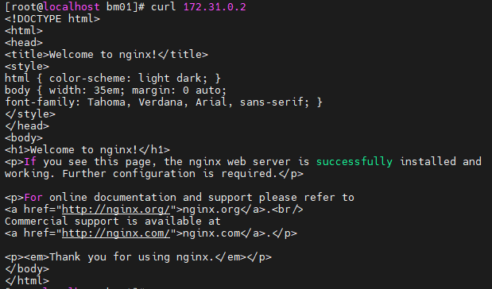

# 0712

* 도커 이미지 생성 방법
  1. commit
  2. docker build - 도커 파일 없이 만들 수 없다

# Docker

## Dockerfile을 구성하는 명령어

* `ADD` = tar와 비슷
* `USER` : 일반 사용자

| COMMAND    | 설명               | COMMAND    | 설명               |
| ---------- | ------------------ | ---------- | ------------------ |
| FROM       | 베이스 이미지 지정 | ADD        | 파일 추가          |
| MAINTAINER | 작성자 지정        | COPY       | 파일 복사          |
| RUN        | 명령어 실행        | VOLUME     | 볼륨 마운트        |
| CMD        | 데몬 실행          | ENTRYPOINT | 데몬 실행          |
| LABEL      | 라벨 설정          | USER       | 사용자 설정        |
| EXPOSE     | 포트 내보내기      | WORKDIR    | 작업 디렉토리 지정 |
| ENV        | 환경 변수 설정     | ONBUILD    | 빌드 후 실행 명령  |


## Dockerfile 작성

```
# mkdir test && cd $_ 
# vi Dockerfile
```

* `etc/apt/sources.list` 파일에서 `archive.ubuntu.com/`를 `ftp.daumkakao.com/`로 바꿔라
  * `etc/apt/sources.list` 파일 : ubuntu 저장소

```
FROM ubuntu:18.04
MAINTAINER xeomina@example.com
LABEL "name"="webserver"
ENV aloha=date
ENV path=/var/www/html
RUN sed -i 's/archive.ubuntu.com/ftp.daumkakao.com/g' /etc/apt/sources.list
RUN apt-get update
RUN apt-get install apache2 -y
COPY nihao /var/www/html/nihao
COPY hello.html $path
ADD aws.tar /var/www/html		# ADD(+tar 포함) : 아카이브 풀어서 html에
WORKDIR /var/www/html			# WORKDIR : cd와 유사 - 경로 변경 / exec 처음 경로
RUN echo ohayo >> ohayo.html
VOLUME /var/www/html
EXPOSE 80						# -p 80:80 = -P : 컨테이너 포트
ENTRYPOINT ["apachectl"]		 # apache 실행 명령어
CMD ["-D", "FOREGROUND"]		 # 옵션
							   # apachectl -DFOREGROUND
```


* html 파일 생성

```
# cd test
# ls
# vi Dockerfile
# mkdir nihao
# echo "NIHAO" > nihao/index.html
# echo "HELLO" > hello.html
# ls
```


## Dockerfile로 이미지 생성

* `docker build <옵션> <Dockerfile 경로>` 
* `--tag` 옵션 : 이미지 이름과 태그를 설정 가능
  * 이미지 이름만 설정하면 태그는 **latest**로 설정됨

```
# docker build -t xeomina/hello:v1.0 .
```


* `-P` : 컨테이너 포트 `80` / 호스트 포트는 랜덤
  * 49153

```
# docker run -d -P --name hello xeomina/hello:v1.0
# docker ps
```


* 192.168.1.83:49153


* 192.168.1.83:49153/nihao/


* 192.168.1.83:49153/hello.html




* 192.168.1.83:49153/ohayo.html


* 볼륨 확인

```
# docker volume list
```


* workdir 확인
  * /var/www/html 으로 바로 접속


* homepage 만들기

```
# mkdir homepage/
# cd homepage/
# mkdir images
# ls images
# ls
```


* tar 파일 생성

```
# tar cvf test.tar images index.html
```


* Dockerfile 설정

```
# vi Dockerfile
FROM nginx:latest
ADD test.tar /usr/share/nginx/html
CMD ["nginx", "-g", "daemon off;"]		# niginx 기동
```

*

```
# docker build -t xeomina/homepage:v1.0 .
# docker push xeomina/homwpage:v1.0
```


*

```
# docker run -d -p 9000:80 --name home xeomina/homepage:v1.0
# docker ps
```


*

```
# docker run -d -P --name home xeomina/homepage:v1.0
# docker ps
```



* 192.168.1.83:9000


## docker host 경로

* `hello.html` 수정

```
# find / -name ohayo.html
# cd /var/lib/docker/volumes/98696d76293f0a0bf0d4f6067694c704e1b11baa3a62e8994ae6942b1e70fbb6/_data/
# ls
# vi hello.html
HELLO
ALOHA
```


**Cf) 소스가 되는 도커 호스트의 경로는 임의로 지정할 수 없음**

* `"/var/lib/docker/volumes/98696d76293f0a0bf0d4f6067694c704e1b11baa3a62e8994ae6942b1e70fbb6/_data",`


## wordpress dockerfile

*

```
# mkdir wordpress && cd $_
# vi Dockerfile
FROM centos:7
MAINTAINER test@example.com
RUN yum install -y httpd php php-mysql php-gd php-mbstring wget unzip
RUN wget https://ko.wordpress.org/wordpress-4.8.2-ko_KR.zip
WORKDIR /var/www/html
RUN unzip /wordpress-4.8.2-ko_KR.zip
RUN mv wordpress/* .
RUN chown -R apache:apache /var/www
CMD httpd -DFOREGROUND
```


*

```
# docker build -t xeomina/wordpress:v1.0 .
# docker push xeomina/wordpress:v1.0
```


*

```
- dbserver
# docker run -d -p 3306:3306 --name dbserver \
-e MYSQL_DATABASE=wordpress \
-e MYSQL_USER=wpuser \
-e MYSQL_PASSWORD=wppass \
-e MYSQL_ROOT_PASSWORD=password --network test_bridge mariadb
```


```
# docker run -d -p 80:80 --name wordpress --network test_bridge xeomina/wordpress:v1.0
# docker inspect wordpress
```

* 192.168.1.83/wp-admin


----

## 도커 데이터 관리

### Bind Mount

```
# mkdir volume && cd $_
# mkdir bm01 ; touch bm01/test.txt
# docker run -itd --name bm-test -v /root/volume/bm01:/mnt centos:7
# docker exec bm-test ls /mnt
```


*

```
# cd bm01
# ls

# echo hello > hello.txt
# ls
# docker exec bm-test ls /mnt
```


### Volume

```
# docker volume create my-vol01
# docker volume ls
# docker volume inspect my-vol01
```


*

```
# docker run -itd --name vol-test -v my-vol01:/mnt centos:7
# docker run -itd -p 801:80 --name vol-web -v my-vol01:/usr/local/apache2/htdocs:ro httpd:latest		# ro : read only
# curl 192.168.1.83:801
<html><body><h1>It works!</h1></body></html>
```


* sh : 쉘 명령어

```
# docker exec vol-test sh -c "echo "Nihao" > /mnt/index.html"
# curl 192.168.1.83:801
```


## 도커 네트워크 관리

```
# docker network ls
# docker network inspect test_bridge
```


* `new-net` 네트워크 생성

```
# docker network create new-net --subnet 172.31.0.0/16 --ip-range 172.31.0.0/20 --gateway 172.31.0.1
# docker network ls
```


* 컨테이너 생성

```
# docker run -d -P --network new-net nginx
# docker ps
```


```
# curl 172.31.0.2
```




## 운영자 역할

* 운영자로서 개발자에게 도움주기

```
# mkdir onbuild && cd $_
# vi Dockerfile.base
```


```
# docker build -t xeomina/web-base:v1.0 -f Dockerfile.base .
```


```
# docker login
# docker push xeomina/web-base:v1.0
```


## 개발자 역할

* Dockerfile 파일을 개발자에게 전달

```
# vi Dockerfile
FROM xeomina/web-base:v1.0
```


* 웹서버 tar 파일, dockerfile 받아온 파일 준비
* ubuntu-node02서버 활용

```
root@ubuntu-node02:~# mkdir onbuild && cd $_

# vi Dockerfile
FROM xeomina/web-base:v1.0

# ls
website.tar
Dockerfile

# docker build -t xeomina/web-site:v1.0 .
# docker run -d -p 80:80 --name=web-site xeomina/web-site:v1.0
```


```
# docker login
# docker push xeomina/web-site:v1.0
```


## AWS-운영자 역할 ( 최종 운영 환경 )

1. 인스턴스 생성
   이름 : docker
   이미지 : ami-0fd0765afb77bcca7 (아마존 linux 2)
   유형 : t2.micro
   키페어 : 새 키 페어 ; docker-key
   vpc : MY-VPC
   서브넷 : MY-PUBLIC-SUBNET-2C
   보안그룹 : 보안그룹 생성 ; 이름 ; MY-SG-WEB / SSH, HTTP 위치무관으로 추가
   고급세부정보 - 사용자 데이터 :

```\
#!/bin/bash
sudo amazon-linux-extras install docker -y
sudo systemctl start docker && systemctl enable docker
curl https://raw.githubusercontent.com/docker/docker-ce/master/components/cli/contrib/completion/bash/docker -o /etc/bash_completion.d/docker.sh
sudo usermod -a -G docker ec2-user
```

2. route53에 레코드 추가


* 3.38.96.235


3. mobaxterm으로 접속하여 아래 명령어 수행


```
[ec2-user@ip-10-14-36-119 ~]$ docker --version
Docker version 20.10.13, build a224086

[ec2-user@ip-10-14-36-119 ~]$ docker run -d -p 80:80 --name webserver xeomina/web-site:v1.0
```


4. 최종 운영 환경 확인

