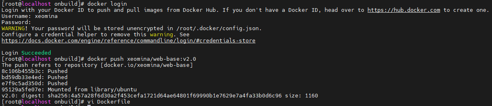

# 0713

## 도커 설치
* Docker CE (Community Edition) : 무료 오픈 소스

* manager1 VM
```
# curl -fsSL https://get.docker.com/ | sh
# yum -y install bash-completion wget unzip net-tools mysql telnet rdate
# rdate -s time.bora.net && clock -w
# curl https://raw.githubusercontent.com/docker/docker-ce/master/components/cli/contrib/completion/bash/docker -o /etc/bash_completion.d/docker.sh
# systemctl enable --now docker
```
* worker1,2 - 연결된 복제


쿠버네티스 전에 도커 - 오케스트레이션 도구 > 유사한 기능 도구 침체기...


## volume

* manager 1

```
# docker volume ls
# docker volume create my-vol01
# docker volume ls
# docker inspect my-vol01
```


## network

```
# docker network create new-net --subnet 10.23.0.0/16 --ip-range 10.23.0.0/20 --gateway 10.23.0.1
# docker network list
```


```
# docker inspect new-net
```


## onbuild

### 운영자 역할

```
# mkdir onbuild && cd $_
# vi Dockerfile.base
```

```
FROM ubuntu:18.04
RUN sed -i 's/archive.ubuntu.com/ftp.daumkakao.com/g' /etc/apt/sources.list
RUN apt-get -y update
RUN apt-get -y install nginx
EXPOSE 80
ONBUILD ADD website*.tar /var/www/html/
CMD ["nginx", "-g", "daemon off;"]
```


```
# docker build -t xeomina/web-base:v2.0 -f Dockerfile.base .
```


```
# docker images
```


```
# docker login
# docker push xeomina/web-base:v2.0
# vi Dockerfile
FROM xeomina/web-base:v2.0
```




### 개발자 역할

* Dockerfile 파일은 운영자가 (운영자 > 개발자)
* website.tar 파일은 개발자가..


```
# ls
Dockerfile website.tar
```


```
# docker build -t xeomina/web-site:v2.0 .
# docker run -d -p 80:80 --name=web-site xeomina/web-site:v2.0
# ip a
```


* 192.168.1.20


```
# docker login
# docker push xeomina/web-site:v2.0
```


* docker hub


## AWS

### EC2 도커 설치


* 고급

  * 운영자 역할(AWS)

    ```
    # docker run -d -p 80:80 --name=test-site xeomina/photoview-image:v2.0
    ```

  * 도커 사설 레지스트리(AWS)

    ```
    # docker run -d -p 5000:5000 --restart=always --name private-docker-registry registry # 저장소 서버
    ```

```
#!/bin/bash
sudo amazon-linux-extras install docker -y
sudo systemctl start docker && systemctl enable docker
curl https://raw.githubusercontent.com/docker/docker-ce/master/components/cli/contrib/completion/bash/docker -o /etc/bash_completion.d/docker.sh
sudo usermod -a -G docker ec2-user
docker run -d -p 80:80 --name=test-site xeomina/web-site:v2.0
docker run -d -p 5000:5000 --restart=always --name private-docker-registry registry
```


### Route 53 호스팅 영역 생성

* xeomina.shop


* docker 인스턴스 IP 복사


* docker.xeomina.shop 레코드 생성
* docker 인스턴스 IP 등록


* 레코드 확인


* docker.xeomina.shop 접속


## 도커 사설 레지스트리

* 사용자 데이터에서 이미 등록

```
# docker run -d -p 5000:5000 --restart=always --name private-docker-registry registry # 저장소 서버
```

* `daemon.json` 파일 작성

```
# vi /etc/docker/daemon.json # 클라이언트
{ "insecure-registries":["54.180.31.212:5000"] }
{ "insecure-registries":["docker.xeomina.shop:5000"] }

# systemctl restart docker
# docker tag xeomina/web-site:v2.0 docker.xeomina.shop:5000/web-site:v2.0
# docker images
# docker push docker.xeomina.shop:5000/web-site:v2.0
```


## 도커 컴포즈

```
# curl -L "https://github.com/docker/compose/releases/download/1.26.2/docker-compose-$(uname -s)-$(uname -m)" -o /usr/local/bin/docker-compose
# chmod +x /usr/local/bin/docker-compose
# mkdir my_wordpress && cd $_
# vi docker-compose.yml
```

```
version: "3.3"    
services:
  dbserver:
    image: mysql:5.7
    volumes:
      - db_data:/var/lib/mysql
    restart: always
    environment:
      MYSQL_ROOT_PASSWORD: password
      MYSQL_DATABASE: wordpress
      MYSQL_USER: wpuser
      MYSQL_PASSWORD: wppass
  wordpress:
    depends_on:
      - dbserver
    image: wordpress:latest
    volumes:
      - wordpress_data:/var/www/html
    ports:	# -p 80:80
      - "80:80"
    restart: always
    environment:
      WORDPRESS_DB_HOST: dbserver:3306
      WORDPRESS_DB_USER: wpuser
      WORDPRESS_DB_PASSWORD: wppass
      WORDPRESS_DB_NAME: wordpress
volumes:
  db_data: {}
  wordpress_data: {}
```


```
# docker-compose up -d
```


* 192.168.1.20:8888


```
# docker volume ls
# docker inspect my_wordpress_db_data
# cd /var/lib/docker/volumes/my_wordpress_db_data/_data
# ls
# cd ~/my_wordpress/
# ls
```


```
# docker volume ls
# docker inspect my_wordpress_wordpress_data
# cd /var/lib/docker/volumes/my_wordpress_wordpress_data/_data
```


### 기타 명령어

```
# docker-compose pause
# docker-compose unpause
# docker-compose port wordpress 80
```


```
# docker-compose config
```


```
# docker-compose stop wordpress
# docker-compose rm wordpress
# docker-compose down
```


* `down` : 전체 삭제


```
# docker-compose up -d
```


```
# docker start web-site
# docker ps -a
# docker stats web-site
```


----


## 도커 컨테이너 모니터링

```
# VERSION=v0.44.0 # use the latest release version from https://github.com/google/cadvisor/releases
# docker run \
  --volume=/:/rootfs:ro \
  --volume=/var/run:/var/run:ro \
  --volume=/sys:/sys:ro \
  --volume=/var/lib/docker/:/var/lib/docker:ro \
  --volume=/dev/disk/:/dev/disk:ro \
  --publish=8080:8080 \
  --detach=true \
  --name=cadvisor \
  --privileged \
  --device=/dev/kmsg \
```


* 192.168.1.20:8080


* 192.168.1.20에 트래픽을 주면 변화..


## 도커 스웜(Cluster)

* 192.168.1.20 manager1
* 192.168.1.154 worker1
* 192.168.1.155 worker2

```
# cat <<EOF >> /etc/hosts
192.168.1.20 manager1
192.168.1.154 worker1
192.168.1.155 worker2
EOF
# hostnamectl set-hostname [이름]
```


* manager1

```
# docker swarm init --advertise-addr 192.168.1.20	# 토큰 정보 출력
```


* worker1,worker2

```
# docker swarm join --token SWMTKN-1-5mx09exu6gtevl0kgs2h8ixbxuzo5qaea5t92b59vw98yk6nv8-ard905zxd1d2ef87usteevtnu 192.168.1.20:2377
```


* manager1

```
# docker node ls
# docker service create --name my_web --replicas 3 --publish published=8080,target=80 nginx
```


* container 3개 node 운영중
  * 3개의 VM에 분산

```
# docker service ps my_web
# docker ps
```


*

```
[root@manager1 ~]# docker exec f401677e01d5 sh -c "echo "manager1" >> /usr/share/nginx/html/index.html"
```

```
[root@worker1 ~]# docker exec 597caf888ff9 sh -c "echo "worker1" >> /usr/share/nginx/html/index.html"
```

```
[root@worker2 ~]# docker exec 954790626f13 sh -c "echo "worker2" >> /usr/share/nginx/html/index.html"
```


```
# docker service inspect --pretty my_web
```

* `ingress` : manager가 아닌 worker 접속 가능...로드밸런싱과 유사한 기능

