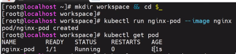
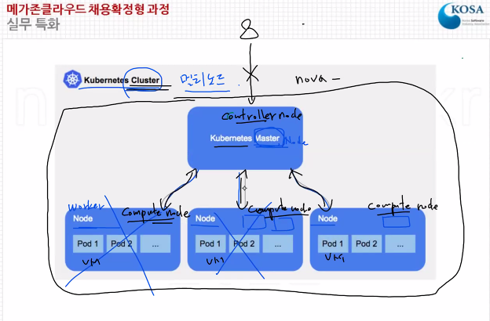
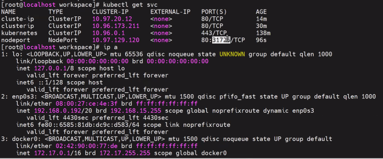
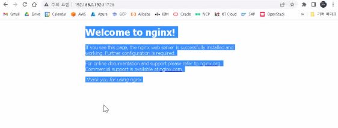
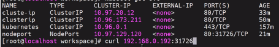
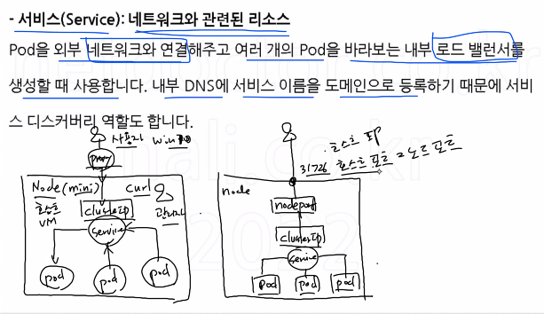
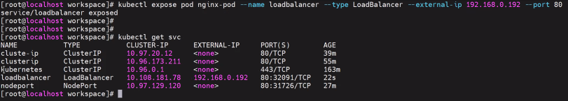
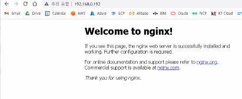
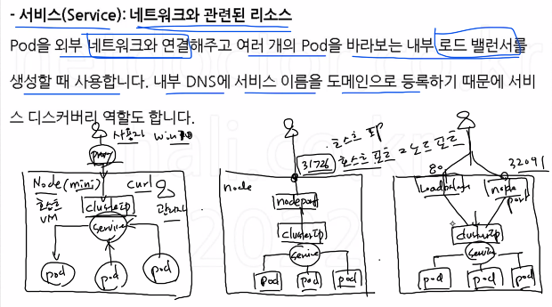

```
# kuberctl version
# kuberctl get svc
# kuberctl get node
```


## Pod

```
# mkdir workspace && cd $_
# kuberctl run nginx-pod --image nginx
# kuberctl get pod
```



* 서비스 이름 clusterip (`_`불가)
* 서비스 유형 ClusterIP
* host port 80

```
# mkdir workspace && cd $_
# kubectl run nginx-pod --image=nginx
# kubectl expose pod nginx-pod --name clusterip --type ClusterIP --port 80
# kubectl get svc
```


cluster ip는 클러스터 안에서만 접속..

* 외부에서 접속 불가 - 프록시 필요

```
# curl 10.96.173.211
```




## 노드 포트 설정

외부에서 접속할 수 있는 node port = 곧 hostport

* cluster ip로 접속

```
# kubectl expose pod nginx-pod --name nodeport --type NodePort --port 80
# curl 10.96~
```











## 로드밸런서

```
# kubectl expose pod nginx-pod --name loadbalancer --type=LoadBalancer --external-ip <node ip=host ip> --port 80
# kuberctl get svc
# kubectl get all
# kubectl delete svc --all
# kubectl delete pod nginx
```



* 




* node port 사용


* 클러스터  ip도 됨..
* 3번째 그림 : 접속경로 다양
  * 오른쪽으로 갈 수록 점점 접속 포인트 증가..
* 하나의 pod - 4개의 클러스터 ip - 4개의 랜카드




```
# kubectl exec -it nginx-pod -- bash
# cd /usr/share/nginx/html/
# ls
# echo "minikube" >> imdex.html
```


