```
# kuberctl version
# kuberctl get svc
# kuberctl get node
```


## Pod

```
# mkdir workspace && cd $_
# kuberctl run nginx-pod --image nginx
# kuberctl get pod
```


* 서비스 이름 clusterip (`_`불가)
* 서비스 유형 ClusterIP
* host port 80

```
# mkdir workspace && cd $_
# kubectl run nginx-pod --image=nginx
# kubectl expose pod nginx-pod --name clusterip --type ClusterIP --port 80
# kubectl get svc
```


cluster ip는 클러스터 안에서만 접속..

* 외부에서 접속 불가 - 프록시 필요

```
# curl 10.96.173.211
```


## 노드 포트 설정

외부에서 접속할 수 있는 node port = 곧 hostport

* cluster ip로 접속

```
# kubectl expose pod nginx-pod --name nodeport --type NodePort --port 80
# curl 10.96~
```


## 로드밸런서

```
# kubectl expose pod nginx-pod --name loadbalancer --type=LoadBalancer --external-ip <node ip=host ip> --port 80
# kuberctl get svc
# kubectl get all
# kubectl delete svc --all
# kubectl delete pod nginx
```


* 


* node port 사용


* 클러스터  ip도 됨..
* 3번째 그림 : 접속경로 다양
  * 오른쪽으로 갈 수록 점점 접속 포인트 증가..
* 하나의 pod - 4개의 클러스터 ip - 4개의 랜카드


```
# kubectl exec -it nginx-pod -- bash
# cd /usr/share/nginx/html/
# ls
# echo "minikube" >> index.html
```

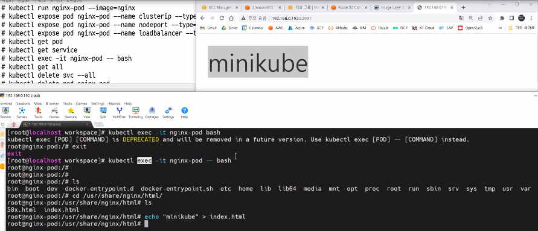

```
# kubectl get all
# kubectl delete svc --all
# kubectl delete pod nginx
```


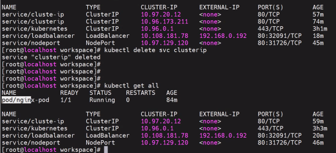

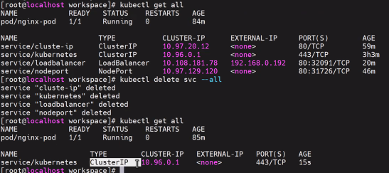

* 얘는 안지워짐

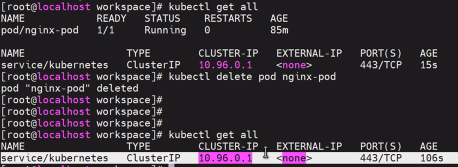


## 애드혹 > yaml 파일

* key : value
* 아키메스~

```
# vi nginx-pod.yaml
apiVersion: v1
kind: Pod
metadata:
  name: nginx-pod
  labels:
    app: nginx-pod
spec:
  containers:
  - name: nginx-pod-container
    image: nginx
```

*  apply

```
# kubectl apply -f nginx-pod.yaml
# kubectl get pod -o wide		# 좀 더 상세한 옵션
# kubectl describe pod nginx-pod
```

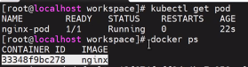

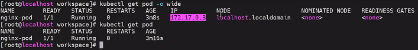

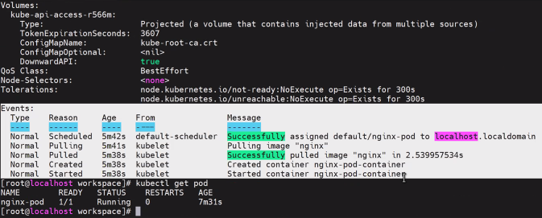

```
# kubectl get svc
# vi clusterip-pod.yaml
apiVersion: v1
kind: Service
metadata:
  name: clusterip-service-pod
spec:
  type: ClusterIP
  selector:				# pod의 labels
    app: nginx-pod
  ports:
  - protocol: TCP
    port: 80			# hostport-minikube
    targetPort: 80
```

* 메타 데이터 정보

```
# kubectl apply -f clusterip-pod.yaml
# kubectl get svc
# curl <cluster ip>
```


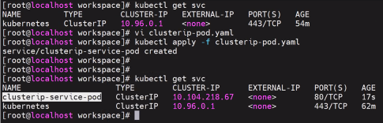


```
# kubectl get svc -o wide
# kubectl describe svc clusterip-service-pod
```

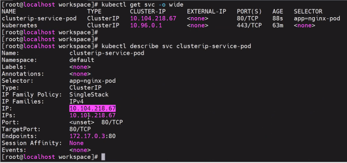


* cluster-ip-pod.yaml 수정해보기
  * labels랑 다르면 에러

```
# kubectl get svc
# kubectl delete svc clusterip-service-pod
# ls
# vi cluster-ip-pod.yaml
selector:
  app:nginx-pod1 # 수정
# kubectl apply -f clusterip-pod.yaml
# kubectl get svc
# curl 클러스터 ip
# kubectl delete svc clusterip-service-pod
# vi cluster-ip-pod.yaml		# 다시 복구
```

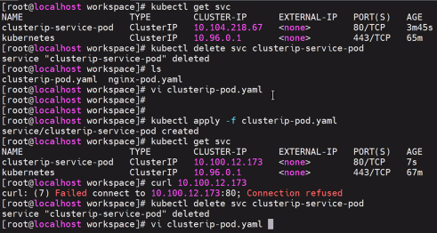

* 포트 번호 8080으로 수정
  * curl  +  포트번호 추가해줘야 함 - 안하면 에러

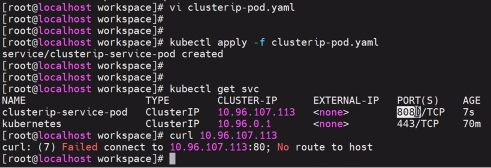

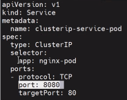

* edit
  * vi와 유사

```
# kubectl edit svc clusterip-service-pod
```

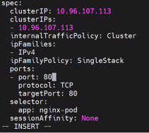

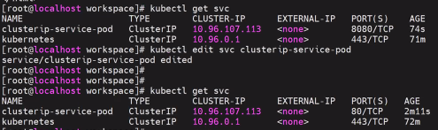

* nodeport 범위 : 30000 - 32767 

```
# vi nodeport-pod.yaml
apiVersion: v1
kind: Service
metadata:
  name: nodeport-service-pod
spec:
  type: NodePort
  selector:
    app: nginx-pod
  ports:
  - protocol: TCP
    port: 80
    targetPort: 80		# 컨테이너 포트
    nodePort: 30080
```

```
# kubectl apply -f nodeport-pod.yaml
# kubectl get svc
# curl <cluster ip>
# kubectl describe svc nodeport-service-pod
```

* targetPort: 8080 > 에러

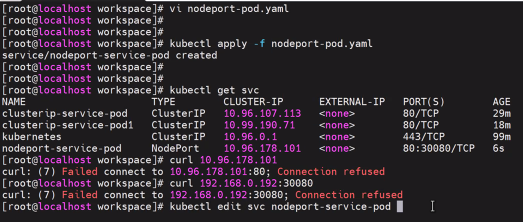

* targetPort: 80으로 

```
# kubectl apply -f nodeport-pod.yaml
# kubectl get svc -o wide
# kubectl describe svc nodeport-service-pod
```

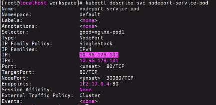

## 로드 밸런서

```
# vi loadbalancer-pod.yaml
apiVersion: v1
kind: Service
metadata:
  name: loadbalancer-service-pod
spec:
  type: LoadBalancer
  externalIPs:
  - 192.168.56.119
  selector:
    app: nginx-pod
  ports:
  - protocol: TCP
    port: 80
    targetPort: 80
```


```
# kubectl apply -f loadbalancer-pod.yaml
# kubectl get svc -o wide
# kubectl describe svc loadbalancer-service-pod
```

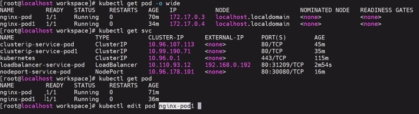

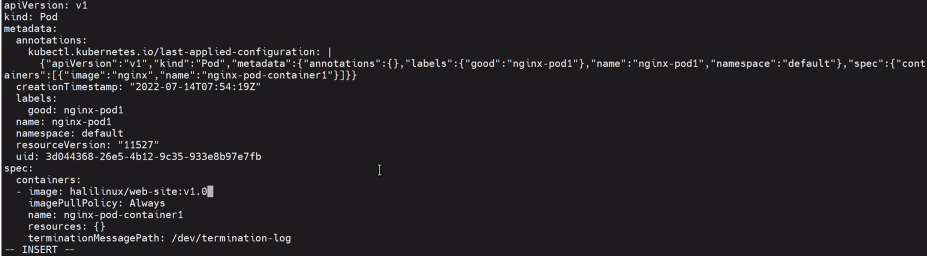

