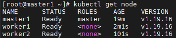
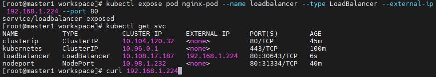

# 0715

## 쿠버네티스

* docker 설치

```
# curl https://download.docker.com/linux/centos/docker-ce.repo -o /etc/yum.repos.d/docker-ce.repo
# sed -i -e "s/enabled=1/enabled=0/g" /etc/yum.repos.d/docker-ce.repo
# yum --enablerepo=docker-ce-stable -y install docker-ce-19.03.15-3.el7
```


```
# mkdir /etc/docker
# cat <<EOF | sudo tee /etc/docker/daemon.json
{
  "exec-opts": ["native.cgroupdriver=systemd"],
  "log-driver": "json-file",
  "log-opts": {
    "max-size": "100m"
  },
  "storage-driver": "overlay2"
}
EOF
```


```
# systemctl enable --now docker
# systemctl daemon-reload
# systemctl restart docker
# systemctl status firewalld
# sestatus
```

```
# systemctl disable --now firewalld
# setenforce 0
# sed -i 's/^SELINUX=enforcing$/SELINUX=disabled/' /etc/selinux/config
```


```
# swapoff -a
# free -h
```


* 맨 밑줄 주석처리

```
# sed -i '/ swap / s/^/#/' /etc/fstab
```


```
cat <<EOF > /etc/sysctl.d/k8s.conf			# kubernetes
net.bridge.bridge-nf-call-ip6tables = 1
net.bridge.bridge-nf-call-iptables = 1
EOF
```


```
# cat <<'EOF' > /etc/yum.repos.d/kubernetes.repo
[kubernetes]
name=Kubernetes
baseurl=https://packages.cloud.google.com/yum/repos/kubernetes-el7-$basearch
enabled=1
gpgcheck=0
repo_gpgcheck=0
gpgkey=https://packages.cloud.google.com/yum/doc/yum-key.gpg https://packages.cloud.google.com/yum/doc/rpm-package-key.gpg
EOF
```


* 쿠버네티스 설치

```
# yum -y install kubeadm-1.19.16-0 kubelet-1.19.16-0 kubectl-1.19.16-0 --disableexcludes=kubernetes
# systemctl enable kubelet
# poweroff
```


### 이후 VM 복제


### All Node

```
# cat <<EOF >> /etc/hosts
192.168.1.192 master1
192.168.1.222 worker1
192.168.1.224 worker2
EOF
```


```
# hostnamectl set-hostname <VM NAME>
```


### Master

```
# kubeadm init --apiserver-advertise-address=192.168.1.192 --pod-network-cidr=10.244.0.0/16
```


* 사용자 등록 및 yaml 파일 적용

```
# mkdir -p $HOME/.kube
# cp -i /etc/kubernetes/admin.conf $HOME/.kube/config
# chown $(id -u):$(id -g) $HOME/.kube/config
# kubectl apply -f https://raw.githubusercontent.com/flannel-io/flannel/master/Documentation/kube-flannel.yml
```


### Node 

* 아까 설치한 후 뜬 토큰 정보 worker 1,2에 복사 붙여넣기

```
kubeadm join 192.168.1.192:6443 --token 141epo.gwp6nnxa59auxbzr \
    --discovery-token-ca-cert-hash sha256:8495bc09969697deac93a0a52edefe15fececeaa8b3c0261c147e010da284202
```


* 토큰 정보 까먹으면..리셋 후 다시 init

```
# kubeadam reset
# kubeadm init --apiserver-advertise-address=192.168.1.192 --pod-network-cidr=10.244.0.0/16
```


### Master

```
# kubectl get node
```



* 자동완성 (tab)
  * exit 후 적용

```
# source <(kubectl completion bash)
# echo "source <(kubectl completion bash)" >> ~/.bashrc
# exit
```


* node마다 pod...확인
  * namespace : 유사한 기능 pods 모아놓은 공간
  * 지정하지 않으면 디폴트로
    * `kube-flannel` : 쿠버네티스 꾸미기 위한 도구.. 모든 자원 모아놓은 namespace
    * `kube-system` : 시스템 관련 자원 pod로 들어가있음

```
# kubectl get pods --all-namespaces
# kubectl get namespaces
```


* 설정은 다 완료...스냅샷 찍기

---


* workspace 폴더 생성

```
# mkdir workspace && cd $_
# kubectl get node -o wide
```


* pod 생성
  * worker1,2 노드에 번갈아가며 생성됨

```
# kubectl run nginx-pod --image nginx
# kubectl get pod
# kubectl get pod -o wide
```


* `clusterip` 서비스 생성
  *  같은 cluster 안의 모든 node에서 접근 가능한 IP (내부 사설)

```
# kubectl expose pod nginx-pod --name clusterip --type ClusterIP --port 80
# kubectl get svc
```


* 다른 노드에서 확인

```
# curl 10.104.120.32
```


* `nodeport` 서비스 생성

```
# kubectl expose pod nginx-pod --name nodeport --type NodePort --port 80
# kubectl get svc
```


* 192.168.1.192:31334


* 다른 노드 IP로도 접속 가능
  * worker1 : 192.168.1.222:31334
  * worker2 : 192.168.1.224:31334


* 노드포트 : 노드 ip 각각 다름 but 같은 포트로 다양한 ip 한쪽으로 몰아줌


---

* 로드밸런서 생성
  * worker2의 ip를 external ip로 설정
  * 192.168.1.224

```
# kubectl expose pod nginx-pod --name loadbalancer --type LoadBalancer --external-ip 192.168.1.224 --port 80
# kubectl get svc
```




* master1, worker1은 접속 불가


* pod,svc 모두 삭제

```
# kubectl delete pod,svc --all
```


* yaml 파일 설정
  * label : 연결 고리

```
# vi nginx-pod.yaml
apiVersion: v1
kind: Pod
metadata:
  name: nginx-pod
  labels:
    app: nginx-pod
spec:
  containers:
  - name: nginx-pod-container
    image: nginx
    ports:
    - containerPort: 8080
```


*

```
# kubectl apply -f nginx-pod.yaml
# kubectl get pod -o wide
# kubectl describe pod nginx-pod
```

