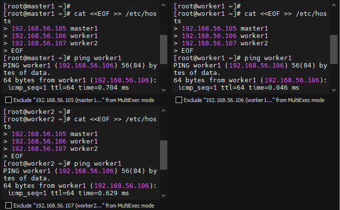
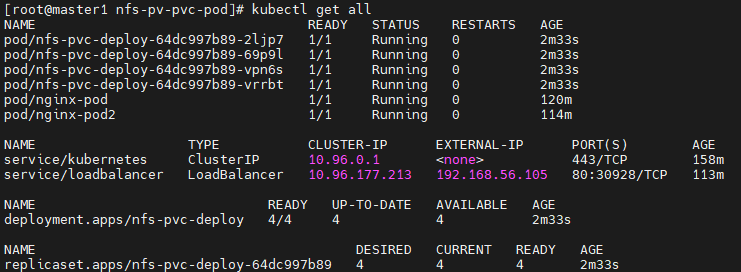
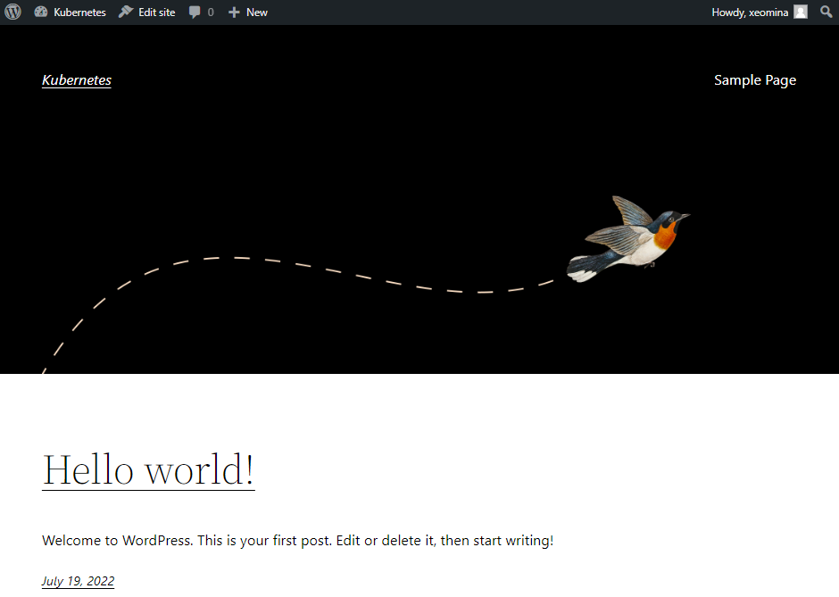
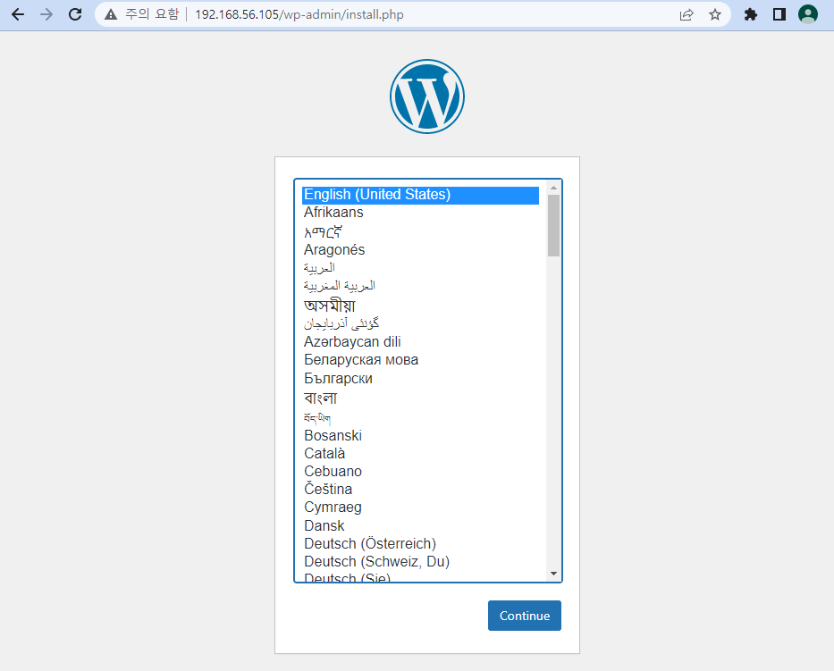

# 0719

## 리뷰


* ingress = L7 = ALB - 경로기반 라우팅


* persistentVolumeReclaimPolicy: Retain
  * pod : persistant volume (pvc) - pv? 이용해 연결... > 지울때 pod의 데이터
  * public cloud / openstack 에서는 `delete` 가능 but 쿠버네티스에서는 불가
  * `recycle` : 온프레미스 / vm에서는 delete와 유사한 기능..재활용


## Volume

* 모든 node에서 실행

```
# yum install -y nfs-utils.x86_64	# mount -t nfs
```


* master

```
# mkdir /nfs_shared
# chmod 777 /nfs_shared/
# echo '/nfs_shared 192.168.0.0/20(rw,sync,no_root_squash)' >> /etc/exports
# cat /etc/exports
```


```
# systemctl enable --now nfs
```

* worker 

```
# mount -t nfs 192.168.1.192:/nfs_shared /mnt
# df -h
# umount /mnt		# unmount
```


### pv

* master node

```
# mkdir nfs-pv-pvc-pod && cd $_
# vi nfs-pv.yaml
apiVersion: v1
kind: PersistentVolume		# pod가 아닌 object
metadata:
  name: nfs-pv
spec:
  capacity:
    storage: 100Mi
  accessModes:
    - ReadWriteMany	# RWX
  persistentVolumeReclaimPolicy: Recycle
  nfs:
    server: 192.168.1.192
    path: /nfs_shared
```


```
# kubectl apply -f nfs-pv.yaml
# kubectl get pv
```


### pvc

* label 및 selector 없음..어떻게 연결?
  * 후순위로 storage로 연결 - 유사한 크기

```
# vi nfs-pvc.yaml
apiVersion: v1
kind: PersistentVolumeClaim		# pvc
metadata:
  name: nfs-pvc
spec:
  accessModes:
    - ReadWriteMany				# rwx
  resources:
    requests:
      storage: 100Mi
```


```
# kubectl apply -f nfs-pvc.yaml
# kubectl get pv,pvc
```

* STATUS : Bound로 변경됨


### Deployment

* replicas: 4
  * 자가 치유...? > 내용 api 전달  > kube 스케쥴러가 리소스 넉넉한 node 스케쥴림 : 갯수 유지

```
# vi nfs-pvc-deploy.yaml
apiVersion: apps/v1
kind: Deployment
metadata:
  name: nfs-pvc-deploy
spec:
  replicas: 4		# spot 스폿
  selector:
    matchLabels:
      app: nfs-pvc-deploy

  template:
    metadata:
      labels:
        app: nfs-pvc-deploy
    spec:
      containers:
      - name: nginx
        image: nginx
        volumeMounts:
        - name: nfs-vol
          mountPath: /usr/share/nginx/html
      volumes:
      - name: nfs-vol
        persistentVolumeClaim:
          claimName: nfs-pvc
```


```
# kubectl apply -f nfs-pvc-deploy.yaml
# kubectl get all
```


* worker1

```
# df -h
```


* worker2

```
# df -h
```


### Loadbalancer

```
# kubectl expose deployment nfs-pvc-deploy --type=LoadBalancer --name=nfs-pvc-deploy-svc1 --external-ip 192.168.1.192 --port=80
# kubectl get svc
# curl 192.168.1.192
```


```
# echo "HELLO" > /nfs_shared/index.html
# curl 192.168.1.192
```


### 삭제

```
# kubectl delete deployments.apps nfs-pvc-deploy
# kubectl get all
# kubectl delete pvc nfs-pvc
# kubectl get all
```

* 시간 텀 필요


* worker


## VM 환경 설정

* NAT 확인


* ip 충돌 방지
  * 모든  VM
  * 네트워크 어댑터 1 : NAT 네트워크
  * 네트워크 어댑터 2 : 호스트 전용 어댑터


### ip 확인

* master 1 : 192.168.56.105
* worker 1 : 192.168.56.106
* worker 2 : 192.168.56.107


# New Kubernetes

* 모든 node

```
# cat <<EOF >> /etc/hosts
192.168.56.105 master1
192.168.56.106 worker1
192.168.56.107 worker2
EOF
```



```
# kubeadm reset
y
```


* master

```
# kubeadm init --apiserver-advertise-address=192.168.56.105 --pod-network-cidr=10.244.0.0/16
# mkdir -p $HOME/.kube
# cp -i /etc/kubernetes/admin.conf $HOME/.kube/config
# chown $(id -u):$(id -g) $HOME/.kube/config
```


* flannel 네트워크 구성

```
# kubectl apply -f https://raw.githubusercontent.com/flannel-io/flannel/master/Documentation/kube-flannel.yml
```

* 조인
  * worker 1,2

```
# kubeadm join 192.168.56.105:6443 --token lucwt4.ybhky6gtdqxblf0a \
    --discovery-token-ca-cert-hash sha256:64e8fba70143e60e9583e4b159c539d3cb2b4f8ed4f024fe3f0f5617c5fa6099
```


* master

```
# kubectl get no
# kubectl get pods --all-namespaces		# runnung 상태 확인
```


## private registry

* 전에 설정했었음...

```
# docker run -d -p 5000:5000 --restart=always --name private-docker-registry registry
# docker ps
```

* `daemon.json` 파일 설정
  * 모든 node

```
# vi /etc/docker/daemon.json
{
  "exec-opts": ["native.cgroupdriver=systemd"],
  "log-driver": "json-file",
  "log-opts": {
    "max-size": "100m"
  },
  "storage-driver": "overlay2",
  "insecure-registries":["192.168.56.105:5000"]			# ip 수정
}

# systemctl restart docker
# poweroff
```


## 스냅샷


## 애드혹

### Pod 

* `nginx-pod` 생성
  * ImagePullBackOff 에러

```
# kubectl run nginx-pod --image nginx
# kubectl get po
# kubectl get po -o wide

# docker tag nginx:latest 192.168.56.105:5000/nginx:latest
# docker push 192.168.56.105:5000/nginx:latest
```

* `nginx-pod2` 생성
  * image에 `tag`

```
# kubectl run nginx-pod2 --image 192.168.56.105:5000/nginx:latest
# kubectl get po
# kubectl get po -o wide
```


### loadbalancer

*  `nginx-pod`로 작업...

```
# kubectl expose pod nginx-pod --name loadbalancer --type=LoadBalancer --external-ip 192.168.56.105 --port 80
# kubectl get svc
# curl 192.168.56.105
```


----

* `exports` 수정

```
# echo '/nfs_shared 192.168.56.0/24(rw,sync,no_root_squash)' > /etc/exports
# cat /etc/exports
# systemctl restart nfs
```


* `nfs-pv.yaml` 파일 수정

```
# vi nfs-pv.yaml
apiVersion: v1
kind: PersistentVolume
metadata:
  name: nfs-pv
spec:
  capacity:
    storage: 100Mi
  accessModes:
    - ReadWriteMany
  persistentVolumeReclaimPolicy: Recycle
  nfs:
    server: 192.168.56.105		# 수정
    path: /nfs_shared
```

* apply

```
# kubectl apply -f nfs-pv.yaml
# kubectl get pv
```


* `nfs-pvc.yaml` apply

```
# kubectl apply -f nfs-pvc.yaml
```


* `nfs-pvc-deploy.yaml` 파일 수정
  * 사설 레지스트리를 이용할 경우

```
# vi nfs-pvc-deploy.yaml
apiVersion: apps/v1
kind: Deployment
metadata:
  name: nfs-pvc-deploy
spec:
  replicas: 4
  selector:
    matchLabels:
      app: nfs-pvc-deploy

  template:
    metadata:
      labels:
        app: nfs-pvc-deploy
    spec:
      containers:
      - name: nginx
        image: 192.168.56.105:5000/nginx:latest		# 수정
        volumeMounts:
        - name: nfs-vol
          mountPath: /usr/share/nginx/html
      volumes:
      - name: nfs-vol
        persistentVolumeClaim:
          claimName: nfs-pvc
```


* apply

```
# kubectl apply -f nfs-pvc-deploy.yaml
```

* 확인

```
# kubectl get all
```




## 

* centos \7 이미지

```
# mkdir test && cd $_
# docker pull centos:7
```

* private resistry

```
# docker tag centos:7 192.168.56.105:5000/centos:7
# docker push 192.168.56.105:5000/centos:7
```


## multi-container

* ​	`multipod.yaml` 파일 생성

```
# vi multipod.yaml
apiVersion: v1
kind: Pod
metadata:
 name: multipod
spec:
 containers:
 - name: nginx-container        #1번째 컨테이너
   image: 192.168.56.105:5000/nginx:latest
   ports:
   - containerPort: 80
 - name: centos-container       #2번째 컨테이너
   image: 192.168.56.105:5000/centos:7
   command:
   - sleep
   - "10000"
```


```
# kubectl apply -f multipod.yaml
# kubectl get po -o wide
```


*  pod 안에 container 확인

```
# kubectl describe pod multipod
```


* `nginx-container` 접속

```
# kubectl exec -it multipod -c nginx-container -- bash
root@multipod:/# 
```


* `centos-container` 접속

```
# kubectl exec -it multipod -c centos-container -- bash
[root@multipod /]# 
```


### wordpress

* 이미지 tag

```
# docker pull mysql:5.7

# docker tag mysql:5.7 192.168.56.105:5000/mysql:5.7
# docker push 192.168.56.105:5000/mysql:5.7
```


```
# docker pull wordpress

# docker tag wordpress 192.168.56.105:5000/wordpress
# docker push 192.168.56.105:5000/wordpress
```


* `wordpress-pod-svc.yaml` 파일 생성
  * `mysql-container`와 `wordpress-container` : `wp-config.php` 파일로 연동

```
# vi wordpress-pod-svc.yaml
apiVersion: v1
kind: Pod
metadata:
  name: wordpress-pod                   # 127.0.0.1
  labels:
    app: wordpress-pod
spec:
  containers:
  - name: mysql-container
    image: 192.168.56.105:5000/mysql:5.7
    env:
    - name: MYSQL_ROOT_HOST
      value: '%'                                # wpuser@% 0.0.0.0/0
    - name: MYSQL_ROOT_PASSWORD
      value: as4914
    - name: MYSQL_DATABASE
      value: wordpress
    - name: MYSQL_USER
      value: wpuser
    - name: MYSQL_PASSWORD
      value: wppass
    ports:
    - containerPort: 3306
  - name: wordpress-container
    image: 192.168.56.105:5000/wordpress
    env:
    - name: WORDPRESS_DB_HOST
      value: wordpress-pod:3306                         # 127.0.0.1
    - name: WORDPRESS_DB_USER
      value: wpuser
    - name: WORDPRESS_DB_PASSWORD
      value: wppass
    - name: WORDPRESS_DB_NAME
      value: wordpress
    ports:
    - containerPort: 80
---
apiVersion: v1
kind: Service
metadata:
  name: loadbalancer-service-deployment-wordpress
spec:
  type: LoadBalancer
  externalIPs:
  - 192.168.56.106
  selector:
    app: wordpress-pod
  ports:
  - protocol: TCP
    port: 80
    targetPort: 80
```


* apply

```
# kubectl apply -f wordpress-pod-svc.yaml
# kubectl get all
```


* External IP 접속
  * 192.168.56.106




Cf) container 지워지면 pvc 설정 안되어 있어 댓글도 삭제됨


* mysql-container 접속

```
# kubectl exec -it wordpress-pod -c mysql-container -- bash
```


* wordpress-container 접속

````
# kubectl exec -it wordpress-pod -c wordpress-container -- bash
````


## metallb (DHCP)

* `wordpress-pod-svc.yaml` 파일 수정
  * node IP가 아닌 IP svc에 등록해보기

```
# vi wordpress-pod-svc.yaml
  externalIPs:
  - 192.168.56.200
```


```
# kubectl apply -f wordpress-pod-svc.yaml
# kubectl get svc
```


* 192.168.56.200 ip 접속
  * node의 ip가 아니면 연결 불가!


**Cf) 폴더 안 모두 delete & apply**

```
# kubectl delete -f .
# kubectl apply -f .
```


* `wordpress-pod-svc.yaml` 파일 수정
  * External IP 주석처리 해보기

```
# vi wordpress-pod-svc.yaml

#  externalIPs:
#  - 192.168.56.200
```


* 온프레미스에서 로드밸런서를 제공하는 MetalLB
  * `metallb.yaml` 파일 다운로드

```
# yum install -y git
# git clone https://github.com/hali-linux/_Book_k8sInfra.git
```


* apply

```
# kubectl apply -f /root/_Book_k8sInfra/ch3/3.3.4/metallb.yaml
```


* `metallb-l2config.yaml` 파일 수정

```
# vi metallb-l2config.yaml
apiVersion: v1
kind: ConfigMap
metadata:
  namespace: metallb-system
  name: config
data:
  config: |
    address-pools:
    - name: nginx-ip-range
      protocol: layer2
      addresses:
      - 192.168.56.200-192.168.56.250		# ip 범위
```


* apply

```
# kubectl apply -f metallb-l2config.yaml
# kubectl describe configmaps -n metallb-system
```


* 확인
  * pending
  * ImagePullBackOff

```
# kubectl get all
# kubectl get po --all-namespaces
```


* 해결

```
# docker login
# docker pull metallb/controller:v0.8.2
# docker pull metallb/speaker:v0.8.2
```


* tag

```
# docker tag metallb/controller:v0.8.2 192.168.56.105:5000/metallb/controller:v0.8.2
# docker tag metallb/speaker:v0.8.2 192.168.56.105:5000/metallb/speaker:v0.8.2
```

* push

```
# docker push 192.168.56.105:5000/metallb/controller:v0.8.2
# docker push 192.168.56.105:5000/metallb/speaker:v0.8.2
```


* `metallb.yaml` 파일 수정
  * image

```
# vi /root/_Book_k8sInfra/ch3/3.3.4/metallb.yaml
image: 192.168.56.105:5000/metallb/speaker:v0.8.2
image: 192.168.56.105:5000/metallb/controller:v0.8.2
```


```
# kubectl apply -f /root/_Book_k8sInfra/ch3/3.3.4/metallb.yaml
# kubectl get all
# kubectl get svc
```


* `metallb-l2config.yaml` 파일 수정
  * test 경로

```
# vi metallb-l2config.yaml
apiVersion: v1
kind: ConfigMap
metadata:
  namespace: metallb-system
  name: config
data:
  config: |
    address-pools:
    - name: nginx-ip-range
      protocol: layer2
      addresses:
      - 192.168.56.105-192.168.56.107		# node IP 범위
```


```
# kubectl apply -f metallb-l2config.yaml
# kubectl describe configmaps -n metallb-system
```


* 확인
  * 192.168.56.105 ip로 접속

```
# kubectl get all
# kubectl get svc
```




* `metallb-test.yaml` 파일 수정

```
# vi metallb-test.yaml
apiVersion: v1
kind: Pod
metadata:
  name: nginx-pod
  labels:
    app: nginx-pod
spec:
  containers:
  - name: nginx-pod-container
    image: 192.168.56.105:5000/nginx
---
apiVersion: v1
kind: Service
metadata:
  name: loadbalancer-service-pod
spec:
  type: LoadBalancer
#  externalIPs:
#  -
  selector:
    app: nginx-pod
  ports:
  - protocol: TCP
    port: 80
    targetPort: 80
```

* apply

```
# kubectl apply -f metallb-test.yaml
```

* 확인
  * 192.168.56.106 접속

```
# kubectl get svc
```


## configMap
컨피그맵은 키-값 쌍으로 기밀이 아닌 데이터를 저장하는 데 사용하는 API 오브젝트입니다. 파드는 볼륨에서 환경 변수, 커맨드-라인 인수 또는 구성 파일로 컨피그맵을 사용할 수 있습니다.
컨피그맵을 사용하면 컨테이너 이미지에서 환경별 구성을 분리하여, 애플리케이션을 쉽게 이식할 수 있습니다.

* `configmap-dev.yaml` 파일 생성

```
# mkdir configmap && cd $_
# vi configmap-dev.yaml
apiVersion: v1
kind: ConfigMap
metadata:
  name: config-dev
  namespace: default
data:
  DB_URL: localhost
  DB_USER: myuser
  DB_PASS: mypass
  DEBUG_INFO: debug
```


* apply

```
# kubectl apply -f configmap-dev.yaml
# kubectl describe configmaps config-dev
```


* `deployment-config01.yaml` 파일 생성

```
# vi deployment-config01.yaml
apiVersion: apps/v1
kind: Deployment
metadata:
  name: configapp
  labels:
    app: configapp
spec:
  replicas: 1
  selector:
    matchLabels:
      app: configapp
  template:
    metadata:
      labels:
        app: configapp
    spec:
      containers:
      - name: testapp
        image: 192.168.56.104:5000/nginx:latest
        ports:
        - containerPort: 8080
        env:
        - name: DEBUG_LEVEL
          valueFrom:
            configMapKeyRef:
              name: config-dev
              key: DEBUG_INFO
---
apiVersion: v1
kind: Service
metadata:
  labels:
    app: configapp
  name: configapp-svc
  namespace: default
spec:
  ports:
  - nodePort: 30800
    port: 8080
    protocol: TCP
    targetPort: 80
  selector:
    app: configapp
```

* 생성 안하고 끝........