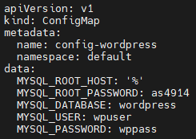
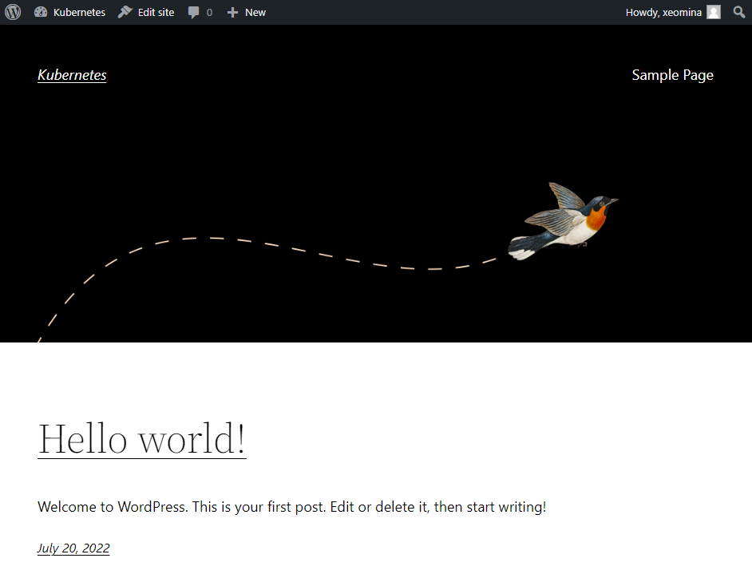
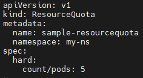
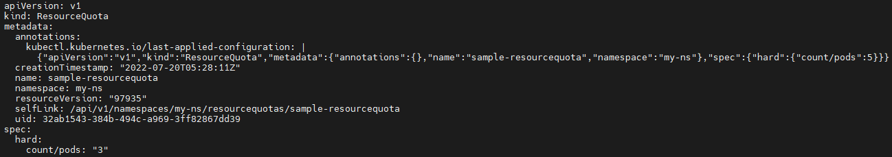
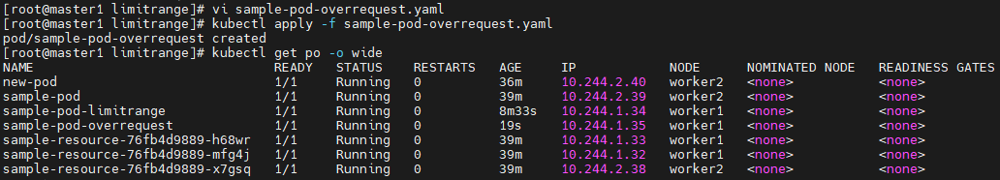

# 0720

# configMap
* 컨피그맵은 키-값 쌍으로 기밀이 아닌 데이터를 저장하는 데 사용하는 API 오브젝트입니다. 
* 파드는 볼륨에서 환경 변수, 커맨드-라인 인수 또는 구성 파일로 컨피그맵을 사용할 수 있습니다.
* 컨피그맵을 사용하면 컨테이너 이미지에서 환경별 구성을 분리하여, 애플리케이션을 쉽게 이식할 수 있습니다.

## configMap 관리

* 컨피그맵은 컨테이너를 필요한 환경 설정을 컨테이너와 분리해서 제공하는 기능입니다. 개발용과 상용 서비스에서는 서로 다른 설정이 필요할 때가 많습니다. 사용하는 데이터 베이스가 다를 수도 있고, 실제 개발할 때는 디버그 모드로 로그를 출력하는데, 서비스용에서는 시스템 정보를 나타내는 모드로 로그를 출력해야 하는 등의 차이가 있습니다. 이렇게 다른 설정으로 컨테이너를 실행해야 할 때 사용하는 것이 컨피그맵입니다. 컨피그맵을 컨테이너와 분리하면 컨테이너 하나를 개발용, 상용 서비스를 운영하기 전 보안이나 성능 장애 등을 검증하는 스테이지용, 상용 서비스용으로 사용할 수 있습니다.


출처 : https://kubernetes.io/blog/2018/07/11/dynamic-kubelet-configuration/

## 연습

* `configmap-dev.yaml` 파일 생성
  * 저번시간 이어서..

```
# vi configmap-dev.yaml
apiVersion: v1
kind: ConfigMap
metadata:
  name: config-dev
  namespace: default
data:
  DB_URL: localhost
  DB_USER: myuser
  DB_PASS: mypass
  DEBUG_INFO: debug
```

* apply

```
# kubectl apply -f configmap-dev.yaml
# kubectl describe configmaps
```


* `deployment-config01.yaml` 파일 생성

```
# vi deployment-config01.yaml
apiVersion: apps/v1
kind: Deployment
metadata:
  name: configapp
  labels:
    app: configapp
spec:
  replicas: 1
  selector:
    matchLabels:
      app: configapp
  template:
    metadata:
      labels:
        app: configapp
    spec:
      containers:
      - name: testapp
        image: 192.168.56.105:5000/nginx:latest
        ports:
        - containerPort: 8080
        env:					# 환경변수 참조
        - name: DEBUG_LEVEL		  # 컨테이너 안에서의 변수명
          valueFrom:			 # 필드
            configMapKeyRef:	  # configmap 안에서
              name: config-dev
              key: DEBUG_INFO 	  # DEBUG_INFO 변수 값 = debug
              					 # DEBUG_LEVEL = debug
---
apiVersion: v1
kind: Service
metadata:
  labels:
    app: configapp
  name: configapp-svc
  namespace: default
spec:
  ports:
  - nodePort: 30800
    port: 8080
    protocol: TCP
    targetPort: 80
  selector:
    app: configapp
```


* apply

```
# kubectl apply -f deployment-config01.yaml
# kubectl get all
```


---


## 이미지 limit 해결 방법

```
# docker login
# kubectl create secret generic xeomina --from-file=.dockerconfigjson=/root/.docker/config.json --type=kubernetes.io/dockerconfigjson
# kubectl patch -n default serviceaccount/default -p '{"imagePullSecrets":[{"name": "xeomina"}]}'
# kubectl describe serviceaccount default -n default	# 확인
```


* 이미지 수정 해보기
  * 사설 레지스트리 x

```
# vi deployment-config01.yaml
image: nginx
```


```
# kubectl delete deployments.apps configapp
# kubectl apply -f deployment-config01.yaml
# kubectl get pod
# kubectl get all
```


* `configapp` pod 접속
  * env 확인

```
# kubectl get po
NAME                        READY   STATUS    RESTARTS   AGE
configapp-c9bb7b748-s59sj   1/1     Running   0          30m

# kubectl exec -it configapp-c9bb7b748-s59sj -- bash
root@configapp-c9bb7b748-s59sj:/# env
```


* 전체 삭제

```
# kubectl delete pod,deploy,svc --all
```


---


## wordpress

### configmap

* `configmap-wordpress.yaml` 파일 생성

```
# vi configmap-wordpress.yaml
apiVersion: v1
kind: ConfigMap
metadata:
  name: config-wordpress
  namespace: default
data:
  MYSQL_ROOT_HOST: '%'
  MYSQL_ROOT_PASSWORD: as4914
  MYSQL_DATABASE: wordpress
  MYSQL_USER: wpuser
  MYSQL_PASSWORD: wppass
```



* apply

```
# kubectl apply -f configmap-wordpress.yaml
# kubectl describe configmaps config-wordpress
```


### pod & svc

* `mysql-pod-svc.yaml` 파일 생성
  * wordpress db setver

```
# vi mysql-pod-svc.yaml
apiVersion: v1
kind: Pod
metadata:
  name: mysql-pod
  labels:
    app: mysql-pod
spec:
  containers:
  - name: mysql-container
    image: mysql:5.7
    envFrom:	# 컨피그맵 설정 전체를 한꺼번에 불러와서 사용하기
    - configMapRef:
        name: config-wordpress
    ports:
    - containerPort: 3306
---
apiVersion: v1
kind: Service
metadata:
  name: mysql-svc
spec:
  type: ClusterIP
  selector:
    app: mysql-pod
  ports:
  - protocol: TCP
    port: 3306
    targetPort: 3306
```


* apply

```
# kubectl apply -f mysql-pod-svc.yaml
# kubectl get all
```


* `wordpress-pod-svc.yaml` 파일 생성

```
# vi wordpress-pod-svc.yaml
apiVersion: v1
kind: Pod
metadata:
  name: wordpress-pod
  labels:
    app: wordpress-pod
spec:
  containers:
  - name: wordpress-container
    image: wordpress
    env:
    - name: WORDPRESS_DB_HOST	# wordpress 이미지 안에 지정되어 있는 변수명
      value: mysql-svc:3306		# 변수값
    - name: WORDPRESS_DB_USER	# 변수명
      valueFrom:			   # 값 가져오기
        configMapKeyRef:		# config-wordpress configMap 안에서
          name: config-wordpress
          key: MYSQL_USER		# 키 값
    - name: WORDPRESS_DB_PASSWORD
      valueFrom:
        configMapKeyRef:
          name: config-wordpress
          key: MYSQL_PASSWORD
    - name: WORDPRESS_DB_NAME
      valueFrom:
        configMapKeyRef:
          name: config-wordpress
          key: MYSQL_DATABASE
    ports:
    - containerPort: 80
---
apiVersion: v1
kind: Service
metadata:
  name: wordpress-svc
spec:
  type: LoadBalancer
  externalIPs:
  - 192.168.2.0
  selector:
    app: wordpress-pod
  ports:
  - protocol: TCP
    port: 80
    targetPort: 80
```


* apply

```
# kubectl apply -f wordpress-pod-svc.yaml
# kubectl get all
```


**Cf) watch**

* 모니터링 명령어

```
# watch kubectl get all
```


* external ip 접속
  * 192.168.56.105


### deploy

* `mysql-deploy-svc.yaml` 파일 생성

```
# vi mysql-deploy-svc.yaml
apiVersion: apps/v1
kind: Deployment
metadata:
  name: mysql-deploy
  labels:
    app: mysql-deploy
spec:
  replicas: 1
  selector:
    matchLabels:
      app: mysql-deploy
  template:
    metadata:
      labels:
        app: mysql-deploy
    spec:
      containers:
      - name: mysql-container
        image: mysql:5.7
        envFrom:
        - configMapRef:
            name: config-wordpress
        ports:
        - containerPort: 3306
---
apiVersion: v1
kind: Service
metadata:
  name: mysql-svc
spec:
  type: ClusterIP
  selector:
    app: mysql-deploy
  ports:
  - protocol: TCP
    port: 3306
    targetPort: 3306
```


* apply

```
# kubectl apply -f mysql-deploy-svc.yaml
# kubectl get all
```


* `wordpress-deploy-svc.yaml` 파일 생성

```
# vi wordpress-deploy-svc.yaml
apiVersion: apps/v1
kind: Deployment
metadata:
  name: wordpress-deploy
  labels:
    app: wordpress-deploy
spec:
  replicas: 3
  selector:
    matchLabels:
      app: wordpress-deploy
  template:
    metadata:
      labels:
        app: wordpress-deploy
    spec:
      containers:
      - name: wordpress-container
        image: wordpress
        env:
        - name: WORDPRESS_DB_HOST # =mysql-svc:3306
          value: mysql-svc:3306
        - name: WORDPRESS_DB_USER # =wpuser
          valueFrom:
            configMapKeyRef:
              name: config-wordpress
              key: MYSQL_USER
        - name: WORDPRESS_DB_PASSWORD # =wppass
          valueFrom:
            configMapKeyRef:
              name: config-wordpress
              key: MYSQL_PASSWORD
        - name: WORDPRESS_DB_NAME
          valueFrom:
            configMapKeyRef:
              name: config-wordpress
              key: MYSQL_DATABASE
        ports:
        - containerPort: 80
---
apiVersion: v1
kind: Service
metadata:
  name: wordpress-svc
spec:
  type: LoadBalancer
#  externalIPs:
#  - 192.168.2.0
  selector:
    app: wordpress-deploy
  ports:
  - protocol: TCP
    port: 80
    targetPort: 80
```


* apply

```
# kubectl apply -f wordpress-deploy-svc.yaml
# kubectl get all
# kubectl get po -o wide
```


* 워드프레스 접속
  * 192.168.56.105




* mysql 접속

```
# mysql -h 10.101.242.101 -u wpuser -p
Enter password:
Welcome to the MariaDB monitor.  Commands end with ; or \g.
Your MySQL connection id is 72
Server version: 5.7.38 MySQL Community Server (GPL)

Copyright (c) 2000, 2018, Oracle, MariaDB Corporation Ab and others.

Type 'help;' or '\h' for help. Type '\c' to clear the current input statement.

MySQL [(none)]> show databases;
+--------------------+
| Database           |
+--------------------+
| information_schema |
| wordpress          |
+--------------------+
2 rows in set (0.01 sec)

MySQL [(none)]> exit
Bye
```


## 정리

* 로드밸런서 svc는 external ip 주지 않을 경우..
  * 외부에서 로드밸런서에게 ip를 자동으로 부여 - dhcp? 클라이언트의 기능
  * metallb 가 있을 경우 부여받음 없으면 pending

* web ui에서 db server의 data 입력하지 않고 configmap에서 미리 정의..

* 전체 삭제

```
# kubectl delete -f .
# kubectl get all
# kubectl get pv,pvc
```


# namespace

## namespace 관리

* 네임스페이스는 쿠버네티스 클러스터 하나를 여러개 논리적인 단위로 나눠서 사용하는 것이니다. 네임스페이스 덕분에 쿠버네티스 클러스터 하나를 여러개 팀이나 사용자가 함께 공유할 수 있습니다. 또한 클러스터 안에서 용도에 따라 실행해야 하는 앱을 구분할 때도 네임스페이스를 사용합니다. 네임스페이스별로 별도의 쿼터를 설정해서 특정 네임스페이스의 사용량을 제한할 수도 있습니다.


출처 : https://wiki.webnori.com/display/kubernetes/Namespace


## 연습

* namespaces 보기
  * `metallb-system`에 속해있는 목록 보기

```
# kubectl get namespaces
# kubectl get all -n metallb-system
```


* admin 계정
  * 디폴트 namespace 사용중

```
# kubectl config get-contexts kubernetes-admin@kubernetes
```


* namespace 생성

```
# kubectl create namespace test-namespace
# kubectl get namespaces
# kubectl run nginx-pod --image nginx -n test-namespace
pod/nginx-pod created

# kubectl get po
# kubectl get po -n test-namespace
```


* `test-namespace`를 default namespace로 설정

```
# kubectl config set-context test-namespace
# kubectl config set-context kubernetes-admin@kubernetes --namespace test-namespace
# kubectl config get-contexts kubernetes-admin@kubernetes
# kubectl get po
```


* loadbalancer 생성해보기
  * metallb : external ip 설정 안해도 됨

```
# kubectl expose pod nginx-pod --name loadbalancer --type LoadBalancer --port 80
# kubectl get all
# curl 192.168.56.105
```


* namespace 삭제해보기

```
# kubectl delete namespaces test-namespace
# kubectl get all
# kubectl config get-contexts kubernetes-admin@kubernetes
```


* default namespace 설정 원복
  * `namespace= ` : 공백으로 두기

```
# kubectl config set-context kubernetes-admin@kubernetes --namespace=
# kubectl config get-contexts kubernetes-admin@kubernetes
# kubectl get all
```


---

## ns

* ns 생성

```
# kubectl create ns my-ns
# kubectl get ns
```


## 이미지 limit 해결 방법

```
# docker login
# kubectl create secret generic xeomina --from-file=.dockerconfigjson=/root/.docker/config.json --type=kubernetes.io/dockerconfigjson
# kubectl patch -n my-ns serviceaccount/default -p '{"imagePullSecrets":[{"name": "xeomina"}]}'
# kubectl describe serviceaccount default -n my-ns	# 확인
```


# ResourceQuota

## ResourceQuota 관리

* 리소스 쿼터를 사용하여 각 네임스페이스마다, 즉 가상 쿠버네티스 클러스터마다 사용 가능한 리소스를 제한할 수 있습니다. 리소스 쿼터는 생성이나 변경으로 그 시점에 제한이 걸린 상태가 되어도 이미 생성된 리소스에는 영향을 주지 않기 때문에 주의해야 합니다. 리소스 쿼터는 크게 '생성 가능한 리소스 수 제한'과 '리소스 사용량 제한'으로 나눌 수 있습니다.


출처: https://dev-youngjun.tistory.com/23

### sample-resourcequota

* `sample-resourcequota.yaml` 파일 생성
  * request & limit 설정

```
# vi sample-resourcequota.yaml
apiVersion: v1
kind: ResourceQuota
metadata:
  name: sample-resourcequota
  namespace: my-ns
spec:
  hard:
    count/pods: 5
```



* apply

```
# kubectl apply -f sample-resourcequota.yaml
# kubectl describe resourcequotas sample-resourcequota
```

* resource quota : 5
  * 6개 이상의 pod는 안만들어짐

```
# kubectl run new-nginx1 --image=nginx
...
# kubectl run new-nginx6 --image=nginx
```


* edit
  * 소급적용 x

```
# kubectl edit resourcequotas sample-resourcequota -n my-ns
# kubectl describe resourcequotas sample-resourcequota -n my-ns
```




* `my-ns` ns를 디폴트로 설정

```
# kubectl config set-context kubernetes-admin@kubernetes --namespace my-ns
# kubectl config get-contexts kubernetes-admin@kubernetes
# kubectl get po
```


### sample-resourcequota-usable

* `sample-resourcequota-usable.yaml` 파일 생성
  * 현재 namespace = my-ns

```
# vi sample-resourcequota-usable.yaml
apiVersion: v1
kind: ResourceQuota
metadata:
  name: sample-resourcequota-usable
# namespace: default
spec:
  hard:
    requests.memory: 2Gi
    requests.storage: 5Gi
    sample-storageclass.storageclass.storage.k8s.io/requests.storage: 5Gi
    requests.ephemeral-storage: 5Gi
    requests.nvidia.com/gpu: 2
    limits.cpu: 4
    limits.ephemeral-storage: 10Gi
    limits.nvidia.com/gpu: 4
```


* apply

```
# kubectl apply -f sample-resourcequota-usable.yaml
# kubectl get resourcequotas
# kubectl describe resourcequotas
```


### sample-pod

* `sample-pod.yaml` 
  * 리소스 지정 x

```
# vi sample-pod.yaml
apiVersion: v1
kind: Pod
metadata:
  name: sample-pod
spec:
  containers:
  - name: nginx-container
    image: nginx:1.16
```


* apply
  * 리소스 지정하지 않으면 error

```
# kubectl apply -f sample-pod.yaml
```


* 리소스 지정

```
# vi sample-pod.yaml
apiVersion: v1
kind: Pod
metadata:
  name: sample-pod
spec:
  containers:
  - name: nginx-container
    image: nginx:1.16
    resources:
      requests:			# 최솟값
        memory: "64Mi"
        cpu: "50m"		# 1000 milicore = 1 core
      limits:
        memory: "128Mi"
        cpu: "100m"
```


* apply
  * pod count 차면 생성 불가

```
# kubectl apply -f sample-pod.yaml
```


### sample-resourcequota

* limits 늘려주기
  * `sample-resourcequota.yaml`

```
# vi sample-resourcequota.yaml
apiVersion: v1
kind: ResourceQuota
metadata:
  name: sample-resourcequota
  namespace: my-ns
spec:
  hard:
    count/pods: 10
```


* apply
  * error 없이 잘 생성됨

```
# kubectl apply -f sample-resourcequota.yaml
# kubectl apply -f sample-pod.yaml
```


### sample-pod

* memory 늘려보기
  * `sample-pod.yaml`

```
# vi sample-pod.yaml
apiVersion: v1
kind: Pod
metadata:
  name: sample-pod
spec:
  containers:
  - name: nginx-container
    image: nginx:1.16
    resources:
      requests:
        memory: "3G"	# 수정
        cpu: "50m"
      limits:
        memory: "128Mi"
        cpu: "100m"
```


* apply
  * 자원 수정 시 지우고 다시 생성해야 함

```
# vi sample-pod.yaml
# kubectl apply -f sample-pod.yaml
```


* `sample-pod.yaml` 수정

```
# vi sample-pod.yaml
apiVersion: v1
kind: Pod
metadata:
  name: sample-pod
spec:
  containers:
  - name: nginx-container
    image: nginx:1.16
    resources:
      requests:
        memory: "64Mi"
        cpu: "1050m"
      limits:
        memory: "128Mi"
        cpu: "1100m"
```


* 생성됨


* 수정

````
# vi sample-pod.yaml
apiVersion: v1
kind: Pod
metadata:
  name: sample-pod
spec:
  containers:
  - name: nginx-container
    image: nginx:1.16
    resources:
      requests:
        memory: "64Mi"
        cpu: "4050m"
      limits:
        memory: "128Mi"
        cpu: "4100m"
````


```
# kubectl apply -f sample-pod.yaml
```


* 리소스 재설정

```
# vi sample-pod.yaml
apiVersion: v1
kind: Pod
metadata:
  name: sample-pod
spec:
  containers:
  - name: nginx-container
    image: nginx:1.16
    resources:
      requests:
        memory: "64Mi"
        cpu: "3950m"
      limits:
        memory: "128Mi"
        cpu: "4000m"
```


* apply
  * pending... 실제 시스템 자원 부족
    * `sample-resourcequota-usable.yaml`에서 `hard: requests.memory: 2Gi`

```
# kubectl apply -f sample-pod.yaml
# kubectl get po -o wide
```


* 다시 수정...

```
# vi sample-pod.yaml
apiVersion: v1
kind: Pod
metadata:
  name: sample-pod
spec:
  containers:
  - name: nginx-container
    image: nginx:1.16
    resources:
      requests:
        memory: "64Mi"
        cpu: "950m"
      limits:
        memory: "128Mi"
        cpu: "1000m"
```

```
# kubectl apply -f sample-pod.yaml
# kubectl get po -o wide
```


**테인트(Taints)와 톨러레이션(Tolerations)**

https://kubernetes.io/ko/docs/concepts/scheduling-eviction/taint-and-toleration/


* 수정수정
  * node 리소스도 봐야..

```
# vi sample-pod.yaml
apiVersion: v1
kind: Pod
metadata:
  name: sample-pod
spec:
  containers:
  - name: nginx-container
    image: nginx:1.16
    resources:
      requests:
        memory: "64Mi"
        cpu: "500m"
      limits:
        memory: "128Mi"
        cpu: "1000m"
```


```
# kubectl apply -f sample-pod.yaml
# kubectl get po -o wide
```


```
# kubectl describe node worker2
```


### sample-resource

```
# vi sample-resource.yaml
apiVersion: apps/v1
kind: Deployment
metadata:
  name: sample-resource
spec:
  replicas: 3
  selector:
    matchLabels:
      app: sample-app
  template:
    metadata:
      labels:
        app: sample-app
    spec:
      containers:
      - name: nginx-container
        image: nginx:1.16
        resources:
          requests:
            memory: "64Mi"
            cpu: "50m"
          limits:
            memory: "128Mi"
            cpu: "100m"
```


* apply

```
# vi sample-resource.yaml
# kubectl apply -f sample-resource.yaml
# kubectl get po -o wide
```


### sample-pod

* sample-pod.yaml 수정

```
# vi sample-pod.yaml
apiVersion: v1
kind: Pod
metadata:
  name: new-pod
spec:
  containers:
  - name: nginx-container
    image: nginx:1.16
    resources:
      requests:
        memory: "64Mi"
        cpu: "50m"
      limits:
        memory: "128Mi"
        cpu: "100m"
```


```
# kubectl apply -f sample-pod.yaml
# kubectl get po -o wide
```


* worker node 비교

```
# kubectl describe node worker1
```


```
# kubectl describe node worker2
```


# LimitRange

## LimitRange 관리

* LimitRange를 사용하면 파드 등에 대해 CPU나 메모리 리소스의 최솟값과 최대값, 기본값등을 설정할 수 있습니다. LimitRange가 네임스페이스에 제한을 주려면 네임스페이스마다 설정이 필요합니다. 또 LimitRange는 신규로 파드를 생성할 때 사용되므로 기본 파드에는 영향을 주지 않습니다.


출처: https://dev-youngjun.tistory.com/23

### sample-limitrange-container

* `sample-limitrange-container.yaml` 파일 생성

```
# vi sample-limitrange-container.yaml
apiVersion: v1
kind: LimitRange
metadata:
  name: sample-limitrange-container
  namespace: my-ns
spec:
  limits:	# 최대 2개 pod 생성, 1개 더하면 생성 안됨
  - type: Container		# 컨테이너에 대한
    default:			# 기본 최대 limits, 정한 리소스가 부족하면 컨테이너가 생성되지 않는다.
      memory: 512Mi
      cpu: 500m
    defaultRequest:		# 직접 정하지 않은 경우 최소 용량, 최소 확보 용량
      memory: 256Mi
      cpu: 250m
    max:				# 직접 설정할 경우의 값
      memory: 1024Mi
      cpu: 1000m
    min:
      memory: 128Mi
      cpu: 125m
    maxLimitRequestRatio:	# Requests와 limit의 차이 허용 비율 2배, 오버 커밋을 피할 수 있다.
      memory: 2
      cpu: 2
```


* apply

```
# vi sample-limitrange-container.yaml
# kubectl apply -f sample-limitrange-container.yaml
# kubectl get limitranges
```


### sample-pod-limitrange

* `sample-pod-limitrange.yaml` 파일 생성

```
# vi sample-pod-limitrange.yaml
apiVersion: v1
kind: Pod
metadata:
  name: sample-pod-limitrange
spec:
  containers:
  - name: nginx-container
    image: nginx:1.16
```


* apply

```
# vi sample-pod-limitrange.yaml
# kubectl apply -f sample-pod-limitrange.yaml
# kubectl get po -o wide
```


* describe

```
# kubectl describe pod sample-pod-limitrange
```


### sample-pod-overrequest

* `sample-pod-overrequest.yaml` 파일 생성
  * 현 cpu : 100m
  * `min cpu : 125m`보다 작음 

```
# vi sample-pod-overrequest.yaml
apiVersion: v1
kind: Pod
metadata:
  name: sample-pod-overrequest
spec:
  containers:
  - name: nginx-container
    image: nginx:1.16
    resources:
      requests:		# 최소
        cpu: 100m	# 125m보다 작음
      limits:		# 최대
        cpu: 100m
```


* apply
  * request error

```
# vi sample-pod-overrequest.yaml
# kubectl apply -f sample-pod-overrequest.yaml
```


* 수정

```
# vi sample-pod-overrequest.yaml
apiVersion: v1
kind: Pod
metadata:
  name: sample-pod-overrequest
spec:
  containers:
  - name: nginx-container
    image: nginx:1.16
    resources:
      requests:
        cpu: 125m
      limits:
        cpu: 125m
```


* apply

```
# kubectl apply -f sample-pod-overrequest.yaml
# kubectl get po -o wide
```




### sample-pod-overratio

* `sample-pod-overratio.yaml` 파일 생성

```
# vi sample-pod-overratio.yaml
apiVersion: v1
kind: Pod
metadata:
  name: sample-pod-overratio
spec:
  containers:
  - name: nginx-container
    image: nginx:1.16
    resources:
      requests:
        cpu: 125m
      limits:
        cpu: 500m	# 250m 비율이 2배 초과 차이
```


* apply

```
# kubectl apply -f sample-pod-overratio.yaml
```


* 수정

```
# vi sample-pod-overratio.yaml
apiVersion: v1
kind: Pod
metadata:
  name: sample-pod-overratio
spec:
  containers:
  - name: nginx-container
    image: nginx:1.16
    resources:
      requests:
        cpu: 125m
      limits:
        cpu: 250m	# 딱 2배 차이
```


* apply 

```
# kubectl apply -f sample-pod-overratio.yaml
# kubectl get po -o wide
```


# 


