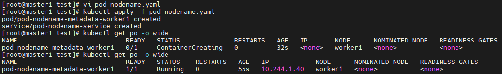
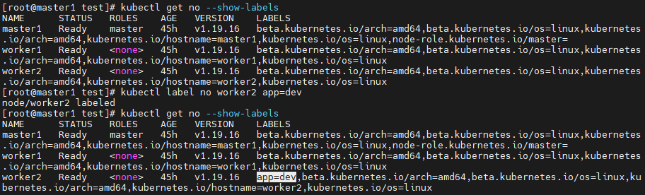
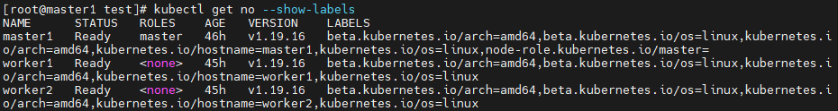
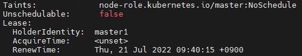

# 0721

* 시작 전 체크

```
# docker login
# kubectl create secret generic xeomina --from-file=.dockerconfigjson=/root/.docker/config.json --type=kubernetes.io/dockerconfigjson
# kubectl patch -n default serviceaccount/default -p '{"imagePullSecrets":[{"name": "xeomina"}]}'
# kubectl describe serviceaccount default -n default
```


## 파드 노드네임 (수동 배치)

* `pod-nodename.yaml` 파일 생성

```
# vi pod-nodename.yaml
apiVersion: v1
kind: Pod
metadata:
  name: pod-nodename-metadata-worker1
  labels:
    app: pod-nodename-labels
spec:
  containers:
  - name: pod-nodename-containers
    image: nginx
    ports:
    - containerPort: 80
  nodeName: worker1
---
apiVersion: v1
kind: Service
metadata:
  name: pod-nodename-service
spec:
  type: NodePort
  selector:
    app: pod-nodename-labels
  ports:
  - protocol: TCP
    port: 80
    targetPort: 80
```

* apply
  * worker1에 생성됨

```
# kubectl apply -f pod-nodename.yaml
# kubectl get po -o wide
```




## 노드 셀렉터 (수동 배치)

* 라벨링
  * `worker2`에 `app=dev`

```
# kubectl label no worker2 app=dev
# kubectl get no --show-labels
```



* `pod-nodeselector.yaml` 파일 생성

```
# vi pod-nodeselector.yaml
apiVersion: v1
kind: Pod
metadata:
  name: pod-nodeselector-metadata-app
  labels:
    app: pod-nodeselector-labels
spec:
  containers:
  - name: pod-nodeselector-containers
    image: nginx
    ports:
    - containerPort: 80
  nodeSelector:
    app: dev
---
apiVersion: v1
kind: Service
metadata:
  name: pod-nodeselector-service
spec:
  type: NodePort
  selector:
    app: pod-nodeselector-labels
  ports:
  - protocol: TCP
    port: 80
    targetPort: 80
```

* apply

```
# kubectl apply -f pod-nodeselector.yaml
# kubectl get po -o wide
```


* 라벨 삭제
  * `[노드 이름] <key> -`

```
# kubectl label no worker2 app-
# kubectl get no --show-labels
```




## taint와 toleration

* master1 node 확인
  * `NoSchedule` : 자동배치에서 스케쥴러가 pod 생성을 node에 배치하지 않음

```
# kubectl describe no master1
```




